# Migration System

<cite>
**Referenced Files in This Document**
- [server/db.js](file://server/db.js)
- [init_db.js](file://init_db.js)
- [server/check_schema.js](file://server/check_schema.js)
- [migrate-db-schema.js](file://migrate-db-schema.js)
- [migrate-db-constraints.js](file://migrate-db-constraints.js)
- [migrate-schedule-templates.js](file://migrate-schedule-templates.js)
- [server/migrate-price-column.js](file://server/migrate-price-column.js)
- [server/migrate-slots-union.js](file://server/migrate-slots-union.js)
- [server/migrate-manual-offline.js](file://server/migrate-manual-offline.js)
- [server/migrate-owner-settings.js](file://server/migrate-owner-settings.js)
- [server/migration_add_trip_date.sql](file://server/migration_add_trip_date.sql)
</cite>

## Table of Contents
1. [Introduction](#introduction)
2. [Project Structure](#project-structure)
3. [Core Components](#core-components)
4. [Architecture Overview](#architecture-overview)
5. [Detailed Component Analysis](#detailed-component-analysis)
6. [Dependency Analysis](#dependency-analysis)
7. [Performance Considerations](#performance-considerations)
8. [Troubleshooting Guide](#troubleshooting-guide)
9. [Conclusion](#conclusion)

## Introduction
This document explains the database migration and schema evolution system used by the application. It covers:
- The automatic migration process that runs on application startup
- One-time data normalization and structural fixes
- Column additions and constraint modifications
- New table creation workflows
- The lightweight migration approach that runs every startup versus one-time migrations
- How settings table markers prevent duplicate migrations
- Guidance for adding new migrations while maintaining backward compatibility

## Project Structure
The migration system spans a combination of:
- Startup-time migrations embedded in the primary database initialization module
- Dedicated offline migration scripts for specialized use cases
- Utility scripts for schema inspection and targeted fixes

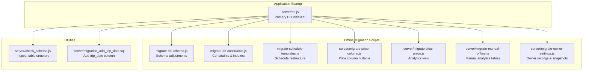

**Diagram sources**
- [server/db.js](file://server/db.js#L1-L1269)
- [migrate-db-schema.js](file://migrate-db-schema.js#L1-L153)
- [migrate-db-constraints.js](file://migrate-db-constraints.js#L1-L136)
- [migrate-schedule-templates.js](file://migrate-schedule-templates.js#L1-L327)
- [server/migrate-price-column.js](file://server/migrate-price-column.js#L1-L62)
- [server/migrate-slots-union.js](file://server/migrate-slots-union.js#L1-L135)
- [server/migrate-manual-offline.js](file://server/migrate-manual-offline.js#L1-L68)
- [server/migrate-owner-settings.js](file://server/migrate-owner-settings.js#L1-L53)
- [server/check_schema.js](file://server/check_schema.js#L1-L9)
- [server/migration_add_trip_date.sql](file://server/migration_add_trip_date.sql#L1-L9)

**Section sources**
- [server/db.js](file://server/db.js#L1-L1269)
- [migrate-db-schema.js](file://migrate-db-schema.js#L1-L153)
- [migrate-db-constraints.js](file://migrate-db-constraints.js#L1-L136)
- [migrate-schedule-templates.js](file://migrate-schedule-templates.js#L1-L327)
- [server/migrate-price-column.js](file://server/migrate-price-column.js#L1-L62)
- [server/migrate-slots-union.js](file://server/migrate-slots-union.js#L1-L135)
- [server/migrate-manual-offline.js](file://server/migrate-manual-offline.js#L1-L68)
- [server/migrate-owner-settings.js](file://server/migrate-owner-settings.js#L1-L53)
- [server/check_schema.js](file://server/check_schema.js#L1-L9)
- [server/migration_add_trip_date.sql](file://server/migration_add_trip_date.sql#L1-L9)

## Core Components
- Primary database initializer and migration hub: [server/db.js](file://server/db.js#L1-L1269)
- Offline migration scripts: [migrate-db-schema.js](file://migrate-db-schema.js#L1-L153), [migrate-db-constraints.js](file://migrate-db-constraints.js#L1-L136), [migrate-schedule-templates.js](file://migrate-schedule-templates.js#L1-L327), [server/migrate-price-column.js](file://server/migrate-price-column.js#L1-L62), [server/migrate-slots-union.js](file://server/migrate-slots-union.js#L1-L135), [server/migrate-manual-offline.js](file://server/migrate-manual-offline.js#L1-L68), [server/migrate-owner-settings.js](file://server/migrate-owner-settings.js#L1-L53)
- Schema inspection utility: [server/check_schema.js](file://server/check_schema.js#L1-L9)
- Additional targeted migration: [server/migration_add_trip_date.sql](file://server/migration_add_trip_date.sql#L1-L9)

Key responsibilities:
- Ensure database tables exist and are structurally sound
- Apply one-time data normalization and structural fixes
- Add new columns and constraints safely
- Create new tables and views for analytics and reporting
- Prevent duplicate migrations via settings markers
- Support both lightweight migrations (startup) and offline migrations (specialized tasks)

**Section sources**
- [server/db.js](file://server/db.js#L1-L1269)
- [migrate-db-schema.js](file://migrate-db-schema.js#L1-L153)
- [migrate-db-constraints.js](file://migrate-db-constraints.js#L1-L136)
- [migrate-schedule-templates.js](file://migrate-schedule-templates.js#L1-L327)
- [server/migrate-price-column.js](file://server/migrate-price-column.js#L1-L62)
- [server/migrate-slots-union.js](file://server/migrate-slots-union.js#L1-L135)
- [server/migrate-manual-offline.js](file://server/migrate-manual-offline.js#L1-L68)
- [server/migrate-owner-settings.js](file://server/migrate-owner-settings.js#L1-L53)
- [server/check_schema.js](file://server/check_schema.js#L1-L9)
- [server/migration_add_trip_date.sql](file://server/migration_add_trip_date.sql#L1-L9)

## Architecture Overview
The migration system combines:
- Startup-time migrations: executed automatically when the app starts, ensuring the database is always in the latest compatible state
- Offline migrations: standalone scripts for complex or specialized changes that require controlled execution
- Settings table markers: a lightweight mechanism to prevent re-running one-time migrations

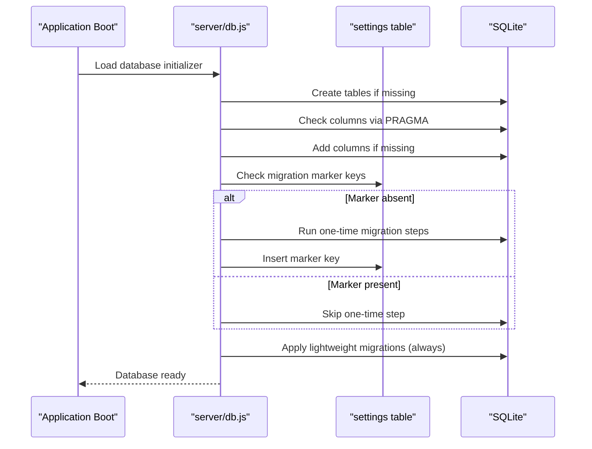

**Diagram sources**
- [server/db.js](file://server/db.js#L111-L800)

**Section sources**
- [server/db.js](file://server/db.js#L111-L800)

## Detailed Component Analysis

### Startup-Time Migration Engine
The primary migration engine resides in the database initializer. It performs:
- Table creation for core entities
- Column existence checks and safe additions
- One-time data normalization and structural fixes
- Lightweight migrations that run every startup
- Settings table markers to prevent duplicate executions

Highlights:
- Uses PRAGMA queries to inspect table structure before altering
- Applies defensive updates to normalize inconsistent data
- Inserts markers into the settings table after completing one-time steps
- Runs lightweight migrations regardless of prior state

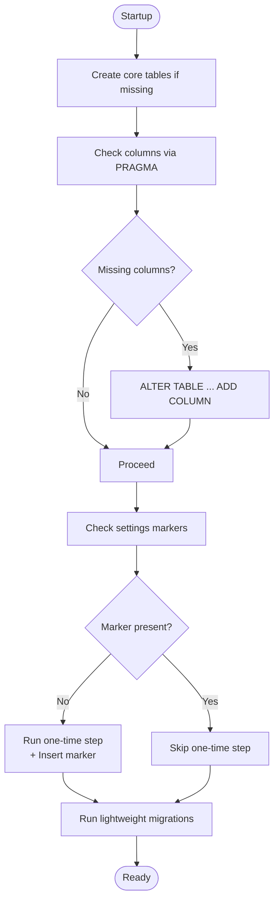

**Diagram sources**
- [server/db.js](file://server/db.js#L111-L800)

**Section sources**
- [server/db.js](file://server/db.js#L111-L800)

### One-Time Data Normalization and Fixes
The system includes several one-time steps designed to clean up historical data and ensure consistency:
- Boat type normalization to canonical values
- Fix for seats_left and capacity defaults
- Legacy data normalization for invalid values
- Boat type inference from names when missing

These steps are guarded by settings markers to avoid re-execution.

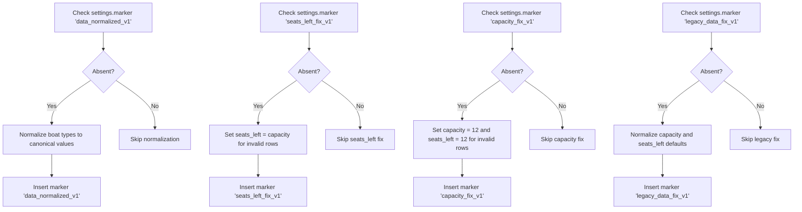

**Diagram sources**
- [server/db.js](file://server/db.js#L166-L311)

**Section sources**
- [server/db.js](file://server/db.js#L166-L311)

### Lightweight Migrations (Run Every Startup)
Lightweight migrations are idempotent and safe to run on every startup. Examples include:
- Canonical normalization of boat types
- Defensive updates to keep data consistent across versions

These steps are not gated by settings markers because they are designed to be safe and repeatable.

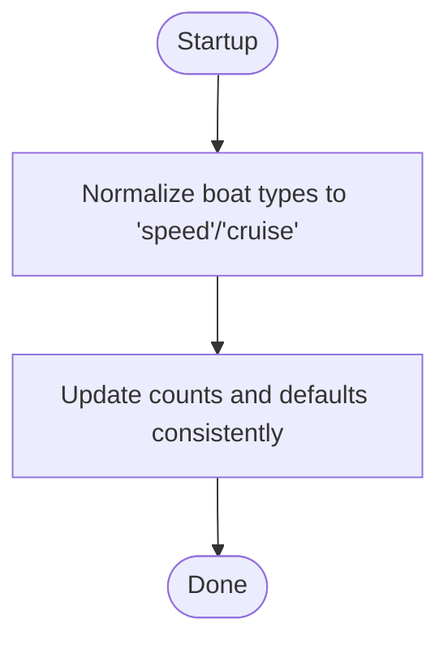

**Diagram sources**
- [server/db.js](file://server/db.js#L229-L246)

**Section sources**
- [server/db.js](file://server/db.js#L229-L246)

### Presales Enhancements
Presales table receives multiple one-time enhancements:
- Status column for tracking presale state
- slot_uid column for linking to generated slots
- tickets_json column for storing ticket breakdowns
- Payment-related columns (payment_method, payment_cash_amount, payment_card_amount)

Each enhancement is guarded by a dedicated settings marker and includes optional indexes where appropriate.

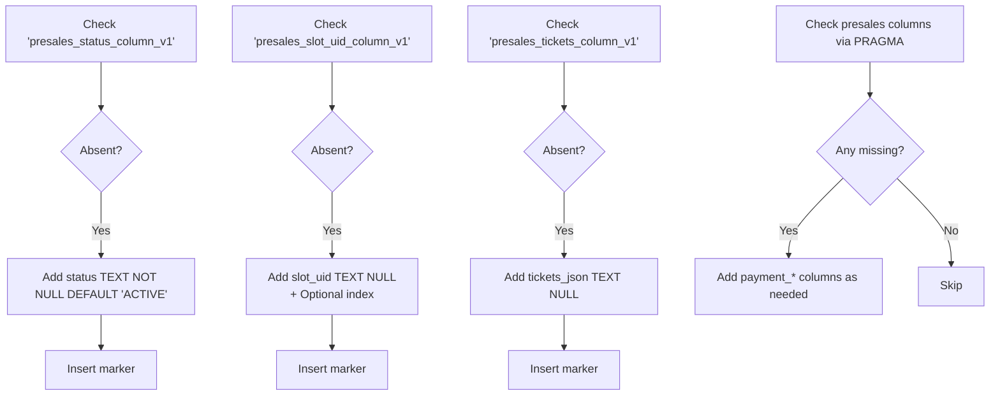

**Diagram sources**
- [server/db.js](file://server/db.js#L313-L408)

**Section sources**
- [server/db.js](file://server/db.js#L313-L408)

### New Table Creation Processes
Several new tables are created through one-time migrations:
- trip_templates: centralizes trip templates with product types and pricing
- tickets: tracks individual tickets derived from presales
- schedule_templates: legacy table (deprecated in favor of schedule_template_items)
- schedule_template_items: new normalized structure with weekdays_mask
- generated_slots: stores generated trip instances with unique constraints
- manual_days, manual_boat_stats, manual_seller_stats: owner analytics offline tables
- owner_settings_versions, owner_day_snapshots: owner settings versioning and snapshots

Each creation is guarded by a settings marker and includes appropriate constraints and indexes.

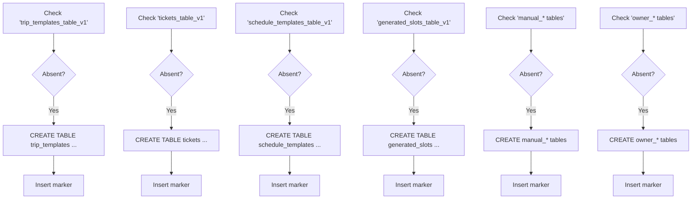

**Diagram sources**
- [server/db.js](file://server/db.js#L559-L793)

**Section sources**
- [server/db.js](file://server/db.js#L559-L793)

### Constraint Modifications and Indexes
Constraints and indexes are applied through a dedicated offline migration script:
- Triggers to validate generated_slots on insert/update
- Unique index to prevent duplicate trips
- Additional indexes for performance
- Idempotent application guarded by a settings marker

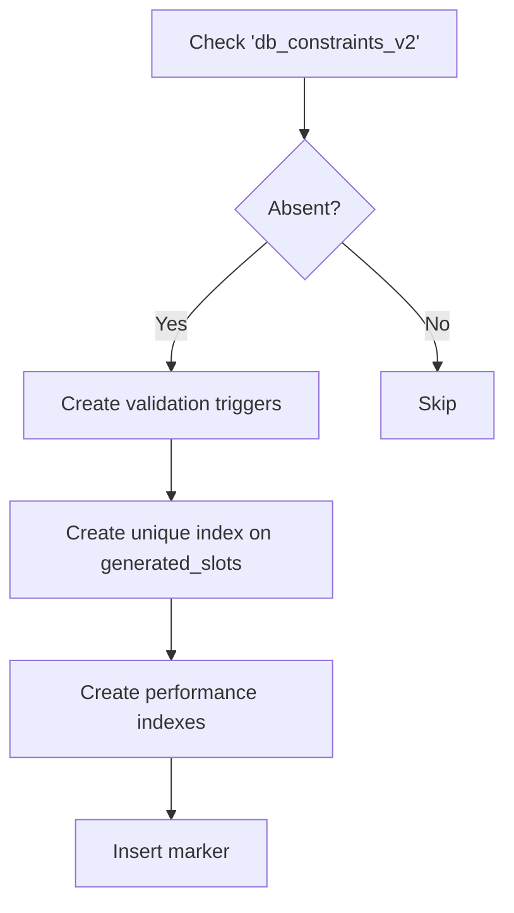

**Diagram sources**
- [migrate-db-constraints.js](file://migrate-db-constraints.js#L11-L110)

**Section sources**
- [migrate-db-constraints.js](file://migrate-db-constraints.js#L1-L136)

### Schedule Templates Restructuring
The schedule templates migration transforms the legacy schedule_templates table into a new normalized structure (schedule_template_items) with a weekdays_mask bitfield. It also creates a backward compatibility view to maintain API compatibility.

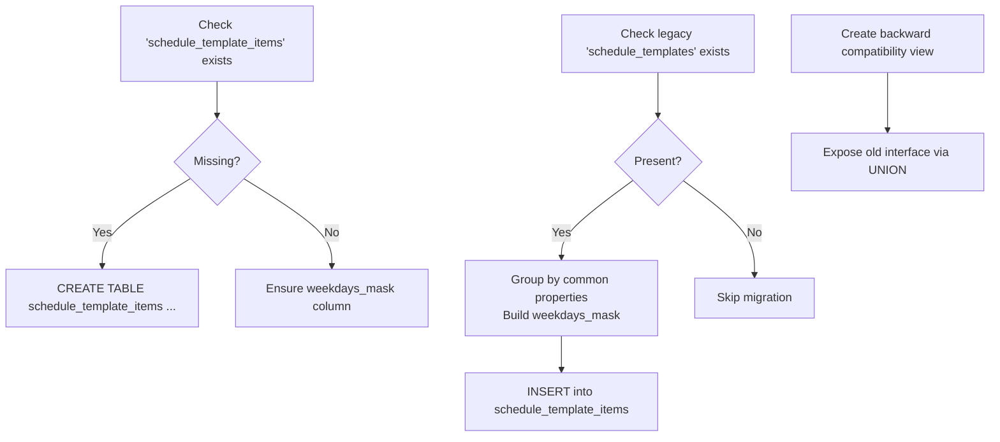

**Diagram sources**
- [migrate-schedule-templates.js](file://migrate-schedule-templates.js#L12-L315)

**Section sources**
- [migrate-schedule-templates.js](file://migrate-schedule-templates.js#L1-L327)

### Analytics View Creation
The slots_union view consolidates data from multiple sources for analytics. It is built as a safe, idempotent migration that handles missing tables gracefully.

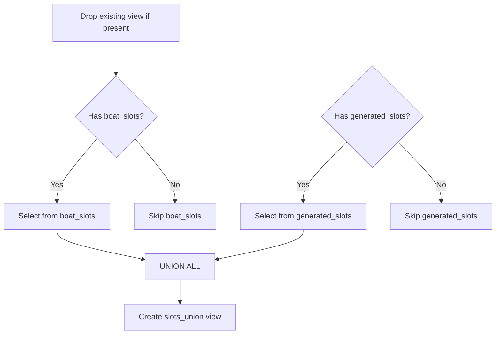

**Diagram sources**
- [server/migrate-slots-union.js](file://server/migrate-slots-union.js#L43-L121)

**Section sources**
- [server/migrate-slots-union.js](file://server/migrate-slots-union.js#L1-L135)

### Specialized Offline Migrations
Additional offline scripts handle specialized scenarios:
- Manual offline analytics tables for owner reporting
- Owner settings versioning and snapshot tables
- Targeted price column nullable migration
- Trip date column addition for boat_slots

These scripts are designed to be run manually and are idempotent.

**Section sources**
- [server/migrate-manual-offline.js](file://server/migrate-manual-offline.js#L1-L68)
- [server/migrate-owner-settings.js](file://server/migrate-owner-settings.js#L1-L53)
- [server/migrate-price-column.js](file://server/migrate-price-column.js#L1-L62)
- [server/migration_add_trip_date.sql](file://server/migration_add_trip_date.sql#L1-L9)

## Dependency Analysis
The migration system exhibits a layered dependency model:
- Startup-time migrations depend on the presence of core tables and rely on settings markers
- Offline migrations operate independently and are designed for controlled execution
- Utilities assist in schema inspection and targeted fixes

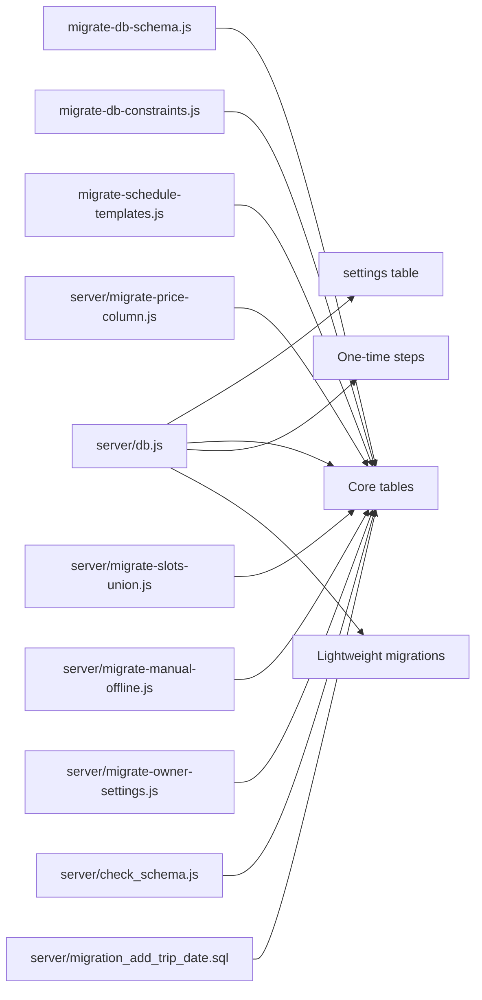

**Diagram sources**
- [server/db.js](file://server/db.js#L111-L800)
- [migrate-db-schema.js](file://migrate-db-schema.js#L1-L153)
- [migrate-db-constraints.js](file://migrate-db-constraints.js#L1-L136)
- [migrate-schedule-templates.js](file://migrate-schedule-templates.js#L1-L327)
- [server/migrate-price-column.js](file://server/migrate-price-column.js#L1-L62)
- [server/migrate-slots-union.js](file://server/migrate-slots-union.js#L1-L135)
- [server/migrate-manual-offline.js](file://server/migrate-manual-offline.js#L1-L68)
- [server/migrate-owner-settings.js](file://server/migrate-owner-settings.js#L1-L53)
- [server/check_schema.js](file://server/check_schema.js#L1-L9)
- [server/migration_add_trip_date.sql](file://server/migration_add_trip_date.sql#L1-L9)

**Section sources**
- [server/db.js](file://server/db.js#L111-L800)
- [migrate-db-schema.js](file://migrate-db-schema.js#L1-L153)
- [migrate-db-constraints.js](file://migrate-db-constraints.js#L1-L136)
- [migrate-schedule-templates.js](file://migrate-schedule-templates.js#L1-L327)
- [server/migrate-price-column.js](file://server/migrate-price-column.js#L1-L62)
- [server/migrate-slots-union.js](file://server/migrate-slots-union.js#L1-L135)
- [server/migrate-manual-offline.js](file://server/migrate-manual-offline.js#L1-L68)
- [server/migrate-owner-settings.js](file://server/migrate-owner-settings.js#L1-L53)
- [server/check_schema.js](file://server/check_schema.js#L1-L9)
- [server/migration_add_trip_date.sql](file://server/migration_add_trip_date.sql#L1-L9)

## Performance Considerations
- Unique indexes on generated_slots prevent duplicate trips and improve lookup performance
- Validation triggers enforce data quality at write time, reducing downstream processing costs
- Lightweight migrations are designed to be fast and idempotent, minimizing startup overhead
- Offline migrations should be scheduled during low-traffic periods to avoid blocking writes

## Troubleshooting Guide
Common issues and resolutions:
- Duplicate migration execution: Ensure settings markers are checked and inserted appropriately
- Schema mismatch errors: Use the schema inspection utility to verify table structures
- Constraint violations: Review triggers and indexes applied by the constraints migration
- Missing tables: Verify offline migration scripts have been run for specialized features

**Section sources**
- [server/check_schema.js](file://server/check_schema.js#L1-L9)
- [migrate-db-constraints.js](file://migrate-db-constraints.js#L112-L131)

## Conclusion
The migration system combines startup-time safety with offline flexibility to evolve the database schema reliably. By using settings markers, defensive updates, and idempotent operations, it ensures backward compatibility while enabling incremental improvements. Developers should follow the established patterns when adding new migrations: guard one-time steps with markers, keep lightweight migrations safe and repeatable, and leverage offline scripts for complex changes.