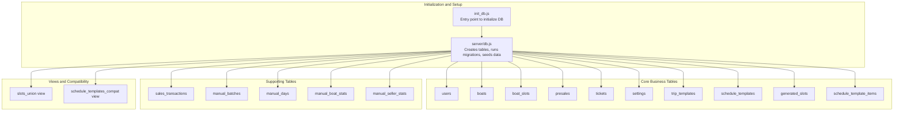
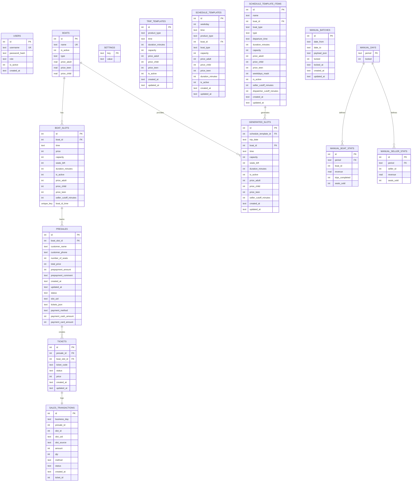
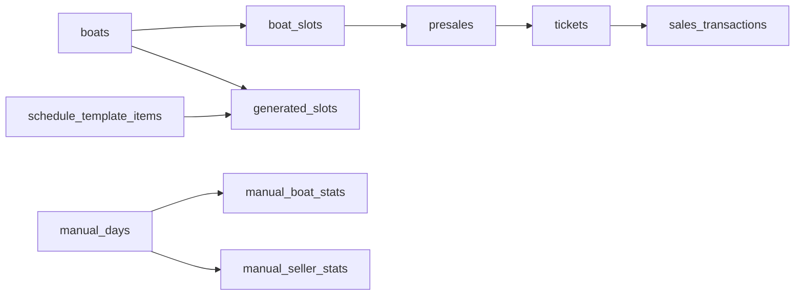

# Schema Overview

<cite>
**Referenced Files in This Document**
- [server/db.js](file://server/db.js)
- [migrate-db-schema.js](file://migrate-db-schema.js)
- [migrate-db-constraints.js](file://migrate-db-constraints.js)
- [migrate-schedule-templates.js](file://migrate-schedule-templates.js)
- [server/migrate-price-column.js](file://server/migrate-price-column.js)
- [server/migrate-slots-union.js](file://server/migrate-slots-union.js)
- [server/migrate-manual-offline.js](file://server/migrate-manual-offline.js)
- [server/migration_add_trip_date.sql](file://server/migration_add_trip_date.sql)
- [check-generated-slots.js](file://check-generated-slots.js)
- [init_db.js](file://init_db.js)
</cite>

## Table of Contents
1. [Introduction](#introduction)
2. [Project Structure](#project-structure)
3. [Core Components](#core-components)
4. [Architecture Overview](#architecture-overview)
5. [Detailed Component Analysis](#detailed-component-analysis)
6. [Dependency Analysis](#dependency-analysis)
7. [Performance Considerations](#performance-considerations)
8. [Troubleshooting Guide](#troubleshooting-guide)
9. [Conclusion](#conclusion)

## Introduction
This document provides a comprehensive schema overview for the SQLite database supporting the boat ticketing system. It documents the complete table schema for users, boats, boat_slots, presales, tickets, settings, trip_templates, schedule_templates, generated_slots, schedule_template_items, and related auxiliary tables. It explains the overall database architecture, table relationships, primary and foreign key constraints, and the initialization and migration mechanisms. It also outlines the purpose and scope of each table within the business logic of the ticketing system.

## Project Structure
The database is initialized and managed by the backend module that creates tables, applies safe migrations, seeds initial data, and maintains integrity via triggers and indexes. Supporting migration scripts handle schema updates, constraints enforcement, and compatibility views.

**Diagram sources**
- [server/db.js](file://server/db.js#L39-L108)
- [server/db.js](file://server/db.js#L559-L793)
- [server/db.js](file://server/db.js#L965-L1027)
- [server/db.js](file://server/db.js#L1037-L1247)
- [server/migrate-slots-union.js](file://server/migrate-slots-union.js#L118-L121)
- [migrate-schedule-templates.js](file://migrate-schedule-templates.js#L174-L313)

**Section sources**
- [server/db.js](file://server/db.js#L39-L108)
- [server/db.js](file://server/db.js#L559-L793)
- [server/db.js](file://server/db.js#L965-L1027)
- [server/db.js](file://server/db.js#L1037-L1247)
- [init_db.js](file://init_db.js#L1-L8)

## Core Components
This section summarizes the purpose and scope of each table in the context of the boat ticketing system.

- users
  - Purpose: Stores system users (roles: seller, dispatcher, admin, owner) with credentials and activity status.
  - Key attributes: id, username, password_hash, role, is_active, created_at.
  - Constraints: Unique username; role constrained to allowed values; default is_active = 1.

- boats
  - Purpose: Defines fleet inventory with pricing tiers and operational flags.
  - Key attributes: id, name, is_active, type, price_adult, price_teen, price_child.
  - Constraints: Unique name; default type and pricing defaults; type normalized to canonical values.

- boat_slots
  - Purpose: Template slots for trips without fixed dates (seasonal or flexible).
  - Key attributes: id, boat_id, time, price, capacity, seats_left, duration_minutes, is_active, price_adult, price_child, price_teen, seller_cutoff_minutes, unique(boat_id, time).
  - Constraints: References boats; unique composite key prevents duplicate slots per boat/time; nullable price supports dynamic pricing.

- presales
  - Purpose: Pre-sales/bookings linked to either template slots or generated slots.
  - Key attributes: id, boat_slot_id, customer_name, customer_phone, number_of_seats, total_price, prepayment_amount, prepayment_comment, created_at, updated_at, status, slot_uid, tickets_json, payment_method, payment_cash_amount, payment_card_amount.
  - Constraints: References boat_slots; additional columns support booking lifecycle and payment tracking.

- tickets
  - Purpose: Individual ticket records tied to presales and boat slots.
  - Key attributes: id, presale_id, boat_slot_id, ticket_code, status, price, created_at, updated_at.
  - Constraints: References presales and boat_slots; status maintained for validity.

- settings
  - Purpose: Global key-value storage for migrations and system flags.
  - Key attributes: key (PK), value.
  - Usage: Tracks completion of one-time migrations to avoid reapplication.

- trip_templates
  - Purpose: Static trip templates for specific product types with pricing and capacity.
  - Key attributes: id, product_type, time, duration_minutes, capacity, price_adult, price_child, price_teen, is_active, created_at, updated_at.
  - Constraints: product_type constrained; default is_active = 1.

- schedule_templates
  - Purpose: Deprecated; replaced by schedule_template_items with expanded weekday support.
  - Note: Maintained via compatibility view for backward compatibility.

- generated_slots
  - Purpose: Concrete scheduled trips created from templates or manual inputs.
  - Key attributes: id, schedule_template_id, trip_date, boat_id, time, capacity, seats_left, duration_minutes, is_active, price_adult, price_child, price_teen, seller_cutoff_minutes, created_at, updated_at.
  - Constraints: References schedule_templates and boats; unique index on (trip_date, time, boat_id); triggers enforce positive numeric fields and formats.

- schedule_template_items
  - Purpose: Modernized schedule templates with weekday bitmask support.
  - Key attributes: id, name, boat_id, boat_type, type, departure_time, duration_minutes, capacity, price_adult, price_child, price_teen, weekdays_mask, is_active, seller_cutoff_minutes, dispatcher_cutoff_minutes, created_at, updated_at.
  - Constraints: type constrained; weekdays_mask encodes recurring days; optional cutoffs for operational controls.

- sales_transactions
  - Purpose: Canonical money layer capturing sales events.
  - Key attributes: id, business_day, presale_id, slot_id, slot_uid, slot_source, amount, qty, method, status, created_at, ticket_id.
  - Triggers: Auto-populate from tickets insert/update/delete; unique index on ticket_id.

- manual_* tables
  - Purpose: Owner offline analytics data layer with manual overrides.
  - Tables: manual_batches, manual_days, manual_boat_stats, manual_seller_stats; enforced constraints and referential integrity.

**Section sources**
- [server/db.js](file://server/db.js#L41-L93)
- [server/db.js](file://server/db.js#L55-L66)
- [server/db.js](file://server/db.js#L68-L85)
- [server/db.js](file://server/db.js#L95-L109)
- [server/db.js](file://server/db.js#L617-L647)
- [server/db.js](file://server/db.js#L559-L593)
- [server/db.js](file://server/db.js#L649-L686)
- [server/db.js](file://server/db.js#L688-L726)
- [server/db.js](file://server/db.js#L753-L793)
- [server/db.js](file://server/db.js#L1037-L1054)
- [server/db.js](file://server/db.js#L965-L1027)

## Architecture Overview
The database architecture centers around three core layers:
- Template Layer: boats and boat_slots define reusable trip templates.
- Generation Layer: schedule_template_items and generated_slots produce concrete scheduled trips.
- Transaction Layer: presales and tickets manage bookings and sales; sales_transactions provides canonical financial tracking.

**Diagram sources**
- [server/db.js](file://server/db.js#L41-L93)
- [server/db.js](file://server/db.js#L55-L66)
- [server/db.js](file://server/db.js#L68-L85)
- [server/db.js](file://server/db.js#L95-L109)
- [server/db.js](file://server/db.js#L617-L647)
- [server/db.js](file://server/db.js#L559-L593)
- [server/db.js](file://server/db.js#L649-L686)
- [server/db.js](file://server/db.js#L688-L726)
- [server/db.js](file://server/db.js#L753-L793)
- [server/db.js](file://server/db.js#L1037-L1054)
- [server/db.js](file://server/db.js#L965-L1027)

## Detailed Component Analysis

### Users
- Purpose: Authentication and authorization for sellers, dispatchers, admins, and owners.
- Initialization: Ensures owner role and seeds initial users if none exist.
- Security: Passwords hashed before storage.

**Section sources**
- [server/db.js](file://server/db.js#L41-L49)
- [server/db.js](file://server/db.js#L795-L823)

### Boats
- Purpose: Fleet definition with pricing and type categorization.
- Migrations: Adds is_active, type, and pricing columns; normalizes types to canonical values.

**Section sources**
- [server/db.js](file://server/db.js#L55-L66)
- [server/db.js](file://server/db.js#L111-L144)
- [server/db.js](file://server/db.js#L166-L183)
- [server/db.js](file://server/db.js#L229-L246)
- [server/db.js](file://server/db.js#L248-L276)
- [server/db.js](file://server/db.js#L410-L435)

### Boat Slots
- Purpose: Template slots for flexible scheduling.
- Migrations: Adds seats_left, capacity, duration_minutes, price columns; makes price nullable; adds seller_cutoff_minutes.
- Integrity: Unique constraint on (boat_id, time).

**Section sources**
- [server/db.js](file://server/db.js#L68-L85)
- [server/db.js](file://server/db.js#L116-L164)
- [server/migrate-price-column.js](file://server/migrate-price-column.js#L14-L43)
- [migrate-db-schema.js](file://migrate-db-schema.js#L82-L136)
- [server/db.js](file://server/db.js#L873-L894)

### Presales
- Purpose: Booking lifecycle management with payment tracking and ticket breakdown storage.
- Migrations: Adds status, slot_uid, tickets_json, and payment columns; ensures indexes where applicable.

**Section sources**
- [server/db.js](file://server/db.js#L95-L109)
- [server/db.js](file://server/db.js#L313-L383)
- [server/db.js](file://server/db.js#L386-L408)
- [server/db.js](file://server/db.js#L334-L361)

### Tickets
- Purpose: Individual ticket records with status and price.
- Migrations: Adds payment_method column; integrates with sales_transactions via triggers.

**Section sources**
- [server/db.js](file://server/db.js#L617-L647)
- [server/db.js](file://server/db.js#L596-L614)

### Settings
- Purpose: Lightweight persistence for migration flags and system state.

**Section sources**
- [server/db.js](file://server/db.js#L87-L93)

### Trip Templates
- Purpose: Static templates for product types with pricing and capacity.
- Creation: One-time table creation with constraints.

**Section sources**
- [server/db.js](file://server/db.js#L559-L593)

### Schedule Templates and Items
- Purpose: Define recurring schedules with weekday masks; replace older schedule_templates.
- Migration: Creates schedule_template_items, migrates data, and provides backward compatibility view.

**Section sources**
- [server/db.js](file://server/db.js#L649-L686)
- [migrate-schedule-templates.js](file://migrate-schedule-templates.js#L12-L161)
- [migrate-schedule-templates.js](file://migrate-schedule-templates.js#L163-L313)

### Generated Slots
- Purpose: Concrete scheduled trips derived from templates or manual inputs.
- Constraints: Unique index on (trip_date, time, boat_id); triggers validate positive numeric fields and formats.
- Indexes: Optimizes lookups by boat/date, template, and active status.

**Section sources**
- [server/db.js](file://server/db.js#L688-L726)
- [migrate-db-constraints.js](file://migrate-db-constraints.js#L98-L104)
- [migrate-db-constraints.js](file://migrate-db-constraints.js#L44-L96)

### Sales Transactions
- Purpose: Canonical financial layer capturing sales events.
- Triggers: Automatically populate on tickets insert/update/delete; unique index on ticket_id.

**Section sources**
- [server/db.js](file://server/db.js#L1037-L1054)
- [server/db.js](file://server/db.js#L1065-L1160)
- [server/db.js](file://server/db.js#L1169-L1219)
- [server/db.js](file://server/db.js#L1225-L1247)

### Manual Offline Analytics
- Purpose: Owner-managed analytics data with manual overrides; enforces constraints and referential integrity.

**Section sources**
- [server/db.js](file://server/db.js#L965-L1027)
- [server/migrate-manual-offline.js](file://server/migrate-manual-offline.js#L29-L62)

### Slots Union View
- Purpose: Unified view across template and generated slots for analytics.

**Section sources**
- [server/migrate-slots-union.js](file://server/migrate-slots-union.js#L75-L121)

## Dependency Analysis
The database exhibits layered dependencies:
- Template Layer: boats → boat_slots
- Generation Layer: schedule_template_items → generated_slots
- Transaction Layer: presales → tickets → sales_transactions
- Operational Controls: generated_slots references schedule_template_items; manual_* tables reference manual_days

**Diagram sources**
- [server/db.js](file://server/db.js#L55-L66)
- [server/db.js](file://server/db.js#L68-L85)
- [server/db.js](file://server/db.js#L688-L726)
- [server/db.js](file://server/db.js#L753-L793)
- [server/db.js](file://server/db.js#L965-L1027)

**Section sources**
- [server/db.js](file://server/db.js#L55-L66)
- [server/db.js](file://server/db.js#L68-L85)
- [server/db.js](file://server/db.js#L688-L726)
- [server/db.js](file://server/db.js#L753-L793)
- [server/db.js](file://server/db.js#L965-L1027)

## Performance Considerations
- Indexes: Unique and selective indexes improve lookup performance for generated_slots and sales_transactions.
- Triggers: Enforce data integrity at write time; ensure validation logic is efficient.
- Views: slots_union consolidates data for analytics without duplicating storage.
- WAL Mode: Journal mode set to WAL improves concurrency and read performance.

**Section sources**
- [server/db.js](file://server/db.js#L19-L21)
- [migrate-db-constraints.js](file://migrate-db-constraints.js#L98-L104)
- [server/db.js](file://server/db.js#L1225-L1247)
- [server/migrate-slots-union.js](file://server/migrate-slots-union.js#L118-L121)

## Troubleshooting Guide
- Schema Validation
  - Verify table structures using PRAGMA queries and inspection scripts.
  - Example: [check-generated-slots.js](file://check-generated-slots.js#L1-L40) demonstrates seat availability checks and filtering of active, available slots.

- Constraint Violations
  - generated_slots triggers block invalid data (non-positive prices/capacity/duration, incorrect formats). Review trigger logic and test data accordingly.

- Migration Failures
  - Migrations use transactions and rollback on failure. Re-run targeted migration scripts after resolving underlying issues.
  - Examples: [migrate-db-schema.js](file://migrate-db-schema.js#L141-L151), [migrate-db-constraints.js](file://migrate-db-constraints.js#L133-L136), [server/migrate-price-column.js](file://server/migrate-price-column.js#L51-L61).

- Initialization Issues
  - Ensure database file path is correct and accessible. The backend sets journal_mode and busy_timeout pragmas at startup.
  - Entry point: [init_db.js](file://init_db.js#L1-L8).

**Section sources**
- [check-generated-slots.js](file://check-generated-slots.js#L1-L40)
- [migrate-db-constraints.js](file://migrate-db-constraints.js#L44-L96)
- [migrate-db-schema.js](file://migrate-db-schema.js#L141-L151)
- [server/migrate-price-column.js](file://server/migrate-price-column.js#L51-L61)
- [init_db.js](file://init_db.js#L1-L8)

## Conclusion
The SQLite schema for the boat ticketing system is designed around three core layers—templates, generation, and transactions—ensuring flexibility, integrity, and performance. Robust migrations, triggers, and indexes maintain data quality and enable scalable analytics. The modular architecture supports future enhancements while preserving backward compatibility through views and careful migration strategies.