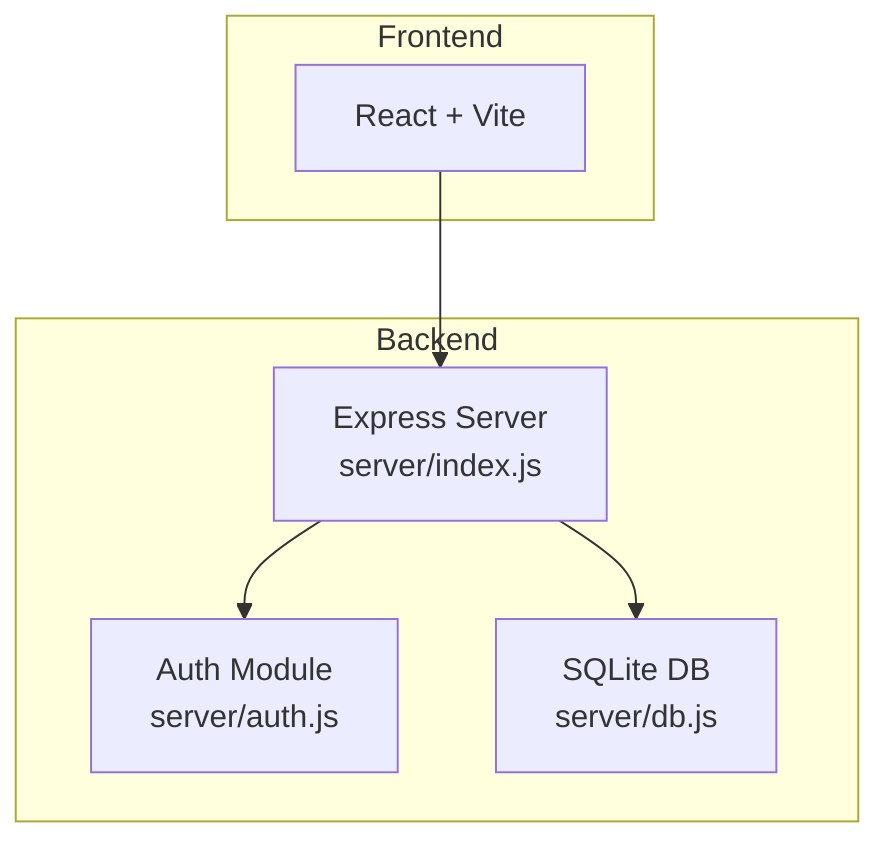
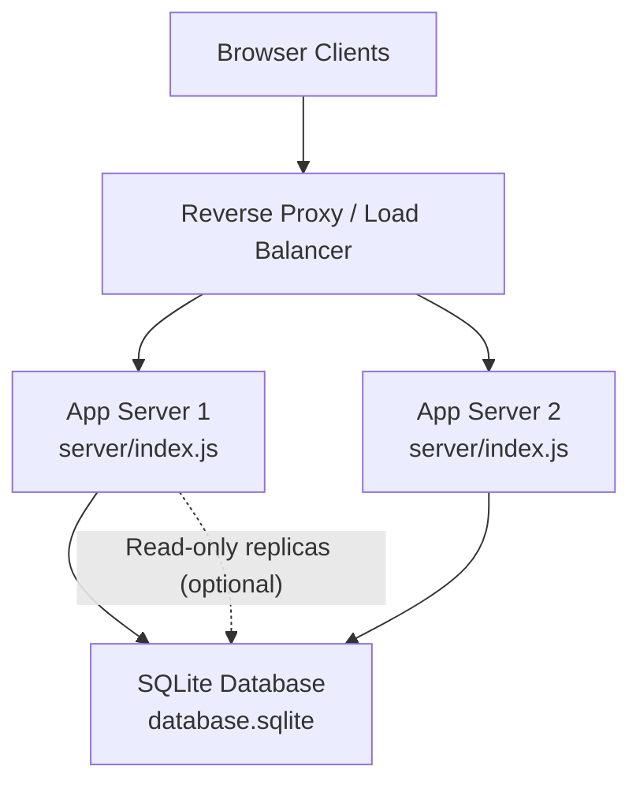
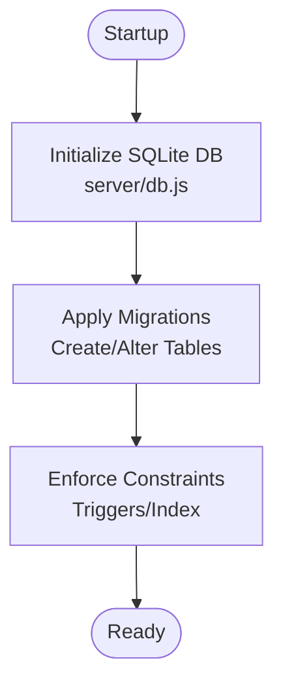
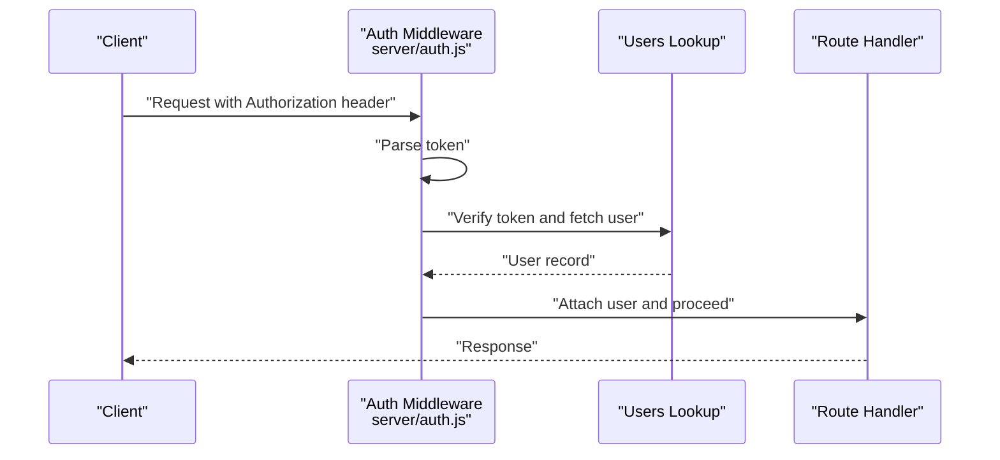
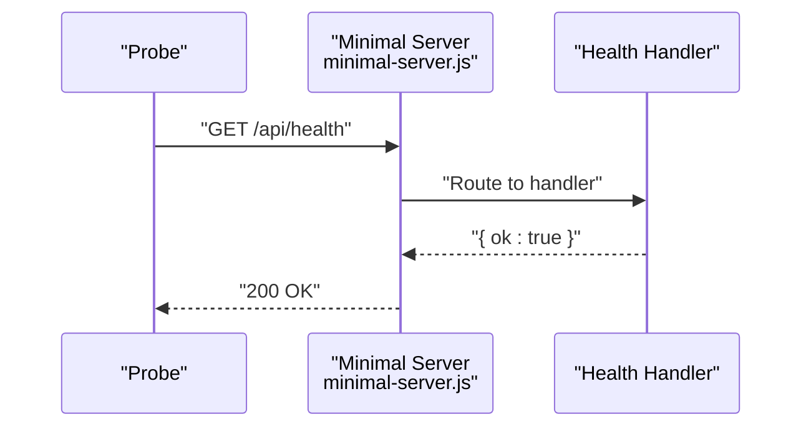
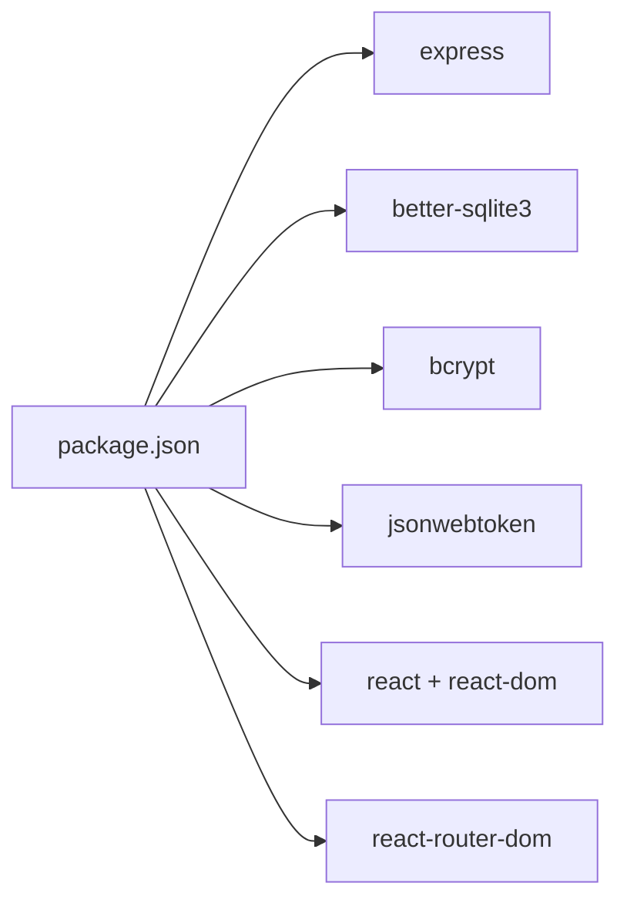

# Deployment & Operations

<cite>
**Referenced Files in This Document**
- [README.md](file://README.md)
- [package.json](file://package.json)
- [.env](file://.env)
- [server/index.js](file://server/index.js)
- [server/db.js](file://server/db.js)
- [server/auth.js](file://server/auth.js)
- [migrate-db-schema.js](file://migrate-db-schema.js)
- [migrate-db-constraints.js](file://migrate-db-constraints.js)
- [server/check_schema.js](file://server/check_schema.js)
- [init_db.js](file://init_db.js)
- [minimal-server.js](file://minimal-server.js)
- [test-health.js](file://test-health.js)
- [start-dev.ps1](file://start-dev.ps1)
- [start-dev.bat](file://start-dev.bat)
- [server/migration_add_trip_date.sql](file://server/migration_add_trip_date.sql)
</cite>

## Table of Contents
1. [Introduction](#introduction)
2. [Project Structure](#project-structure)
3. [Core Components](#core-components)
4. [Architecture Overview](#architecture-overview)
5. [Detailed Component Analysis](#detailed-component-analysis)
6. [Dependency Analysis](#dependency-analysis)
7. [Performance Considerations](#performance-considerations)
8. [Troubleshooting Guide](#troubleshooting-guide)
9. [Conclusion](#conclusion)
10. [Appendices](#appendices)

## Introduction
This document provides production-grade deployment and operations guidance for the Beach Boat Ticket Sales System. It covers environment preparation, dependency installation, service configuration, environment variable management, database migration and integrity strategies, monitoring and maintenance, security considerations, backup and recovery, and operational runbooks for routine maintenance, scaling, and capacity planning.

## Project Structure
The application is a full-stack Node.js/Express server with a React/Vite frontend. The backend exposes REST APIs and manages an embedded SQLite database via better-sqlite3. Development scripts orchestrate both frontend and backend servers concurrently.

**Diagram sources**
- [server/index.js](file://server/index.js#L1-L45)
- [server/auth.js](file://server/auth.js#L1-L154)
- [server/db.js](file://server/db.js#L1-L1269)

**Section sources**
- [README.md](file://README.md#L104-L136)
- [package.json](file://package.json#L6-L13)

## Core Components
- Backend server entrypoint mounts API routes and starts the HTTP listener.
- Database module initializes SQLite, applies migrations, and enforces constraints.
- Authentication middleware validates JWT tokens and enforces role-based access.
- Migration utilities manage schema evolution and integrity constraints.
- Health check endpoint supports basic uptime verification.

Key runtime behaviors:
- Port binding and route mounting occur in the server entrypoint.
- Database file path is resolved relative to the current working directory.
- JWT secret is loaded from environment variables for token signing/verification.
- Health endpoint responds with a simple JSON payload.

**Section sources**
- [server/index.js](file://server/index.js#L1-L45)
- [server/db.js](file://server/db.js#L11-L26)
- [server/auth.js](file://server/auth.js#L5-L75)
- [minimal-server.js](file://minimal-server.js#L6-L9)

## Architecture Overview
The production architecture centers on a single-instance Express server hosting both API and static assets, backed by a local SQLite database. For high availability, consider load balancing multiple instances behind a reverse proxy and migrating to a managed database.

[No sources needed since this diagram shows conceptual architecture]

## Detailed Component Analysis

### Environment Variables and Secrets
- JWT_SECRET: Required for signing and verifying JWT tokens.
- PORT: Optional override for the HTTP listener port.
- VITE_DEV_MODE: Frontend-only development flag; not used by backend.

Operational guidance:
- Set JWT_SECRET in production to a strong, random value.
- Expose PORT only to localhost or via reverse proxy; avoid exposing raw backend port publicly.
- Store secrets in a secure secret manager or environment injection mechanism.

**Section sources**
- [server/auth.js](file://server/auth.js#L5-L5)
- [server/index.js](file://server/index.js#L21-L21)
- [.env](file://.env#L1-L1)

### Database Initialization and Schema Management
The backend initializes the database on startup and applies a series of migrations to ensure schema stability and data integrity. Additional migration scripts exist for offline or targeted schema adjustments.

**Diagram sources**
- [server/db.js](file://server/db.js#L39-L847)
- [migrate-db-constraints.js](file://migrate-db-constraints.js#L41-L104)

Key migration behaviors:
- One-time normalization and integrity fixes for historical data.
- Addition of pricing columns per ticket type and duration metadata.
- Creation of specialized tables for scheduling and ticket tracking.
- Unique constraints and triggers to prevent invalid data insertion.

**Section sources**
- [server/db.js](file://server/db.js#L111-L276)
- [server/db.js](file://server/db.js#L280-L383)
- [server/db.js](file://server/db.js#L385-L557)
- [server/db.js](file://server/db.js#L559-L793)
- [migrate-db-schema.js](file://migrate-db-schema.js#L8-L138)
- [migrate-db-constraints.js](file://migrate-db-constraints.js#L41-L104)

### Authentication and Access Control
JWT-based authentication is enforced via middleware. Token verification uses the configured secret, and user roles gate access to protected routes.

**Diagram sources**
- [server/auth.js](file://server/auth.js#L10-L40)
- [server/auth.js](file://server/auth.js#L120-L142)

**Section sources**
- [server/auth.js](file://server/auth.js#L10-L75)

### Health Checks and Monitoring
A minimal health endpoint returns a simple JSON payload indicating service readiness. Use this endpoint for liveness/readiness probes in container orchestrators.

**Diagram sources**
- [minimal-server.js](file://minimal-server.js#L6-L9)

**Section sources**
- [minimal-server.js](file://minimal-server.js#L6-L9)
- [test-health.js](file://test-health.js#L5-L14)

### Production Deployment Procedures
- Prepare environment:
  - OS: Linux or Windows with Node.js LTS installed.
  - Storage: Persistent disk for database.sqlite and logs.
  - Network: Reverse proxy (Nginx/Caddy) or cloud load balancer; expose only HTTPS.
- Install dependencies:
  - Run dependency installation as per package scripts.
- Build frontend:
  - Generate static assets using the build script.
- Configure environment:
  - Set JWT_SECRET and optional PORT.
  - Ensure database file path resolves correctly in production directory.
- Start services:
  - Launch backend server; frontend static assets served by reverse proxy.
- Verify:
  - Call health endpoint and confirm successful login flow.

**Section sources**
- [package.json](file://package.json#L6-L13)
- [server/index.js](file://server/index.js#L21-L44)
- [minimal-server.js](file://minimal-server.js#L6-L9)

### Database Migration Strategies
- Online migrations:
  - Rely on the startup migration pipeline to add columns, create tables, and apply constraints.
- Offline migrations:
  - Use dedicated scripts for targeted schema adjustments and integrity enforcement.
- Schema inspection:
  - Use the schema checker to inspect current table structures.

**Section sources**
- [server/db.js](file://server/db.js#L39-L847)
- [migrate-db-schema.js](file://migrate-db-schema.js#L8-L138)
- [migrate-db-constraints.js](file://migrate-db-constraints.js#L41-L104)
- [server/check_schema.js](file://server/check_schema.js#L1-L9)

### Backup and Recovery Procedures
- Backup:
  - Copy database.sqlite along with its journal/WAL files to preserve atomicity.
  - Schedule periodic snapshots of the entire application directory.
- Recovery:
  - Stop the service.
  - Replace database.sqlite with the latest backup copy.
  - Restart the service and verify health and login.

Note: For high availability, consider migrating to a managed database with built-in backups and point-in-time recovery.

**Section sources**
- [server/db.js](file://server/db.js#L11-L26)

### Monitoring and Maintenance
- Health checks:
  - Use the health endpoint for automated probes.
- Logs:
  - Capture stdout/stderr from the backend process.
  - Aggregate logs centrally (e.g., syslog, ELK, or cloud logging).
- Performance:
  - Monitor CPU, memory, and disk I/O.
  - Track database query performance and connection contention.

**Section sources**
- [minimal-server.js](file://minimal-server.js#L6-L9)

### Security Considerations
- TLS termination:
  - Terminate TLS at the reverse proxy; configure strong ciphers and protocols.
- Secrets:
  - Store JWT_SECRET securely; rotate periodically.
- Access controls:
  - Enforce role-based access via middleware.
- Audit logging:
  - Log authentication events and sensitive operations at INFO or higher.

**Section sources**
- [server/auth.js](file://server/auth.js#L10-L75)

### Operational Runbooks
- Routine maintenance:
  - Daily: Review health endpoint status and logs.
  - Weekly: Inspect database integrity and schema.
- Scaling:
  - Horizontal scale by adding more backend instances behind a load balancer.
  - Consider read replicas for reporting workloads.
- Capacity planning:
  - Monitor database file growth and I/O saturation.
  - Plan storage expansion and backup retention windows.

[No sources needed since this section provides general guidance]

## Dependency Analysis
Runtime dependencies include Express, better-sqlite3, bcrypt, jsonwebtoken, and React ecosystem packages. Development dependencies support building and linting.

**Diagram sources**
- [package.json](file://package.json#L15-L39)

**Section sources**
- [package.json](file://package.json#L15-L39)

## Performance Considerations
- Database:
  - WAL mode is enabled; ensure adequate disk throughput.
  - Indexes created by migrations improve query performance.
- Application:
  - Keep JWT_SECRET stable to avoid token invalidation storms.
  - Minimize synchronous I/O in hot paths.

[No sources needed since this section provides general guidance]

## Troubleshooting Guide
Common issues and resolutions:
- Database initialization failure:
  - Verify file permissions for the database directory and ensure sufficient disk space.
- Health endpoint returns error:
  - Confirm backend is listening on the expected port and reverse proxy is configured correctly.
- Authentication failures:
  - Validate JWT_SECRET matches across deployments and clients.
- Schema inconsistencies:
  - Re-run the startup migration script and inspect table structures.

**Section sources**
- [server/db.js](file://server/db.js#L17-L26)
- [minimal-server.js](file://minimal-server.js#L11-L14)
- [server/auth.js](file://server/auth.js#L5-L75)
- [init_db.js](file://init_db.js#L1-L8)
- [server/check_schema.js](file://server/check_schema.js#L1-L9)

## Conclusion
This guide outlines production deployment and operations for the Beach Boat Ticket Sales System. By following environment preparation, secure configuration, robust migration strategies, monitoring, and backup procedures, teams can operate the system reliably. For long-term scalability and resilience, consider managed infrastructure and database services.

[No sources needed since this section summarizes without analyzing specific files]

## Appendices

### Appendix A: Development vs Production Startup
- Development:
  - Use provided scripts to start both frontend and backend concurrently.
- Production:
  - Build frontend assets, serve via reverse proxy, and run backend with environment variables.

**Section sources**
- [start-dev.ps1](file://start-dev.ps1#L1-L9)
- [start-dev.bat](file://start-dev.bat#L1-L11)
- [package.json](file://package.json#L6-L13)

### Appendix B: Example Migration Notes
- Adding a trip_date column to boat_slots:
  - Apply the SQL migration once to the target database.

**Section sources**
- [server/migration_add_trip_date.sql](file://server/migration_add_trip_date.sql#L1-L9)