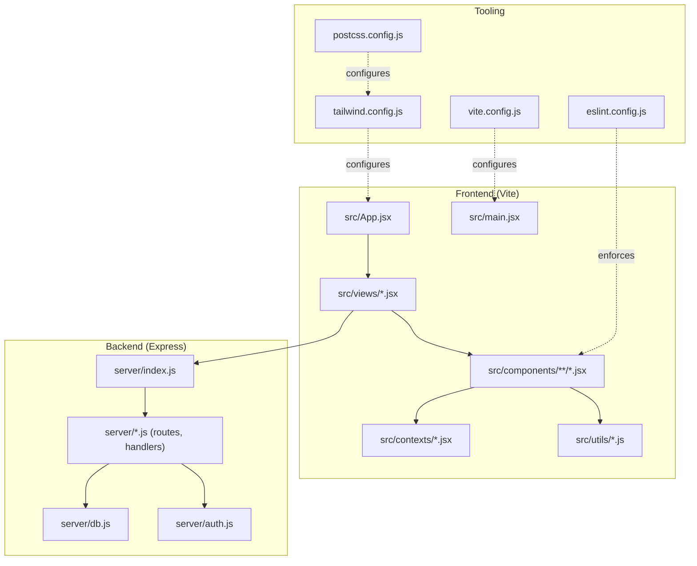
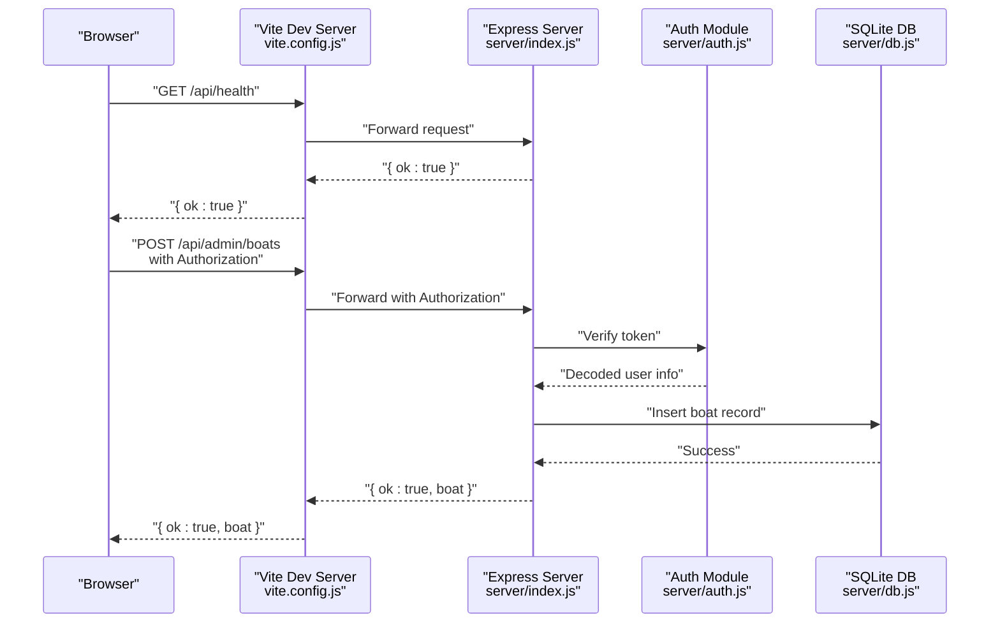
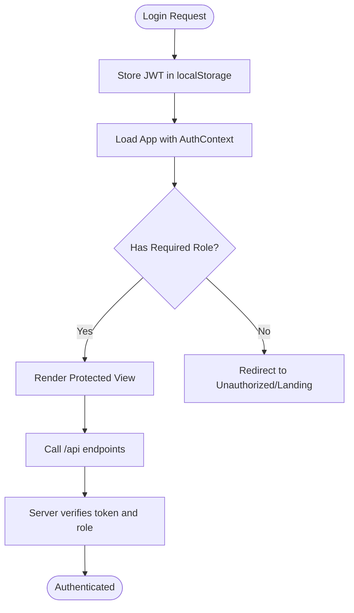
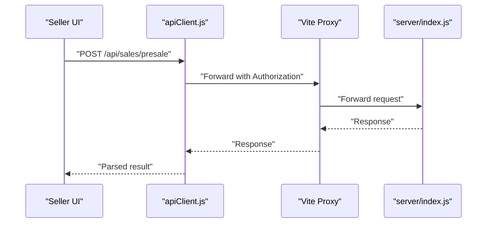
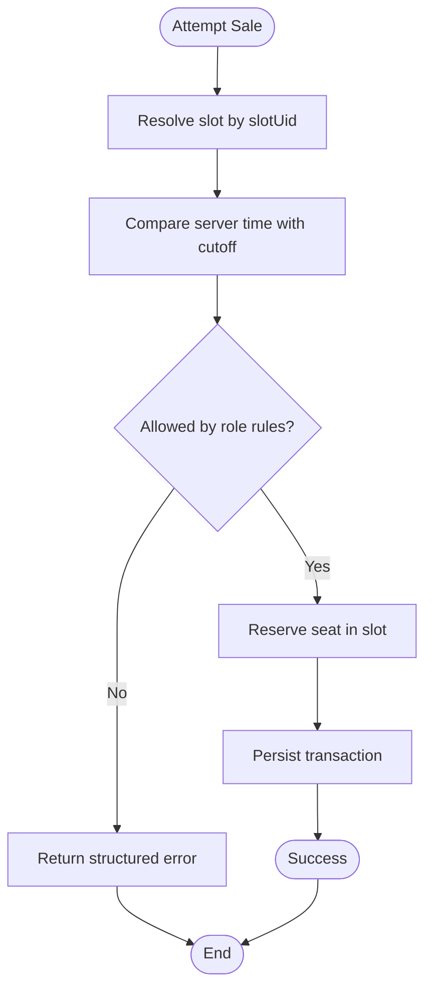
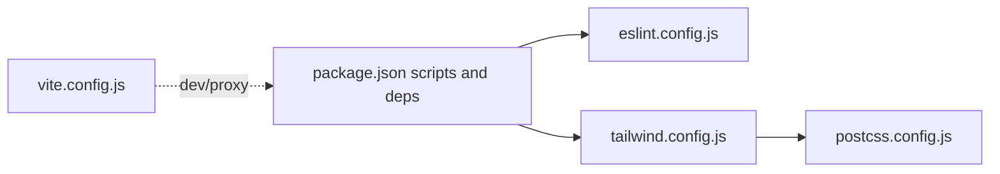
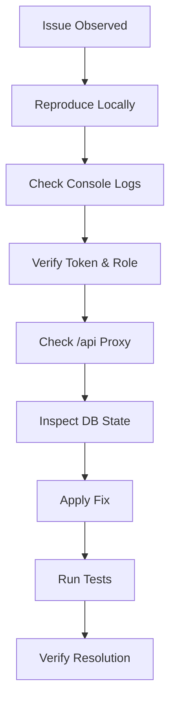
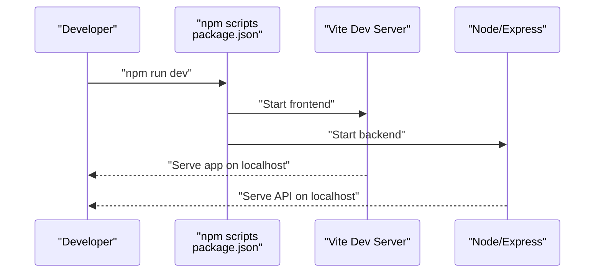
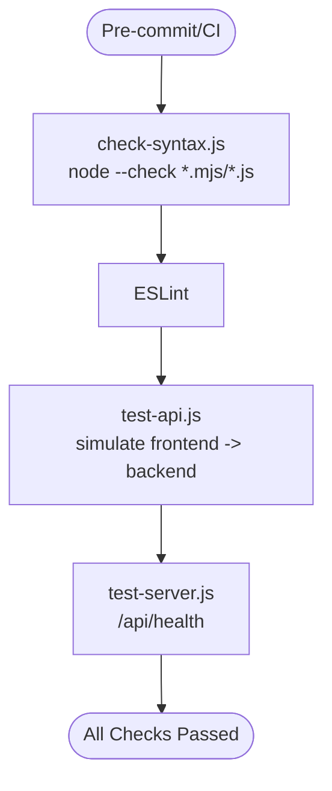

# Development Guidelines

<cite>
**Referenced Files in This Document**
- [eslint.config.js](file://eslint.config.js)
- [package.json](file://package.json)
- [README.md](file://README.md)
- [docs/DEBUG_POLICY.md](file://docs/DEBUG_POLICY.md)
- [docs/PROJECT_PRINCIPLES.md](file://docs/PROJECT_PRINCIPLES.md)
- [docs/BUSINESS_RULES.md](file://docs/BUSINESS_RULES.md)
- [vite.config.js](file://vite.config.js)
- [tailwind.config.js](file://tailwind.config.js)
- [postcss.config.js](file://postcss.config.js)
- [check-syntax.js](file://check-syntax.js)
- [simple-test.js](file://simple-test.js)
- [test-api.js](file://test-api.js)
- [test-server.js](file://test-server.js)
- [server/index.js](file://server/index.js)
- [server/auth.js](file://server/auth.js)
- [server/db.js](file://server/db.js)
- [src/utils/apiClient.js](file://src/utils/apiClient.js)
- [src/App.jsx](file://src/App.jsx)
- [src/main.jsx](file://src/main.jsx)
- [src/views/LoginPage.jsx](file://src/views/LoginPage.jsx)
- [src/views/SellerView.jsx](file://src/views/SellerView.jsx)
- [src/views/DispatcherView.jsx](file://src/views/DispatcherView.jsx)
- [src/views/AdminView.jsx](file://src/views/AdminView.jsx)
- [src/components/seller/SellTicketScreen.jsx](file://src/components/seller/SellTicketScreen.jsx)
- [src/components/dispatcher/PassengerList.jsx](file://src/components/dispatcher/PassengerList.jsx)
- [src/components/admin/BoatManagement.jsx](file://src/components/admin/BoatManagement.jsx)
- [src/contexts/AuthContext.jsx](file://src/contexts/AuthContext.jsx)
- [src/utils/dateUtils.js](file://src/utils/dateUtils.js)
- [src/utils/slotAvailability.js](file://src/utils/slotAvailability.js)
</cite>

## Table of Contents
1. [Introduction](#introduction)
2. [Project Structure](#project-structure)
3. [Core Components](#core-components)
4. [Architecture Overview](#architecture-overview)
5. [Detailed Component Analysis](#detailed-component-analysis)
6. [Dependency Analysis](#dependency-analysis)
7. [Performance Considerations](#performance-considerations)
8. [Troubleshooting Guide](#troubleshooting-guide)
9. [Development Workflow](#development-workflow)
10. [Code Quality Metrics and Security](#code-quality-metrics-and-security)
11. [Automated Checking Systems](#automated-checking-systems)
12. [Extending Functionality and Backward Compatibility](#extending-functionality-and-backward-compatibility)
13. [Conclusion](#conclusion)

## Introduction
This document defines comprehensive development guidelines for the Beach Boat Ticket Sales System. It covers code standards, testing strategies, debugging procedures, development workflow, performance, security, maintainability, and automated checks. The project is a React/Vite frontend with a Node.js/Express backend using SQLite via better-sqlite3. Authentication relies on JWT tokens stored client-side.

## Project Structure
The repository follows a clear separation of concerns:
- Frontend: React application under src/, with views, components, contexts, and utilities.
- Backend: Node.js/Express server under server/, exposing REST endpoints and managing SQLite.
- Tooling: Vite for dev/build, ESLint for linting, Tailwind CSS for styling, PostCSS for processing.

**Diagram sources**
- [vite.config.js](file://vite.config.js#L1-L25)
- [eslint.config.js](file://eslint.config.js#L1-L30)
- [tailwind.config.js](file://tailwind.config.js#L1-L12)
- [postcss.config.js](file://postcss.config.js#L1-L7)
- [server/index.js](file://server/index.js)
- [server/db.js](file://server/db.js)
- [server/auth.js](file://server/auth.js)
- [src/App.jsx](file://src/App.jsx)
- [src/main.jsx](file://src/main.jsx)

**Section sources**
- [README.md](file://README.md#L1-L150)
- [vite.config.js](file://vite.config.js#L1-L25)
- [tailwind.config.js](file://tailwind.config.js#L1-L12)
- [postcss.config.js](file://postcss.config.js#L1-L7)

## Core Components
- Authentication and Authorization: JWT-based with role-aware routes and protected views. See [server/auth.js](file://server/auth.js), [src/contexts/AuthContext.jsx](file://src/contexts/AuthContext.jsx), [src/views/LoginPage.jsx](file://src/views/LoginPage.jsx).
- API Layer: REST endpoints under /api handled by server modules. See [server/index.js](file://server/index.js).
- Data Access: SQLite via better-sqlite3 abstraction in [server/db.js](file://server/db.js).
- Frontend Views and Components: Role-specific views and reusable components. See [src/views/SellerView.jsx](file://src/views/SellerView.jsx), [src/views/DispatcherView.jsx](file://src/views/DispatcherView.jsx), [src/views/AdminView.jsx](file://src/views/AdminView.jsx), [src/components/seller/SellTicketScreen.jsx](file://src/components/seller/SellTicketScreen.jsx), [src/components/dispatcher/PassengerList.jsx](file://src/components/dispatcher/PassengerList.jsx), [src/components/admin/BoatManagement.jsx](file://src/components/admin/BoatManagement.jsx).
- Utilities: Date helpers and slot availability logic. See [src/utils/dateUtils.js](file://src/utils/dateUtils.js), [src/utils/slotAvailability.js](file://src/utils/slotAvailability.js).
- API Client: Centralized HTTP client for frontend-backend communication. See [src/utils/apiClient.js](file://src/utils/apiClient.js).

**Section sources**
- [server/auth.js](file://server/auth.js)
- [src/contexts/AuthContext.jsx](file://src/contexts/AuthContext.jsx)
- [src/views/LoginPage.jsx](file://src/views/LoginPage.jsx)
- [server/index.js](file://server/index.js)
- [server/db.js](file://server/db.js)
- [src/utils/apiClient.js](file://src/utils/apiClient.js)
- [src/views/SellerView.jsx](file://src/views/SellerView.jsx)
- [src/views/DispatcherView.jsx](file://src/views/DispatcherView.jsx)
- [src/views/AdminView.jsx](file://src/views/AdminView.jsx)
- [src/components/seller/SellTicketScreen.jsx](file://src/components/seller/SellTicketScreen.jsx)
- [src/components/dispatcher/PassengerList.jsx](file://src/components/dispatcher/PassengerList.jsx)
- [src/components/admin/BoatManagement.jsx](file://src/components/admin/BoatManagement.jsx)
- [src/utils/dateUtils.js](file://src/utils/dateUtils.js)
- [src/utils/slotAvailability.js](file://src/utils/slotAvailability.js)

## Architecture Overview
The system uses a thin-client architecture:
- Frontend (React/Vite) handles UI routing and state via Context API.
- Backend (Express) exposes REST endpoints and manages SQLite persistence.
- Proxy in Vite forwards /api requests to the backend while preserving Authorization headers.

**Diagram sources**
- [vite.config.js](file://vite.config.js#L10-L22)
- [server/index.js](file://server/index.js)
- [server/auth.js](file://server/auth.js)
- [server/db.js](file://server/db.js)

**Section sources**
- [vite.config.js](file://vite.config.js#L1-L25)
- [server/index.js](file://server/index.js)
- [server/auth.js](file://server/auth.js)
- [server/db.js](file://server/db.js)

## Detailed Component Analysis

### Authentication and Authorization
- Token lifecycle: Login stores JWT in localStorage; AuthContext provides user state and logout.
- Protected routes: Role gates ensure access control.
- Backend verification: Token decoding and role checks in auth module.

**Diagram sources**
- [src/contexts/AuthContext.jsx](file://src/contexts/AuthContext.jsx)
- [src/views/LoginPage.jsx](file://src/views/LoginPage.jsx)
- [server/auth.js](file://server/auth.js)

**Section sources**
- [src/contexts/AuthContext.jsx](file://src/contexts/AuthContext.jsx)
- [src/views/LoginPage.jsx](file://src/views/LoginPage.jsx)
- [server/auth.js](file://server/auth.js)

### API Client and Data Flow
- Centralized client: Handles base URL, headers, and error handling.
- Example usage: Seller ticket sale flow invokes backend endpoints and updates local state.

**Diagram sources**
- [src/utils/apiClient.js](file://src/utils/apiClient.js)
- [vite.config.js](file://vite.config.js#L10-L22)
- [server/index.js](file://server/index.js)

**Section sources**
- [src/utils/apiClient.js](file://src/utils/apiClient.js)
- [vite.config.js](file://vite.config.js#L1-L25)
- [server/index.js](file://server/index.js)

### Business Rules Enforcement
- Cutoff logic: Sales validity depends on server time vs cutoff thresholds per role.
- Consistency: Generated and manual slots must behave identically.
- Explicit errors: All failures must surface structured error messages.

**Diagram sources**
- [docs/BUSINESS_RULES.md](file://docs/BUSINESS_RULES.md#L1-L49)

**Section sources**
- [docs/BUSINESS_RULES.md](file://docs/BUSINESS_RULES.md#L1-L49)

## Dependency Analysis
- Frontend dependencies: React, React Router, Tailwind CSS, better-sqlite3 for backend mocking/testing, bcrypt and jsonwebtoken for auth.
- Dev dependencies: Vite, ESLint, PostCSS/Tailwind, concurrently for dev.

**Diagram sources**
- [package.json](file://package.json#L1-L41)
- [eslint.config.js](file://eslint.config.js#L1-L30)
- [tailwind.config.js](file://tailwind.config.js#L1-L12)
- [postcss.config.js](file://postcss.config.js#L1-L7)
- [vite.config.js](file://vite.config.js#L1-L25)

**Section sources**
- [package.json](file://package.json#L1-L41)
- [eslint.config.js](file://eslint.config.js#L1-L30)
- [tailwind.config.js](file://tailwind.config.js#L1-L12)
- [postcss.config.js](file://postcss.config.js#L1-L7)
- [vite.config.js](file://vite.config.js#L1-L25)

## Performance Considerations
- Minimize re-renders: Use React.memo and useMemo/useCallback where appropriate.
- Efficient queries: Prefer indexed columns and limit scans in SQLite.
- Network efficiency: Batch small requests, avoid unnecessary polling.
- Bundle size: Keep Tailwind purged to used content paths.

## Troubleshooting Guide
- Debug policy: Debug indicators (slotUid, server time, cutoff time, role, error codes) are permitted during development and removed upon deployment.
- Logging strategy: Use console logs for development; ensure sensitive data is not printed. Centralize logging in apiClient for API failures.
- Common issues:
  - 401 Unauthorized: Verify Authorization header forwarding and token validity.
  - CORS/proxy: Confirm Vite proxy configuration for /api.
  - Schema mismatches: Validate request payloads against backend expectations.

**Section sources**
- [docs/DEBUG_POLICY.md](file://docs/DEBUG_POLICY.md#L1-L12)
- [vite.config.js](file://vite.config.js#L10-L22)
- [src/utils/apiClient.js](file://src/utils/apiClient.js)

## Development Workflow
- Setup: Install dependencies and run both frontend and backend with a single command.
- Running:
  - Development: npm run dev starts Vite and Express concurrently.
  - Preview: npm run preview for production-like build preview.
- Branching and CI: Define feature branches, pull requests, and automated checks in CI (syntax, lint, tests).

**Diagram sources**
- [package.json](file://package.json#L6-L13)

**Section sources**
- [README.md](file://README.md#L104-L136)
- [package.json](file://package.json#L6-L13)

## Code Quality Metrics and Security
- Code style: Enforced by ESLint with recommended rules plus React Hooks and React Refresh presets.
- Naming patterns:
  - Components: PascalCase (e.g., SellerView, PassengerList).
  - Utility functions: camelCase (e.g., dateUtils, slotAvailability).
  - Constants: UPPER_SNAKE_CASE (e.g., MAX_SEATS).
- Security:
  - Passwords hashed with bcrypt.
  - JWT tokens stored in localStorage; ensure HTTPS in production.
  - Validate and sanitize all inputs; enforce explicit errors.

**Section sources**
- [eslint.config.js](file://eslint.config.js#L1-L30)
- [README.md](file://README.md#L66-L77)

## Automated Checking Systems
- Syntax validation: Node’s internal syntax checker for all server-side ESM files.
- Linting: ESLint runs across the repo.
- API smoke tests: Simple script simulates frontend requests and validates backend responses.
- Health checks: Lightweight Express server exposes /api/health.

**Diagram sources**
- [check-syntax.js](file://check-syntax.js#L1-L56)
- [eslint.config.js](file://eslint.config.js#L1-L30)
- [test-api.js](file://test-api.js#L1-L86)
- [test-server.js](file://test-server.js#L1-L13)

**Section sources**
- [check-syntax.js](file://check-syntax.js#L1-L56)
- [eslint.config.js](file://eslint.config.js#L1-L30)
- [test-api.js](file://test-api.js#L1-L86)
- [test-server.js](file://test-server.js#L1-L13)

## Extending Functionality and Backward Compatibility
- Adding a new feature:
  - Define clear API endpoints in server modules.
  - Add frontend views/components and wire them via React Router.
  - Update utilities and contexts as needed.
- Backward compatibility:
  - Respect business rules: generated and manual slots must behave identically.
  - Maintain explicit error messages and consistent data shapes.
  - Avoid silent fallbacks; follow project principles.

**Section sources**
- [docs/PROJECT_PRINCIPLES.md](file://docs/PROJECT_PRINCIPLES.md#L1-L9)
- [docs/BUSINESS_RULES.md](file://docs/BUSINESS_RULES.md#L27-L28)

## Conclusion
These guidelines establish a consistent approach to building, testing, debugging, and maintaining the Beach Boat Ticket Sales System. By adhering to the documented standards, workflows, and automated checks, contributors can ensure high-quality, secure, and maintainable code.