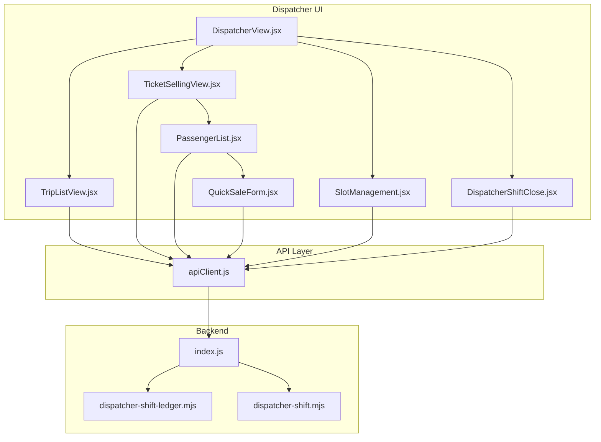
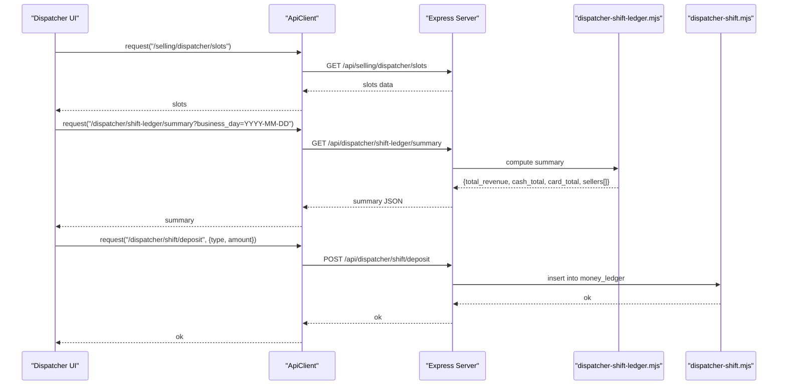
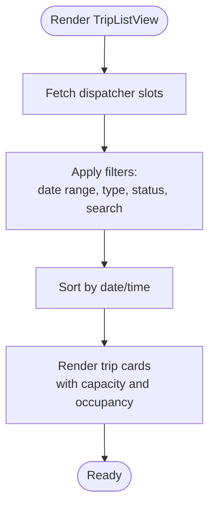
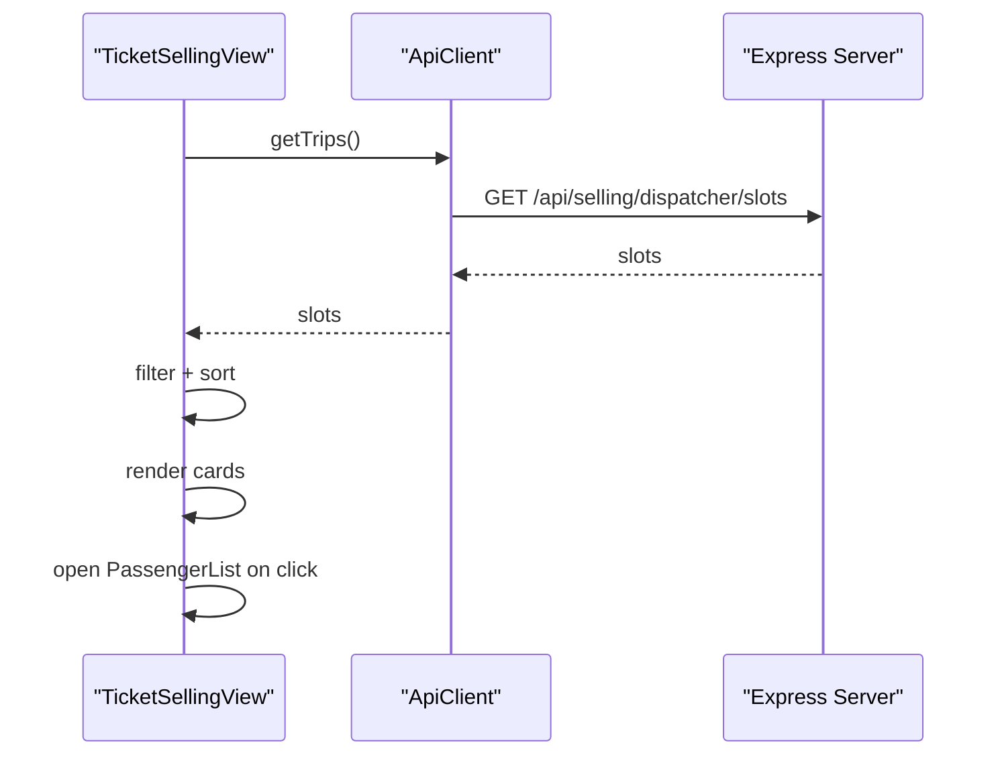
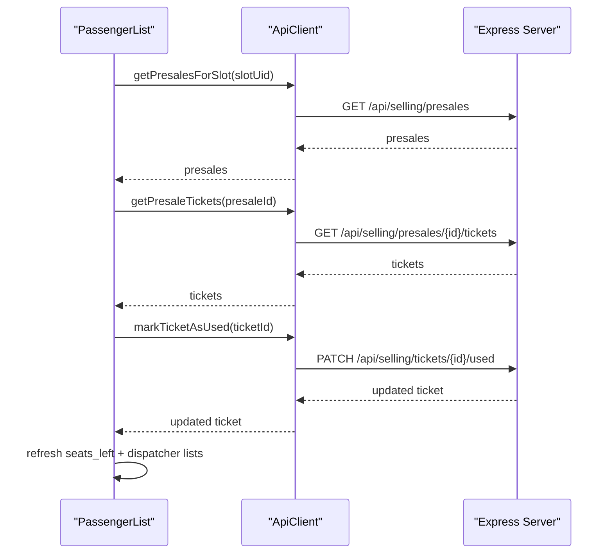
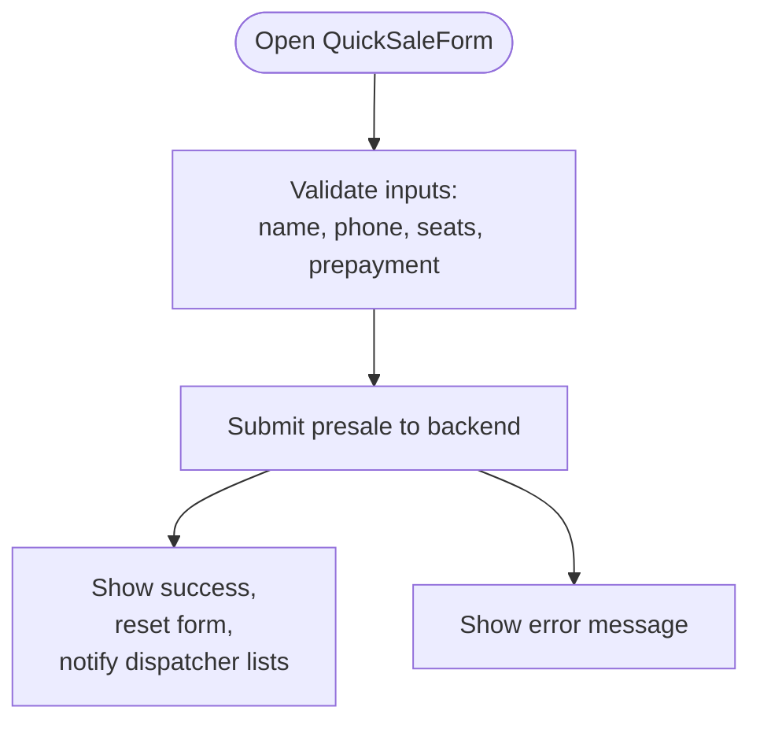
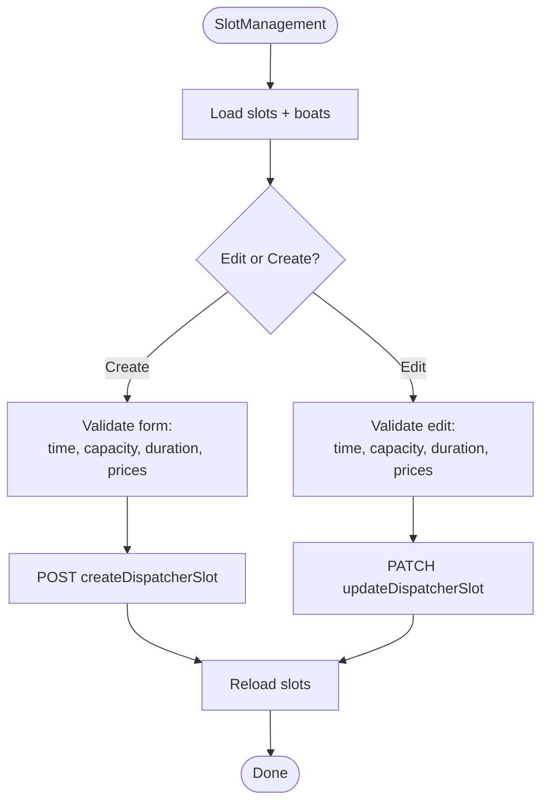
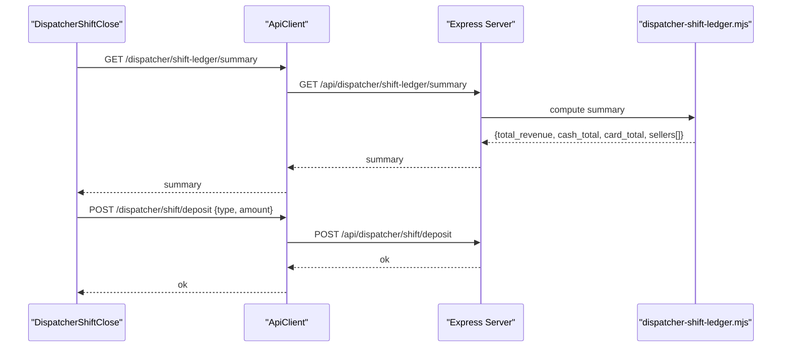
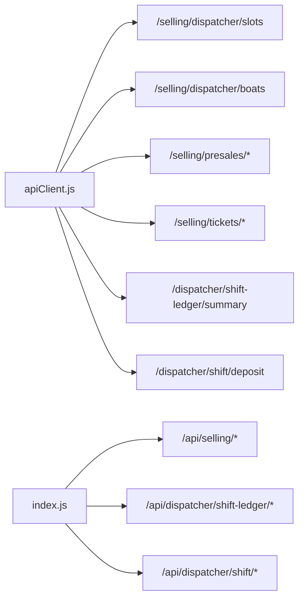

# Dispatcher Portal

<cite>
**Referenced Files in This Document**
- [DispatcherView.jsx](file://src/views/DispatcherView.jsx)
- [DispatcherShiftClose.jsx](file://src/views/DispatcherShiftClose.jsx)
- [TripListView.jsx](file://src/components/dispatcher/TripListView.jsx)
- [TicketSellingView.jsx](file://src/components/dispatcher/TicketSellingView.jsx)
- [PassengerList.jsx](file://src/components/dispatcher/PassengerList.jsx)
- [QuickSaleForm.jsx](file://src/components/dispatcher/QuickSaleForm.jsx)
- [ConfirmBoardingModal.jsx](file://src/components/dispatcher/ConfirmBoardingModal.jsx)
- [SlotManagement.jsx](file://src/components/dispatcher/SlotManagement.jsx)
- [apiClient.js](file://src/utils/apiClient.js)
- [dispatcher-shift-ledger.mjs](file://server/dispatcher-shift-ledger.mjs)
- [dispatcher-shift.mjs](file://server/dispatcher-shift.mjs)
- [index.js](file://server/index.js)
</cite>

## Table of Contents
1. [Introduction](#introduction)
2. [Project Structure](#project-structure)
3. [Core Components](#core-components)
4. [Architecture Overview](#architecture-overview)
5. [Detailed Component Analysis](#detailed-component-analysis)
6. [Dependency Analysis](#dependency-analysis)
7. [Performance Considerations](#performance-considerations)
8. [Troubleshooting Guide](#troubleshooting-guide)
9. [Conclusion](#conclusion)

## Introduction
This document describes the dispatcher portal functionality for managing trips, boarding operations, shift management, and emergency ticket sales. It covers the trip list view with real-time status and capacity, passenger list management, boarding controls, shift closing procedures, and quick sale capabilities. It also documents integration with backend systems for real-time updates and audit trail maintenance.

## Project Structure
The dispatcher portal is organized around a main view that hosts multiple functional tabs:
- Trip list view: displays scheduled trips with filtering, sorting, and capacity indicators
- Ticket selling view: detailed trip cards with capacity and occupancy metrics
- Slot management: create/update/delete trips and manage schedules
- Shift close: financial reconciliation and shift closure
- Quick sale: emergency ticket sales with prepayment handling

**Diagram sources**
- [DispatcherView.jsx](file://src/views/DispatcherView.jsx#L23-L288)
- [TripListView.jsx](file://src/components/dispatcher/TripListView.jsx#L71-L257)
- [TicketSellingView.jsx](file://src/components/dispatcher/TicketSellingView.jsx#L58-L333)
- [PassengerList.jsx](file://src/components/dispatcher/PassengerList.jsx#L167-L1448)
- [QuickSaleForm.jsx](file://src/components/dispatcher/QuickSaleForm.jsx#L7-L676)
- [SlotManagement.jsx](file://src/components/dispatcher/SlotManagement.jsx#L19-L1058)
- [DispatcherShiftClose.jsx](file://src/views/DispatcherShiftClose.jsx#L21-L800)
- [apiClient.js](file://src/utils/apiClient.js#L105-L360)
- [index.js](file://server/index.js#L14-L35)
- [dispatcher-shift-ledger.mjs](file://server/dispatcher-shift-ledger.mjs#L78-L352)
- [dispatcher-shift.mjs](file://server/dispatcher-shift.mjs#L7-L62)

**Section sources**
- [DispatcherView.jsx](file://src/views/DispatcherView.jsx#L23-L288)
- [index.js](file://server/index.js#L14-L35)

## Core Components
- Trip list view: loads dispatcher slots, applies filters (date range, type, status, search), sorts by date/time, and renders trip cards with capacity and occupancy
- Ticket selling view: presents trip cards optimized for boarding operations, with sold-out badges and occupancy levels
- Passenger list: per-trip view showing presales, ticket operations (mark used, refund, transfer, delete), and quick sale creation
- Quick sale form: emergency sale workflow with category selection, customer info, prepayment, and payment method
- Slot management: create, edit, activate/deactivate, and delete trips; manage schedule templates
- Shift close: daily financial summary, seller reconciliation, deposit handling, salary stub, and shift closure

**Section sources**
- [TripListView.jsx](file://src/components/dispatcher/TripListView.jsx#L71-L257)
- [TicketSellingView.jsx](file://src/components/dispatcher/TicketSellingView.jsx#L58-L333)
- [PassengerList.jsx](file://src/components/dispatcher/PassengerList.jsx#L167-L1448)
- [QuickSaleForm.jsx](file://src/components/dispatcher/QuickSaleForm.jsx#L7-L676)
- [SlotManagement.jsx](file://src/components/dispatcher/SlotManagement.jsx#L19-L1058)
- [DispatcherShiftClose.jsx](file://src/views/DispatcherShiftClose.jsx#L21-L800)

## Architecture Overview
The dispatcher portal integrates frontend components with a backend API. The frontend uses an API client to fetch and mutate data, while the backend exposes routes for dispatcher operations, sales, and shift ledger.

**Diagram sources**
- [apiClient.js](file://src/utils/apiClient.js#L105-L128)
- [dispatcher-shift-ledger.mjs](file://server/dispatcher-shift-ledger.mjs#L78-L352)
- [dispatcher-shift.mjs](file://server/dispatcher-shift.mjs#L7-L62)
- [index.js](file://server/index.js#L29-L35)

## Detailed Component Analysis

### Trip List View
Displays all scheduled trips with:
- Real-time capacity and occupancy
- Filtering by date range, boat type, status, and search term
- Sorting by date and time
- Visual occupancy indicators and warnings for low capacity

**Diagram sources**
- [TripListView.jsx](file://src/components/dispatcher/TripListView.jsx#L85-L157)

**Section sources**
- [TripListView.jsx](file://src/components/dispatcher/TripListView.jsx#L71-L257)

### Ticket Selling View
Provides a boarding-focused presentation:
- Trip cards with occupancy level indicators
- Sold-out badge when no debt remains
- Click-to-open passenger list for each trip
- Optimized for shift-closed state restrictions

**Diagram sources**
- [TicketSellingView.jsx](file://src/components/dispatcher/TicketSellingView.jsx#L84-L132)
- [apiClient.js](file://src/utils/apiClient.js#L108-L128)

**Section sources**
- [TicketSellingView.jsx](file://src/components/dispatcher/TicketSellingView.jsx#L58-L333)

### Passenger List and Boarding Controls
Per-trip passenger list with:
- Presale groups and individual tickets
- Ticket operations: mark used, refund, transfer, delete
- Payment acceptance and prepayment handling
- Quick sale creation from within the trip view
- Real-time seat availability refresh

**Diagram sources**
- [PassengerList.jsx](file://src/components/dispatcher/PassengerList.jsx#L244-L289)
- [PassengerList.jsx](file://src/components/dispatcher/PassengerList.jsx#L630-L733)
- [apiClient.js](file://src/utils/apiClient.js#L264-L274)

**Section sources**
- [PassengerList.jsx](file://src/components/dispatcher/PassengerList.jsx#L167-L1448)
- [ConfirmBoardingModal.jsx](file://src/components/dispatcher/ConfirmBoardingModal.jsx#L10-L87)

### Quick Sale Form (Emergency Sales)
Allows emergency ticket sales with:
- Category selection (adult/teen/child) with boat-type validation
- Customer name and phone with validation
- Prepayment handling and payment method selection
- Submission with optimistic UI updates and backend synchronization

**Diagram sources**
- [QuickSaleForm.jsx](file://src/components/dispatcher/QuickSaleForm.jsx#L153-L310)

**Section sources**
- [QuickSaleForm.jsx](file://src/components/dispatcher/QuickSaleForm.jsx#L7-L676)

### Slot Management
Trip lifecycle management:
- Create/edit trips with validation (time, capacity, duration, prices)
- Activate/deactivate trips
- Delete trips with archive/deletion modes
- Remove trips for deleted boats
- Manage schedule templates and generation

**Diagram sources**
- [SlotManagement.jsx](file://src/components/dispatcher/SlotManagement.jsx#L220-L354)

**Section sources**
- [SlotManagement.jsx](file://src/components/dispatcher/SlotManagement.jsx#L19-L1058)

### Shift Operations and Ledger
Shift closing workflow:
- Load daily summary from backend ledger
- Seller reconciliation (cash remaining, terminal debt)
- Deposit handling (cash/terminal) with fallback to local mode
- Salary stub (manual input) and finalization
- Shift closure with confirmation checks

**Diagram sources**
- [DispatcherShiftClose.jsx](file://src/views/DispatcherShiftClose.jsx#L96-L188)
- [dispatcher-shift-ledger.mjs](file://server/dispatcher-shift-ledger.mjs#L78-L352)
- [dispatcher-shift.mjs](file://server/dispatcher-shift.mjs#L7-L62)
- [index.js](file://server/index.js#L34-L35)

**Section sources**
- [DispatcherShiftClose.jsx](file://src/views/DispatcherShiftClose.jsx#L21-L800)
- [dispatcher-shift-ledger.mjs](file://server/dispatcher-shift-ledger.mjs#L78-L352)
- [dispatcher-shift.mjs](file://server/dispatcher-shift.mjs#L7-L62)

## Dependency Analysis
The dispatcher portal relies on a typed API client and a modular backend with dedicated routes for dispatcher operations and shift ledger.

**Diagram sources**
- [apiClient.js](file://src/utils/apiClient.js#L105-L360)
- [index.js](file://server/index.js#L25-L35)

**Section sources**
- [apiClient.js](file://src/utils/apiClient.js#L105-L360)
- [index.js](file://server/index.js#L25-L35)

## Performance Considerations
- Debounced and cached trip lists with session storage to reduce network churn
- Optimistic UI updates for ticket operations with subsequent server sync
- Anti-spam reload guards to prevent excessive reloads
- Efficient filtering and sorting on the client-side after fetching dispatcher slots
- Batch deposit operations and selective backend enablement fallback

[No sources needed since this section provides general guidance]

## Troubleshooting Guide
Common issues and resolutions:
- Shift closure blocked by outstanding debts or unpaid salaries: ensure all seller debts are zero and salary is settled before closing
- Backend deposit endpoint unavailable: UI falls back to local mode; deposits are applied locally and UI reflects changes
- Ticket operations failing: verify presale status and that shift is not closed; confirm seat availability and payment method for prepayment
- Quick sale validation errors: check phone format, prepayment amount limits, and category availability for boat type

**Section sources**
- [DispatcherShiftClose.jsx](file://src/views/DispatcherShiftClose.jsx#L395-L433)
- [PassengerList.jsx](file://src/components/dispatcher/PassengerList.jsx#L764-L890)
- [QuickSaleForm.jsx](file://src/components/dispatcher/QuickSaleForm.jsx#L153-L310)

## Conclusion
The dispatcher portal provides a comprehensive toolkit for managing trips, boarding operations, and shift finances. Its real-time integrations, robust error handling, and clear separation of concerns enable efficient dispatcher workflows while maintaining audit trails and operational safety.