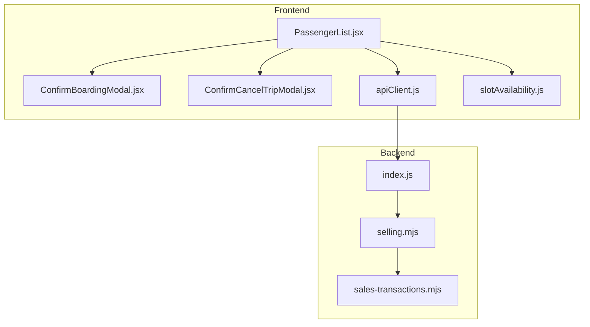
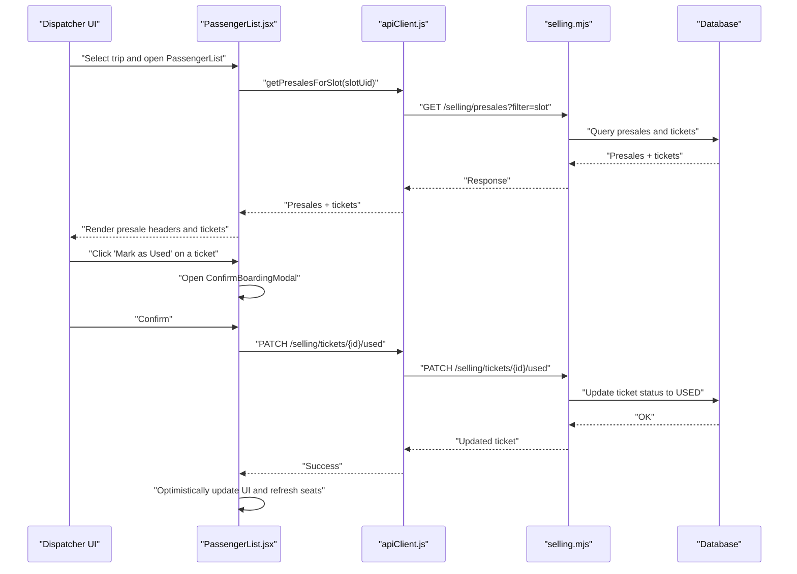
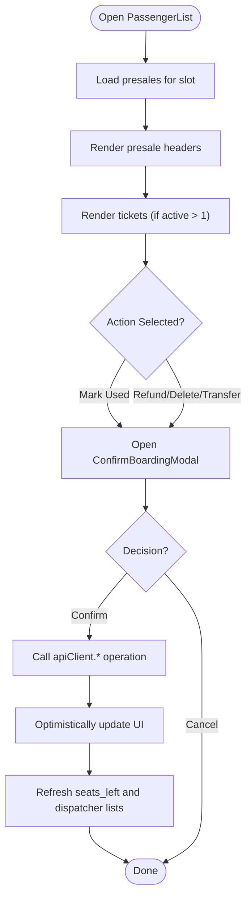
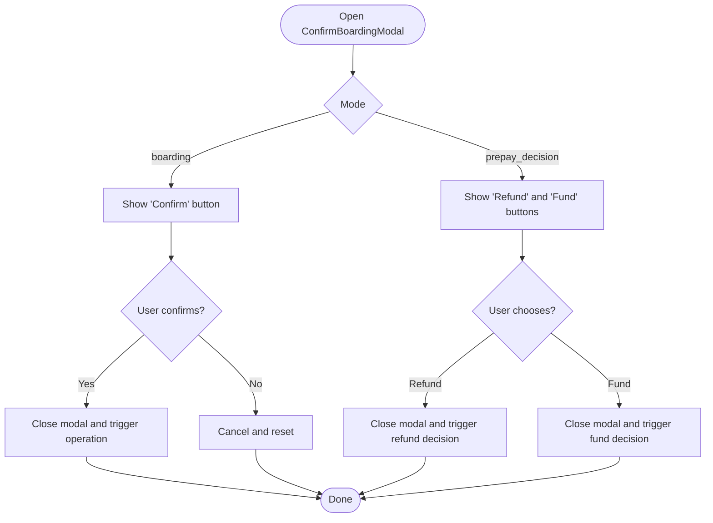
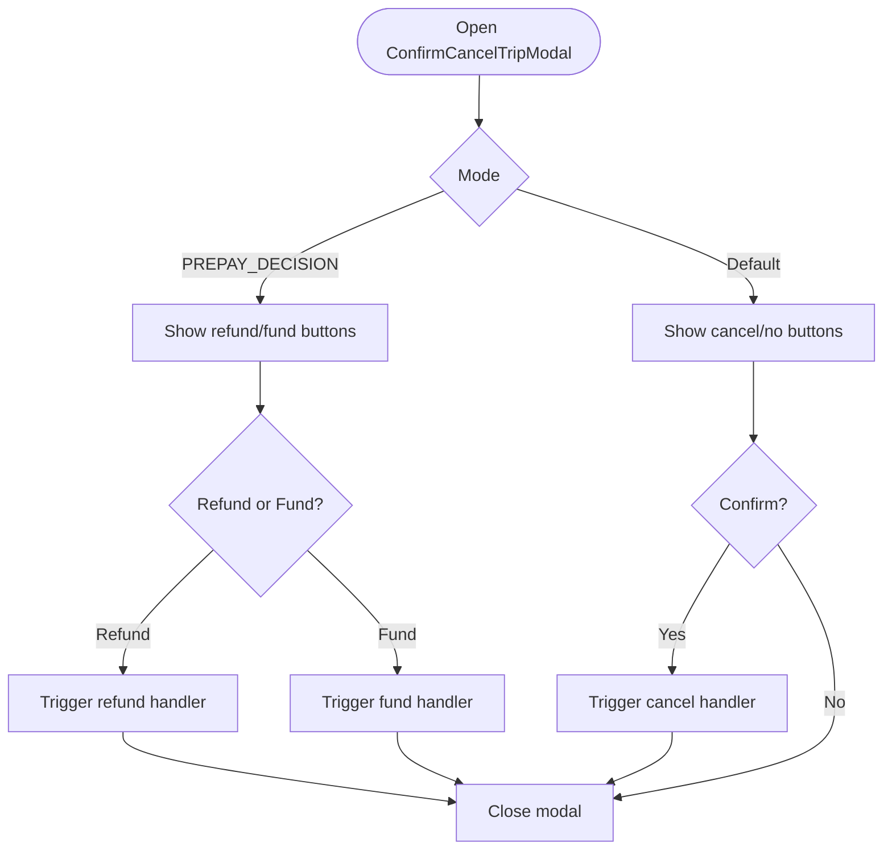
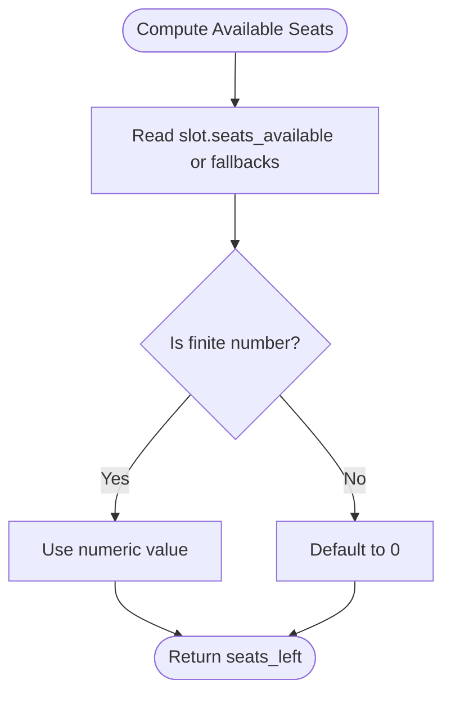
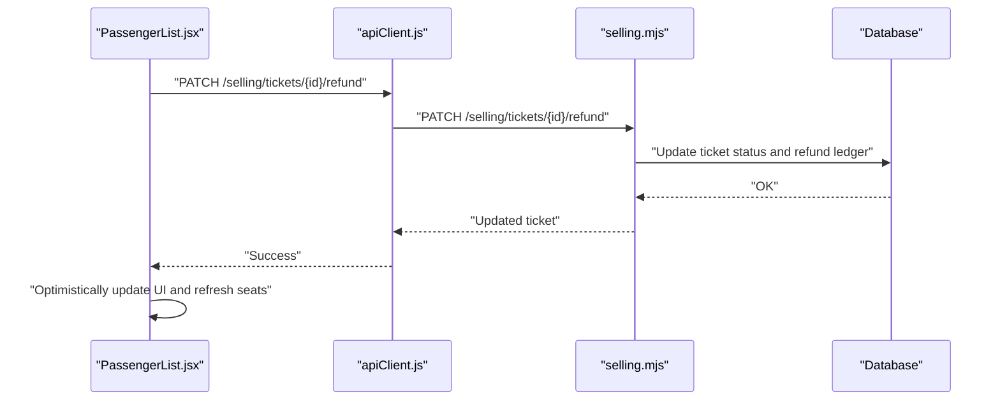
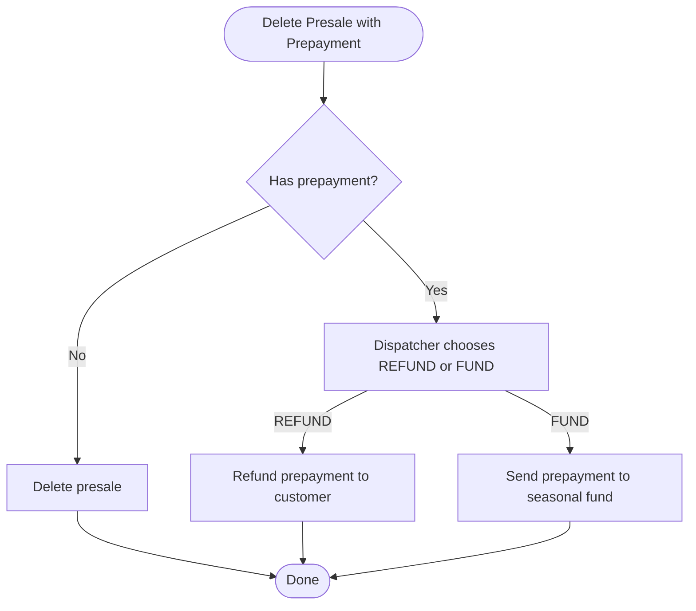
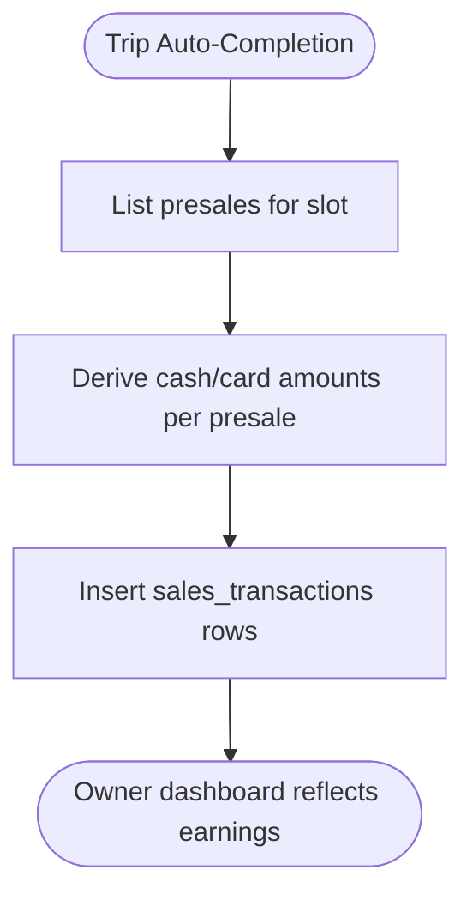
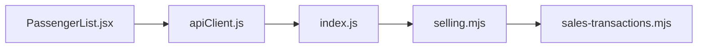

# Passenger Handling

<cite>
**Referenced Files in This Document**
- [PassengerList.jsx](file://src/components/dispatcher/PassengerList.jsx)
- [ConfirmBoardingModal.jsx](file://src/components/dispatcher/ConfirmBoardingModal.jsx)
- [ConfirmCancelTripModal.jsx](file://src/components/dispatcher/ConfirmCancelTripModal.jsx)
- [slotAvailability.js](file://src/utils/slotAvailability.js)
- [apiClient.js](file://src/utils/apiClient.js)
- [selling.mjs](file://server/selling.mjs)
- [sales-transactions.mjs](file://server/sales-transactions.mjs)
- [index.js](file://server/index.js)
</cite>

## Table of Contents
1. [Introduction](#introduction)
2. [Project Structure](#project-structure)
3. [Core Components](#core-components)
4. [Architecture Overview](#architecture-overview)
5. [Detailed Component Analysis](#detailed-component-analysis)
6. [Dependency Analysis](#dependency-analysis)
7. [Performance Considerations](#performance-considerations)
8. [Troubleshooting Guide](#troubleshooting-guide)
9. [Conclusion](#conclusion)
10. [Appendices](#appendices)

## Introduction
This document explains the passenger handling operations for dispatcher users, focusing on:
- Viewing and managing passenger lists for selected trips
- Boarding control and status updates
- Refund processing for tickets and presales
- Cancellation confirmation for trips and associated refund procedures
- Real-time seat availability and capacity updates
- Audit trail and money ledger integration

It consolidates frontend UI flows and backend APIs to provide a complete picture of how passenger operations work end-to-end.

## Project Structure
The passenger handling feature spans frontend components and backend routes:
- Frontend: PassengerList displays passengers, boarding confirmation, and refund flows; supporting modals and utilities
- Backend: Selling routes implement seat capacity checks, ticket operations, transfers, and refund logic; sales transactions module maintains canonical owner money records

**Diagram sources**
- [PassengerList.jsx](file://src/components/dispatcher/PassengerList.jsx#L167-L196)
- [ConfirmBoardingModal.jsx](file://src/components/dispatcher/ConfirmBoardingModal.jsx#L10-L18)
- [ConfirmCancelTripModal.jsx](file://src/components/dispatcher/ConfirmCancelTripModal.jsx#L12-L21)
- [apiClient.js](file://src/utils/apiClient.js#L108-L288)
- [slotAvailability.js](file://src/utils/slotAvailability.js#L7-L10)
- [index.js](file://server/index.js#L25-L35)
- [selling.mjs](file://server/selling.mjs#L1-L20)
- [sales-transactions.mjs](file://server/sales-transactions.mjs#L34-L63)

**Section sources**
- [PassengerList.jsx](file://src/components/dispatcher/PassengerList.jsx#L167-L196)
- [apiClient.js](file://src/utils/apiClient.js#L108-L288)
- [index.js](file://server/index.js#L25-L35)

## Core Components
- PassengerList: Central UI for viewing presales and tickets, initiating boarding/refund/deletion/transfer operations, and updating seat availability
- ConfirmBoardingModal: Generic confirmation modal for boarding and prepayment decisions
- ConfirmCancelTripModal: Trip cancellation confirmation with prepayment decision support
- apiClient: Frontend HTTP client wrapping backend endpoints for presales, tickets, and slots
- slotAvailability: Utility to compute available seats from slot objects
- selling.mjs: Backend routes implementing seat capacity checks, ticket operations, transfers, and refund logic
- sales-transactions.mjs: Canonical owner money generation from valid presales after trip completion

**Section sources**
- [PassengerList.jsx](file://src/components/dispatcher/PassengerList.jsx#L167-L196)
- [ConfirmBoardingModal.jsx](file://src/components/dispatcher/ConfirmBoardingModal.jsx#L10-L18)
- [ConfirmCancelTripModal.jsx](file://src/components/dispatcher/ConfirmCancelTripModal.jsx#L12-L21)
- [apiClient.js](file://src/utils/apiClient.js#L166-L288)
- [slotAvailability.js](file://src/utils/slotAvailability.js#L7-L10)
- [selling.mjs](file://server/selling.mjs#L1-L20)
- [sales-transactions.mjs](file://server/sales-transactions.mjs#L34-L63)

## Architecture Overview
The passenger handling architecture connects UI actions to backend operations with strict capacity and status validations.

**Diagram sources**
- [PassengerList.jsx](file://src/components/dispatcher/PassengerList.jsx#L579-L733)
- [ConfirmBoardingModal.jsx](file://src/components/dispatcher/ConfirmBoardingModal.jsx#L10-L18)
- [apiClient.js](file://src/utils/apiClient.js#L264-L266)
- [selling.mjs](file://server/selling.mjs#L3815-L3825)

## Detailed Component Analysis

### PassengerList Component
Responsibilities:
- Load presales and tickets for a selected trip
- Render presale headers with payment progress and actions
- Render individual tickets with status and action buttons
- Manage boarding confirmation modal and prepayment decision flows
- Handle ticket operations: mark as used, refund, transfer, delete
- Manage presale operations: accept payment, cancel/delete with prepayment decision
- Integrate with seat availability and refresh slots

Key behaviors:
- Seat availability is computed from dispatcher slots and refreshed periodically
- Ticket operations are guarded by presale status checks
- Transfer operations require selecting a destination slot with sufficient capacity
- Prepayment decisions prompt the dispatcher to choose refund or fund when deleting presales

**Diagram sources**
- [PassengerList.jsx](file://src/components/dispatcher/PassengerList.jsx#L244-L289)
- [PassengerList.jsx](file://src/components/dispatcher/PassengerList.jsx#L579-L733)
- [PassengerList.jsx](file://src/components/dispatcher/PassengerList.jsx#L764-L891)

**Section sources**
- [PassengerList.jsx](file://src/components/dispatcher/PassengerList.jsx#L167-L196)
- [PassengerList.jsx](file://src/components/dispatcher/PassengerList.jsx#L244-L289)
- [PassengerList.jsx](file://src/components/dispatcher/PassengerList.jsx#L579-L733)
- [PassengerList.jsx](file://src/components/dispatcher/PassengerList.jsx#L764-L891)
- [PassengerList.jsx](file://src/components/dispatcher/PassengerList.jsx#L1029-L1112)
- [PassengerList.jsx](file://src/components/dispatcher/PassengerList.jsx#L1114-L1448)

### ConfirmBoardingModal
Purpose:
- Unified confirmation UI for boarding and prepayment decisions
- Mode switching between boarding confirmation and prepay decision

Behavior:
- Displays descriptive title and message based on mode
- Provides single-button confirmation for boarding
- Presents two-action buttons (refund or fund) for prepayment decisions

**Diagram sources**
- [ConfirmBoardingModal.jsx](file://src/components/dispatcher/ConfirmBoardingModal.jsx#L10-L18)
- [ConfirmBoardingModal.jsx](file://src/components/dispatcher/ConfirmBoardingModal.jsx#L21-L25)
- [ConfirmBoardingModal.jsx](file://src/components/dispatcher/ConfirmBoardingModal.jsx#L47-L68)
- [ConfirmBoardingModal.jsx](file://src/components/dispatcher/ConfirmBoardingModal.jsx#L69-L78)

**Section sources**
- [ConfirmBoardingModal.jsx](file://src/components/dispatcher/ConfirmBoardingModal.jsx#L10-L18)
- [ConfirmBoardingModal.jsx](file://src/components/dispatcher/ConfirmBoardingModal.jsx#L21-L25)
- [ConfirmBoardingModal.jsx](file://src/components/dispatcher/ConfirmBoardingModal.jsx#L47-L68)
- [ConfirmBoardingModal.jsx](file://src/components/dispatcher/ConfirmBoardingModal.jsx#L69-L78)

### ConfirmCancelTripModal
Purpose:
- Trip cancellation confirmation with backward-compatible modes
- Prepayment decision mode for handling prepayments when cancelling entire presales

Behavior:
- Backward-compatible mode shows simple yes/no confirmation
- Prepay decision mode shows refund/fund options and error messaging

**Diagram sources**
- [ConfirmCancelTripModal.jsx](file://src/components/dispatcher/ConfirmCancelTripModal.jsx#L12-L21)
- [ConfirmCancelTripModal.jsx](file://src/components/dispatcher/ConfirmCancelTripModal.jsx#L25-L27)
- [ConfirmCancelTripModal.jsx](file://src/components/dispatcher/ConfirmCancelTripModal.jsx#L29-L74)
- [ConfirmCancelTripModal.jsx](file://src/components/dispatcher/ConfirmCancelTripModal.jsx#L77-L102)

**Section sources**
- [ConfirmCancelTripModal.jsx](file://src/components/dispatcher/ConfirmCancelTripModal.jsx#L12-L21)
- [ConfirmCancelTripModal.jsx](file://src/components/dispatcher/ConfirmCancelTripModal.jsx#L25-L27)
- [ConfirmCancelTripModal.jsx](file://src/components/dispatcher/ConfirmCancelTripModal.jsx#L29-L74)
- [ConfirmCancelTripModal.jsx](file://src/components/dispatcher/ConfirmCancelTripModal.jsx#L77-L102)

### Seat Availability and Capacity Updates
Seat availability is derived from dispatcher slots and recalculated when needed:
- Primary source: seats_available, fallbacks: seats_left, capacity
- Periodic refresh via dispatcher slots endpoint
- Backend capacity checks enforce seat occupancy limits and generated slot cache synchronization

**Diagram sources**
- [slotAvailability.js](file://src/utils/slotAvailability.js#L7-L10)
- [PassengerList.jsx](file://src/components/dispatcher/PassengerList.jsx#L184-L196)
- [selling.mjs](file://server/selling.mjs#L66-L94)

**Section sources**
- [slotAvailability.js](file://src/utils/slotAvailability.js#L7-L10)
- [PassengerList.jsx](file://src/components/dispatcher/PassengerList.jsx#L184-L196)
- [selling.mjs](file://server/selling.mjs#L66-L94)

### Ticket Operations and Refunds
Operations supported:
- Mark ticket as used
- Refund ticket
- Transfer ticket to another slot
- Delete ticket
- Accept payment for presale
- Cancel/delete presale with prepayment decision
- Transfer presale to another slot

Backend validations:
- Capacity checks for transfers
- Status checks for allowed operations
- Money ledger updates for pending amounts after transfers

**Diagram sources**
- [apiClient.js](file://src/utils/apiClient.js#L268-L269)
- [selling.mjs](file://server/selling.mjs#L3376-L3381)

**Section sources**
- [apiClient.js](file://src/utils/apiClient.js#L264-L274)
- [PassengerList.jsx](file://src/components/dispatcher/PassengerList.jsx#L630-L733)
- [selling.mjs](file://server/selling.mjs#L3376-L3381)

### Presale Operations and Prepayment Decisions
When deleting a presale with prepayment:
- Dispatcher must choose between refund to customer or sending to seasonal fund
- Backend enforces prepayment decision and updates presale status accordingly
- Pending money ledger recalculated to reflect expected payments

**Diagram sources**
- [PassengerList.jsx](file://src/components/dispatcher/PassengerList.jsx#L794-L824)
- [PassengerList.jsx](file://src/components/dispatcher/PassengerList.jsx#L825-L859)

**Section sources**
- [PassengerList.jsx](file://src/components/dispatcher/PassengerList.jsx#L794-L824)
- [PassengerList.jsx](file://src/components/dispatcher/PassengerList.jsx#L825-L859)

### Integration with Owner Money Ledger
Owner money is recorded from valid presales after trip completion:
- Canonical money layer ensures owner earnings appear only after auto-completion
- Sales transactions created per business day, slot, and payment method
- Explicit cash/card amounts preferred; fallbacks handled conservatively

**Diagram sources**
- [sales-transactions.mjs](file://server/sales-transactions.mjs#L167-L236)

**Section sources**
- [sales-transactions.mjs](file://server/sales-transactions.mjs#L167-L236)

## Dependency Analysis
Frontend-to-backend dependencies:
- PassengerList depends on apiClient for all operations
- apiClient maps UI actions to backend endpoints under /api/selling
- Backend routes in selling.mjs implement seat capacity checks and ticket/presale operations
- sales-transactions.mjs creates canonical owner money entries

**Diagram sources**
- [PassengerList.jsx](file://src/components/dispatcher/PassengerList.jsx#L1-L6)
- [apiClient.js](file://src/utils/apiClient.js#L108-L114)
- [index.js](file://server/index.js#L25-L35)
- [selling.mjs](file://server/selling.mjs#L1-L20)
- [sales-transactions.mjs](file://server/sales-transactions.mjs#L34-L63)

**Section sources**
- [PassengerList.jsx](file://src/components/dispatcher/PassengerList.jsx#L1-L6)
- [apiClient.js](file://src/utils/apiClient.js#L108-L114)
- [index.js](file://server/index.js#L25-L35)
- [selling.mjs](file://server/selling.mjs#L1-L20)
- [sales-transactions.mjs](file://server/sales-transactions.mjs#L34-L63)

## Performance Considerations
- Anti-spam throttling: reloads are debounced to reduce network churn
- Optimistic UI updates: ticket/presale changes are reflected immediately, with server-side reconciliation
- Seat refresh: periodic refresh of seats_left from dispatcher slots to maintain accuracy
- Capacity checks: backend validates seat availability before transfers and prevents overbooking

[No sources needed since this section provides general guidance]

## Troubleshooting Guide
Common issues and resolutions:
- Capacity exceeded during transfer: Ensure destination slot has sufficient seats_left
- Operation blocked by status: Verify presale status allows the requested action
- Payment method errors: Mixed payments require explicit cash/card amounts
- Transfer destination selection: Choose a valid active slot with adequate capacity and correct time/date

**Section sources**
- [selling.mjs](file://server/selling.mjs#L52-L94)
- [PassengerList.jsx](file://src/components/dispatcher/PassengerList.jsx#L833-L846)
- [PassengerList.jsx](file://src/components/dispatcher/PassengerList.jsx#L1224-L1237)

## Conclusion
The passenger handling system integrates a robust frontend UI with backend seat capacity enforcement and money ledger logic. It supports comprehensive operations including boarding confirmation, refund processing, presale management, and trip cancellation with prepayment decisions. Real-time seat updates and canonical owner money generation ensure accurate operational and financial reporting.

[No sources needed since this section summarizes without analyzing specific files]

## Appendices

### Practical Examples Index
- Passenger status updates: Mark ticket as used, refund, transfer, delete
- Boarding procedures: ConfirmBoardingModal flow for boarding confirmation
- Refund calculations: Prepayment decision modal and backend refund logic
- Audit trail maintenance: Money ledger updates and sales transactions creation
- Integration with seat availability: Dispatcher slots refresh and capacity checks

[No sources needed since this section provides general guidance]