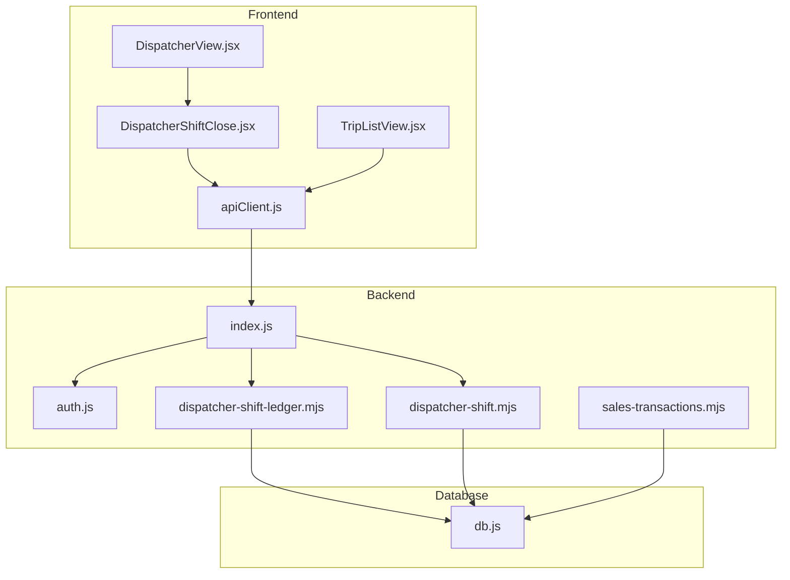
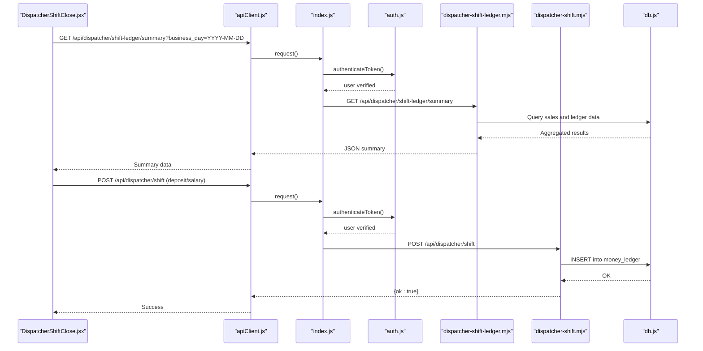
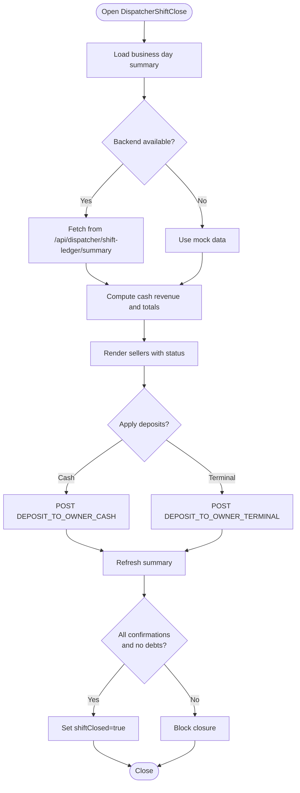
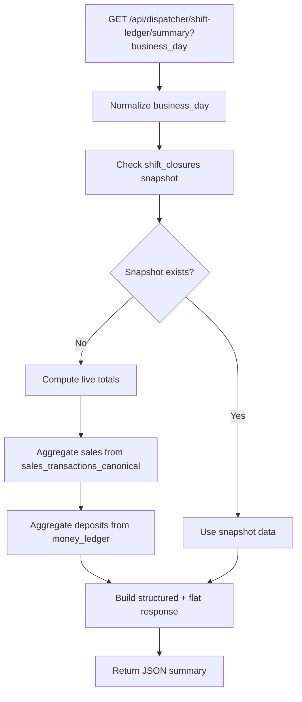
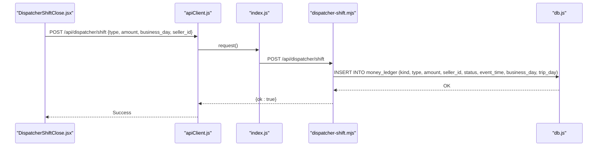
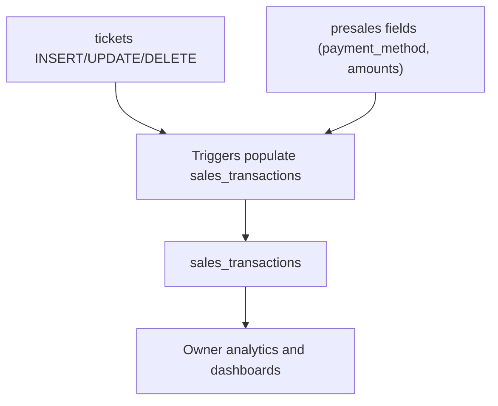
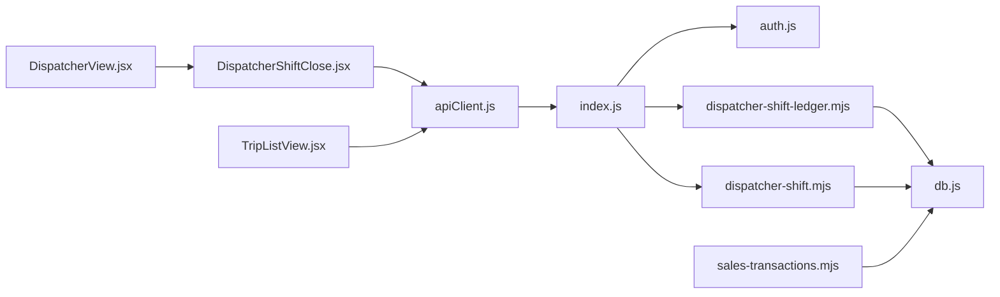

# Shift Operations

<cite>
**Referenced Files in This Document**
- [DispatcherShiftClose.jsx](file://src/views/DispatcherShiftClose.jsx)
- [DispatcherView.jsx](file://src/views/DispatcherView.jsx)
- [dispatcher-shift-ledger.mjs](file://server/dispatcher-shift-ledger.mjs)
- [dispatcher-shift.mjs](file://server/dispatcher-shift.mjs)
- [sales-transactions.mjs](file://server/sales-transactions.mjs)
- [apiClient.js](file://src/utils/apiClient.js)
- [auth.js](file://server/auth.js)
- [index.js](file://server/index.js)
- [db.js](file://server/db.js)
- [TripListView.jsx](file://src/components/dispatcher/TripListView.jsx)
</cite>

## Table of Contents
1. [Introduction](#introduction)
2. [Project Structure](#project-structure)
3. [Core Components](#core-components)
4. [Architecture Overview](#architecture-overview)
5. [Detailed Component Analysis](#detailed-component-analysis)
6. [Dependency Analysis](#dependency-analysis)
7. [Performance Considerations](#performance-considerations)
8. [Troubleshooting Guide](#troubleshooting-guide)
9. [Conclusion](#conclusion)

## Introduction
This document explains the dispatcher shift operations system, focusing on shift opening and closing procedures, cash reconciliation, and ledger management. It covers the DispatcherShiftClose view that orchestrates shift closure workflows, backend shift management APIs, ledger calculations, and integration with sales transactions. Practical examples demonstrate shift opening procedures, daily operations tracking, cash handling, and shift handover documentation. The system emphasizes real-time status updates and administrative reporting capabilities.

## Project Structure
The shift operations system spans frontend React components and backend Express routes, with a SQLite database serving as the canonical data store. Key areas:
- Frontend: DispatcherShiftClose view and DispatcherView orchestration
- Backend: Shift ledger API and shift deposit API
- Data layer: Sales transactions canonical layer and money ledger
- Authentication: JWT-based middleware for secure access

**Diagram sources**
- [DispatcherShiftClose.jsx](file://src/views/DispatcherShiftClose.jsx#L1-L800)
- [DispatcherView.jsx](file://src/views/DispatcherView.jsx#L1-L291)
- [TripListView.jsx](file://src/components/dispatcher/TripListView.jsx#L1-L257)
- [apiClient.js](file://src/utils/apiClient.js#L1-L360)
- [index.js](file://server/index.js#L1-L45)
- [auth.js](file://server/auth.js#L1-L154)
- [dispatcher-shift-ledger.mjs](file://server/dispatcher-shift-ledger.mjs#L1-L352)
- [dispatcher-shift.mjs](file://server/dispatcher-shift.mjs#L1-L62)
- [sales-transactions.mjs](file://server/sales-transactions.mjs#L1-L237)
- [db.js](file://server/db.js#L1-L1269)

**Section sources**
- [DispatcherShiftClose.jsx](file://src/views/DispatcherShiftClose.jsx#L1-L800)
- [DispatcherView.jsx](file://src/views/DispatcherView.jsx#L1-L291)
- [index.js](file://server/index.js#L1-L45)

## Core Components
- DispatcherShiftClose view: Manages shift closure, cash reconciliation, salary handover, and confirmation steps.
- dispatcher-shift-ledger API: Provides safe, schema-tolerant shift ledger summaries for the UI.
- dispatcher-shift API: Records shift-related financial events (cash deposits, terminal closures, salary payouts).
- sales-transactions canonical layer: Owner-facing money layer built from tickets and presales.
- Authentication middleware: Secures all APIs with JWT and role-based access checks.

**Section sources**
- [DispatcherShiftClose.jsx](file://src/views/DispatcherShiftClose.jsx#L1-L800)
- [dispatcher-shift-ledger.mjs](file://server/dispatcher-shift-ledger.mjs#L1-L352)
- [dispatcher-shift.mjs](file://server/dispatcher-shift.mjs#L1-L62)
- [sales-transactions.mjs](file://server/sales-transactions.mjs#L1-L237)
- [auth.js](file://server/auth.js#L1-L154)

## Architecture Overview
The system integrates frontend UI with backend APIs and a robust database layer. The dispatcher shift ledger API aggregates sales and ledger data safely across evolving schemas, while the shift deposit API records operational events. The sales transactions canonical layer ensures owner reporting remains consistent even as seller flows evolve.

**Diagram sources**
- [DispatcherShiftClose.jsx](file://src/views/DispatcherShiftClose.jsx#L96-L188)
- [apiClient.js](file://src/utils/apiClient.js#L23-L88)
- [index.js](file://server/index.js#L29-L35)
- [auth.js](file://server/auth.js#L10-L40)
- [dispatcher-shift-ledger.mjs](file://server/dispatcher-shift-ledger.mjs#L78-L350)
- [dispatcher-shift.mjs](file://server/dispatcher-shift.mjs#L8-L59)
- [db.js](file://server/db.js#L1-L1269)

## Detailed Component Analysis

### DispatcherShiftClose View: Shift Closure Workflow
The DispatcherShiftClose view coordinates shift closure, reconciliation, and handover:
- Loads daily summary from the backend ledger API, falling back to mock data if backend is unavailable.
- Computes cash revenue from real cash balances plus explicit cash deposits.
- Tracks seller debts (cash remaining and terminal debt) and provides accordion details.
- Supports cash and terminal deposit operations with backend integration.
- Manages salary stubs (manual input) and salary payout actions.
- Enforces confirmation checks and prevents closure until conditions are met.

Key behaviors:
- Business day calculation and backend summary loading.
- Draft-based deposit entries per seller.
- Real-time reconciliation and UI-driven closure controls.
- Local storage flagging for shift closure state.

**Diagram sources**
- [DispatcherShiftClose.jsx](file://src/views/DispatcherShiftClose.jsx#L96-L433)

**Section sources**
- [DispatcherShiftClose.jsx](file://src/views/DispatcherShiftClose.jsx#L1-L800)

### Backend Shift Ledger API: Safe Summary Calculation
The dispatcher-shift-ledger API provides a resilient summary for the UI:
- Supports multiple schema variants by checking table and column existence.
- Prefers a dedicated shift_closures snapshot for past days; otherwise computes live balances.
- Aggregates sales totals from sales_transactions_canonical with status filtering.
- Computes deposits to owner by method (cash/card) and per seller.
- Returns both flat and structured response formats for UI compatibility.
- Includes schema diagnostics for support and debugging.

**Diagram sources**
- [dispatcher-shift-ledger.mjs](file://server/dispatcher-shift-ledger.mjs#L78-L350)

**Section sources**
- [dispatcher-shift-ledger.mjs](file://server/dispatcher-shift-ledger.mjs#L1-L352)

### Shift Deposit API: Recording Operational Events
The dispatcher-shift API records shift-related financial events:
- Validates request body and allowed event types.
- Inserts records into money_ledger with kind 'DISPATCHER_SHIFT'.
- Sets status to POSTED and captures timestamps and business day.
- Supports cash deposits, terminal closures, and salary payouts.

**Diagram sources**
- [dispatcher-shift.mjs](file://server/dispatcher-shift.mjs#L8-L59)
- [db.js](file://server/db.js#L1-L1269)

**Section sources**
- [dispatcher-shift.mjs](file://server/dispatcher-shift.mjs#L1-L62)

### Sales Transactions Canonical Layer: Owner Reporting
The sales-transactions module creates a canonical money layer for owner analytics:
- Creates and maintains sales_transactions table with additive-only migrations.
- Populates sales_transactions via triggers from tickets and presales.
- Ensures idempotency and safety by ignoring duplicates and missing columns.
- Supports owner dashboard and reporting without disrupting seller flows.

**Diagram sources**
- [sales-transactions.mjs](file://server/sales-transactions.mjs#L1065-L1219)
- [db.js](file://server/db.js#L1036-L1247)

**Section sources**
- [sales-transactions.mjs](file://server/sales-transactions.mjs#L1-L237)
- [db.js](file://server/db.js#L1036-L1247)

### DispatcherView: Navigation and Shift State
The DispatcherView manages navigation and shift state persistence:
- Tabs for trips, selling, slots, maps, and shift close.
- Maintains shiftClosed state in localStorage and passes to child views.
- Integrates with TripListView for active/completed trip filtering.

**Section sources**
- [DispatcherView.jsx](file://src/views/DispatcherView.jsx#L1-L291)
- [TripListView.jsx](file://src/components/dispatcher/TripListView.jsx#L1-L257)

## Dependency Analysis
The system exhibits clear separation of concerns:
- Frontend depends on apiClient for all backend communication.
- Backend routes depend on authentication middleware and database helpers.
- Ledger API tolerates schema changes through safe checks and fallbacks.
- Sales transactions layer is additive and isolated from seller flows.

**Diagram sources**
- [apiClient.js](file://src/utils/apiClient.js#L1-L360)
- [index.js](file://server/index.js#L1-L45)
- [auth.js](file://server/auth.js#L1-L154)
- [dispatcher-shift-ledger.mjs](file://server/dispatcher-shift-ledger.mjs#L1-L352)
- [dispatcher-shift.mjs](file://server/dispatcher-shift.mjs#L1-L62)
- [sales-transactions.mjs](file://server/sales-transactions.mjs#L1-L237)
- [db.js](file://server/db.js#L1-L1269)
- [DispatcherShiftClose.jsx](file://src/views/DispatcherShiftClose.jsx#L1-L800)
- [DispatcherView.jsx](file://src/views/DispatcherView.jsx#L1-L291)
- [TripListView.jsx](file://src/components/dispatcher/TripListView.jsx#L1-L257)

**Section sources**
- [index.js](file://server/index.js#L1-L45)
- [auth.js](file://server/auth.js#L1-L154)

## Performance Considerations
- Schema-safe queries: The ledger API uses PRAGMA checks and conditional aggregations to avoid startup failures and reduce runtime overhead.
- Indexes: Sales transactions and tickets tables include indexes to accelerate owner analytics and reporting.
- Minimal frontend state: Drafts and computed totals are memoized to minimize re-renders.
- Backend caching: The ledger summary endpoint consolidates multiple reads into a single JSON response.

[No sources needed since this section provides general guidance]

## Troubleshooting Guide
Common issues and resolutions:
- Backend unavailable: The UI falls back to mock data and allows manual reconciliation. Re-enable backend to restore real-time updates.
- Missing schema elements: The ledger API gracefully handles missing tables/columns and returns partial data; check _schema diagnostics in the summary response.
- Authentication failures: Ensure a valid JWT token is present; verify server logs for token verification errors.
- Deposit not recorded: Verify allowed types and positive amounts; check money_ledger inserts and POSTED status.

**Section sources**
- [DispatcherShiftClose.jsx](file://src/views/DispatcherShiftClose.jsx#L190-L202)
- [dispatcher-shift-ledger.mjs](file://server/dispatcher-shift-ledger.mjs#L332-L349)
- [auth.js](file://server/auth.js#L10-L40)
- [dispatcher-shift.mjs](file://server/dispatcher-shift.mjs#L12-L24)

## Conclusion
The dispatcher shift operations system provides a robust, schema-tolerant framework for managing shift workflows, cash reconciliation, and ledger reporting. The frontend offers intuitive controls for deposits and salary handovers, while the backend APIs ensure reliable data capture and aggregation. The sales transactions canonical layer guarantees owner reporting stability as the system evolves.