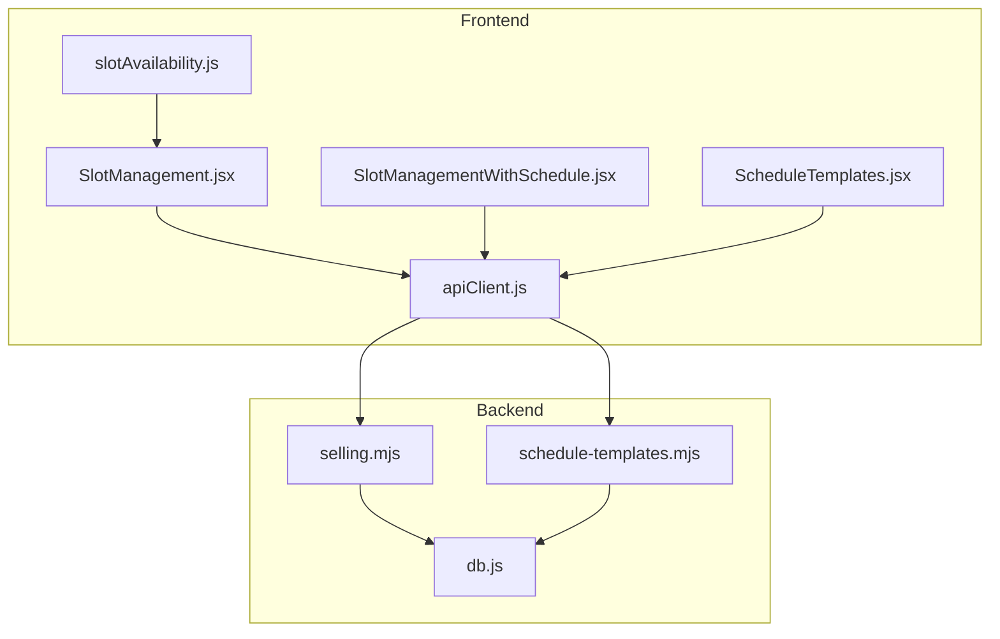
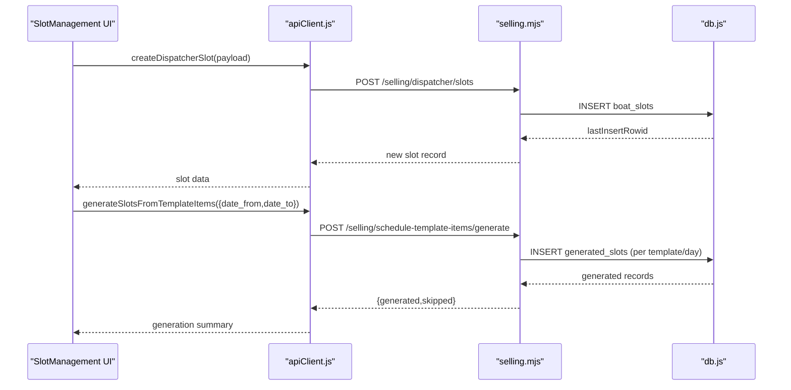
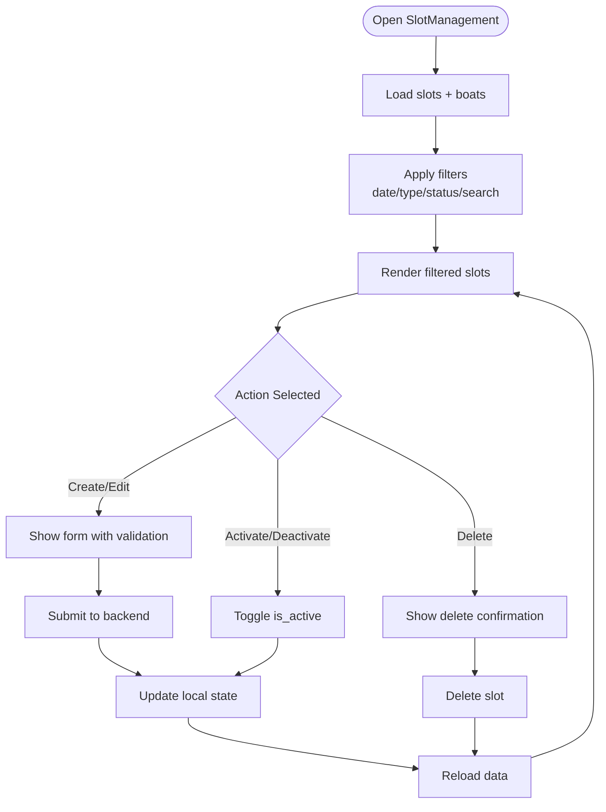
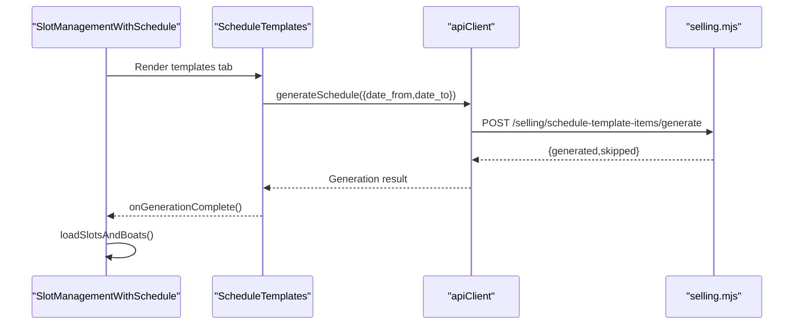
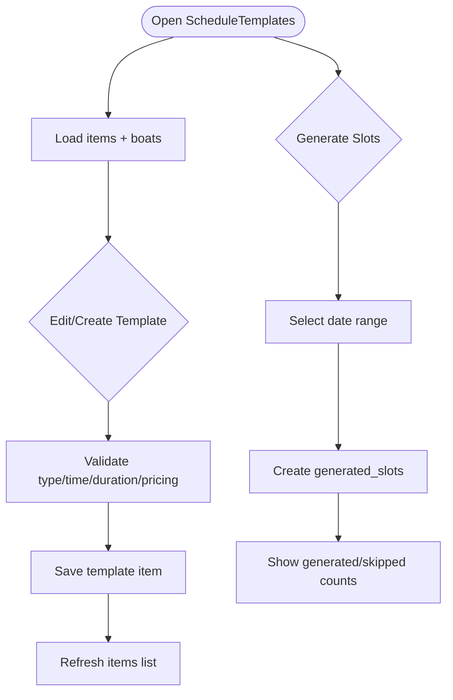
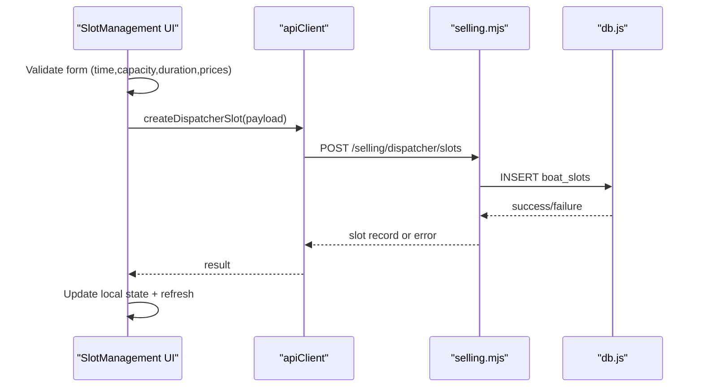
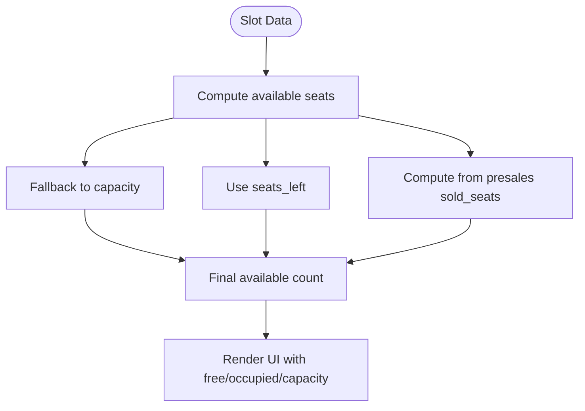
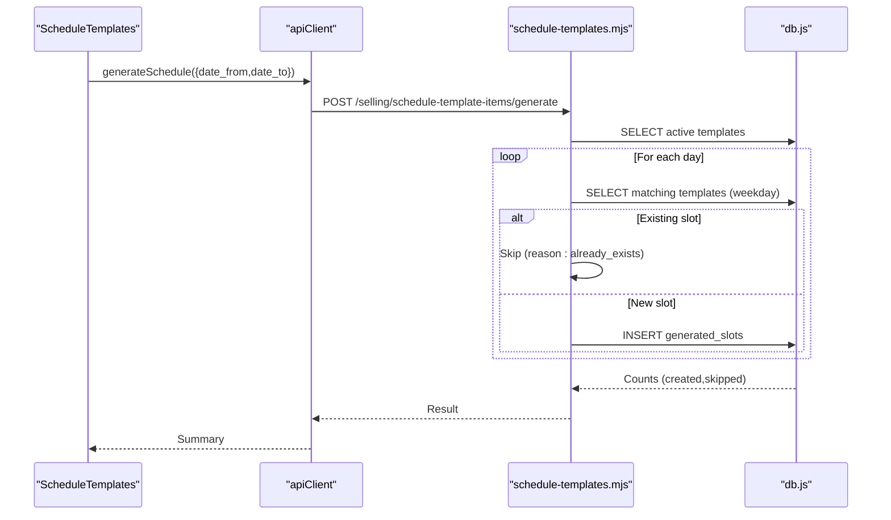
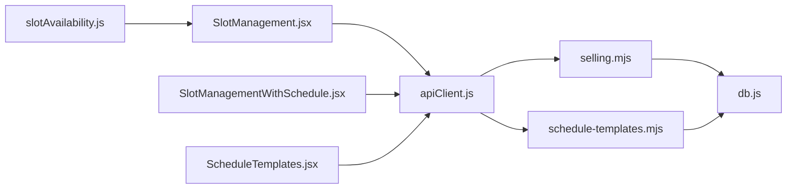

# Slot Management

<cite>
**Referenced Files in This Document**
- [SlotManagement.jsx](file://src/components/dispatcher/SlotManagement.jsx)
- [SlotManagementWithSchedule.jsx](file://src/components/dispatcher/SlotManagementWithSchedule.jsx)
- [ScheduleTemplates.jsx](file://src/components/dispatcher/ScheduleTemplates.jsx)
- [slotAvailability.js](file://src/utils/slotAvailability.js)
- [apiClient.js](file://src/utils/apiClient.js)
- [selling.mjs](file://server/selling.mjs)
- [schedule-templates.mjs](file://server/schedule-templates.mjs)
- [db.js](file://server/db.js)
</cite>

## Table of Contents
1. [Introduction](#introduction)
2. [Project Structure](#project-structure)
3. [Core Components](#core-components)
4. [Architecture Overview](#architecture-overview)
5. [Detailed Component Analysis](#detailed-component-analysis)
6. [Dependency Analysis](#dependency-analysis)
7. [Performance Considerations](#performance-considerations)
8. [Troubleshooting Guide](#troubleshooting-guide)
9. [Conclusion](#conclusion)

## Introduction
This document provides comprehensive documentation for the slot management functionality in the boat ticket application. It covers the creation, modification, and deletion of individual trip slots, as well as the template-based scheduling system that automates slot generation. The documentation explains how dispatchers manage operational configurations, capacity allocation, timing adjustments, and integrates with schedule templates. It also details the relationship between slots and boat availability, operational constraints, and real-time capacity updates.

## Project Structure
The slot management system spans frontend React components and backend APIs with database persistence:
- Frontend components handle user interactions, form validation, filtering, and display of slots and templates.
- Backend routes manage slot CRUD operations, template CRUD operations, and slot generation from templates.
- Database schema defines tables for manual slots, generated slots, boats, and schedule templates.

**Diagram sources**
- [SlotManagement.jsx](file://src/components/dispatcher/SlotManagement.jsx#L1-L1058)
- [SlotManagementWithSchedule.jsx](file://src/components/dispatcher/SlotManagementWithSchedule.jsx#L1-L1062)
- [ScheduleTemplates.jsx](file://src/components/dispatcher/ScheduleTemplates.jsx#L1-L726)
- [apiClient.js](file://src/utils/apiClient.js#L1-L360)
- [selling.mjs](file://server/selling.mjs#L1750-L1900)
- [schedule-templates.mjs](file://server/schedule-templates.mjs#L1-L760)
- [db.js](file://server/db.js#L688-L793)

**Section sources**
- [SlotManagement.jsx](file://src/components/dispatcher/SlotManagement.jsx#L1-L1058)
- [SlotManagementWithSchedule.jsx](file://src/components/dispatcher/SlotManagementWithSchedule.jsx#L1-L1062)
- [ScheduleTemplates.jsx](file://src/components/dispatcher/ScheduleTemplates.jsx#L1-L726)
- [apiClient.js](file://src/utils/apiClient.js#L1-L360)
- [selling.mjs](file://server/selling.mjs#L1750-L1900)
- [schedule-templates.mjs](file://server/schedule-templates.mjs#L1-L760)
- [db.js](file://server/db.js#L688-L793)

## Core Components
- SlotManagement: Manages individual trip slots with capacity, pricing, timing, and activation controls. Supports filtering by date, type, status, and search terms. Integrates with schedule templates tab.
- SlotManagementWithSchedule: Unified interface combining slot management and schedule template management with tabbed navigation.
- ScheduleTemplates: Defines recurring schedule templates with weekday masks, capacity, durations, and pricing; generates actual slots for date ranges.
- apiClient: Centralized HTTP client for all backend endpoints including slots, boats, and schedule templates.
- slotAvailability: Utility for computing available seats across different slot data formats.

Key capabilities:
- Create/update/delete manual slots with validation for time, capacity, duration, and pricing.
- Activate/deactivate slots and bulk cleanup for deleted boats.
- Generate slots from schedule templates for date ranges with conflict detection.
- Real-time capacity computation and display of occupied/free seats.

**Section sources**
- [SlotManagement.jsx](file://src/components/dispatcher/SlotManagement.jsx#L19-L510)
- [SlotManagementWithSchedule.jsx](file://src/components/dispatcher/SlotManagementWithSchedule.jsx#L6-L585)
- [ScheduleTemplates.jsx](file://src/components/dispatcher/ScheduleTemplates.jsx#L4-L363)
- [apiClient.js](file://src/utils/apiClient.js#L105-L360)
- [slotAvailability.js](file://src/utils/slotAvailability.js#L1-L19)

## Architecture Overview
The slot management architecture follows a layered pattern:
- UI Layer: React components render forms, lists, and modals; manage state and user interactions.
- API Layer: Express routes expose endpoints for dispatcher slots, schedule templates, and generated slots.
- Data Access Layer: SQLite database with migrations ensuring schema consistency and constraints.
- Business Logic: Validation rules, capacity checks, and template-driven generation.

**Diagram sources**
- [apiClient.js](file://src/utils/apiClient.js#L134-L163)
- [selling.mjs](file://server/selling.mjs#L1752-L1862)
- [schedule-templates.mjs](file://server/schedule-templates.mjs#L571-L682)
- [db.js](file://server/db.js#L688-L793)

## Detailed Component Analysis

### SlotManagement Component
The SlotManagement component provides a comprehensive interface for managing individual trip slots:
- Tabs: Switches between "Slots (dates)" and "Schedule (templates)" views.
- Filtering: Supports date range (today/tomorrow), boat type, status (active/completed), and free-text search.
- Forms: Create/edit forms with validation for time, capacity, duration, and pricing categories.
- Actions: Edit, activate/deactivate, delete, and bulk cleanup for deleted boats.
- Display: Shows capacity, occupancy, duration, and boat status with accessibility hints.

**Diagram sources**
- [SlotManagement.jsx](file://src/components/dispatcher/SlotManagement.jsx#L160-L510)

**Section sources**
- [SlotManagement.jsx](file://src/components/dispatcher/SlotManagement.jsx#L19-L1058)

### SlotManagementWithSchedule Variant
This component combines slot management and schedule template management in a single interface:
- Tabs: "Slots (dates)" for manual slots and "Schedule (templates)" for templates.
- Template Integration: Delegates template management to ScheduleTemplates component.
- Generation Callback: Notifies parent when schedule generation completes to refresh slot lists.

**Diagram sources**
- [SlotManagementWithSchedule.jsx](file://src/components/dispatcher/SlotManagementWithSchedule.jsx#L6-L1062)
- [ScheduleTemplates.jsx](file://src/components/dispatcher/ScheduleTemplates.jsx#L338-L363)
- [apiClient.js](file://src/utils/apiClient.js#L345-L352)
- [selling.mjs](file://server/selling.mjs#L1750-L1900)

**Section sources**
- [SlotManagementWithSchedule.jsx](file://src/components/dispatcher/SlotManagementWithSchedule.jsx#L6-L1062)
- [ScheduleTemplates.jsx](file://src/components/dispatcher/ScheduleTemplates.jsx#L338-L363)

### ScheduleTemplates Component
The ScheduleTemplates component manages recurring schedule templates:
- Template Items: Define weekday mask, departure time, capacity, duration, and pricing.
- Validation: Enforces constraints based on boat type (banana vs others).
- Generation: Generates actual slots for a given date range, skipping duplicates.
- Deletion: Supports removing templates while optionally deleting future generated trips.

**Diagram sources**
- [ScheduleTemplates.jsx](file://src/components/dispatcher/ScheduleTemplates.jsx#L44-L363)
- [schedule-templates.mjs](file://server/schedule-templates.mjs#L571-L682)

**Section sources**
- [ScheduleTemplates.jsx](file://src/components/dispatcher/ScheduleTemplates.jsx#L1-L726)
- [schedule-templates.mjs](file://server/schedule-templates.mjs#L1-L760)

### Slot Creation Workflow
The slot creation workflow ensures data integrity and operational constraints:
- Validation: Time format, capacity bounds, duration rules by boat type, pricing validation.
- Persistence: Inserts into boat_slots or generated_slots depending on source.
- Conflict Detection: Prevents duplicate slots for the same boat and time.
- Real-time Updates: Refreshes lists and notifies parent components.

**Diagram sources**
- [SlotManagement.jsx](file://src/components/dispatcher/SlotManagement.jsx#L220-L354)
- [apiClient.js](file://src/utils/apiClient.js#L134-L139)
- [selling.mjs](file://server/selling.mjs#L1752-L1862)
- [db.js](file://server/db.js#L688-L793)

**Section sources**
- [SlotManagement.jsx](file://src/components/dispatcher/SlotManagement.jsx#L220-L354)
- [apiClient.js](file://src/utils/apiClient.js#L134-L139)
- [selling.mjs](file://server/selling.mjs#L1752-L1862)

### Capacity Allocation and Real-time Updates
Capacity management ensures accurate seat availability:
- Available Seats: Computed from seats_available/seats_left/capacity/boat_capacity with fallbacks.
- Occupancy Calculation: Derived from capacity minus seats_left.
- Sold Seats: Calculated from capacity minus seats_left or from presales aggregation.
- Display: Shows free/occupied/capacity and highlights inactive or missing boats.

**Diagram sources**
- [slotAvailability.js](file://src/utils/slotAvailability.js#L1-L19)
- [SlotManagement.jsx](file://src/components/dispatcher/SlotManagement.jsx#L909-L944)

**Section sources**
- [slotAvailability.js](file://src/utils/slotAvailability.js#L1-L19)
- [SlotManagement.jsx](file://src/components/dispatcher/SlotManagement.jsx#L909-L944)

### Schedule Template Integration
Template-based scheduling automates slot creation:
- Template Definition: Weekday mask, departure time, capacity, duration, pricing.
- Generation: Iterates through date range, checks duplicates, inserts generated_slots.
- Constraints: Enforces type-specific rules (duration, capacity, pricing).
- Conflict Handling: Skips existing slots to avoid duplicates.

**Diagram sources**
- [ScheduleTemplates.jsx](file://src/components/dispatcher/ScheduleTemplates.jsx#L338-L363)
- [apiClient.js](file://src/utils/apiClient.js#L345-L352)
- [schedule-templates.mjs](file://server/schedule-templates.mjs#L571-L682)
- [db.js](file://server/db.js#L688-L793)

**Section sources**
- [ScheduleTemplates.jsx](file://src/components/dispatcher/ScheduleTemplates.jsx#L338-L363)
- [schedule-templates.mjs](file://server/schedule-templates.mjs#L571-L682)

## Dependency Analysis
The slot management system exhibits clear separation of concerns:
- UI components depend on apiClient for backend communication.
- apiClient encapsulates endpoint definitions and request/response handling.
- Backend routes depend on db.js for schema access and migrations.
- Template generation relies on schedule-templates.mjs and db.js constraints.

**Diagram sources**
- [SlotManagement.jsx](file://src/components/dispatcher/SlotManagement.jsx#L1-L1058)
- [SlotManagementWithSchedule.jsx](file://src/components/dispatcher/SlotManagementWithSchedule.jsx#L1-L1062)
- [ScheduleTemplates.jsx](file://src/components/dispatcher/ScheduleTemplates.jsx#L1-L726)
- [apiClient.js](file://src/utils/apiClient.js#L1-L360)
- [selling.mjs](file://server/selling.mjs#L1750-L1900)
- [schedule-templates.mjs](file://server/schedule-templates.mjs#L1-L760)
- [db.js](file://server/db.js#L688-L793)
- [slotAvailability.js](file://src/utils/slotAvailability.js#L1-L19)

**Section sources**
- [SlotManagement.jsx](file://src/components/dispatcher/SlotManagement.jsx#L1-L1058)
- [SlotManagementWithSchedule.jsx](file://src/components/dispatcher/SlotManagementWithSchedule.jsx#L1-L1062)
- [ScheduleTemplates.jsx](file://src/components/dispatcher/ScheduleTemplates.jsx#L1-L726)
- [apiClient.js](file://src/utils/apiClient.js#L1-L360)
- [selling.mjs](file://server/selling.mjs#L1750-L1900)
- [schedule-templates.mjs](file://server/schedule-templates.mjs#L1-L760)
- [db.js](file://server/db.js#L688-L793)
- [slotAvailability.js](file://src/utils/slotAvailability.js#L1-L19)

## Performance Considerations
- Database Indexes: Unique constraints and indexes on generated_slots improve lookup performance and prevent duplicates.
- Batch Operations: Template generation iterates efficiently over date ranges and applies weekday filtering.
- UI Rendering: Memoization and filtered lists reduce re-renders for large datasets.
- Real-time Updates: Local state updates minimize unnecessary network requests.

[No sources needed since this section provides general guidance]

## Troubleshooting Guide
Common issues and resolutions:
- Duplicate Slot Creation: Conflicts prevented by unique constraints; UI displays conflict messages.
- Inactive Boat Availability: Slots with inactive or missing boats are highlighted and actions disabled.
- Template Generation Failures: Backend validates date ranges and template activity; errors surfaced via API responses.
- Capacity Exceeded: Backend enforces capacity limits during presales; UI reflects available seats.

**Section sources**
- [selling.mjs](file://server/selling.mjs#L1847-L1857)
- [SlotManagement.jsx](file://src/components/dispatcher/SlotManagement.jsx#L935-L944)
- [schedule-templates.mjs](file://server/schedule-templates.mjs#L586-L591)

## Conclusion
The slot management system provides robust tools for dispatchers to manage both individual and template-based trip slots. It enforces operational constraints, integrates real-time capacity updates, and supports scalable scheduling through templates. The modular architecture ensures maintainability and extensibility for future enhancements.