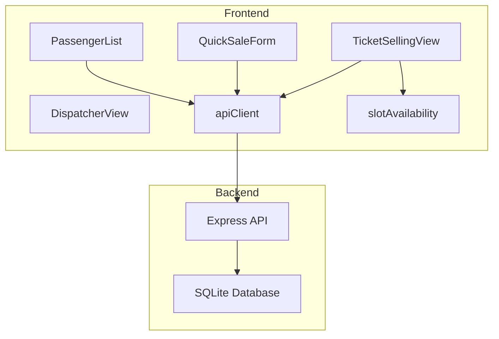
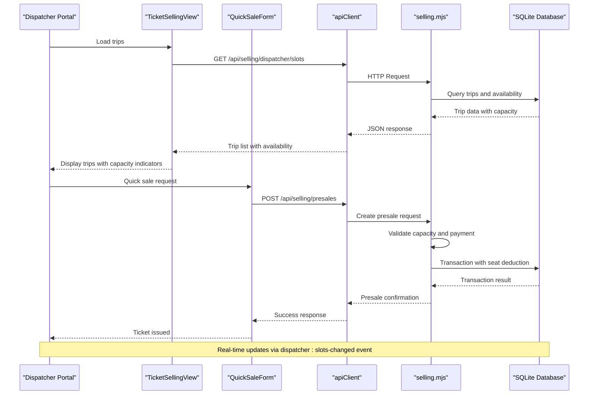
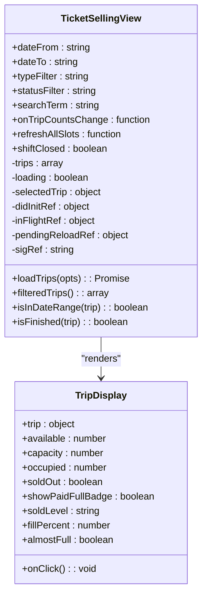
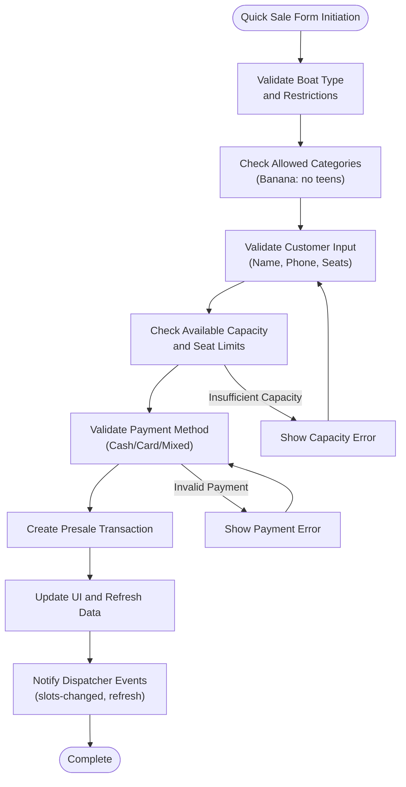
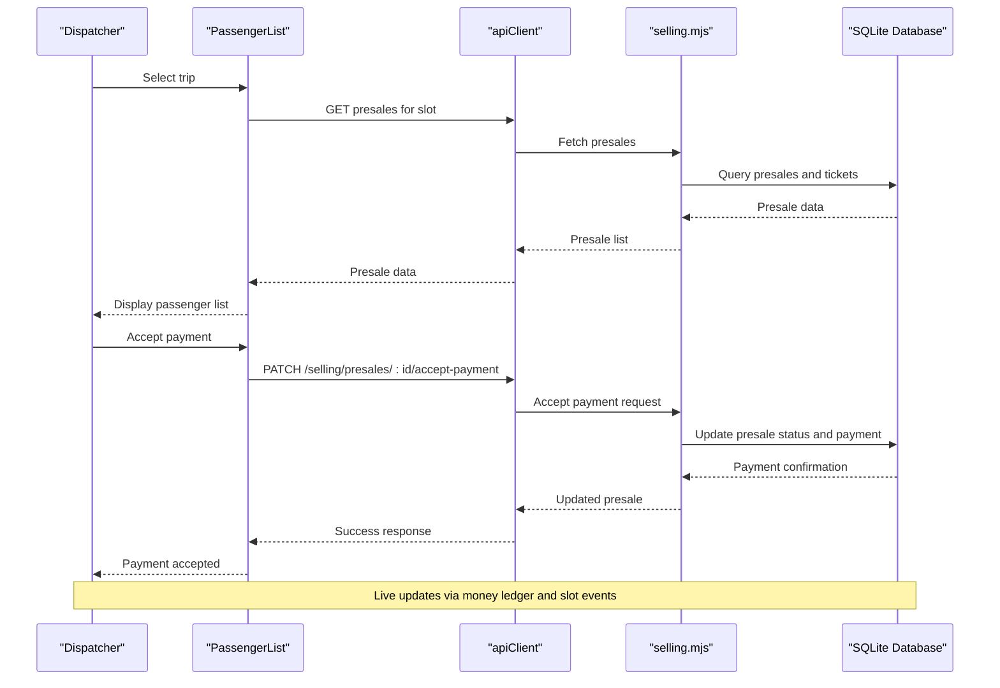
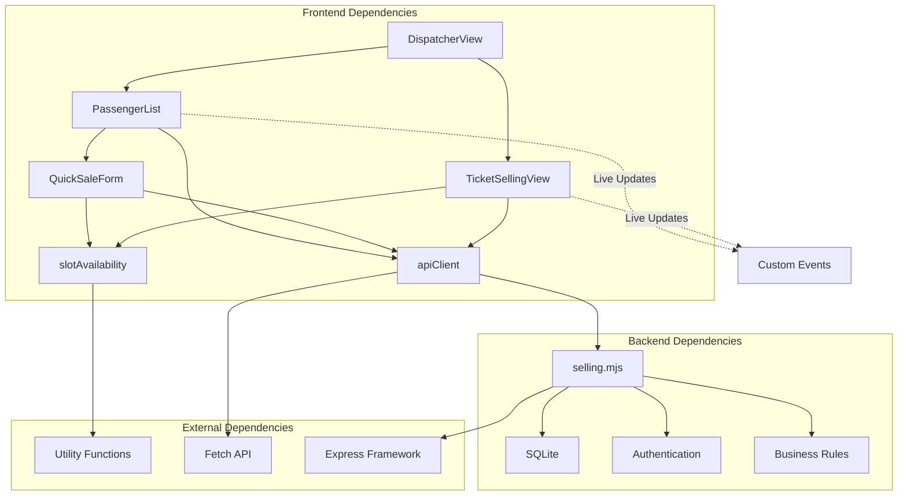

# Ticket Selling Operations

<cite>
**Referenced Files in This Document**
- [TicketSellingView.jsx](file://src/components/dispatcher/TicketSellingView.jsx)
- [QuickSaleForm.jsx](file://src/components/dispatcher/QuickSaleForm.jsx)
- [PassengerList.jsx](file://src/components/dispatcher/PassengerList.jsx)
- [DispatcherView.jsx](file://src/views/DispatcherView.jsx)
- [slotAvailability.js](file://src/utils/slotAvailability.js)
- [apiClient.js](file://src/utils/apiClient.js)
- [selling.mjs](file://server/selling.mjs)
</cite>

## Table of Contents
1. [Introduction](#introduction)
2. [Project Structure](#project-structure)
3. [Core Components](#core-components)
4. [Architecture Overview](#architecture-overview)
5. [Detailed Component Analysis](#detailed-component-analysis)
6. [Dependency Analysis](#dependency-analysis)
7. [Performance Considerations](#performance-considerations)
8. [Troubleshooting Guide](#troubleshooting-guide)
9. [Conclusion](#conclusion)

## Introduction
This document provides comprehensive documentation for the ticket selling operations within the dispatcher portal. It focuses on the TicketSellingView component that combines trip management with immediate ticket sales functionality, and the QuickSaleForm for emergency ticket sales and special circumstances outside normal booking procedures. The documentation explains the integration between trip selection, seat availability checking, and immediate ticket issuance processes, including practical examples of quick sale scenarios, capacity validation, payment processing, and ticket generation. It also addresses workflows for handling rush sales, last-minute bookings, and special customer situations while maintaining proper audit trails and capacity management.

## Project Structure
The ticket selling functionality spans both frontend components and backend APIs:

- Frontend components:
  - TicketSellingView: Displays available trips and allows selection for immediate sale
  - QuickSaleForm: Handles emergency and special circumstance ticket sales
  - PassengerList: Manages passenger lists and ticket operations within a selected trip
  - DispatcherView: Orchestrates the dispatcher interface and navigation
  - slotAvailability: Utility for seat availability calculations
  - apiClient: Frontend API client for backend communication

- Backend API:
  - selling.mjs: Implements ticket selling endpoints, capacity validation, and transaction processing



**Diagram sources**
- [TicketSellingView.jsx](file://src/components/dispatcher/TicketSellingView.jsx#L1-L333)
- [QuickSaleForm.jsx](file://src/components/dispatcher/QuickSaleForm.jsx#L1-L676)
- [PassengerList.jsx](file://src/components/dispatcher/PassengerList.jsx#L1-L1448)
- [DispatcherView.jsx](file://src/views/DispatcherView.jsx#L1-L291)
- [apiClient.js](file://src/utils/apiClient.js#L1-L360)
- [slotAvailability.js](file://src/utils/slotAvailability.js#L1-L19)
- [selling.mjs](file://server/selling.mjs#L1-L800)

**Section sources**
- [TicketSellingView.jsx](file://src/components/dispatcher/TicketSellingView.jsx#L1-L333)
- [QuickSaleForm.jsx](file://src/components/dispatcher/QuickSaleForm.jsx#L1-L676)
- [PassengerList.jsx](file://src/components/dispatcher/PassengerList.jsx#L1-L1448)
- [DispatcherView.jsx](file://src/views/DispatcherView.jsx#L1-L291)
- [apiClient.js](file://src/utils/apiClient.js#L1-L360)
- [slotAvailability.js](file://src/utils/slotAvailability.js#L1-L19)
- [selling.mjs](file://server/selling.mjs#L1-L800)

## Core Components
The ticket selling system consists of several interconnected components that work together to provide seamless ticket sales operations:

### TicketSellingView Component
The TicketSellingView serves as the main interface for trip management and immediate ticket sales. It displays available trips with real-time capacity information and allows dispatchers to quickly access passenger lists for immediate action.

Key features:
- Real-time trip filtering by date range, boat type, and status
- Visual capacity indicators with color-coded sold levels
- Immediate access to passenger lists for selected trips
- Integration with dispatcher slot events for live updates

### QuickSaleForm Component
The QuickSaleForm enables emergency and special circumstance ticket sales with flexible payment options and category-based ticketing.

Key features:
- Category-based ticketing (adult, teen, child) with automatic validation
- Flexible payment methods (cash, card, mixed)
- Real-time capacity validation and seat availability checking
- Special handling for banana boat restrictions (no teen tickets)
- Immediate feedback and error handling

### PassengerList Component
The PassengerList manages passenger operations within a selected trip, providing comprehensive ticket management capabilities.

Key features:
- Full passenger list display with status indicators
- Ticket operations (mark as used, refund, transfer, delete)
- Payment acceptance with multiple payment methods
- Transfer operations between trips with capacity validation
- Integration with dispatcher slot events for live updates

**Section sources**
- [TicketSellingView.jsx](file://src/components/dispatcher/TicketSellingView.jsx#L58-L333)
- [QuickSaleForm.jsx](file://src/components/dispatcher/QuickSaleForm.jsx#L7-L676)
- [PassengerList.jsx](file://src/components/dispatcher/PassengerList.jsx#L167-L1448)

## Architecture Overview
The ticket selling architecture follows a client-server model with real-time synchronization:



**Diagram sources**
- [TicketSellingView.jsx](file://src/components/dispatcher/TicketSellingView.jsx#L84-L132)
- [QuickSaleForm.jsx](file://src/components/dispatcher/QuickSaleForm.jsx#L153-L310)
- [apiClient.js](file://src/utils/apiClient.js#L108-L168)
- [selling.mjs](file://server/selling.mjs#L642-L1599)

The architecture ensures:
- Real-time capacity validation through backend transactions
- Atomic operations for seat reservations and payment processing
- Comprehensive audit trails through money ledger entries
- Live UI updates via custom events

**Section sources**
- [TicketSellingView.jsx](file://src/components/dispatcher/TicketSellingView.jsx#L84-L146)
- [QuickSaleForm.jsx](file://src/components/dispatcher/QuickSaleForm.jsx#L153-L310)
- [apiClient.js](file://src/utils/apiClient.js#L108-L168)
- [selling.mjs](file://server/selling.mjs#L1129-L1509)

## Detailed Component Analysis

### TicketSellingView Component Analysis
The TicketSellingView component serves as the central hub for trip management and immediate ticket sales operations.



**Diagram sources**
- [TicketSellingView.jsx](file://src/components/dispatcher/TicketSellingView.jsx#L58-L333)

Key functionality:
- **Trip Loading and Caching**: Implements intelligent caching with signature-based updates to prevent unnecessary re-renders
- **Real-time Updates**: Subscribes to dispatcher slot events for live capacity updates
- **Advanced Filtering**: Supports date range, boat type, status, and search term filtering
- **Visual Capacity Indicators**: Provides color-coded capacity levels and near-sold-out warnings
- **Trip Status Management**: Automatically filters finished trips and handles shift closure states

**Section sources**
- [TicketSellingView.jsx](file://src/components/dispatcher/TicketSellingView.jsx#L68-L132)
- [TicketSellingView.jsx](file://src/components/dispatcher/TicketSellingView.jsx#L161-L187)
- [TicketSellingView.jsx](file://src/components/dispatcher/TicketSellingView.jsx#L226-L327)

### QuickSaleForm Component Analysis
The QuickSaleForm provides comprehensive emergency and special circumstance ticket sales capabilities.



**Diagram sources**
- [QuickSaleForm.jsx](file://src/components/dispatcher/QuickSaleForm.jsx#L153-L310)

Key features:
- **Category-Based Ticketing**: Supports adult, teen, and child categories with automatic validation
- **Flexible Payment Processing**: Handles cash, card, and mixed payment methods with proper validation
- **Real-time Validation**: Provides immediate feedback on capacity, payment validity, and form completeness
- **Special Boat Handling**: Automatically adjusts available categories for banana boats (no teen tickets)
- **Error Handling**: Comprehensive error messages for capacity issues, payment problems, and form validation failures

**Section sources**
- [QuickSaleForm.jsx](file://src/components/dispatcher/QuickSaleForm.jsx#L7-L676)

### PassengerList Component Analysis
The PassengerList component manages comprehensive passenger operations within selected trips.



**Diagram sources**
- [PassengerList.jsx](file://src/components/dispatcher/PassengerList.jsx#L244-L289)
- [PassengerList.jsx](file://src/components/dispatcher/PassengerList.jsx#L520-L545)
- [selling.mjs](file://server/selling.mjs#L1216-L1509)

Key operations:
- **Presale Management**: Full lifecycle management of presales including creation, modification, and cancellation
- **Ticket Operations**: Individual ticket operations with comprehensive status tracking
- **Payment Processing**: Multi-method payment acceptance with proper ledger updates
- **Transfer Operations**: Complex transfer operations between trips with capacity validation
- **Audit Trail**: Complete transaction history with money ledger entries

**Section sources**
- [PassengerList.jsx](file://src/components/dispatcher/PassengerList.jsx#L167-L1448)
- [selling.mjs](file://server/selling.mjs#L1216-L1509)

### Backend Integration and Business Logic
The backend implementation in selling.mjs provides robust business logic for ticket sales operations.

```mermaid
flowchart TD
APIRequest[API Request] --> ValidateInputs[Validate Inputs<br/>(slotUid, customer data, seats)]
ValidateInputs --> ResolveSlot[Resolve Slot by UID<br/>(generated/manual)]
ResolveSlot --> CheckActive[Check Slot Active Status]
CheckActive --> CheckCutoff[Check Cutoff Times<br/>(seller/dispatcher)]
CheckCutoff --> ValidateTickets[Validate Ticket Breakdown<br/>(boat type specific)]
ValidateTickets --> CheckCapacity[Check Capacity<br/>(generated/manual slots)]
CheckCapacity --> ValidatePayment[Validate Payment Amount<br/>(prepayment limits)]
ValidatePayment --> CreateTransaction[Create Transaction<br/>(atomic operations)]
CreateTransaction --> UpdateSeats[Update Seats Left<br/>(manual/generated)]
UpdateSeats --> CreatePresale[Create Presale Record]
CreatePresale --> CreateTickets[Create Ticket Records]
CreateTickets --> UpdateLedger[Update Money Ledger<br/>(cash/card analytics)]
UpdateLedger --> SyncCache[Sync Seats Left Cache]
SyncCache --> Success[Success Response]
CheckActive --> |Inactive| Error1[Error: Slot Closed]
CheckCutoff --> |Too Late| Error2[Error: Sales Closed]
CheckCapacity --> |Insufficient| Error3[Error: No Seats]
ValidatePayment --> |Exceeds Total| Error4[Error: Prepayment Exceeded]
```

**Diagram sources**
- [selling.mjs](file://server/selling.mjs#L642-L1599)

**Section sources**
- [selling.mjs](file://server/selling.mjs#L642-L1599)

## Dependency Analysis
The ticket selling system exhibits strong component relationships with clear separation of concerns:



**Diagram sources**
- [TicketSellingView.jsx](file://src/components/dispatcher/TicketSellingView.jsx#L1-L10)
- [QuickSaleForm.jsx](file://src/components/dispatcher/QuickSaleForm.jsx#L1-L6)
- [PassengerList.jsx](file://src/components/dispatcher/PassengerList.jsx#L1-L6)
- [apiClient.js](file://src/utils/apiClient.js#L1-L360)
- [selling.mjs](file://server/selling.mjs#L1-L153)

Key dependency characteristics:
- **Frontend Cohesion**: Components share common utilities and API client
- **Backend Coupling**: Strong business logic encapsulation in selling.mjs
- **Event-Driven Updates**: Custom events enable real-time UI synchronization
- **Transaction Safety**: Backend ensures atomic operations for data consistency

**Section sources**
- [TicketSellingView.jsx](file://src/components/dispatcher/TicketSellingView.jsx#L1-L10)
- [QuickSaleForm.jsx](file://src/components/dispatcher/QuickSaleForm.jsx#L1-L6)
- [PassengerList.jsx](file://src/components/dispatcher/PassengerList.jsx#L1-L6)
- [apiClient.js](file://src/utils/apiClient.js#L1-L360)
- [selling.mjs](file://server/selling.mjs#L1-L153)

## Performance Considerations
The ticket selling system implements several performance optimization strategies:

### Frontend Performance
- **Intelligent Caching**: Trip data cached in sessionStorage with signature-based invalidation
- **Anti-Flash Optimization**: Prevents UI flickering during rapid updates
- **Event Debouncing**: Prevents excessive reload triggers through in-flight request tracking
- **Lazy Loading**: Components load data only when needed and when user is ready

### Backend Performance
- **Atomic Transactions**: Ensures data consistency while minimizing lock contention
- **Efficient Queries**: Optimized database queries with proper indexing
- **Connection Pooling**: Efficient database connection management
- **Real-time Updates**: Event-driven updates reduce polling overhead

### Capacity Management
- **Real-time Validation**: Prevents overselling through immediate capacity checks
- **Cache Synchronization**: Maintains consistency between UI and database
- **Graceful Degradation**: Handles edge cases without system failure

## Troubleshooting Guide

### Common Issues and Solutions

#### Capacity Validation Errors
**Problem**: "Недостаточно мест" (Not enough seats)
**Causes**:
- Real-time seat changes by other users
- Backend cache inconsistencies
- Booking conflicts during peak hours

**Solutions**:
- Refresh trip list to get latest capacity
- Wait for cache synchronization
- Verify seat availability before attempting sale

#### Payment Processing Issues
**Problem**: Payment method validation errors
**Causes**:
- Mixed payment amount mismatches
- Invalid payment amounts
- Payment method restrictions

**Solutions**:
- Verify payment amounts sum correctly for mixed payments
- Ensure payment amounts don't exceed total price
- Check payment method compatibility with boat type

#### Trip Closure Errors
**Problem**: "Рейс закрыт" (Trip closed)
**Causes**:
- Sales cutoff time exceeded
- Dispatcher cutoff time exceeded
- Slot deactivation

**Solutions**:
- Check trip timing and cutoff requirements
- Verify slot active status
- Contact administrator for slot reactivation

#### Quick Sale Form Validation
**Problem**: Form validation failures
**Causes**:
- Invalid phone number format
- Insufficient capacity
- Missing required fields

**Solutions**:
- Use valid Russian phone format (+7, 8, or 7)
- Verify available capacity matches requested seats
- Complete all required form fields

**Section sources**
- [QuickSaleForm.jsx](file://src/components/dispatcher/QuickSaleForm.jsx#L275-L310)
- [selling.mjs](file://server/selling.mjs#L868-L1005)

## Conclusion
The ticket selling operations within the dispatcher portal provide a comprehensive solution for managing boat ticket sales with real-time capacity validation, flexible payment processing, and robust audit trails. The system successfully balances user experience with business requirements through:

- **Real-time Operations**: Live capacity updates and immediate feedback
- **Flexible Payment Options**: Multiple payment methods with proper validation
- **Comprehensive Audit Trails**: Complete transaction history and money ledger integration
- **Robust Error Handling**: Clear error messages and graceful degradation
- **Mobile-First Design**: Touch-friendly interface optimized for dispatcher workflows

The architecture ensures scalability, maintainability, and reliability while providing the flexibility needed for emergency situations and special circumstances. The integration between frontend components and backend APIs creates a cohesive system that meets the operational needs of boat ticket sales management.