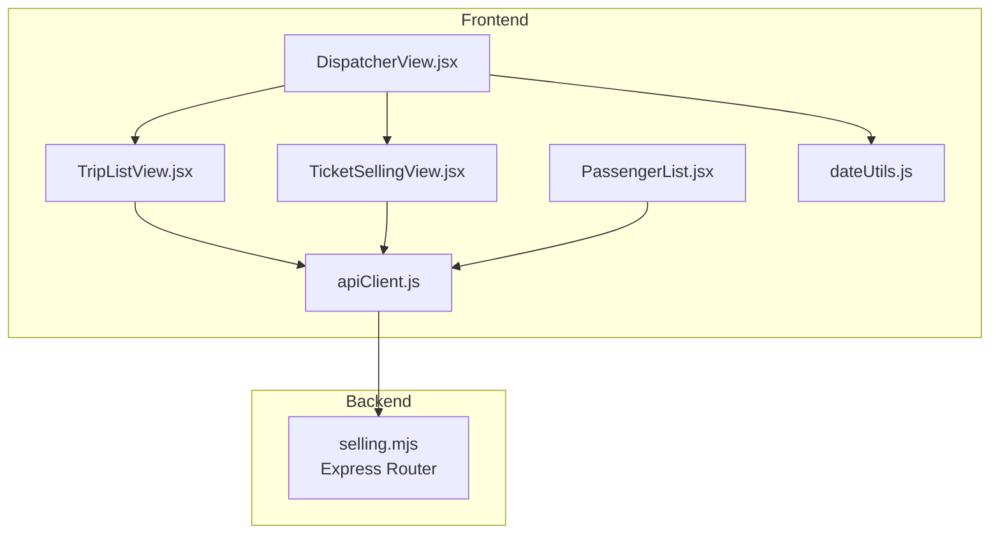
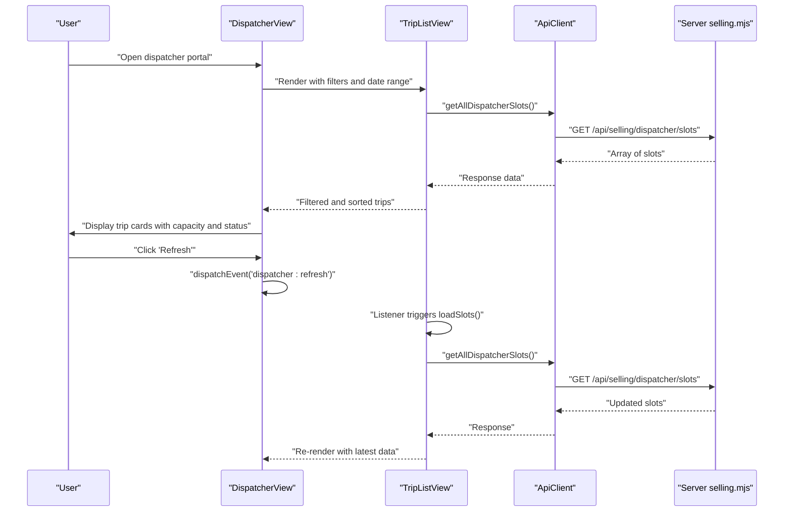
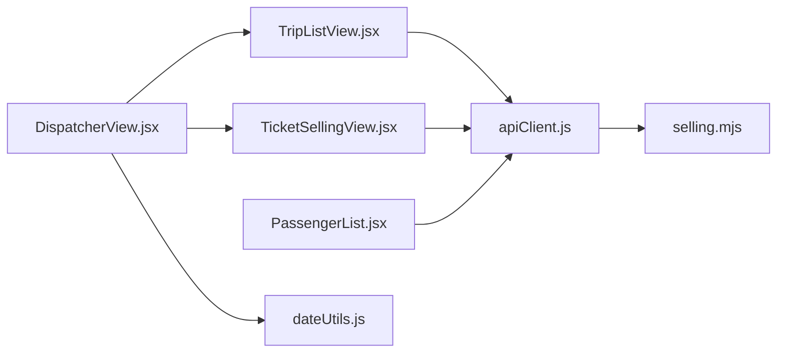

# Trip Management

<cite>
**Referenced Files in This Document**
- [TripListView.jsx](file://src/components/dispatcher/TripListView.jsx)
- [DispatcherView.jsx](file://src/views/DispatcherView.jsx)
- [TicketSellingView.jsx](file://src/components/dispatcher/TicketSellingView.jsx)
- [PassengerList.jsx](file://src/components/dispatcher/PassengerList.jsx)
- [dateUtils.js](file://src/utils/dateUtils.js)
- [apiClient.js](file://src/utils/apiClient.js)
- [selling.mjs](file://server/selling.mjs)
</cite>

## Table of Contents
1. [Introduction](#introduction)
2. [Project Structure](#project-structure)
3. [Core Components](#core-components)
4. [Architecture Overview](#architecture-overview)
5. [Detailed Component Analysis](#detailed-component-analysis)
6. [Dependency Analysis](#dependency-analysis)
7. [Performance Considerations](#performance-considerations)
8. [Troubleshooting Guide](#troubleshooting-guide)
9. [Conclusion](#conclusion)

## Introduction
This document describes the trip management functionality in the dispatcher portal, focusing on the TripListView component and related UI elements. It explains how scheduled trips are displayed with filtering capabilities (date range, boat type, status, and search), how real-time status updates and capacity information are presented, and how the tabbed interface navigates between trips, selling, slots, maps, and shift close sections. It also covers practical examples of filtering, date presets, and the integration with backend APIs for real-time data updates and manual refresh mechanisms.

## Project Structure
The trip management feature spans React components in the frontend and Express routes in the backend:
- Frontend components: TripListView, TicketSellingView, PassengerList, and the main DispatcherView container
- Utilities: date utilities and API client
- Backend: Express router endpoints for dispatcher slots and related operations

**Diagram sources**
- [DispatcherView.jsx](file://src/views/DispatcherView.jsx#L23-L288)
- [TripListView.jsx](file://src/components/dispatcher/TripListView.jsx#L71-L257)
- [TicketSellingView.jsx](file://src/components/dispatcher/TicketSellingView.jsx#L58-L333)
- [PassengerList.jsx](file://src/components/dispatcher/PassengerList.jsx#L167-L733)
- [apiClient.js](file://src/utils/apiClient.js#L105-L128)
- [selling.mjs](file://server/selling.mjs#L2282-L2327)
- [dateUtils.js](file://src/utils/dateUtils.js#L1-L74)

**Section sources**
- [DispatcherView.jsx](file://src/views/DispatcherView.jsx#L1-L291)
- [TripListView.jsx](file://src/components/dispatcher/TripListView.jsx#L1-L257)
- [TicketSellingView.jsx](file://src/components/dispatcher/TicketSellingView.jsx#L1-L333)
- [PassengerList.jsx](file://src/components/dispatcher/PassengerList.jsx#L1-L800)
- [apiClient.js](file://src/utils/apiClient.js#L1-L360)
- [selling.mjs](file://server/selling.mjs#L2282-L2327)
- [dateUtils.js](file://src/utils/dateUtils.js#L1-L74)

## Core Components
- TripListView: Displays all scheduled trips with filtering and sorting, shows capacity and occupancy, and integrates with real-time data via a refresh mechanism.
- TicketSellingView: Alternative view focused on selling and boarding, with caching and event-driven refresh.
- PassengerList: Detailed view for a selected trip, showing passengers and enabling operations like transfers, refunds, and deletions.
- DispatcherView: Container that manages tabs, filters, date presets, and counts display.

Key responsibilities:
- Filtering: date range, boat type, status, and search term
- Real-time updates: automatic and manual refresh via custom events
- Capacity and occupancy: computed from backend data and displayed visually
- Navigation: tabbed interface among trips, selling, slots, maps, and shift close

**Section sources**
- [TripListView.jsx](file://src/components/dispatcher/TripListView.jsx#L71-L157)
- [TicketSellingView.jsx](file://src/components/dispatcher/TicketSellingView.jsx#L58-L194)
- [PassengerList.jsx](file://src/components/dispatcher/PassengerList.jsx#L167-L295)
- [DispatcherView.jsx](file://src/views/DispatcherView.jsx#L23-L288)

## Architecture Overview
The trip management architecture connects the dispatcher UI to backend data through an API client. The dispatcher can view trips, filter them, and trigger manual refreshes. The backend serves dispatcher slots with computed availability and status.

**Diagram sources**
- [DispatcherView.jsx](file://src/views/DispatcherView.jsx#L87-L101)
- [TripListView.jsx](file://src/components/dispatcher/TripListView.jsx#L85-L105)
- [apiClient.js](file://src/utils/apiClient.js#L126-L128)
- [selling.mjs](file://server/selling.mjs#L2282-L2327)

## Detailed Component Analysis

### TripListView Component
TripListView renders a grid of trip cards with:
- Boat name, time, and formatted date
- Boat type pill (speed, cruise, banana)
- Free seats, capacity, and occupancy percentage
- Visual indicators for low capacity and sold-out status

Filtering logic:
- Date range: hides trips outside the selected from/to range
- Status: active (not finished and is_active) or completed (finished or explicitly marked)
- Type: normalized boat type (speed, cruise, banana)
- Search: matches against boat name, time, and date

Real-time updates:
- Loads data on mount and listens for a custom "dispatcher:refresh" event
- Computes seatLeft and capacity safely from various field names
- Sorts by date and time

Trip card rendering:
- Uses seatLeft and capacity to compute sold count and percentage
- Applies visual warnings when seats_left is low
- Displays filled ring color based on occupancy level

Practical examples:
- Date preset selection: Today, Tomorrow, or Custom (date inputs)
- Status filters: Active, Completed, All
- Type filters: Speed, Cruise, Banana, All
- Search: text input to match boat name, time, or date

Trip count display:
- Emits total and shown counts to parent via onTripCountsChange

Integration with backend:
- Calls getAllDispatcherSlots via apiClient
- Backend computes seats_left and other fields from generated_slots and presales

**Section sources**
- [TripListView.jsx](file://src/components/dispatcher/TripListView.jsx#L71-L257)
- [apiClient.js](file://src/utils/apiClient.js#L126-L128)
- [selling.mjs](file://server/selling.mjs#L2282-L2327)

### Tabbed Interface Navigation
DispatcherView provides a tabbed interface:
- Trips: renders TripListView with filters and counts
- Selling: renders TicketSellingView for boarding and sales
- Slots: renders SlotManagement (not analyzed here)
- Maps: placeholder for future map integration
- Shift Close: renders DispatcherShiftClose

Navigation:
- Segmented buttons switch activeTab
- Date presets (Today, Tomorrow) update dateRange
- Status and type filters control TripListView and TicketSellingView
- Search input filters both views
- Reset button restores defaults

Trip count display:
- Shows "shown of total" below filters

**Section sources**
- [DispatcherView.jsx](file://src/views/DispatcherView.jsx#L33-L288)

### TicketSellingView Component
TicketSellingView complements TripListView with:
- Caching trips in sessionStorage to reduce network requests
- Event-driven refresh via "dispatcher:slots-changed"
- Alternative filtering and presentation focused on selling and boarding
- Visual indicators for sold-out status and debt presence

Trip card features:
- Duration display
- Occupancy and capacity with color-coded bars
- Sold-out badge when fully booked and no debt
- Clickable cards to open PassengerList for detailed operations

**Section sources**
- [TicketSellingView.jsx](file://src/components/dispatcher/TicketSellingView.jsx#L58-L333)

### PassengerList Component
PassengerList provides detailed operations for a selected trip:
- Loads presales and tickets for the selected slot
- Supports quick sale form, transfer modal, and individual ticket operations
- Updates seats_left by refreshing dispatcher slots
- Dispatches custom events to notify other components of changes

Operations:
- Accept payment, delete presale, transfer presale, and ticket operations
- Transfer tickets or presales to another slot with validation
- Notifies dispatcher and owner dashboards of changes

**Section sources**
- [PassengerList.jsx](file://src/components/dispatcher/PassengerList.jsx#L167-L733)

### Date Utilities
Date utilities support:
- getTodayDate and getTomorrowDate for presets
- normalizeDate for consistent date comparisons
- Local date formatting without UTC shifts

**Section sources**
- [dateUtils.js](file://src/utils/dateUtils.js#L52-L74)

### API Client Integration
ApiClient centralizes HTTP requests:
- Base URL /api with Authorization header handling
- Methods for dispatcher slots and related operations
- Logging and error handling for network requests

Dispatcher slots endpoint:
- getAllDispatcherSlots returns the canonical list for the dispatcher

**Section sources**
- [apiClient.js](file://src/utils/apiClient.js#L105-L128)
- [apiClient.js](file://src/utils/apiClient.js#L23-L88)

### Backend API Implementation
The backend Express router:
- Exposes GET /api/selling/dispatcher/slots returning generated_slots joined with boats and computed seats_left
- Uses presales to derive accurate seat occupancy
- Orders results by trip_date and time

**Section sources**
- [selling.mjs](file://server/selling.mjs#L2282-L2327)

## Dependency Analysis
The trip management feature exhibits clear separation of concerns:
- DispatcherView orchestrates UI state and passes props to child components
- TripListView and TicketSellingView depend on apiClient for data
- Both components rely on backend endpoints for real-time data
- PassengerList depends on apiClient for presales and tickets
- Custom events propagate changes across components

**Diagram sources**
- [DispatcherView.jsx](file://src/views/DispatcherView.jsx#L23-L288)
- [TripListView.jsx](file://src/components/dispatcher/TripListView.jsx#L71-L257)
- [TicketSellingView.jsx](file://src/components/dispatcher/TicketSellingView.jsx#L58-L333)
- [PassengerList.jsx](file://src/components/dispatcher/PassengerList.jsx#L167-L733)
- [apiClient.js](file://src/utils/apiClient.js#L105-L128)
- [selling.mjs](file://server/selling.mjs#L2282-L2327)
- [dateUtils.js](file://src/utils/dateUtils.js#L1-L74)

**Section sources**
- [DispatcherView.jsx](file://src/views/DispatcherView.jsx#L23-L288)
- [TripListView.jsx](file://src/components/dispatcher/TripListView.jsx#L71-L257)
- [TicketSellingView.jsx](file://src/components/dispatcher/TicketSellingView.jsx#L58-L333)
- [PassengerList.jsx](file://src/components/dispatcher/PassengerList.jsx#L167-L733)
- [apiClient.js](file://src/utils/apiClient.js#L105-L128)
- [selling.mjs](file://server/selling.mjs#L2282-L2327)
- [dateUtils.js](file://src/utils/dateUtils.js#L1-L74)

## Performance Considerations
- Memoization: TripListView uses useMemo for filtering and sorting to avoid unnecessary re-renders
- Event-driven refresh: Custom events prevent polling and reduce redundant network calls
- Caching: TicketSellingView caches trips in sessionStorage to minimize repeated loads
- Anti-spam: PassengerList throttles reloads to avoid rapid successive requests
- Efficient computation: seatLeft and capacity calculations handle multiple field names robustly

[No sources needed since this section provides general guidance]

## Troubleshooting Guide
Common issues and resolutions:
- No trips displayed:
  - Verify date range and status/type filters
  - Trigger manual refresh using the "Refresh" button
  - Check network logs for API errors
- Incorrect capacity or occupancy:
  - Ensure backend seats_left is computed from presales
  - Confirm that generated_slots cache is synchronized
- Slow updates:
  - Use "Refresh" to force immediate reload
  - Avoid excessive rapid clicks; the UI includes throttling
- Transfer or ticket operations failing:
  - Confirm the presale status allows the operation
  - Check for remaining debt or unpaid balances
  - Retry after dispatcher:refresh events propagate

**Section sources**
- [TripListView.jsx](file://src/components/dispatcher/TripListView.jsx#L85-L105)
- [TicketSellingView.jsx](file://src/components/dispatcher/TicketSellingView.jsx#L134-L146)
- [PassengerList.jsx](file://src/components/dispatcher/PassengerList.jsx#L244-L289)
- [apiClient.js](file://src/utils/apiClient.js#L23-L88)

## Conclusion
The trip management functionality provides a comprehensive, real-time view of scheduled trips with powerful filtering and status indicators. The tabbed interface offers seamless navigation between trips, selling, slots, maps, and shift close. The integration with backend APIs ensures accurate capacity and occupancy data, while custom events enable efficient, event-driven updates. Users can easily filter by date, boat type, status, and search terms, and manually refresh data when needed.