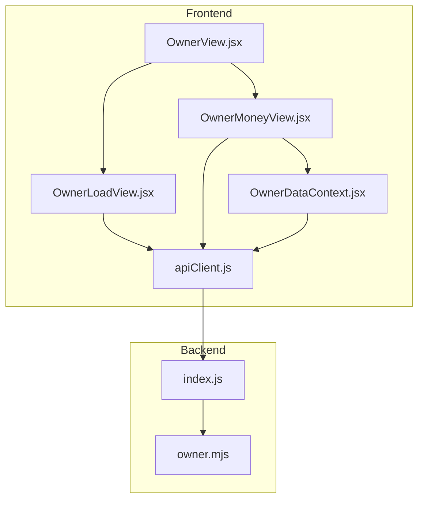
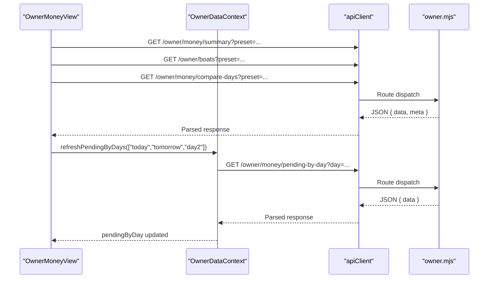
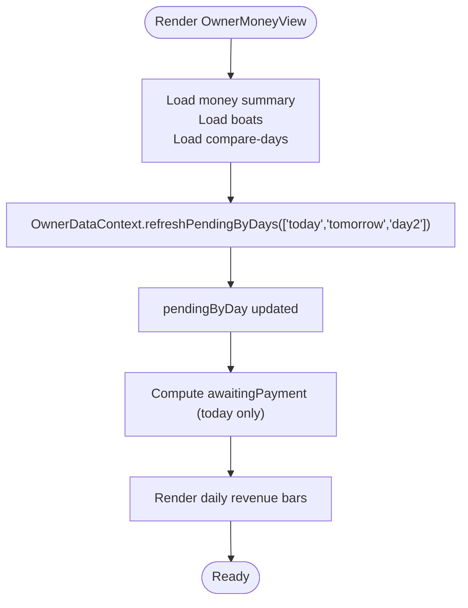
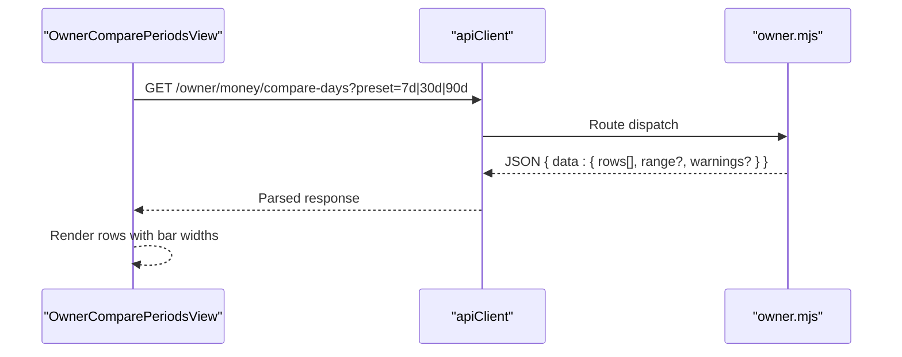
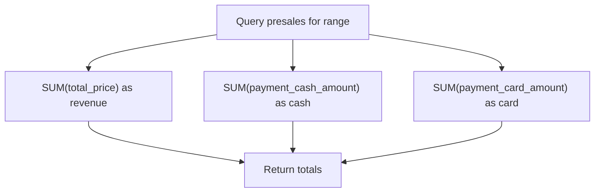
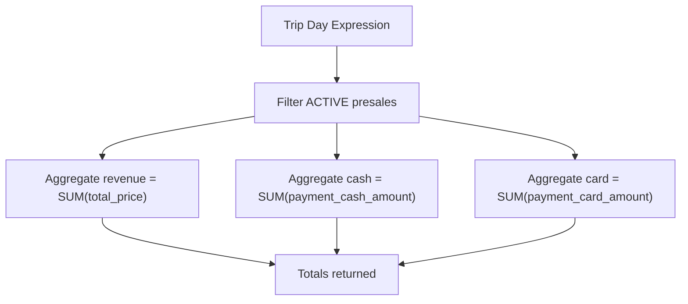
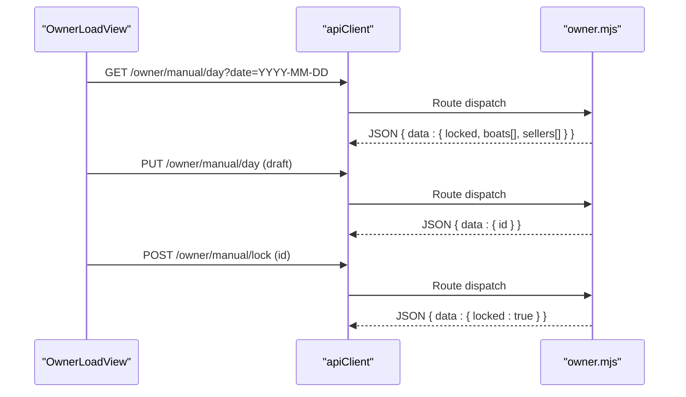
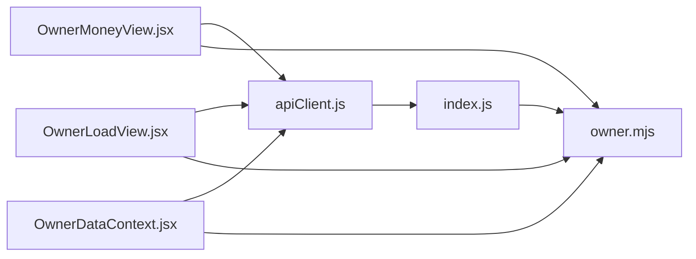

# Analytics Dashboard

<cite>
**Referenced Files in This Document**
- [README.md](file://README.md)
- [OwnerView.jsx](file://src/views/OwnerView.jsx)
- [OwnerMoneyView.jsx](file://src/views/OwnerMoneyView.jsx)
- [OwnerLoadView.jsx](file://src/views/OwnerLoadView.jsx)
- [OwnerDataContext.jsx](file://src/contexts/OwnerDataContext.jsx)
- [apiClient.js](file://src/utils/apiClient.js)
- [owner.mjs](file://server/owner.mjs)
- [index.js](file://server/index.js)
- [migrate-manual-offline.js](file://server/migrate-manual-offline.js)
</cite>

## Table of Contents
1. [Introduction](#introduction)
2. [Project Structure](#project-structure)
3. [Core Components](#core-components)
4. [Architecture Overview](#architecture-overview)
5. [Detailed Component Analysis](#detailed-component-analysis)
6. [Dependency Analysis](#dependency-analysis)
7. [Performance Considerations](#performance-considerations)
8. [Troubleshooting Guide](#troubleshooting-guide)
9. [Conclusion](#conclusion)

## Introduction
This document explains the owner analytics dashboard functionality, focusing on revenue analytics, period comparison, payment breakdown, and integration with backend analytics endpoints. It also covers real-time updates, manual override behavior, and practical interpretation of metrics for business decisions.

## Project Structure
The analytics dashboard spans the frontend React views and owner-specific backend routes. The frontend communicates via an API client to owner endpoints, while the backend aggregates data from the database and applies business rules for revenue, cash/card accounting, and pending collections.

**Diagram sources**
- [OwnerView.jsx](file://src/views/OwnerView.jsx#L164-L194)
- [OwnerMoneyView.jsx](file://src/views/OwnerMoneyView.jsx#L54-L132)
- [OwnerLoadView.jsx](file://src/views/OwnerLoadView.jsx#L31-L123)
- [OwnerDataContext.jsx](file://src/contexts/OwnerDataContext.jsx#L21-L127)
- [apiClient.js](file://src/utils/apiClient.js#L23-L88)
- [index.js](file://server/index.js#L40-L40)
- [owner.mjs](file://server/owner.mjs#L99-L168)

**Section sources**
- [README.md](file://README.md#L56-L64)
- [OwnerView.jsx](file://src/views/OwnerView.jsx#L164-L194)
- [OwnerMoneyView.jsx](file://src/views/OwnerMoneyView.jsx#L54-L132)
- [OwnerLoadView.jsx](file://src/views/OwnerLoadView.jsx#L31-L123)
- [OwnerDataContext.jsx](file://src/contexts/OwnerDataContext.jsx#L21-L127)
- [apiClient.js](file://src/utils/apiClient.js#L23-L88)
- [index.js](file://server/index.js#L40-L40)
- [owner.mjs](file://server/owner.mjs#L99-L168)

## Core Components
- OwnerMoneyView: primary dashboard for revenue, tickets, trips, fill percentage, and daily revenue bars. Integrates with owner context for pending-by-day data and auto-refreshes.
- OwnerComparePeriodsView: period comparison screen showing daily revenue, cash, and card breakdown across presets (7d/30d/90d).
- OwnerLoadView: manual override UI for offline-entered revenue and seat counts per boat/seller; supports draft saving and locking.
- OwnerDataContext: shared state for pending-by-day data with refetching and refresh orchestration.
- apiClient: centralized HTTP client with logging and bearer token support.
- Backend owner routes: endpoints for money summary, compare-days, boats, pending-by-day, and collected-today-by-tripday.

**Section sources**
- [OwnerMoneyView.jsx](file://src/views/OwnerMoneyView.jsx#L54-L456)
- [OwnerView.jsx](file://src/views/OwnerView.jsx#L21-L132)
- [OwnerLoadView.jsx](file://src/views/OwnerLoadView.jsx#L31-L249)
- [OwnerDataContext.jsx](file://src/contexts/OwnerDataContext.jsx#L21-L127)
- [apiClient.js](file://src/utils/apiClient.js#L23-L88)
- [owner.mjs](file://server/owner.mjs#L99-L493)

## Architecture Overview
The dashboard architecture follows a reactive, context-driven pattern:
- OwnerMoneyView orchestrates loading of three datasets concurrently: money summary, boats, and compare-days.
- OwnerDataContext manages pending-by-day data and exposes refresh hooks to synchronize with money summary updates.
- apiClient encapsulates network requests and attaches JWT tokens.
- Backend owner routes compute revenue, cash/card, and pending balances using business rules and database queries.

**Diagram sources**
- [OwnerMoneyView.jsx](file://src/views/OwnerMoneyView.jsx#L99-L132)
- [OwnerDataContext.jsx](file://src/contexts/OwnerDataContext.jsx#L52-L90)
- [apiClient.js](file://src/utils/apiClient.js#L23-L88)
- [owner.mjs](file://server/owner.mjs#L99-L168)

## Detailed Component Analysis

### Revenue Analytics Interface (OwnerMoneyView)
- Purpose: Present total revenue, average check, tickets/trips, fill percentage, and payment mix (cash/card). Show daily revenue bars and pending-by-day cards for today/tomorrow/day2.
- Data sources:
  - Money summary: total revenue, cash, card for a preset.
  - Boats: aggregated revenue, tickets, trips, and fill percentage.
  - Compare-days: daily rows for the selected preset.
  - Pending-by-day: per-day pending sums, tickets, and trips.
- Real-time behavior:
  - Auto-refresh every 20 seconds when preset is "today".
  - Manual refresh triggers reload of money data plus pending-by-day refresh.
  - Focus and visibility change handlers trigger silent reloads.
- Pending computation:
  - For "today", pending is shown; otherwise zero.
  - Pending can be computed from API totals or derived as revenue minus (cash + card).

**Diagram sources**
- [OwnerMoneyView.jsx](file://src/views/OwnerMoneyView.jsx#L99-L132)
- [OwnerMoneyView.jsx](file://src/views/OwnerMoneyView.jsx#L155-L185)
- [OwnerMoneyView.jsx](file://src/views/OwnerMoneyView.jsx#L234-L239)
- [OwnerDataContext.jsx](file://src/contexts/OwnerDataContext.jsx#L52-L90)

**Section sources**
- [OwnerMoneyView.jsx](file://src/views/OwnerMoneyView.jsx#L54-L456)
- [OwnerDataContext.jsx](file://src/contexts/OwnerDataContext.jsx#L21-L127)

### Period Comparison (OwnerComparePeriodsView)
- Purpose: Allow owners to compare revenue across presets (7d/30d/90d) with daily cash/card breakdown.
- Behavior:
  - Preset chips switch the requested preset.
  - Loads compare-days rows and displays bar widths proportional to max revenue in the window.
  - Shows warnings if manual override is detected.

**Diagram sources**
- [OwnerView.jsx](file://src/views/OwnerView.jsx#L35-L54)
- [owner.mjs](file://server/owner.mjs#L235-L268)

**Section sources**
- [OwnerView.jsx](file://src/views/OwnerView.jsx#L21-L132)
- [owner.mjs](file://server/owner.mjs#L235-L268)

### Cash vs Card Payment Breakdown
- Presentation:
  - Daily rows display cash and card values for each day in the compare view.
  - Money summary view shows totals for cash and card alongside revenue.
- Backend computation:
  - Money summary endpoint sums payment_cash_amount and payment_card_amount for paid/active presales within the selected range.
  - Compare-days endpoint aggregates daily revenue and separates cash/card contributions.

**Diagram sources**
- [owner.mjs](file://server/owner.mjs#L128-L150)
- [owner.mjs](file://server/owner.mjs#L241-L262)

**Section sources**
- [OwnerView.jsx](file://src/views/OwnerView.jsx#L119-L122)
- [OwnerMoneyView.jsx](file://src/views/OwnerMoneyView.jsx#L333-L335)
- [owner.mjs](file://server/owner.mjs#L128-L150)
- [owner.mjs](file://server/owner.mjs#L241-L262)

### Revenue Calculation Methods
- Revenue: sum of total_price for active presales by trip day.
- Cash/Card: sums of payment_cash_amount/payment_card_amount for posted sales entries.
- Pending: revenue minus (cash + card) when computed on the UI; alternatively, backend provides pending-by-day aggregates grouped by trip day.

**Diagram sources**
- [owner.mjs](file://server/owner.mjs#L35-L44)
- [owner.mjs](file://server/owner.mjs#L128-L150)

**Section sources**
- [owner.mjs](file://server/owner.mjs#L30-L53)
- [owner.mjs](file://server/owner.mjs#L128-L150)

### Manual Override and Offline Data
- Purpose: Allow owners to enter revenue/seats per boat/seller for a given day and lock the record so it overrides online analytics.
- Workflow:
  - Load manual day data by date.
  - Save draft (PUT) with arrays of boats and sellers.
  - Lock the day (POST) to prevent further edits.
  - After lock, the manual dataset becomes the source of truth for analytics.
- Backend schema:
  - Tables for manual_days, manual_boat_stats, and manual_seller_stats are created by migration scripts.

**Diagram sources**
- [OwnerLoadView.jsx](file://src/views/OwnerLoadView.jsx#L41-L73)
- [OwnerLoadView.jsx](file://src/views/OwnerLoadView.jsx#L75-L106)
- [OwnerLoadView.jsx](file://src/views/OwnerLoadView.jsx#L108-L123)
- [migrate-manual-offline.js](file://server/migrate-manual-offline.js#L26-L67)

**Section sources**
- [OwnerLoadView.jsx](file://src/views/OwnerLoadView.jsx#L31-L249)
- [migrate-manual-offline.js](file://server/migrate-manual-offline.js#L26-L67)

### Interactive Filtering and Presets
- Presets:
  - Money view: today, yesterday, 7d, 30d, 90d, last_nonzero_day.
  - Compare view: 7d, 30d, 90d.
  - Boats view: maps presets to backend ranges.
- Chips and tabs drive preset changes, triggering reloads and re-rendering of charts and summaries.

**Section sources**
- [OwnerMoneyView.jsx](file://src/views/OwnerMoneyView.jsx#L284-L296)
- [OwnerView.jsx](file://src/views/OwnerView.jsx#L80-L89)
- [OwnerMoneyView.jsx](file://src/views/OwnerMoneyView.jsx#L83-L97)

### Data Presentation Formats
- Currency formatting: RUB with no decimals.
- Integer formatting: locale-aware integers.
- Bar charts: proportional heights based on max revenue in the visible window.
- Pending cards: show sum, tickets, and trips for today/tomorrow/day2.

**Section sources**
- [OwnerMoneyView.jsx](file://src/views/OwnerMoneyView.jsx#L16-L36)
- [OwnerView.jsx](file://src/views/OwnerView.jsx#L134-L145)
- [OwnerMoneyView.jsx](file://src/views/OwnerMoneyView.jsx#L419-L441)

## Dependency Analysis
- Frontend-to-backend:
  - OwnerMoneyView and OwnerComparePeriodsView depend on apiClient for owner endpoints.
  - OwnerDataContext coordinates pending data fetching and refresh callbacks.
- Backend routing:
  - owner.mjs defines routes for money summary, compare-days, boats, pending-by-day, and collected-today-by-tripday.
  - index.js mounts the owner router under /api/owner.

**Diagram sources**
- [apiClient.js](file://src/utils/apiClient.js#L23-L88)
- [index.js](file://server/index.js#L40-L40)
- [owner.mjs](file://server/owner.mjs#L99-L168)
- [OwnerMoneyView.jsx](file://src/views/OwnerMoneyView.jsx#L54-L132)
- [OwnerView.jsx](file://src/views/OwnerView.jsx#L21-L132)
- [OwnerLoadView.jsx](file://src/views/OwnerLoadView.jsx#L31-L123)
- [OwnerDataContext.jsx](file://src/contexts/OwnerDataContext.jsx#L21-L127)

**Section sources**
- [apiClient.js](file://src/utils/apiClient.js#L23-L88)
- [index.js](file://server/index.js#L40-L40)
- [owner.mjs](file://server/owner.mjs#L99-L168)
- [OwnerMoneyView.jsx](file://src/views/OwnerMoneyView.jsx#L54-L132)
- [OwnerView.jsx](file://src/views/OwnerView.jsx#L21-L132)
- [OwnerLoadView.jsx](file://src/views/OwnerLoadView.jsx#L31-L123)
- [OwnerDataContext.jsx](file://src/contexts/OwnerDataContext.jsx#L21-L127)

## Performance Considerations
- Concurrent loads: OwnerMoneyView fetches money summary, boats, and compare-days in parallel to reduce latency.
- Auto-refresh cadence: 20-second polling for "today" prevents stale data without overwhelming the backend.
- Visibility/focus refresh: avoids unnecessary polling when the tab is not active.
- Pending data normalization: OwnerDataContext deduplicates and stale-checks per-day requests.

[No sources needed since this section provides general guidance]

## Troubleshooting Guide
- Network errors:
  - apiClient surfaces HTTP errors and logs request/response details for debugging.
- Empty or missing data:
  - Compare view shows "No data" when rows are empty; Money view hides pending for non-"today" presets.
- Warnings:
  - Manual override warning appears when backend meta includes "manual override"; Money view highlights this state.
- Pending loading:
  - OwnerDataContext pendingLoading flag indicates ongoing fetches; errors are captured and surfaced.

**Section sources**
- [apiClient.js](file://src/utils/apiClient.js#L63-L87)
- [OwnerView.jsx](file://src/views/OwnerView.jsx#L96-L100)
- [OwnerMoneyView.jsx](file://src/views/OwnerMoneyView.jsx#L368-L405)
- [OwnerDataContext.jsx](file://src/contexts/OwnerDataContext.jsx#L36-L49)

## Conclusion
The owner analytics dashboard provides a comprehensive, real-time view of financial performance with flexible period comparisons and payment breakdowns. It integrates tightly with backend owner endpoints, supports manual overrides for offline scenarios, and offers responsive auto-refresh behavior tailored to the current preset. Owners can use these metrics to monitor daily performance, compare trends, and validate cash/card collection against expectations.