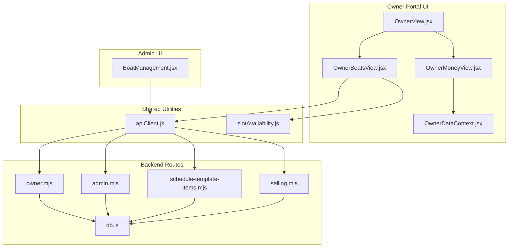
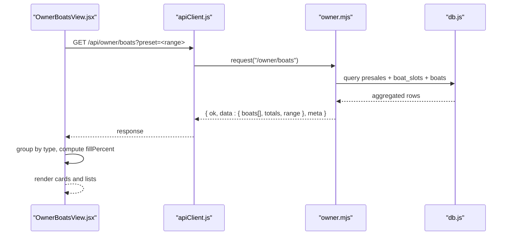
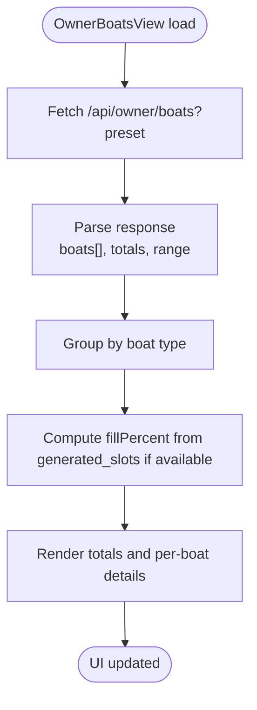
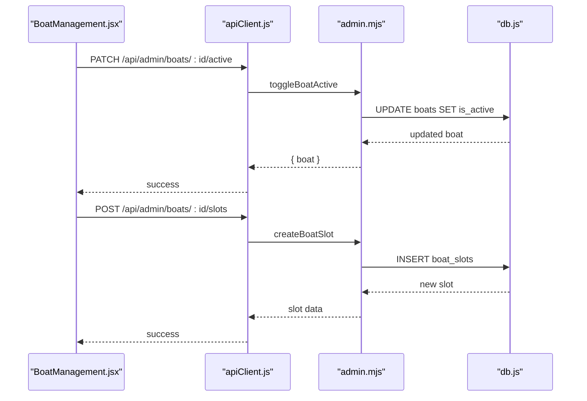
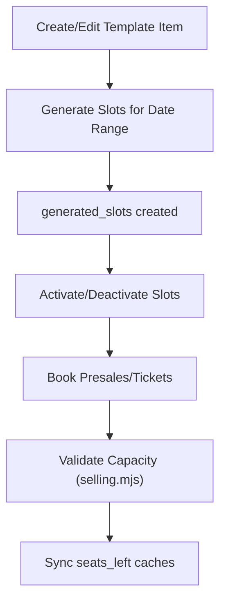
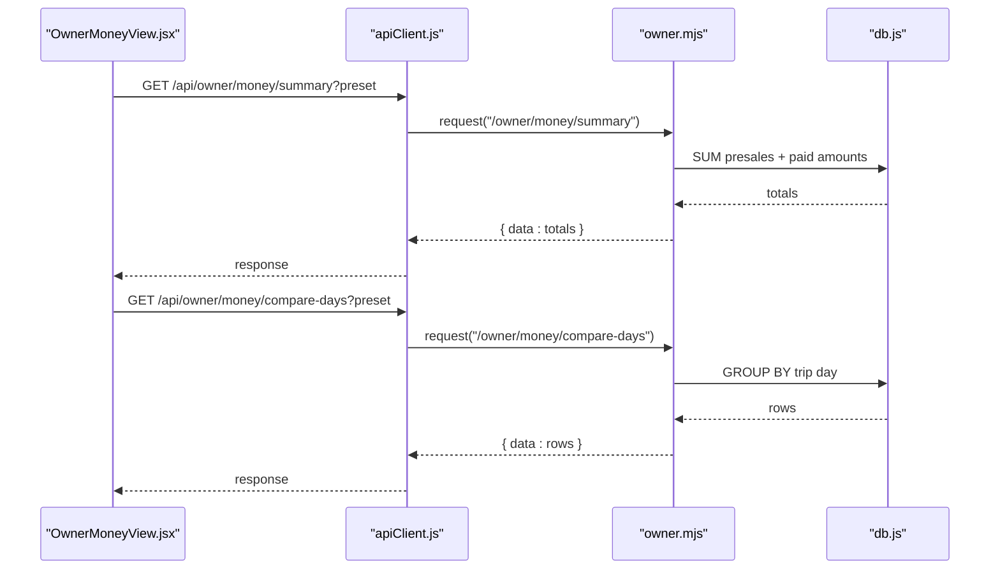
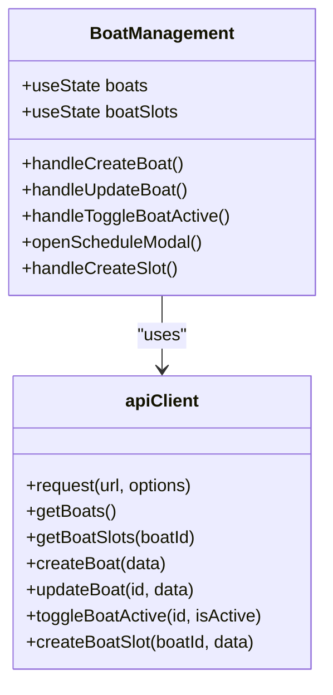
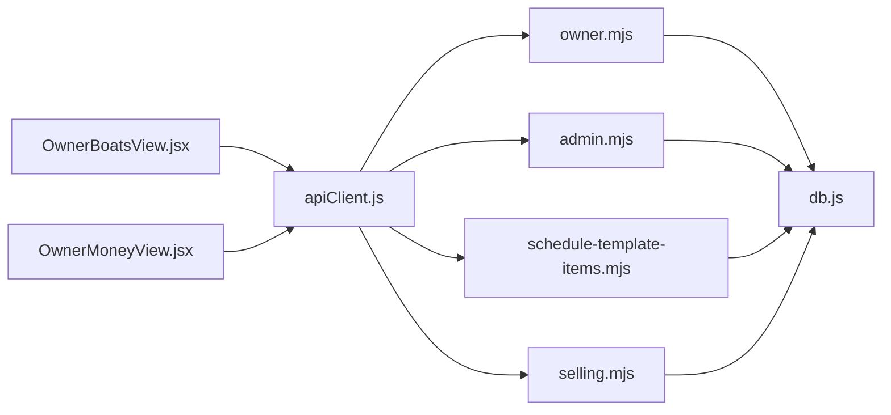

# Boats Management

<cite>
**Referenced Files in This Document**
- [OwnerBoatsView.jsx](file://src/views/OwnerBoatsView.jsx)
- [OwnerView.jsx](file://src/views/OwnerView.jsx)
- [OwnerMoneyView.jsx](file://src/views/OwnerMoneyView.jsx)
- [OwnerDataContext.jsx](file://src/contexts/OwnerDataContext.jsx)
- [BoatManagement.jsx](file://src/components/admin/BoatManagement.jsx)
- [apiClient.js](file://src/utils/apiClient.js)
- [slotAvailability.js](file://src/utils/slotAvailability.js)
- [owner.mjs](file://server/owner.mjs)
- [admin.mjs](file://server/admin.mjs)
- [db.js](file://server/db.js)
- [schedule-template-items.mjs](file://server/schedule-template-items.mjs)
- [selling.mjs](file://server/selling.mjs)
</cite>

## Table of Contents
1. [Introduction](#introduction)
2. [Project Structure](#project-structure)
3. [Core Components](#core-components)
4. [Architecture Overview](#architecture-overview)
5. [Detailed Component Analysis](#detailed-component-analysis)
6. [Dependency Analysis](#dependency-analysis)
7. [Performance Considerations](#performance-considerations)
8. [Troubleshooting Guide](#troubleshooting-guide)
9. [Conclusion](#conclusion)

## Introduction
This document describes the boats management system within the owner portal, focusing on fleet tracking, capacity management, asset utilization monitoring, maintenance scheduling, operational status tracking, and performance metrics. It explains how the owner-facing UI integrates with administrative boat management features and enables real-time fleet visibility. The guide also provides examples of boat allocation strategies, capacity planning, operational efficiency analysis, boat-specific analytics, maintenance cost tracking, and fleet optimization recommendations.

## Project Structure
The boats management system spans the React owner portal UI, shared API client utilities, and the Express backend routes. Administrative boat management is implemented in the admin UI and backed by dedicated admin routes. The backend consolidates data from multiple tables (boats, boat_slots, generated_slots, presales) to compute fleet analytics and capacity utilization.

**Diagram sources**
- [OwnerView.jsx](file://src/views/OwnerView.jsx#L164-L194)
- [OwnerBoatsView.jsx](file://src/views/OwnerBoatsView.jsx#L48-L91)
- [OwnerMoneyView.jsx](file://src/views/OwnerMoneyView.jsx#L54-L132)
- [OwnerDataContext.jsx](file://src/contexts/OwnerDataContext.jsx#L21-L127)
- [BoatManagement.jsx](file://src/components/admin/BoatManagement.jsx#L14-L784)
- [apiClient.js](file://src/utils/apiClient.js#L10-L360)
- [slotAvailability.js](file://src/utils/slotAvailability.js#L7-L19)
- [owner.mjs](file://server/owner.mjs#L278-L399)
- [admin.mjs](file://server/admin.mjs#L18-L180)
- [schedule-template-items.mjs](file://server/schedule-template-items.mjs#L66-L90)
- [selling.mjs](file://server/selling.mjs#L1-L200)
- [db.js](file://server/db.js#L55-L120)

**Section sources**
- [OwnerView.jsx](file://src/views/OwnerView.jsx#L164-L194)
- [OwnerBoatsView.jsx](file://src/views/OwnerBoatsView.jsx#L48-L91)
- [OwnerMoneyView.jsx](file://src/views/OwnerMoneyView.jsx#L54-L132)
- [OwnerDataContext.jsx](file://src/contexts/OwnerDataContext.jsx#L21-L127)
- [BoatManagement.jsx](file://src/components/admin/BoatManagement.jsx#L14-L784)
- [apiClient.js](file://src/utils/apiClient.js#L10-L360)
- [slotAvailability.js](file://src/utils/slotAvailability.js#L7-L19)
- [owner.mjs](file://server/owner.mjs#L278-L399)
- [admin.mjs](file://server/admin.mjs#L18-L180)
- [schedule-template-items.mjs](file://server/schedule-template-items.mjs#L66-L90)
- [selling.mjs](file://server/selling.mjs#L1-L200)
- [db.js](file://server/db.js#L55-L120)

## Core Components
- OwnerBoatsView: Presents aggregated fleet performance by boat, grouped by type, with revenue, ticket counts, trip counts, and computed fill percentage. Supports preset time ranges and auto-refresh.
- OwnerMoneyView: Coordinates owner financial summaries, boat analytics, and comparison-by-day data, integrating with OwnerDataContext for pending collections and auto-refresh.
- OwnerDataContext: Centralizes owner data refresh logic, pending-by-day computation, and cross-screen synchronization.
- BoatManagement (Admin): Manages boats and their schedules, including creation, updates, activation/deactivation, and slot management with capacity and pricing controls.
- apiClient: Unified HTTP client for owner/admin endpoints, with token handling and structured logging.
- slotAvailability: Utility for computing available seats across different slot sources.
- Backend routes (owner.mjs, admin.mjs, schedule-template-items.mjs, selling.mjs): Provide fleet analytics, boat CRUD, schedule templates, and capacity validation.

**Section sources**
- [OwnerBoatsView.jsx](file://src/views/OwnerBoatsView.jsx#L48-L184)
- [OwnerMoneyView.jsx](file://src/views/OwnerMoneyView.jsx#L54-L132)
- [OwnerDataContext.jsx](file://src/contexts/OwnerDataContext.jsx#L21-L127)
- [BoatManagement.jsx](file://src/components/admin/BoatManagement.jsx#L14-L784)
- [apiClient.js](file://src/utils/apiClient.js#L10-L360)
- [slotAvailability.js](file://src/utils/slotAvailability.js#L7-L19)
- [owner.mjs](file://server/owner.mjs#L278-L399)
- [admin.mjs](file://server/admin.mjs#L18-L180)
- [schedule-template-items.mjs](file://server/schedule-template-items.mjs#L66-L90)
- [selling.mjs](file://server/selling.mjs#L1-L200)

## Architecture Overview
The owner portal retrieves fleet analytics via owner.mjs endpoints, grouping by boat and computing fill percentage from generated_slots when available. Admin UI manages boats and slots via admin.mjs and schedule-template-items.mjs, while capacity validation and seat tracking are enforced in selling.mjs. The database schema supports these features with tables for boats, slots, generated slots, presales, and tickets.

**Diagram sources**
- [OwnerBoatsView.jsx](file://src/views/OwnerBoatsView.jsx#L48-L91)
- [apiClient.js](file://src/utils/apiClient.js#L23-L88)
- [owner.mjs](file://server/owner.mjs#L278-L399)
- [db.js](file://server/db.js#L55-L120)

**Section sources**
- [OwnerBoatsView.jsx](file://src/views/OwnerBoatsView.jsx#L48-L91)
- [apiClient.js](file://src/utils/apiClient.js#L23-L88)
- [owner.mjs](file://server/owner.mjs#L278-L399)
- [db.js](file://server/db.js#L55-L120)

## Detailed Component Analysis

### Fleet Tracking and Asset Utilization
- Aggregation by boat: The backend groups presales by boat, summing revenue, tickets, and trips. Boat type is derived from the boats table, enabling type-based grouping in the UI.
- Fill percentage: When generated_slots contains seats_left, the backend estimates total capacity and sold seats across generated slots to compute a best-effort fill percentage.
- Real-time visibility: OwnerBoatsView polls every 20 seconds for today’s data, ensuring near real-time updates of revenue, tickets, trips, and fill percentage.

**Diagram sources**
- [OwnerBoatsView.jsx](file://src/views/OwnerBoatsView.jsx#L48-L113)
- [owner.mjs](file://server/owner.mjs#L278-L399)

**Section sources**
- [OwnerBoatsView.jsx](file://src/views/OwnerBoatsView.jsx#L48-L113)
- [owner.mjs](file://server/owner.mjs#L278-L399)

### Capacity Management and Operational Status
- Capacity and availability: The system tracks capacity and seats_left in boat_slots and generated_slots. For generated slots, occupancy is computed from presales to maintain accuracy, and seats_left is synchronized back to generated_slots.
- Operational status: Boat activation/deactivation toggles visibility and sale eligibility. Slot activation toggles availability for bookings.
- Pricing tiers: Boat slots support adult/teen/child pricing variants, with special handling for banana boats (no teen pricing).

**Diagram sources**
- [BoatManagement.jsx](file://src/components/admin/BoatManagement.jsx#L130-L144)
- [BoatManagement.jsx](file://src/components/admin/BoatManagement.jsx#L213-L248)
- [admin.mjs](file://server/admin.mjs#L116-L139)
- [admin.mjs](file://server/admin.mjs#L218-L264)
- [db.js](file://server/db.js#L68-L85)

**Section sources**
- [BoatManagement.jsx](file://src/components/admin/BoatManagement.jsx#L130-L144)
- [BoatManagement.jsx](file://src/components/admin/BoatManagement.jsx#L213-L248)
- [admin.mjs](file://server/admin.mjs#L116-L139)
- [admin.mjs](file://server/admin.mjs#L218-L264)
- [db.js](file://server/db.js#L68-L85)

### Maintenance Scheduling and Operational Status Tracking
- Schedule templates: Admins define recurring schedules via schedule-template-items.mjs, specifying type (speed/cruise/banana), departure time, duration, capacity, and pricing. Generation creates generated_slots for specified date ranges.
- Operational status: Boat activation toggles whether a vessel participates in sales. Slot activation toggles availability for a given time and date.
- Capacity validation: selling.mjs enforces capacity limits per slot, respecting both manual and generated slots, and synchronizes seats_left caches.

**Diagram sources**
- [schedule-template-items.mjs](file://server/schedule-template-items.mjs#L127-L200)
- [schedule-template-items.mjs](file://server/schedule-template-items.mjs#L570-L606)
- [selling.mjs](file://server/selling.mjs#L62-L94)

**Section sources**
- [schedule-template-items.mjs](file://server/schedule-template-items.mjs#L127-L200)
- [schedule-template-items.mjs](file://server/schedule-template-items.mjs#L570-L606)
- [selling.mjs](file://server/selling.mjs#L62-L94)

### Performance Metrics and Analytics
- Revenue, tickets, trips: OwnerMoneyView fetches money summaries and compares revenue across days, while OwnerBoatsView presents per-boat and per-type KPIs.
- Pending collections: OwnerDataContext computes pending amounts by trip day, enabling owners to track uncollected revenue per day.
- Fill percentage: Best-effort utilization metric computed from generated_slots when seats_left is available.

**Diagram sources**
- [OwnerMoneyView.jsx](file://src/views/OwnerMoneyView.jsx#L99-L132)
- [owner.mjs](file://server/owner.mjs#L99-L168)
- [owner.mjs](file://server/owner.mjs#L239-L272)

**Section sources**
- [OwnerMoneyView.jsx](file://src/views/OwnerMoneyView.jsx#L99-L132)
- [owner.mjs](file://server/owner.mjs#L99-L168)
- [owner.mjs](file://server/owner.mjs#L239-L272)

### Integration with Administrative Boat Management
- Admin UI (BoatManagement.jsx) provides CRUD for boats and slot management, including activation toggles and batch operations.
- Admin routes (admin.mjs) enforce validation for boat types, pricing, and capacity, and support soft deletion by archiving when dependencies exist.
- Owner UI consumes admin-provided boat lists and slot data through shared endpoints and utilities.

**Diagram sources**
- [BoatManagement.jsx](file://src/components/admin/BoatManagement.jsx#L14-L784)
- [apiClient.js](file://src/utils/apiClient.js#L10-L360)

**Section sources**
- [BoatManagement.jsx](file://src/components/admin/BoatManagement.jsx#L14-L784)
- [apiClient.js](file://src/utils/apiClient.js#L10-L360)
- [admin.mjs](file://server/admin.mjs#L18-L180)

### Examples: Allocation Strategies, Capacity Planning, Efficiency Analysis
- Allocation strategies:
  - Prefer banana boats for shorter durations and fixed capacity to simplify planning.
  - Balance speed/cruise trips by aligning departure times and durations with demand patterns.
- Capacity planning:
  - Use generated_slots capacity and seats_left to forecast availability.
  - Monitor per-boat fill percentage to identify underperforming vessels or time slots.
- Efficiency analysis:
  - Compare revenue trends across days and types to optimize scheduling.
  - Track pending collections by trip day to improve cash flow.

[No sources needed since this section provides conceptual guidance]

## Dependency Analysis
The owner portal depends on owner.mjs for fleet analytics and OwnerDataContext for pending computations. Admin features depend on admin.mjs and schedule-template-items.mjs, with backend enforcing capacity and pricing rules in selling.mjs. The database schema underpins all these features with normalized tables for boats, slots, generated slots, presales, and tickets.

**Diagram sources**
- [OwnerBoatsView.jsx](file://src/views/OwnerBoatsView.jsx#L48-L91)
- [OwnerMoneyView.jsx](file://src/views/OwnerMoneyView.jsx#L99-L132)
- [apiClient.js](file://src/utils/apiClient.js#L23-L88)
- [owner.mjs](file://server/owner.mjs#L278-L399)
- [admin.mjs](file://server/admin.mjs#L18-L180)
- [schedule-template-items.mjs](file://server/schedule-template-items.mjs#L66-L90)
- [selling.mjs](file://server/selling.mjs#L1-L200)
- [db.js](file://server/db.js#L55-L120)

**Section sources**
- [OwnerBoatsView.jsx](file://src/views/OwnerBoatsView.jsx#L48-L91)
- [OwnerMoneyView.jsx](file://src/views/OwnerMoneyView.jsx#L99-L132)
- [apiClient.js](file://src/utils/apiClient.js#L23-L88)
- [owner.mjs](file://server/owner.mjs#L278-L399)
- [admin.mjs](file://server/admin.mjs#L18-L180)
- [schedule-template-items.mjs](file://server/schedule-template-items.mjs#L66-L90)
- [selling.mjs](file://server/selling.mjs#L1-L200)
- [db.js](file://server/db.js#L55-L120)

## Performance Considerations
- Auto-refresh cadence: OwnerBoatsView polls every 20 seconds for today’s data to keep the UI fresh without overloading the backend.
- Efficient aggregations: Backend queries use grouped sums and best-effort fill percentage calculations to minimize UI-side computation.
- Capacity validation: selling.mjs validates capacity against presales-derived occupancy for generated slots, preventing overbooking and reducing rework.

[No sources needed since this section provides general guidance]

## Troubleshooting Guide
- No data shown: Verify preset selection and network connectivity; check warnings returned by owner.mjs endpoints.
- Capacity exceeded errors: Ensure requested seats do not exceed remaining capacity; review generated_slots seats_left and boat_slots capacity.
- Slot creation failures: Confirm time format, duration constraints, and capacity rules; banana boats must use fixed duration and capacity.

**Section sources**
- [OwnerBoatsView.jsx](file://src/views/OwnerBoatsView.jsx#L136-L145)
- [selling.mjs](file://server/selling.mjs#L62-L94)
- [schedule-template-items.mjs](file://server/schedule-template-items.mjs#L170-L194)

## Conclusion
The boats management system integrates owner-facing analytics with administrative controls to deliver real-time fleet visibility, robust capacity management, and operational insights. By leveraging generated slots, validated capacity checks, and consolidated financial metrics, owners can optimize allocation strategies, monitor performance, and plan maintenance and scheduling effectively.