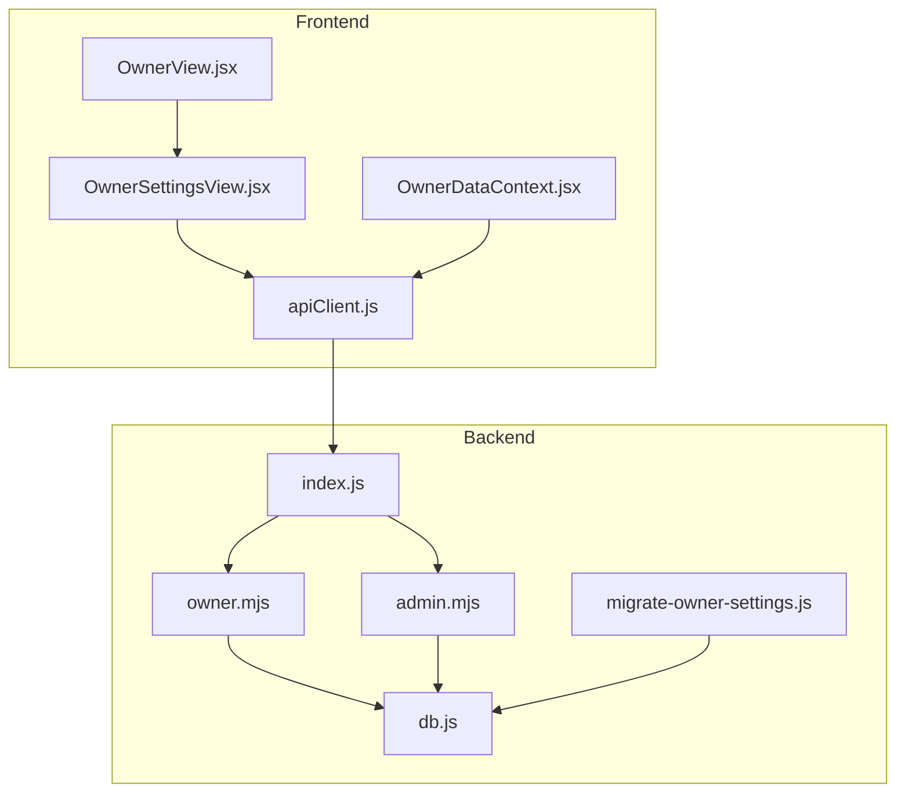
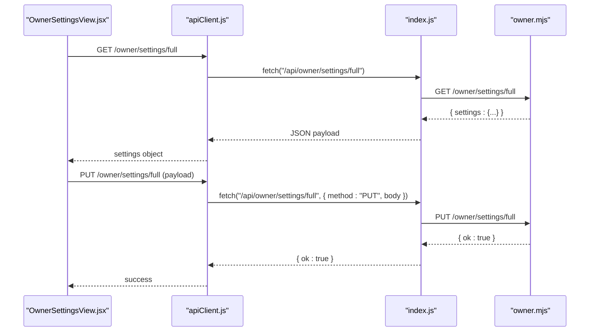
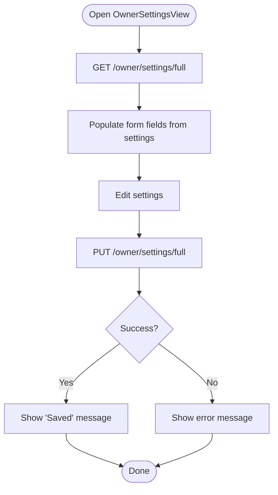
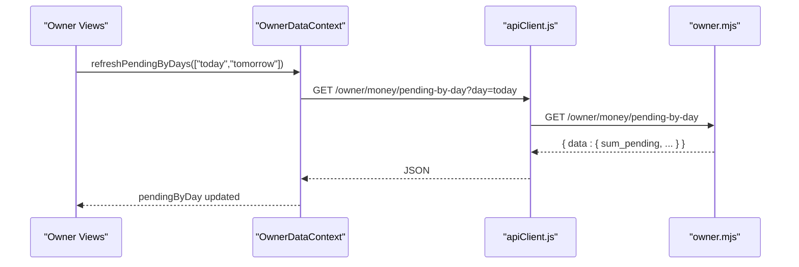
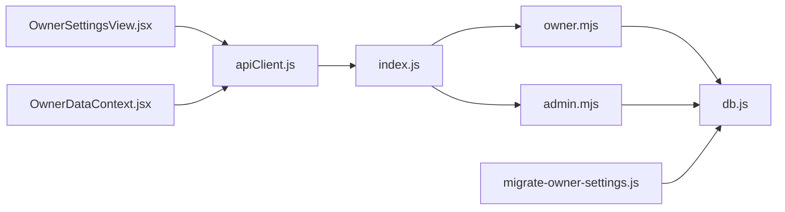

# Business Settings

<cite>
**Referenced Files in This Document**
- [README.md](file://README.md)
- [OwnerSettingsView.jsx](file://src/views/OwnerSettingsView.jsx)
- [OwnerView.jsx](file://src/views/OwnerView.jsx)
- [OwnerDataContext.jsx](file://src/contexts/OwnerDataContext.jsx)
- [apiClient.js](file://src/utils/apiClient.js)
- [owner.mjs](file://server/owner.mjs)
- [admin.mjs](file://server/admin.mjs)
- [db.js](file://server/db.js)
- [index.js](file://server/index.js)
- [BUSINESS_RULES.md](file://docs/BUSINESS_RULES.md)
- [migrate-owner-settings.js](file://server/migrate-owner-settings.js)
</cite>

## Table of Contents
1. [Introduction](#introduction)
2. [Project Structure](#project-structure)
3. [Core Components](#core-components)
4. [Architecture Overview](#architecture-overview)
5. [Detailed Component Analysis](#detailed-component-analysis)
6. [Dependency Analysis](#dependency-analysis)
7. [Performance Considerations](#performance-considerations)
8. [Troubleshooting Guide](#troubleshooting-guide)
9. [Conclusion](#conclusion)
10. [Appendices](#appendices)

## Introduction
This document describes the business settings management functionality within the owner portal. It explains how owners configure pricing strategies, commission structures, operational parameters, and system-wide analytics and notification preferences. It also covers how these settings influence analytics and reporting within the Owner panel, how administrative controls integrate with business operations, and how to optimize configurations for operational efficiency. Security considerations and change management procedures are included to ensure safe and auditable updates.

## Project Structure
The business settings feature spans the frontend Owner UI and the backend owner API. Owners can adjust settings via the OwnerSettingsView, which communicates with the backend owner router. Administrative controls (admin.mjs) manage users, boats, and work zones, while the owner router provides analytics endpoints used by Owner views. The database schema (db.js) persists core entities and supports settings migrations.

**Diagram sources**
- [OwnerView.jsx](file://src/views/OwnerView.jsx#L164-L194)
- [OwnerSettingsView.jsx](file://src/views/OwnerSettingsView.jsx#L17-L164)
- [OwnerDataContext.jsx](file://src/contexts/OwnerDataContext.jsx#L21-L128)
- [apiClient.js](file://src/utils/apiClient.js#L23-L88)
- [index.js](file://server/index.js#L25-L40)
- [owner.mjs](file://server/owner.mjs#L99-L168)
- [admin.mjs](file://server/admin.mjs#L18-L40)
- [db.js](file://server/db.js#L87-L93)
- [migrate-owner-settings.js](file://server/migrate-owner-settings.js#L28-L47)

**Section sources**
- [README.md](file://README.md#L1-L150)
- [OwnerView.jsx](file://src/views/OwnerView.jsx#L164-L194)
- [OwnerSettingsView.jsx](file://src/views/OwnerSettingsView.jsx#L17-L164)
- [OwnerDataContext.jsx](file://src/contexts/OwnerDataContext.jsx#L21-L128)
- [apiClient.js](file://src/utils/apiClient.js#L23-L88)
- [index.js](file://server/index.js#L25-L40)
- [owner.mjs](file://server/owner.mjs#L99-L168)
- [admin.mjs](file://server/admin.mjs#L18-L40)
- [db.js](file://server/db.js#L87-L93)
- [migrate-owner-settings.js](file://server/migrate-owner-settings.js#L28-L47)

## Core Components
- OwnerSettingsView: The UI for managing business settings. It loads current settings, allows editing, and persists changes via the owner router.
- OwnerDataContext: Provides owner analytics data loading and refresh orchestration used by Owner views.
- apiClient: Centralized HTTP client handling authentication and request/response logging.
- owner.mjs: Owner analytics endpoints (money summaries, pending by day, compare days, boats, collected today by trip day). Settings persistence is handled by the backend owner router.
- admin.mjs: Administrative controls for users, boats, and work zone settings (not business settings).
- db.js: Database schema and migrations, including the settings table used by the application.
- migrate-owner-settings.js: Migration script to enable owner settings versioning and day snapshots.

Key settings managed by OwnerSettingsView include:
- General business settings: business name, timezone, currency, and season dates.
- Analytics thresholds: daily revenue thresholds and base comparison period.
- Motivation settings: type (team/personal/adaptive), percentage, inclusion of sellers/dispatchers, weekly and seasonal fund allocations, and coefficients by boat type and zone.
- Operational thresholds: load thresholds and minimum seller revenue.
- Notifications: toggles for revenue, load, and seller thresholds, and channel selection.

These settings influence analytics and calculations within the Owner panel and do not directly alter current sales operations.

**Section sources**
- [OwnerSettingsView.jsx](file://src/views/OwnerSettingsView.jsx#L17-L164)
- [OwnerDataContext.jsx](file://src/contexts/OwnerDataContext.jsx#L21-L128)
- [apiClient.js](file://src/utils/apiClient.js#L23-L88)
- [owner.mjs](file://server/owner.mjs#L99-L168)
- [admin.mjs](file://server/admin.mjs#L18-L40)
- [db.js](file://server/db.js#L87-L93)
- [migrate-owner-settings.js](file://server/migrate-owner-settings.js#L28-L47)

## Architecture Overview
The OwnerSettingsView interacts with the backend through apiClient, which targets the owner router. The owner router encapsulates analytics endpoints used by Owner views. Administrative controls are exposed via admin routes and are separate from business settings.

**Diagram sources**
- [OwnerSettingsView.jsx](file://src/views/OwnerSettingsView.jsx#L64-L159)
- [apiClient.js](file://src/utils/apiClient.js#L23-L88)
- [index.js](file://server/index.js#L39-L40)
- [owner.mjs](file://server/owner.mjs#L99-L168)

## Detailed Component Analysis

### OwnerSettingsView: Business Settings UI
OwnerSettingsView provides a form-driven interface to edit business settings. It:
- Loads settings on mount via GET /owner/settings/full.
- Updates state from returned settings keys.
- Saves changes via PUT /owner/settings/full with a full payload.
- Displays success/error feedback and disables controls during network operations.

Configuration categories:
- General business settings: businessName, timezone, currency, seasonStart, seasonEnd.
- Analytics thresholds: badDay, normalDay, goodDay, baseCompareDays.
- Motivation: motivationType, motivationPercent, teamIncludeSellers, teamIncludeDispatchers, toWeeklyFund, toSeasonFund, coefSpeed, coefWalk, coefBanana, coefFishing, zoneSanatorka, zoneCenter, zoneYozhik.
- Operational thresholds: lowLoad, highLoad, minSellerRevenue.
- Notifications: notifyBadRevenue, notifyLowLoad, notifyLowSeller, notifyChannel.

Operational impact:
- Changes affect analytics and calculations within Owner views.
- Do not trigger immediate operational actions on trips or sales.

**Diagram sources**
- [OwnerSettingsView.jsx](file://src/views/OwnerSettingsView.jsx#L64-L159)

**Section sources**
- [OwnerSettingsView.jsx](file://src/views/OwnerSettingsView.jsx#L17-L164)
- [OwnerSettingsView.jsx](file://src/views/OwnerSettingsView.jsx#L64-L159)

### OwnerDataContext: Owner Analytics Orchestration
OwnerDataContext centralizes owner analytics data loading and refreshes. It:
- Manages pending revenue by day and exposes refresh methods.
- Supports multi-day refresh and stale-checking via request IDs.
- Allows registration of callbacks for broader refresh operations.

Integration with settings:
- Owner views (e.g., OwnerMoneyView) use OwnerDataContext to refresh analytics data.
- Settings changes do not directly trigger these refreshes; owners can manually refresh.

**Diagram sources**
- [OwnerDataContext.jsx](file://src/contexts/OwnerDataContext.jsx#L36-L90)
- [owner.mjs](file://server/owner.mjs#L174-L233)
- [apiClient.js](file://src/utils/apiClient.js#L23-L88)

**Section sources**
- [OwnerDataContext.jsx](file://src/contexts/OwnerDataContext.jsx#L21-L128)
- [owner.mjs](file://server/owner.mjs#L174-L233)

### Business Rule Context
Business rules define how revenue and cutoffs are computed and enforced. Owner settings complement these rules by configuring analytics thresholds and motivation parameters that influence reporting and incentives.

Highlights:
- Revenue aggregation uses presales and business_day semantics.
- Cutoff enforcement is role-based and independent of Owner settings.
- Analytics endpoints compute pending revenue and compare periods.

**Section sources**
- [BUSINESS_RULES.md](file://docs/BUSINESS_RULES.md#L1-L49)
- [owner.mjs](file://server/owner.mjs#L35-L53)
- [owner.mjs](file://server/owner.mjs#L99-L168)

### Administrative Controls and Their Impact
Administrative controls (admin.mjs) manage users, boats, and work zones. They are separate from business settings:
- Users: create, enable/disable, reset passwords.
- Boats: CRUD operations and activity toggle.
- Work zone: persisted via settings table for administrative mapping.

Impact on business operations:
- Boat availability and schedules affect sales and analytics.
- User roles determine access to administrative and owner features.
- Work zone settings support operational mapping but are distinct from Owner business settings.

**Section sources**
- [admin.mjs](file://server/admin.mjs#L18-L40)
- [admin.mjs](file://server/admin.mjs#L266-L387)
- [admin.mjs](file://server/admin.mjs#L474-L520)
- [db.js](file://server/db.js#L87-L93)

### Settings Persistence and Versioning
Settings are persisted in the database via the owner router and can be versioned:
- The settings table stores key/value pairs.
- The migration script establishes owner_settings_versions and owner_day_snapshots tables to track historical settings and lock snapshots by business day.

Change management:
- Versioned settings enable historical analysis and rollback scenarios.
- Day snapshots ensure past analytics remain consistent regardless of future setting changes.

**Section sources**
- [db.js](file://server/db.js#L87-L93)
- [migrate-owner-settings.js](file://server/migrate-owner-settings.js#L28-L47)

## Dependency Analysis
OwnerSettingsView depends on:
- apiClient for HTTP requests.
- OwnerSettingsView.jsx for UI rendering and state management.
OwnerDataContext depends on:
- apiClient for analytics endpoints.
- owner.mjs for owner-specific analytics routes.
Backend dependencies:
- index.js mounts owner and admin routers.
- owner.mjs implements analytics endpoints.
- admin.mjs implements administrative endpoints.
- db.js defines schema and migrations.

**Diagram sources**
- [OwnerSettingsView.jsx](file://src/views/OwnerSettingsView.jsx#L1-L20)
- [OwnerDataContext.jsx](file://src/contexts/OwnerDataContext.jsx#L1-L12)
- [apiClient.js](file://src/utils/apiClient.js#L1-L36)
- [index.js](file://server/index.js#L25-L40)
- [owner.mjs](file://server/owner.mjs#L1-L54)
- [admin.mjs](file://server/admin.mjs#L1-L16)
- [db.js](file://server/db.js#L87-L93)
- [migrate-owner-settings.js](file://server/migrate-owner-settings.js#L28-L47)

**Section sources**
- [OwnerSettingsView.jsx](file://src/views/OwnerSettingsView.jsx#L1-L20)
- [OwnerDataContext.jsx](file://src/contexts/OwnerDataContext.jsx#L1-L12)
- [apiClient.js](file://src/utils/apiClient.js#L1-L36)
- [index.js](file://server/index.js#L25-L40)
- [owner.mjs](file://server/owner.mjs#L1-L54)
- [admin.mjs](file://server/admin.mjs#L1-L16)
- [db.js](file://server/db.js#L87-L93)
- [migrate-owner-settings.js](file://server/migrate-owner-settings.js#L28-L47)

## Performance Considerations
- Owner analytics endpoints aggregate data by trip day and use efficient SQL queries with conditional sums and counts. This minimizes overhead for large datasets.
- OwnerSettingsView performs full payload updates; batch changes reduce round-trips.
- OwnerDataContext supports parallel loading of multiple days and stale-checking to avoid race conditions.

[No sources needed since this section provides general guidance]

## Troubleshooting Guide
Common issues and resolutions:
- Settings load/save failures: Verify backend connectivity and authentication token presence in apiClient.
- Empty analytics data: Ensure business_day semantics and date ranges are valid; check owner.mjs endpoints for correct date expressions.
- Administrative permission errors: Confirm user role includes admin or owner for admin routes.

**Section sources**
- [apiClient.js](file://src/utils/apiClient.js#L23-L88)
- [owner.mjs](file://server/owner.mjs#L35-L53)
- [admin.mjs](file://server/admin.mjs#L7-L15)

## Conclusion
Business settings in the owner portal enable precise configuration of pricing strategies, motivation parameters, operational thresholds, and notifications. These settings influence analytics and reporting within the Owner panel without altering ongoing sales operations. Administrative controls manage users, boats, and work zones independently. Proper change management and versioning ensure auditability and stability of business configurations.

[No sources needed since this section summarizes without analyzing specific files]

## Appendices

### API Definitions: Owner Settings
- GET /api/owner/settings/full
  - Method: GET
  - Description: Retrieve current owner settings
  - Response: { settings: { ... } }
- PUT /api/owner/settings/full
  - Method: PUT
  - Body: Full settings payload
  - Description: Persist owner settings
  - Response: { ok: true }

**Section sources**
- [OwnerSettingsView.jsx](file://src/views/OwnerSettingsView.jsx#L64-L159)

### Example Optimizations and Policy Changes
- Optimize motivation: Adjust motivationType and motivationPercent to align with seasonal performance; monitor analytics thresholds (badDay/normalDay/goodDay) to calibrate expectations.
- Operational efficiency: Tune lowLoad/highLoad thresholds to trigger timely alerts; set minSellerRevenue to identify underperforming sellers.
- Notification tuning: Enable notifyBadRevenue and notifyLowLoad to receive timely alerts via the selected channel.

[No sources needed since this section provides general guidance]

### Security Considerations
- Role-based access: OwnerSettingsView is intended for owners; administrative controls require admin or owner roles.
- Token handling: apiClient injects Authorization headers automatically; ensure secure storage and transmission.
- Data integrity: Use versioned settings and day snapshots to maintain historical accuracy and support audits.

**Section sources**
- [OwnerSettingsView.jsx](file://src/views/OwnerSettingsView.jsx#L17-L164)
- [admin.mjs](file://server/admin.mjs#L7-L15)
- [apiClient.js](file://src/utils/apiClient.js#L23-L88)
- [migrate-owner-settings.js](file://server/migrate-owner-settings.js#L28-L47)