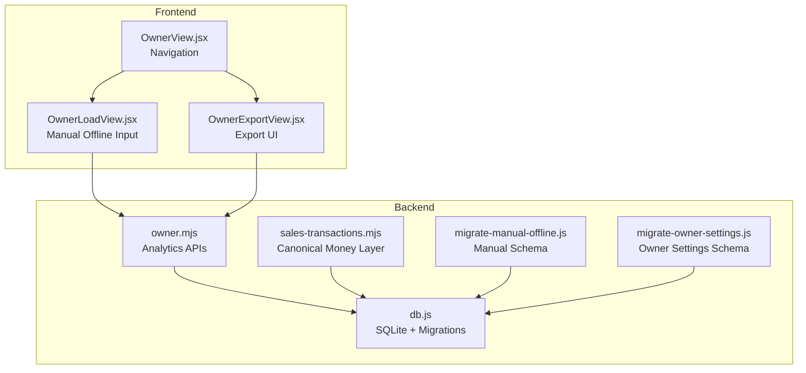
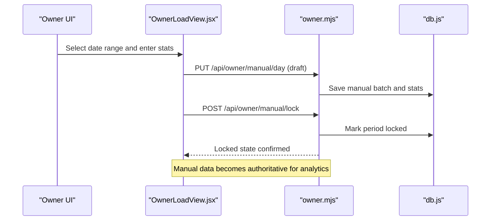
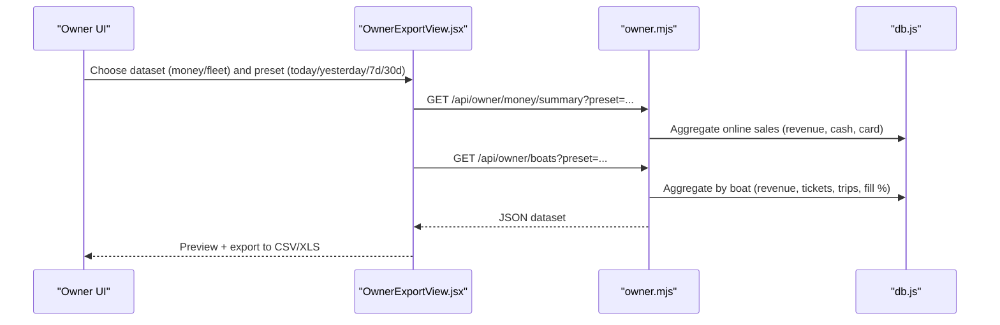
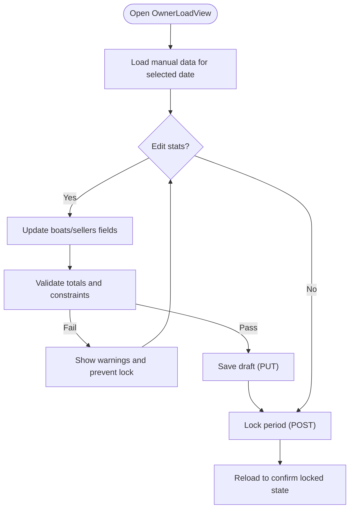
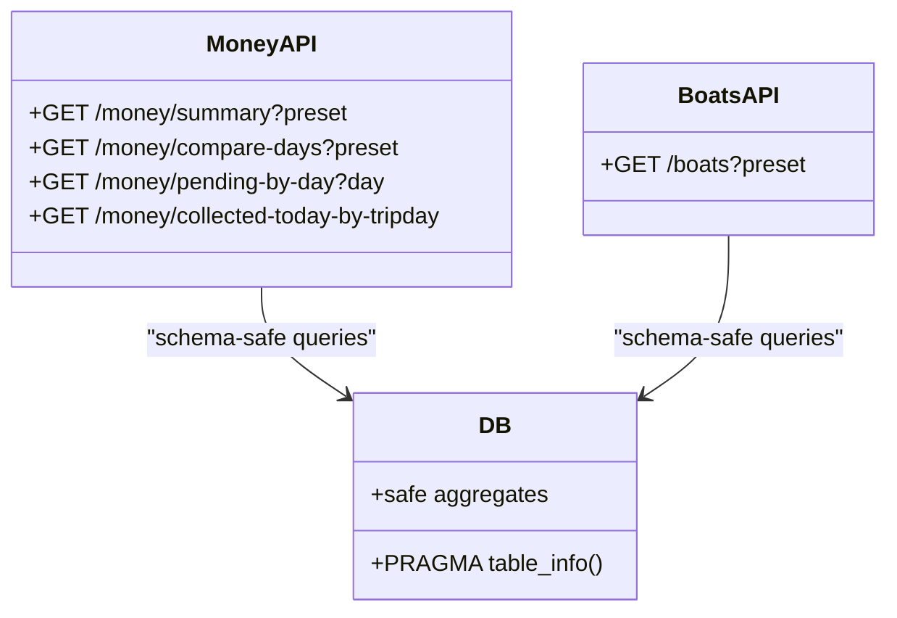
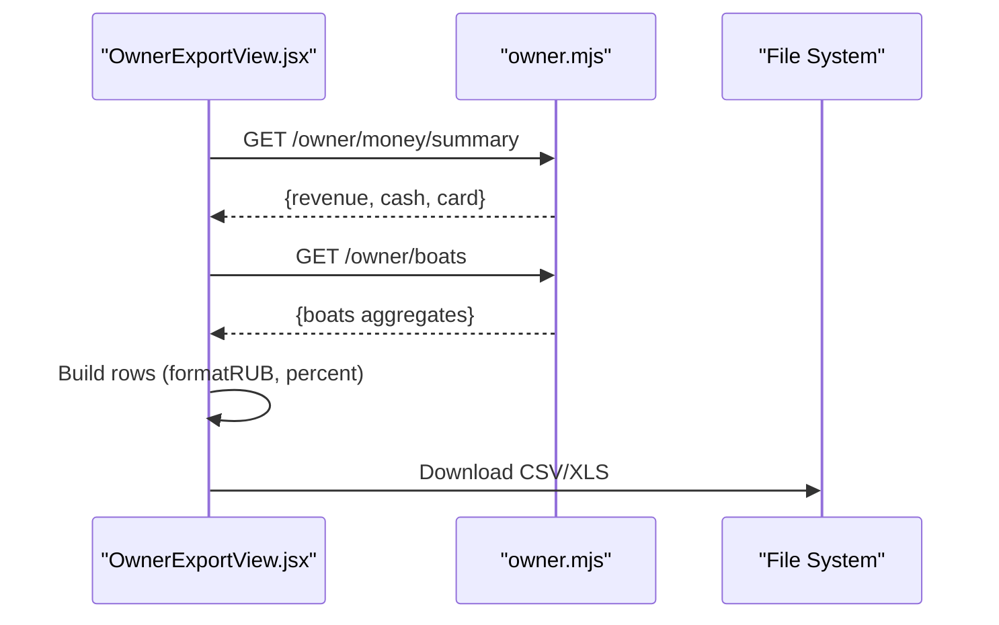
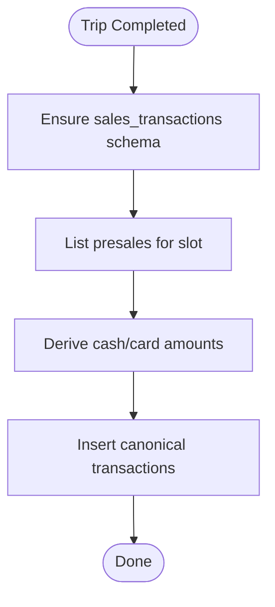
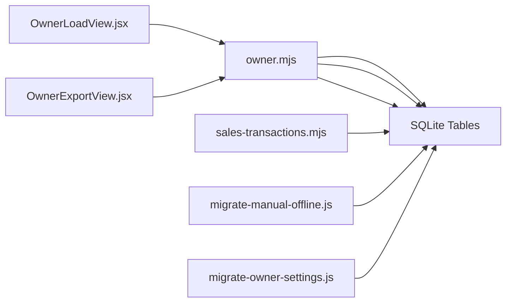

# Data Load & Export

<cite>
**Referenced Files in This Document**
- [OwnerLoadView.jsx](file://src/views/OwnerLoadView.jsx)
- [OwnerExportView.jsx](file://src/views/OwnerExportView.jsx)
- [OwnerLoadView.jsx](file://src/components/owner/OwnerLoadView.jsx)
- [owner.mjs](file://server/owner.mjs)
- [sales-transactions.mjs](file://server/sales-transactions.mjs)
- [migrate-manual-offline.js](file://server/migrate-manual-offline.js)
- [migrate-owner-settings.js](file://server/migrate-owner-settings.js)
- [db.js](file://server/db.js)
- [OwnerView.jsx](file://src/views/OwnerView.jsx)
- [OwnerMoneyView.jsx](file://src/views/OwnerMoneyView.jsx)
- [README.md](file://README.md)
</cite>

## Table of Contents
1. [Introduction](#introduction)
2. [Project Structure](#project-structure)
3. [Core Components](#core-components)
4. [Architecture Overview](#architecture-overview)
5. [Detailed Component Analysis](#detailed-component-analysis)
6. [Dependency Analysis](#dependency-analysis)
7. [Performance Considerations](#performance-considerations)
8. [Troubleshooting Guide](#troubleshooting-guide)
9. [Conclusion](#conclusion)
10. [Appendices](#appendices)

## Introduction
This document explains the data import and export capabilities within the owner portal. It covers:
- Data loading for bulk operations and historical data import via manual offline input
- System migration and schema evolution for owner analytics
- Export capabilities for generating business reports, financial summaries, and operational insights
- Supported file formats, validation, and quality assurance
- Examples of exporting sales data and generating tax-ready reports
- Data security, backup, and compliance considerations

## Project Structure
The owner portal integrates a client-side UI with a Node/Express backend serving analytics APIs and managing owner-specific data layers. The system supports:
- Manual offline input for historical periods
- Owner analytics endpoints aggregating online sales
- Export of summarized datasets to CSV/XLS
- Migration scripts to evolve schema safely

**Diagram sources**
- [OwnerLoadView.jsx](file://src/views/OwnerLoadView.jsx#L1-L363)
- [OwnerExportView.jsx](file://src/views/OwnerExportView.jsx#L1-L291)
- [OwnerView.jsx](file://src/views/OwnerView.jsx#L328-L374)
- [owner.mjs](file://server/owner.mjs#L1-L456)
- [sales-transactions.mjs](file://server/sales-transactions.mjs#L1-L237)
- [db.js](file://server/db.js#L965-L1019)
- [migrate-manual-offline.js](file://server/migrate-manual-offline.js#L1-L68)
- [migrate-owner-settings.js](file://server/migrate-owner-settings.js#L1-L53)

**Section sources**
- [README.md](file://README.md#L1-L150)
- [OwnerView.jsx](file://src/views/OwnerView.jsx#L328-L374)

## Core Components
- Manual Offline Input (OwnerLoadView):
  - Allows entering revenue, trips, and seats by boat and seller for a selected date range
  - Drafts can be saved; locking makes the period immutable and prioritizes manual data in analytics
- Analytics APIs (owner.mjs):
  - Provides money summaries and fleet-level aggregates
  - Uses schema-safe queries and fallbacks for evolving DB structures
- Export UI (OwnerExportView):
  - Loads summarized datasets and exports to CSV or XLS
- Canonical Money Layer (sales-transactions.mjs):
  - Creates a canonical record of sales for generated slots after trips are completed
- Manual Schema Migration (migrate-manual-offline.js):
  - Adds tables for manual offline batches, days, and per-boat/per-seller stats
- Owner Settings Migration (migrate-owner-settings.js):
  - Adds versioning and snapshot tables for owner settings
- Database and Indexes (db.js):
  - Maintains manual schema, indexes, and audit logging for owner analytics

**Section sources**
- [OwnerLoadView.jsx](file://src/views/OwnerLoadView.jsx#L1-L363)
- [OwnerLoadView.jsx](file://src/components/owner/OwnerLoadView.jsx#L1-L651)
- [owner.mjs](file://server/owner.mjs#L1-L456)
- [OwnerExportView.jsx](file://src/views/OwnerExportView.jsx#L1-L291)
- [sales-transactions.mjs](file://server/sales-transactions.mjs#L1-L237)
- [migrate-manual-offline.js](file://server/migrate-manual-offline.js#L1-L68)
- [migrate-owner-settings.js](file://server/migrate-owner-settings.js#L1-L53)
- [db.js](file://server/db.js#L965-L1019)

## Architecture Overview
The owner portal’s data pipeline combines manual input with canonical analytics derived from online sales. Manual input takes precedence in analytics, ensuring accurate reporting for offline or historical periods.

**Diagram sources**
- [OwnerLoadView.jsx](file://src/views/OwnerLoadView.jsx#L75-L123)
- [owner.mjs](file://server/owner.mjs#L99-L168)
- [db.js](file://server/db.js#L965-L1019)

**Diagram sources**
- [OwnerExportView.jsx](file://src/views/OwnerExportView.jsx#L101-L165)
- [owner.mjs](file://server/owner.mjs#L99-L168)
- [owner.mjs](file://server/owner.mjs#L278-L399)

## Detailed Component Analysis

### Manual Offline Data Load (OwnerLoadView)
- Purpose:
  - Enter daily revenue, trips, and seats for boats and sellers for offline or historical periods
  - Save drafts; lock to make the period immutable and authoritative in analytics
- Key behaviors:
  - Fetches existing manual data for a given date
  - Validates totals and sums before allowing lock
  - Persists payload to manual tables and marks locked
- Data model:
  - Period table with lock flag
  - Boat and seller stats per period
- Validation and QA:
  - UI-level checks ensure totals reconcile and required rows exist
  - Server-side analytics treat manual data as authoritative (manual > online)

**Diagram sources**
- [OwnerLoadView.jsx](file://src/views/OwnerLoadView.jsx#L41-L123)
- [OwnerLoadView.jsx](file://src/components/owner/OwnerLoadView.jsx#L75-L88)

**Section sources**
- [OwnerLoadView.jsx](file://src/views/OwnerLoadView.jsx#L1-L363)
- [OwnerLoadView.jsx](file://src/components/owner/OwnerLoadView.jsx#L1-L651)
- [migrate-manual-offline.js](file://server/migrate-manual-offline.js#L29-L62)
- [db.js](file://server/db.js#L965-L1019)

### Analytics APIs (owner.mjs)
- Money Summary:
  - Aggregates revenue, cash, and card for a preset range
  - Uses business day expressions and schema-safe column detection
- Fleet Aggregation:
  - Aggregates by boat (revenue, tickets, trips, fill percentage)
  - Estimates capacity from generated slots when available
- Safety and Compatibility:
  - Uses PRAGMA checks and fallbacks for evolving schemas
  - Returns warnings for mixed or missing data

**Diagram sources**
- [owner.mjs](file://server/owner.mjs#L99-L168)
- [owner.mjs](file://server/owner.mjs#L278-L399)

**Section sources**
- [owner.mjs](file://server/owner.mjs#L1-L456)

### Export Capabilities (OwnerExportView)
- Supported formats:
  - CSV (semicolon-separated)
  - XLS (HTML table wrapper)
- Datasets:
  - Money: revenue, cash, card, average check, tickets, trips, load %
  - Fleet: boat type/name, trips, tickets, load %, revenue, share, source
- Workflow:
  - Load dataset from analytics APIs
  - Preview table
  - Export to CSV/XLS with appropriate MIME type

**Diagram sources**
- [OwnerExportView.jsx](file://src/views/OwnerExportView.jsx#L101-L177)
- [owner.mjs](file://server/owner.mjs#L99-L168)
- [owner.mjs](file://server/owner.mjs#L278-L399)

**Section sources**
- [OwnerExportView.jsx](file://src/views/OwnerExportView.jsx#L1-L291)

### Canonical Money Layer (sales-transactions.mjs)
- Purpose:
  - Create a canonical record of sales for generated slots after trips are completed
  - Normalize payment methods and amounts, insert records with business day and slot metadata
- Safety:
  - Idempotent creation guarded by unique indexes
  - Schema ensured before insert
  - Handles missing columns gracefully

**Diagram sources**
- [sales-transactions.mjs](file://server/sales-transactions.mjs#L34-L237)

**Section sources**
- [sales-transactions.mjs](file://server/sales-transactions.mjs#L1-L237)
- [db.js](file://server/db.js#L1195-L1268)

### Manual Schema Migration
- Adds:
  - manual_batches: stores draft payloads for date ranges
  - manual_days: per-day lock flag
  - manual_boat_stats and manual_seller_stats: per-period aggregates
- Ensures:
  - Manual data overrides online analytics (manual > online)

**Section sources**
- [migrate-manual-offline.js](file://server/migrate-manual-offline.js#L1-L68)
- [db.js](file://server/db.js#L965-L1019)

### Owner Settings Migration
- Adds:
  - owner_settings_versions: versioned settings snapshots
  - owner_day_snapshots: per-business-day snapshot with lock flag
- Ensures:
  - Historical correctness and auditability of owner settings

**Section sources**
- [migrate-owner-settings.js](file://server/migrate-owner-settings.js#L1-L53)

## Dependency Analysis
- Frontend depends on:
  - Analytics APIs for money and fleet datasets
  - Manual input APIs for saving and locking periods
- Backend depends on:
  - SQLite tables for sales, generated slots, and manual overrides
  - Schema-safe helpers to maintain compatibility across DB versions
- Export depends on:
  - Consistent dataset construction from analytics APIs

**Diagram sources**
- [OwnerLoadView.jsx](file://src/views/OwnerLoadView.jsx#L1-L363)
- [OwnerExportView.jsx](file://src/views/OwnerExportView.jsx#L1-L291)
- [owner.mjs](file://server/owner.mjs#L1-L456)
- [sales-transactions.mjs](file://server/sales-transactions.mjs#L1-L237)
- [migrate-manual-offline.js](file://server/migrate-manual-offline.js#L1-L68)
- [migrate-owner-settings.js](file://server/migrate-owner-settings.js#L1-L53)

**Section sources**
- [OwnerView.jsx](file://src/views/OwnerView.jsx#L328-L374)
- [OwnerMoneyView.jsx](file://src/views/OwnerMoneyView.jsx#L444-L481)

## Performance Considerations
- Schema-safe queries:
  - Use PRAGMA checks and column existence guards to avoid failures on evolving schemas
- Indexing:
  - Dedicated indexes for sales_transactions and tickets improve query performance
- Aggregation efficiency:
  - Precomputed aggregates (e.g., fill percentage) reduce UI workload
- Export throughput:
  - CSV/XLS generation is client-side; keep datasets reasonably sized for large presets

[No sources needed since this section provides general guidance]

## Troubleshooting Guide
- Manual input fails to lock:
  - Ensure all validation warnings are resolved before lock
  - Verify network connectivity and server response
- Export returns empty data:
  - Confirm preset range and availability of analytics data
  - Check for warnings indicating missing revenue days
- Discrepancies between manual and online:
  - Manual data takes priority; verify lock state and comments
- Payment method mismatches:
  - Canonical layer derives cash/card from explicit fields or fallbacks; ensure required columns exist

**Section sources**
- [OwnerLoadView.jsx](file://src/views/OwnerLoadView.jsx#L75-L123)
- [OwnerExportView.jsx](file://src/views/OwnerExportView.jsx#L159-L165)
- [owner.mjs](file://server/owner.mjs#L99-L168)
- [sales-transactions.mjs](file://server/sales-transactions.mjs#L115-L144)

## Conclusion
The owner portal provides robust mechanisms for importing historical and offline data and exporting business insights. Manual input ensures accurate reporting for offline periods, while analytics APIs deliver reliable summaries. Export formats (CSV/XLS) enable downstream reporting and integration with external systems. Migrations safeguard schema evolution and data integrity.

[No sources needed since this section summarizes without analyzing specific files]

## Appendices

### Supported File Formats and Export Options
- CSV: semicolon-separated values for spreadsheets
- XLS: HTML table wrapper suitable for Excel

**Section sources**
- [OwnerExportView.jsx](file://src/views/OwnerExportView.jsx#L15-L47)

### Data Validation and Quality Assurance
- UI-level validation:
  - Totals reconciliation and required row presence
- Server-level safety:
  - Schema-safe queries and fallbacks
  - Idempotent canonical transaction creation
- Auditability:
  - Owner audit log and settings versioning

**Section sources**
- [OwnerLoadView.jsx](file://src/components/owner/OwnerLoadView.jsx#L75-L88)
- [owner.mjs](file://server/owner.mjs#L9-L28)
- [sales-transactions.mjs](file://server/sales-transactions.mjs#L34-L63)
- [db.js](file://server/db.js#L1250-L1268)

### Examples and Use Cases
- Exporting sales data:
  - Choose dataset (money or fleet), preset (today/yesterday/7d/30d), preview, and download CSV/XLS
- Generating tax reports:
  - Use money dataset totals (revenue, cash, card) and fleet dataset (revenue, tickets, trips) for reconciliation
- Integrating with external accounting systems:
  - Export CSV/XLS and map columns to target system fields; verify business day alignment

**Section sources**
- [OwnerExportView.jsx](file://src/views/OwnerExportView.jsx#L92-L177)
- [owner.mjs](file://server/owner.mjs#L99-L168)
- [owner.mjs](file://server/owner.mjs#L278-L399)

### Data Security, Backup, and Compliance
- Authentication and transport:
  - JWT-based authentication and HTTPS in production deployments
- Data retention and audit:
  - Owner audit log and settings versioning for traceability
- Backups:
  - Regular SQLite file backups; ensure offsite storage and periodic restore tests
- Compliance:
  - Restrict access to owner portal; enforce role-based permissions; review data retention policies

[No sources needed since this section provides general guidance]