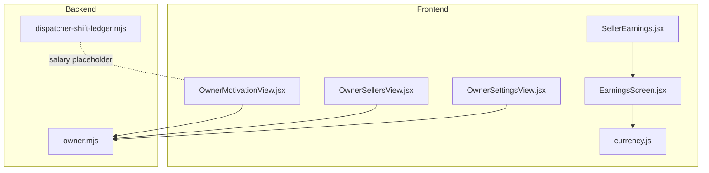
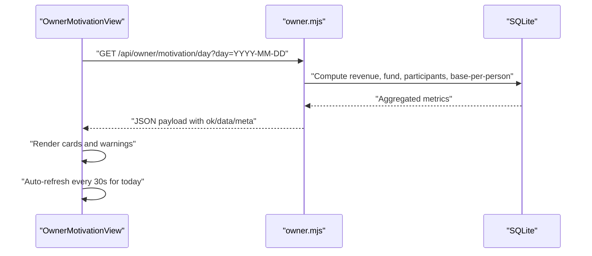
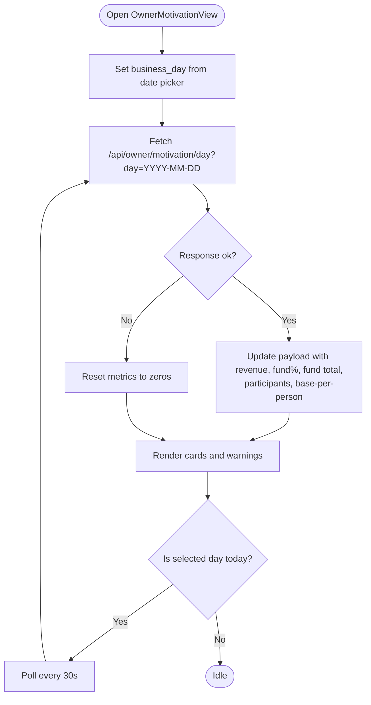
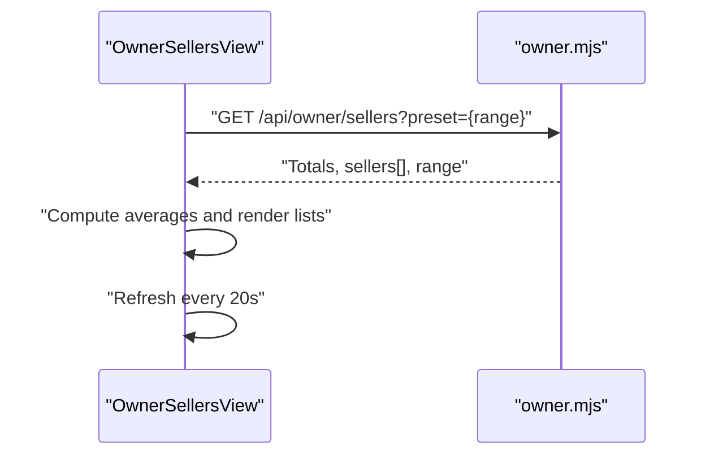
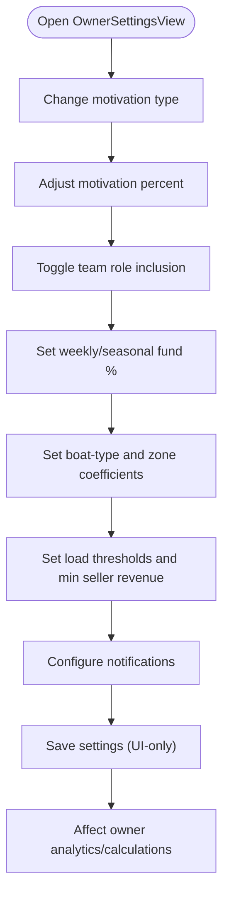
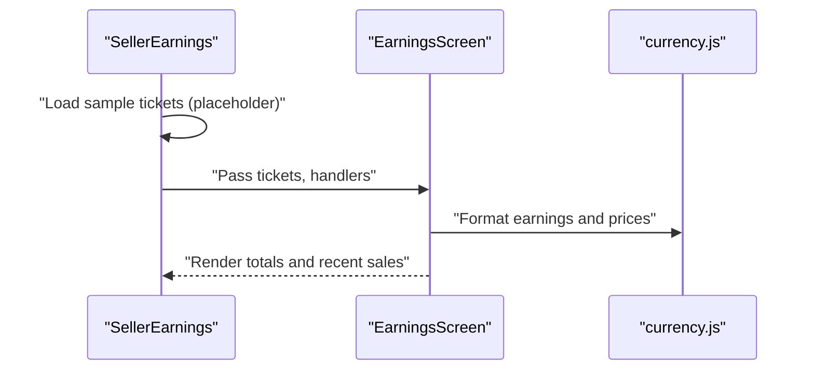
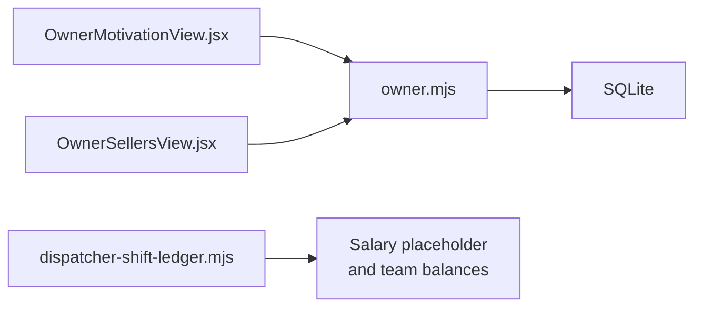
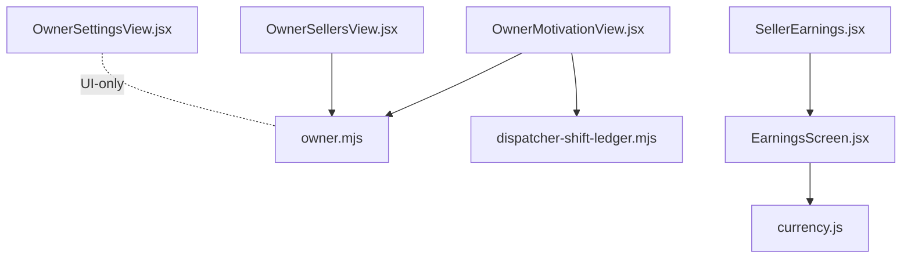

# Motivation & Rewards

<cite>
**Referenced Files in This Document**
- [OwnerMotivationView.jsx](file://src/views/OwnerMotivationView.jsx)
- [OwnerSellersView.jsx](file://src/views/OwnerSellersView.jsx)
- [OwnerSettingsView.jsx](file://src/views/OwnerSettingsView.jsx)
- [SellerEarnings.jsx](file://src/views/SellerEarnings.jsx)
- [EarningsScreen.jsx](file://src/components/seller/EarningsScreen.jsx)
- [owner.mjs](file://server/owner.mjs)
- [dispatcher-shift-ledger.mjs](file://server/dispatcher-shift-ledger.mjs)
- [currency.js](file://src/utils/currency.js)
</cite>

## Table of Contents
1. [Introduction](#introduction)
2. [Project Structure](#project-structure)
3. [Core Components](#core-components)
4. [Architecture Overview](#architecture-overview)
5. [Detailed Component Analysis](#detailed-component-analysis)
6. [Dependency Analysis](#dependency-analysis)
7. [Performance Considerations](#performance-considerations)
8. [Troubleshooting Guide](#troubleshooting-guide)
9. [Conclusion](#conclusion)
10. [Appendices](#appendices)

## Introduction
This document explains the motivation and rewards system designed to enhance seller performance and engagement. It covers reward structures, performance-based incentives, recognition programs, gamification elements, achievement tracking, progress monitoring, integration with performance metrics, and automated reward calculation. It also provides practical guidance on designing effective motivation strategies, setting performance targets, maintaining team morale, and customizing reward programs to drive positive business outcomes.

## Project Structure
The motivation and rewards system spans front-end React views and server-side APIs:
- Front-end:
  - OwnerMotivationView displays daily motivation metrics and live updates for the current day.
  - OwnerSellersView shows aggregated seller performance and team analytics.
  - OwnerSettingsView configures motivation parameters and thresholds.
  - SellerEarnings and EarningsScreen present individual seller earnings and recent sales.
- Back-end:
  - owner.mjs exposes owner analytics endpoints used by the motivation dashboard.
  - dispatcher-shift-ledger.mjs includes placeholders for salary and motivation calculations.
- Shared utilities:
  - currency.js provides consistent RUB formatting across the UI.

**Diagram sources**
- [OwnerMotivationView.jsx](file://src/views/OwnerMotivationView.jsx#L1-L151)
- [OwnerSellersView.jsx](file://src/views/OwnerSellersView.jsx#L1-L222)
- [OwnerSettingsView.jsx](file://src/views/OwnerSettingsView.jsx#L1-L506)
- [SellerEarnings.jsx](file://src/views/SellerEarnings.jsx#L1-L91)
- [EarningsScreen.jsx](file://src/components/seller/EarningsScreen.jsx#L1-L68)
- [owner.mjs](file://server/owner.mjs#L1-L456)
- [dispatcher-shift-ledger.mjs](file://server/dispatcher-shift-ledger.mjs#L263-L303)
- [currency.js](file://src/utils/currency.js#L1-L15)

**Section sources**
- [OwnerMotivationView.jsx](file://src/views/OwnerMotivationView.jsx#L1-L151)
- [OwnerSellersView.jsx](file://src/views/OwnerSellersView.jsx#L1-L222)
- [OwnerSettingsView.jsx](file://src/views/OwnerSettingsView.jsx#L1-L506)
- [SellerEarnings.jsx](file://src/views/SellerEarnings.jsx#L1-L91)
- [EarningsScreen.jsx](file://src/components/seller/EarningsScreen.jsx#L1-L68)
- [owner.mjs](file://server/owner.mjs#L1-L456)
- [dispatcher-shift-ledger.mjs](file://server/dispatcher-shift-ledger.mjs#L263-L303)
- [currency.js](file://src/utils/currency.js#L1-L15)

## Core Components
- OwnerMotivationView: Live dashboard for daily motivation metrics with auto-refresh for today, allowing owners to inspect revenue, fund percentage, total fund, participants, and base-per-person amounts.
- OwnerSellersView: Team performance overview aggregating revenue, average revenue per seller, active sellers, and per-seller stats with expandable details.
- OwnerSettingsView: Configuration hub for motivation types (team/personal/adaptive), motivation percentage, inclusion of roles in team motivation, weekly/seasonal fund allocations, boat-type and zone coefficients, thresholds, and notifications.
- SellerEarnings and EarningsScreen: Individual seller earnings screen summarizing total tickets sold, total earnings, and recent sales history.
- owner.mjs: Backend analytics endpoints feeding the motivation and sellers dashboards.
- dispatcher-shift-ledger.mjs: Placeholder for salary computation and future motivation engine integration.
- currency.js: Utility for consistent Russian Ruble formatting.

**Section sources**
- [OwnerMotivationView.jsx](file://src/views/OwnerMotivationView.jsx#L47-L139)
- [OwnerSellersView.jsx](file://src/views/OwnerSellersView.jsx#L48-L177)
- [OwnerSettingsView.jsx](file://src/views/OwnerSettingsView.jsx#L254-L314)
- [SellerEarnings.jsx](file://src/views/SellerEarnings.jsx#L7-L89)
- [EarningsScreen.jsx](file://src/components/seller/EarningsScreen.jsx#L3-L67)
- [owner.mjs](file://server/owner.mjs#L96-L168)
- [dispatcher-shift-ledger.mjs](file://server/dispatcher-shift-ledger.mjs#L263-L303)
- [currency.js](file://src/utils/currency.js#L6-L15)

## Architecture Overview
The motivation system integrates front-end dashboards with backend analytics via REST endpoints. OwnerMotivationView polls the owner motivation endpoint for the selected day, auto-refreshing every 30 seconds when viewing today. OwnerSellersView periodically refreshes seller performance metrics. OwnerSettingsView stores configuration that influences how motivation and thresholds are computed. Currency formatting ensures consistent financial display.

**Diagram sources**
- [OwnerMotivationView.jsx](file://src/views/OwnerMotivationView.jsx#L62-L95)
- [owner.mjs](file://server/owner.mjs#L96-L168)

## Detailed Component Analysis

### OwnerMotivationView: Daily Motivation Dashboard
- Purpose: Display daily motivation metrics and enable live monitoring for today.
- Key behaviors:
  - Date selection with local business day defaults.
  - Auto-refresh polling every 30 seconds when viewing today.
  - Renders revenue, fund percentage, fund total, participants, and base-per-person.
  - Displays warnings returned by the backend.
- Integration points:
  - Fetches from owner.mjs motivation endpoint.
  - Uses shared currency formatting.

**Diagram sources**
- [OwnerMotivationView.jsx](file://src/views/OwnerMotivationView.jsx#L47-L95)

**Section sources**
- [OwnerMotivationView.jsx](file://src/views/OwnerMotivationView.jsx#L47-L139)
- [owner.mjs](file://server/owner.mjs#L96-L168)

### OwnerSellersView: Team Performance Analytics
- Purpose: Provide aggregated team performance and per-seller visibility.
- Key behaviors:
  - Preset-based ranges (today, yesterday, 7 days, month).
  - Auto-refresh every 20 seconds.
  - Computes totals, average revenue per seller, and per-seller details.
  - Displays warnings and loading states.
- Integration points:
  - Uses owner.mjs endpoints for aggregated seller data.

**Diagram sources**
- [OwnerSellersView.jsx](file://src/views/OwnerSellersView.jsx#L48-L83)
- [owner.mjs](file://server/owner.mjs#L96-L168)

**Section sources**
- [OwnerSellersView.jsx](file://src/views/OwnerSellersView.jsx#L48-L177)
- [owner.mjs](file://server/owner.mjs#L96-L168)

### OwnerSettingsView: Motivation Configuration
- Purpose: Configure motivation program parameters and thresholds.
- Key configuration areas:
  - Motivation type: team, personal, adaptive.
  - Motivation percentage.
  - Team participation: include sellers and dispatchers.
  - Fund allocations: weekly and seasonal percentages.
  - Coefficients: by boat type and zone.
  - Thresholds: low/high load, minimum seller revenue.
  - Notifications: triggers and channel.
- Impact: These settings influence how motivation metrics are computed and presented in dashboards.

**Diagram sources**
- [OwnerSettingsView.jsx](file://src/views/OwnerSettingsView.jsx#L254-L314)
- [OwnerSettingsView.jsx](file://src/views/OwnerSettingsView.jsx#L316-L334)
- [OwnerSettingsView.jsx](file://src/views/OwnerSettingsView.jsx#L336-L361)

**Section sources**
- [OwnerSettingsView.jsx](file://src/views/OwnerSettingsView.jsx#L254-L314)
- [OwnerSettingsView.jsx](file://src/views/OwnerSettingsView.jsx#L316-L334)
- [OwnerSettingsView.jsx](file://src/views/OwnerSettingsView.jsx#L336-L361)

### SellerEarnings and EarningsScreen: Individual Performance Tracking
- Purpose: Allow sellers to review their daily sales and earnings.
- Key behaviors:
  - Calculates total earnings from prepayment or total price.
  - Lists recent sales with timestamps and boat names.
  - Provides navigation to new sale and back actions.
- Integration points:
  - Uses currency formatting utility for consistent display.

**Diagram sources**
- [SellerEarnings.jsx](file://src/views/SellerEarnings.jsx#L7-L89)
- [EarningsScreen.jsx](file://src/components/seller/EarningsScreen.jsx#L3-L67)
- [currency.js](file://src/utils/currency.js#L6-L15)

**Section sources**
- [SellerEarnings.jsx](file://src/views/SellerEarnings.jsx#L7-L89)
- [EarningsScreen.jsx](file://src/components/seller/EarningsScreen.jsx#L3-L67)
- [currency.js](file://src/utils/currency.js#L6-L15)

### Backend Integration: owner.mjs and dispatcher-shift-ledger.mjs
- owner.mjs:
  - Provides analytics endpoints used by OwnerMotivationView and OwnerSellersView.
  - Implements safe SQL queries with schema-aware column detection and date-range handling.
- dispatcher-shift-ledger.mjs:
  - Includes a salary placeholder and team ledger structure suitable for future motivation engine integration.

**Diagram sources**
- [owner.mjs](file://server/owner.mjs#L96-L168)
- [dispatcher-shift-ledger.mjs](file://server/dispatcher-shift-ledger.mjs#L263-L303)

**Section sources**
- [owner.mjs](file://server/owner.mjs#L96-L168)
- [dispatcher-shift-ledger.mjs](file://server/dispatcher-shift-ledger.mjs#L263-L303)

## Dependency Analysis
- Front-end dashboards depend on owner.mjs for analytics data.
- OwnerMotivationView additionally depends on dispatcher-shift-ledger.mjs for salary placeholders and team balances.
- Currency formatting is centralized in currency.js and reused across components.
- OwnerSettingsView is UI-only in this snapshot; it does not call backend endpoints in the shown code.

**Diagram sources**
- [OwnerMotivationView.jsx](file://src/views/OwnerMotivationView.jsx#L1-L151)
- [OwnerSellersView.jsx](file://src/views/OwnerSellersView.jsx#L1-L222)
- [OwnerSettingsView.jsx](file://src/views/OwnerSettingsView.jsx#L1-L506)
- [SellerEarnings.jsx](file://src/views/SellerEarnings.jsx#L1-L91)
- [EarningsScreen.jsx](file://src/components/seller/EarningsScreen.jsx#L1-L68)
- [owner.mjs](file://server/owner.mjs#L1-L456)
- [dispatcher-shift-ledger.mjs](file://server/dispatcher-shift-ledger.mjs#L263-L303)
- [currency.js](file://src/utils/currency.js#L1-L15)

**Section sources**
- [OwnerMotivationView.jsx](file://src/views/OwnerMotivationView.jsx#L1-L151)
- [OwnerSellersView.jsx](file://src/views/OwnerSellersView.jsx#L1-L222)
- [OwnerSettingsView.jsx](file://src/views/OwnerSettingsView.jsx#L1-L506)
- [SellerEarnings.jsx](file://src/views/SellerEarnings.jsx#L1-L91)
- [EarningsScreen.jsx](file://src/components/seller/EarningsScreen.jsx#L1-L68)
- [owner.mjs](file://server/owner.mjs#L1-L456)
- [dispatcher-shift-ledger.mjs](file://server/dispatcher-shift-ledger.mjs#L263-L303)
- [currency.js](file://src/utils/currency.js#L1-L15)

## Performance Considerations
- Auto-refresh cadence:
  - OwnerMotivationView refreshes every 30 seconds for today to reflect live changes.
  - OwnerSellersView refreshes every 20 seconds for near-real-time team metrics.
- Backend efficiency:
  - owner.mjs uses schema-aware column detection and date-range expressions to minimize errors and optimize queries.
- UI responsiveness:
  - Currency formatting is centralized to reduce repeated computations and ensure consistent display.
- Scalability:
  - Current dashboards aggregate data per day and per seller; further automation can introduce cohort-based comparisons and adaptive thresholds without changing the UI structure.

[No sources needed since this section provides general guidance]

## Troubleshooting Guide
- Empty or stale data:
  - OwnerMotivationView and OwnerSellersView show warnings returned by the backend; check network connectivity and endpoint availability.
- Auto-refresh not updating:
  - Verify the selected day is “today” for 30-second polling in OwnerMotivationView.
- Currency formatting anomalies:
  - Ensure numeric values are passed to the currency formatter; fallbacks are included in the utility.
- Backend errors:
  - owner.mjs wraps endpoints with try/catch and returns structured error responses; inspect meta.warnings and response codes.

**Section sources**
- [OwnerMotivationView.jsx](file://src/views/OwnerMotivationView.jsx#L115-L124)
- [OwnerSellersView.jsx](file://src/views/OwnerSellersView.jsx#L110-L119)
- [owner.mjs](file://server/owner.mjs#L165-L167)
- [currency.js](file://src/utils/currency.js#L6-L15)

## Conclusion
The motivation and rewards system combines configurable settings, team and individual dashboards, and backend analytics to drive performance and engagement. Owners can tailor motivation types, participation, and fund allocations while sellers gain visibility into their earnings. The architecture supports live updates, consistent formatting, and scalable enhancements such as adaptive thresholds and automated reward calculations.

[No sources needed since this section summarizes without analyzing specific files]

## Appendices

### Reward Structures and Incentives
- Team-based motivation:
  - Distribute a daily fund proportionally among participants based on configured percent and participant count.
- Personal-based motivation:
  - Compute individual payouts using per-ticket or per-revenue coefficients adjusted by boat-type and zone multipliers.
- Adaptive motivation:
  - Dynamically adjust thresholds and coefficients based on seasonality and historical baselines.

### Performance Targets and Thresholds
- Define baseline targets (bad/normal/good day) and compare today against a moving window (e.g., 7/14/30 days).
- Use per-seller minimum revenue thresholds to trigger alerts and recognition.

### Recognition and Gamification
- Public leaderboards and badges for top performers.
- Milestone celebrations (e.g., consecutive good days, reaching personal targets).
- Social recognition toggles in settings to notify owners when thresholds are met.

### Customization and Business Outcomes
- Adjust motivation percent and fund allocations to align with budget goals.
- Tune coefficients by boat type and zone to reflect operational differences.
- Enable notifications to maintain awareness and timely interventions.

[No sources needed since this section provides general guidance]