# Owner Portal

<cite>
**Referenced Files in This Document**
- [OwnerView.jsx](file://src/views/OwnerView.jsx)
- [OwnerMoneyView.jsx](file://src/views/OwnerMoneyView.jsx)
- [OwnerBoatsView.jsx](file://src/views/OwnerBoatsView.jsx)
- [OwnerSellersView.jsx](file://src/views/OwnerSellersView.jsx)
- [OwnerMotivationView.jsx](file://src/views/OwnerMotivationView.jsx)
- [OwnerSettingsView.jsx](file://src/views/OwnerSettingsView.jsx)
- [OwnerExportView.jsx](file://src/views/OwnerExportView.jsx)
- [OwnerLoadView.jsx](file://src/components/owner/OwnerLoadView.jsx)
- [OwnerDataContext.jsx](file://src/contexts/OwnerDataContext.jsx)
- [owner.mjs](file://server/owner.mjs)
- [index.js](file://server/index.js)
- [apiClient.js](file://src/utils/apiClient.js)
</cite>

## Table of Contents
1. [Introduction](#introduction)
2. [Project Structure](#project-structure)
3. [Core Components](#core-components)
4. [Architecture Overview](#architecture-overview)
5. [Detailed Component Analysis](#detailed-component-analysis)
6. [Dependency Analysis](#dependency-analysis)
7. [Performance Considerations](#performance-considerations)
8. [Troubleshooting Guide](#troubleshooting-guide)
9. [Conclusion](#conclusion)
10. [Appendices](#appendices)

## Introduction
The Owner Portal provides business analytics and reporting for a boat tour ticketing system. It enables owners to monitor financial performance, track fleet utilization, evaluate seller performance, configure business settings, and export operational reports. The portal integrates real-time data from the backend with offline manual data entry, ensuring robust analytics even when connectivity is limited. It also supports export to CSV/XLS formats and notification configuration for proactive business oversight.

## Project Structure
The Owner Portal is organized around a central shell with multiple analytical and administrative views:
- Shell navigation and routing: [OwnerView.jsx](file://src/views/OwnerView.jsx)
- Financial dashboard and analytics: [OwnerMoneyView.jsx](file://src/views/OwnerMoneyView.jsx)
- Fleet and asset tracking: [OwnerBoatsView.jsx](file://src/views/OwnerBoatsView.jsx)
- Seller performance monitoring: [OwnerSellersView.jsx](file://src/views/OwnerSellersView.jsx)
- Motivational fund calculation: [OwnerMotivationView.jsx](file://src/views/OwnerMotivationView.jsx)
- Settings management: [OwnerSettingsView.jsx](file://src/views/OwnerSettingsView.jsx)
- Export capabilities: [OwnerExportView.jsx](file://src/views/OwnerExportView.jsx)
- Offline manual data entry: [OwnerLoadView.jsx](file://src/components/owner/OwnerLoadView.jsx)
- Shared owner data context: [OwnerDataContext.jsx](file://src/contexts/OwnerDataContext.jsx)
- Backend owner APIs: [owner.mjs](file://server/owner.mjs)
- API client: [apiClient.js](file://src/utils/apiClient.js)
- Server mounting: [index.js](file://server/index.js)

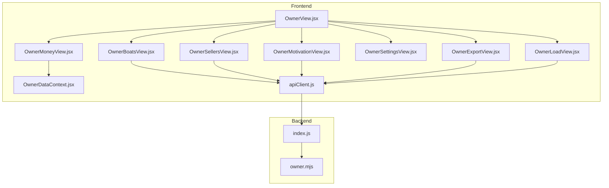

**Diagram sources**
- [OwnerView.jsx](file://src/views/OwnerView.jsx#L164-L194)
- [OwnerMoneyView.jsx](file://src/views/OwnerMoneyView.jsx#L54-L132)
- [OwnerBoatsView.jsx](file://src/views/OwnerBoatsView.jsx#L48-L91)
- [OwnerSellersView.jsx](file://src/views/OwnerSellersView.jsx#L48-L83)
- [OwnerMotivationView.jsx](file://src/views/OwnerMotivationView.jsx#L47-L95)
- [OwnerSettingsView.jsx](file://src/views/OwnerSettingsView.jsx#L17-L164)
- [OwnerExportView.jsx](file://src/views/OwnerExportView.jsx#L92-L165)
- [OwnerLoadView.jsx](file://src/components/owner/OwnerLoadView.jsx#L42-L144)
- [OwnerDataContext.jsx](file://src/contexts/OwnerDataContext.jsx#L21-L127)
- [apiClient.js](file://src/utils/apiClient.js#L23-L88)
- [index.js](file://server/index.js#L40-L40)
- [owner.mjs](file://server/owner.mjs#L118-L512)

**Section sources**
- [OwnerView.jsx](file://src/views/OwnerView.jsx#L164-L194)
- [OwnerMoneyView.jsx](file://src/views/OwnerMoneyView.jsx#L54-L132)
- [OwnerBoatsView.jsx](file://src/views/OwnerBoatsView.jsx#L48-L91)
- [OwnerSellersView.jsx](file://src/views/OwnerSellersView.jsx#L48-L83)
- [OwnerMotivationView.jsx](file://src/views/OwnerMotivationView.jsx#L47-L95)
- [OwnerSettingsView.jsx](file://src/views/OwnerSettingsView.jsx#L17-L164)
- [OwnerExportView.jsx](file://src/views/OwnerExportView.jsx#L92-L165)
- [OwnerLoadView.jsx](file://src/components/owner/OwnerLoadView.jsx#L42-L144)
- [OwnerDataContext.jsx](file://src/contexts/OwnerDataContext.jsx#L21-L127)
- [apiClient.js](file://src/utils/apiClient.js#L23-L88)
- [index.js](file://server/index.js#L40-L40)
- [owner.mjs](file://server/owner.mjs#L118-L512)

## Core Components
- OwnerShell: Central navigation and tabbed interface for switching between analytics and administrative views.
- Money Dashboard: Real-time financial KPIs, revenue by day comparison, and pending collections.
- Fleet Analytics: Revenue, tickets, trips, and load percentage per boat and grouped by boat type.
- Seller Performance: Revenue, ticket counts, and per-seller statistics with averages.
- Motivation Fund: Daily revenue-based fund calculation with configurable participation and distribution.
- Settings Management: Business configuration, thresholds, motivational parameters, and notifications.
- Export Engine: CSV/XLS generation from money and fleet datasets with preset-aware mapping.
- Manual Data Loader: Offline data entry with validation, locking, and “manual override” precedence.
- Owner Data Context: Centralized pending data fetching and refresh orchestration.

**Section sources**
- [OwnerView.jsx](file://src/views/OwnerView.jsx#L164-L194)
- [OwnerMoneyView.jsx](file://src/views/OwnerMoneyView.jsx#L54-L132)
- [OwnerBoatsView.jsx](file://src/views/OwnerBoatsView.jsx#L48-L91)
- [OwnerSellersView.jsx](file://src/views/OwnerSellersView.jsx#L48-L83)
- [OwnerMotivationView.jsx](file://src/views/OwnerMotivationView.jsx#L47-L95)
- [OwnerSettingsView.jsx](file://src/views/OwnerSettingsView.jsx#L17-L164)
- [OwnerExportView.jsx](file://src/views/OwnerExportView.jsx#L92-L165)
- [OwnerLoadView.jsx](file://src/components/owner/OwnerLoadView.jsx#L42-L144)
- [OwnerDataContext.jsx](file://src/contexts/OwnerDataContext.jsx#L21-L127)

## Architecture Overview
The Owner Portal follows a React-based frontend with a shared API client and a dedicated owner backend router. Data flows from SQLite-backed queries to the UI via REST endpoints, with caching and polling strategies optimized for owner decision-making.

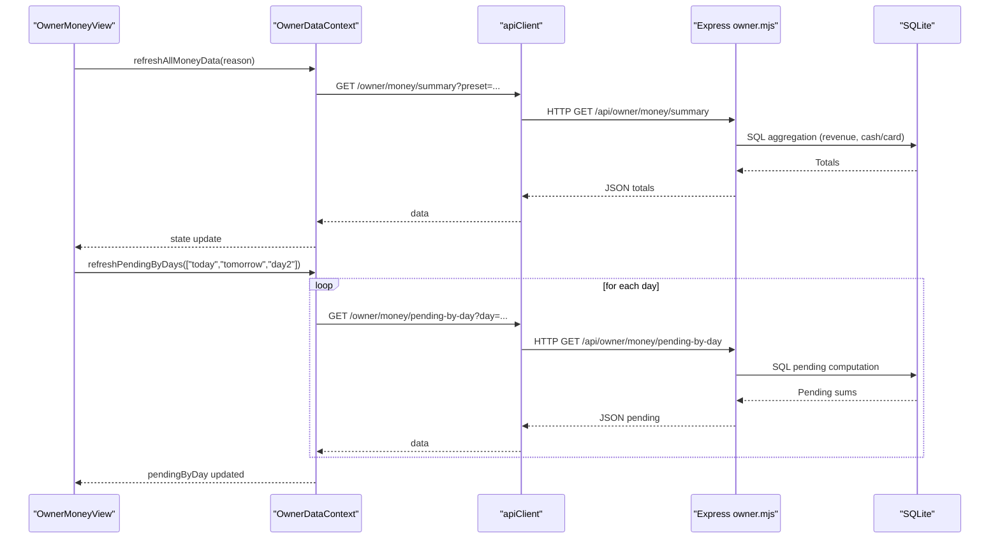

**Diagram sources**
- [OwnerMoneyView.jsx](file://src/views/OwnerMoneyView.jsx#L99-L146)
- [OwnerDataContext.jsx](file://src/contexts/OwnerDataContext.jsx#L52-L112)
- [owner.mjs](file://server/owner.mjs#L118-L187)
- [owner.mjs](file://server/owner.mjs#L193-L248)

**Section sources**
- [OwnerMoneyView.jsx](file://src/views/OwnerMoneyView.jsx#L99-L146)
- [OwnerDataContext.jsx](file://src/contexts/OwnerDataContext.jsx#L52-L112)
- [owner.mjs](file://server/owner.mjs#L118-L187)
- [owner.mjs](file://server/owner.mjs#L193-L248)

## Detailed Component Analysis

### Revenue Analytics Dashboard
The dashboard presents:
- Totals: revenue, average check, cash/card split, and pending collections.
- Fleet KPIs: tickets, trips, and load percentage.
- Weekly revenue bars normalized to the highest day.
- Pending collections grouped by trip day for today/tomorrow/day2.
- Manual override indicator and warnings propagation.

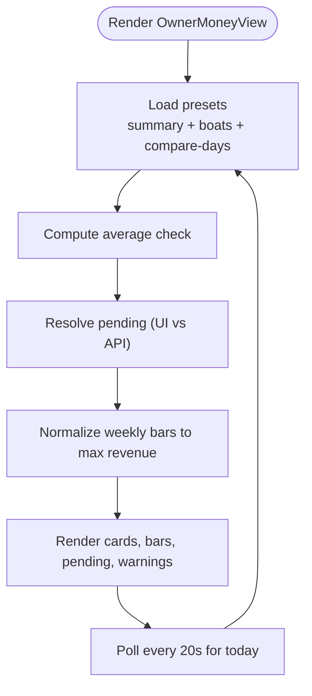

**Diagram sources**
- [OwnerMoneyView.jsx](file://src/views/OwnerMoneyView.jsx#L99-L132)
- [OwnerMoneyView.jsx](file://src/views/OwnerMoneyView.jsx#L246-L255)
- [OwnerMoneyView.jsx](file://src/views/OwnerMoneyView.jsx#L234-L239)

**Section sources**
- [OwnerMoneyView.jsx](file://src/views/OwnerMoneyView.jsx#L54-L132)
- [OwnerMoneyView.jsx](file://src/views/OwnerMoneyView.jsx#L234-L239)
- [OwnerMoneyView.jsx](file://src/views/OwnerMoneyView.jsx#L246-L255)

### Seller Performance Monitoring
Key features:
- Aggregated revenue and tickets per seller.
- Average revenue per seller.
- Preset-driven time windows (today/yesterday/7 days/month).
- Auto-refresh every 20 seconds.

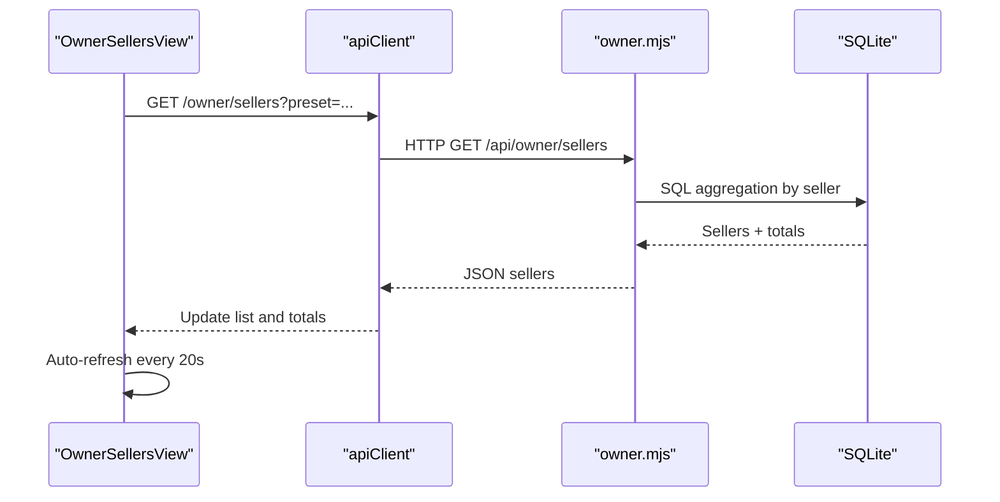

**Diagram sources**
- [OwnerSellersView.jsx](file://src/views/OwnerSellersView.jsx#L48-L83)
- [owner.mjs](file://server/owner.mjs#L293-L414)

**Section sources**
- [OwnerSellersView.jsx](file://src/views/OwnerSellersView.jsx#L48-L83)
- [owner.mjs](file://server/owner.mjs#L293-L414)

### Fleet and Asset Tracking
Capabilities:
- Revenue, tickets, trips, and load percentage aggregated by boat.
- Grouping by boat type with totals per group.
- Preset-aware ranges (today/yesterday/7 days/month/all).
- Best-effort load percentage estimation using generated slots.

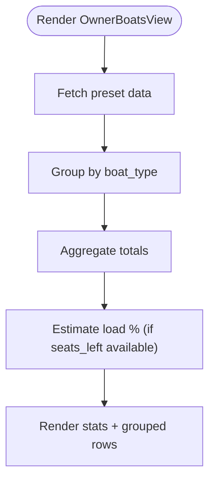

**Diagram sources**
- [OwnerBoatsView.jsx](file://src/views/OwnerBoatsView.jsx#L48-L91)
- [OwnerBoatsView.jsx](file://src/views/OwnerBoatsView.jsx#L93-L113)
- [owner.mjs](file://server/owner.mjs#L293-L414)

**Section sources**
- [OwnerBoatsView.jsx](file://src/views/OwnerBoatsView.jsx#L48-L91)
- [OwnerBoatsView.jsx](file://src/views/OwnerBoatsView.jsx#L93-L113)
- [owner.mjs](file://server/owner.mjs#L293-L414)

### Motivational Fund Calculation
- Daily revenue-based fund computation.
- Configurable fund percent and participant count.
- Auto-refresh for today every 30 seconds.

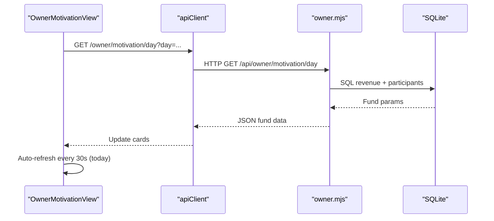

**Diagram sources**
- [OwnerMotivationView.jsx](file://src/views/OwnerMotivationView.jsx#L47-L95)
- [owner.mjs](file://server/owner.mjs#L420-L512)

**Section sources**
- [OwnerMotivationView.jsx](file://src/views/OwnerMotivationView.jsx#L47-L95)
- [owner.mjs](file://server/owner.mjs#L420-L512)

### Settings Management
Owner-configurable parameters affecting analytics and motivation:
- Business: name, timezone, currency, season dates.
- Analytics: revenue thresholds and base comparison period.
- Motivation: type, percent, inclusion of roles, fund allocations, coefficients by boat type and zone.
- Triggers: load thresholds and minimum seller revenue.
- Notifications: channels and conditions.

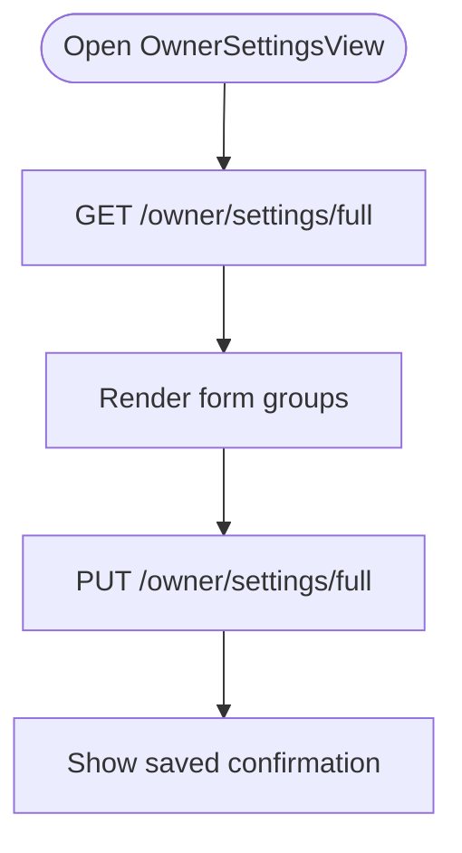

**Diagram sources**
- [OwnerSettingsView.jsx](file://src/views/OwnerSettingsView.jsx#L64-L159)
- [OwnerSettingsView.jsx](file://src/views/OwnerSettingsView.jsx#L166-L368)

**Section sources**
- [OwnerSettingsView.jsx](file://src/views/OwnerSettingsView.jsx#L64-L159)
- [OwnerSettingsView.jsx](file://src/views/OwnerSettingsView.jsx#L166-L368)

### Export Capabilities
Exports supported:
- Money dataset: revenue, cash/card, average check, tickets, trips, load, manual override flag.
- Fleet dataset: per-boat breakdown with share percentage.
- Formats: CSV and XLS (HTML table).
- Presets mapped to backend presets for consistency.

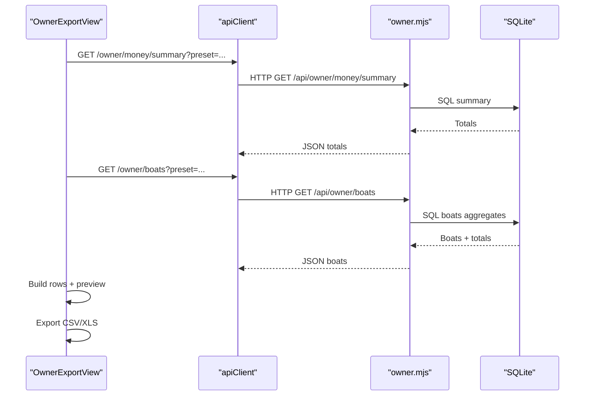

**Diagram sources**
- [OwnerExportView.jsx](file://src/views/OwnerExportView.jsx#L101-L165)
- [owner.mjs](file://server/owner.mjs#L118-L187)
- [owner.mjs](file://server/owner.mjs#L293-L414)

**Section sources**
- [OwnerExportView.jsx](file://src/views/OwnerExportView.jsx#L92-L165)
- [owner.mjs](file://server/owner.mjs#L118-L187)
- [owner.mjs](file://server/owner.mjs#L293-L414)

### Offline Manual Data Entry
Allows entering revenue and aggregates for offline periods:
- Draft saving and locking.
- Validation: totals consistency checks.
- “Manual override” precedence over online data.
- Prevents further edits after lock.

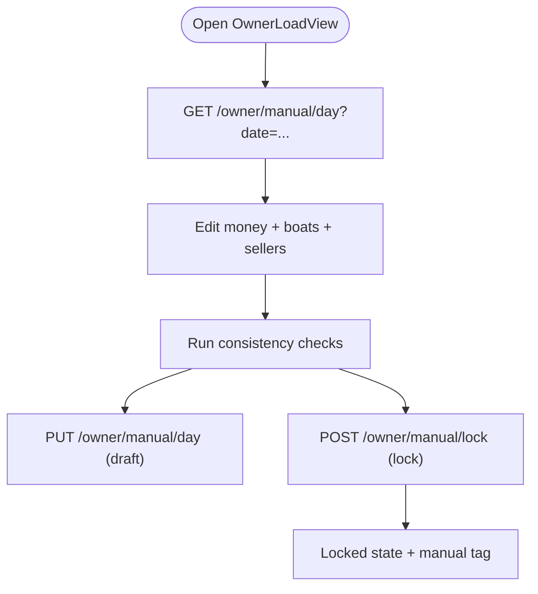

**Diagram sources**
- [OwnerLoadView.jsx](file://src/components/owner/OwnerLoadView.jsx#L90-L144)
- [OwnerLoadView.jsx](file://src/components/owner/OwnerLoadView.jsx#L146-L211)

**Section sources**
- [OwnerLoadView.jsx](file://src/components/owner/OwnerLoadView.jsx#L90-L144)
- [OwnerLoadView.jsx](file://src/components/owner/OwnerLoadView.jsx#L146-L211)

### Owner Data Context and Pending Orchestration
Centralizes pending data fetching and refresh callbacks:
- Parallel fetches per day with stale checks.
- Optional refresh callback registration for broader dashboard refresh.
- Combined refresh for all money data.

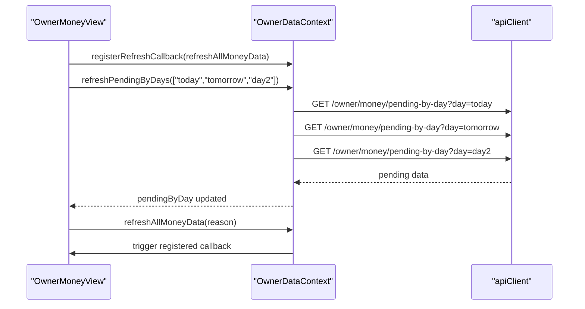

**Diagram sources**
- [OwnerMoneyView.jsx](file://src/views/OwnerMoneyView.jsx#L187-L194)
- [OwnerDataContext.jsx](file://src/contexts/OwnerDataContext.jsx#L52-L112)

**Section sources**
- [OwnerMoneyView.jsx](file://src/views/OwnerMoneyView.jsx#L187-L194)
- [OwnerDataContext.jsx](file://src/contexts/OwnerDataContext.jsx#L52-L112)

## Dependency Analysis
- Frontend-to-backend:
  - OwnerMoneyView depends on OwnerDataContext for pending data and refresh orchestration.
  - OwnerBoatsView, OwnerSellersView, and OwnerMotivationView use apiClient to call owner endpoints.
  - OwnerExportView composes datasets from money and boats endpoints.
  - OwnerLoadView uses apiClient for manual data endpoints.
- Backend:
  - owner.mjs exposes endpoints for money, boats, pending, and motivation.
  - index.js mounts owner router under /api/owner with authentication middleware.

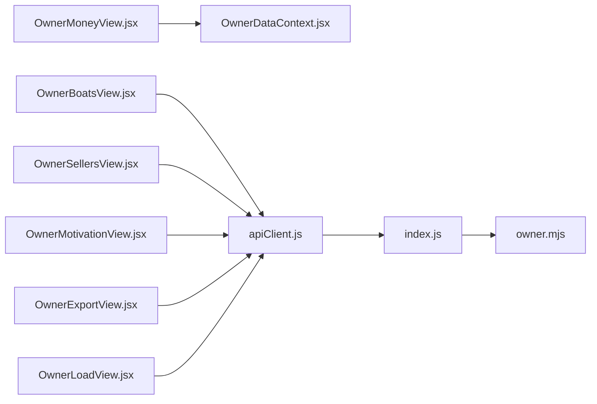

**Diagram sources**
- [OwnerMoneyView.jsx](file://src/views/OwnerMoneyView.jsx#L56-L132)
- [OwnerBoatsView.jsx](file://src/views/OwnerBoatsView.jsx#L34-L83)
- [OwnerSellersView.jsx](file://src/views/OwnerSellersView.jsx#L34-L83)
- [OwnerMotivationView.jsx](file://src/views/OwnerMotivationView.jsx#L25-L95)
- [OwnerExportView.jsx](file://src/views/OwnerExportView.jsx#L62-L165)
- [OwnerLoadView.jsx](file://src/components/owner/OwnerLoadView.jsx#L90-L211)
- [OwnerDataContext.jsx](file://src/contexts/OwnerDataContext.jsx#L21-L127)
- [apiClient.js](file://src/utils/apiClient.js#L23-L88)
- [index.js](file://server/index.js#L40-L40)
- [owner.mjs](file://server/owner.mjs#L118-L512)

**Section sources**
- [OwnerMoneyView.jsx](file://src/views/OwnerMoneyView.jsx#L56-L132)
- [OwnerBoatsView.jsx](file://src/views/OwnerBoatsView.jsx#L34-L83)
- [OwnerSellersView.jsx](file://src/views/OwnerSellersView.jsx#L34-L83)
- [OwnerMotivationView.jsx](file://src/views/OwnerMotivationView.jsx#L25-L95)
- [OwnerExportView.jsx](file://src/views/OwnerExportView.jsx#L62-L165)
- [OwnerLoadView.jsx](file://src/components/owner/OwnerLoadView.jsx#L90-L211)
- [OwnerDataContext.jsx](file://src/contexts/OwnerDataContext.jsx#L21-L127)
- [apiClient.js](file://src/utils/apiClient.js#L23-L88)
- [index.js](file://server/index.js#L40-L40)
- [owner.mjs](file://server/owner.mjs#L118-L512)

## Performance Considerations
- Polling: OwnerMoneyView polls summary and pending data every 20 seconds for today to reflect real-time changes without manual refresh.
- Parallelization: OwnerExportView loads money and boats datasets concurrently for faster preview rendering.
- Normalization: Revenue bars are normalized to the maximum day’s revenue for fair visual comparison.
- Estimation: Load percentage uses best-effort heuristics based on available seat data to avoid heavy joins.
- Offline-first: Manual data entry avoids network dependency and locks after validation to prevent conflicts.

[No sources needed since this section provides general guidance]

## Troubleshooting Guide
Common issues and resolutions:
- Missing or inconsistent data:
  - Check warnings returned by endpoints; manual override warnings indicate offline data precedence.
  - Verify preset selection aligns with available ranges (e.g., last_nonzero_day).
- Export errors:
  - Ensure datasets loaded successfully before exporting; errors display actionable messages.
- Pending discrepancies:
  - Pending is computed as revenue minus posted cash/card; mismatches often indicate unposted transactions.
- Settings persistence:
  - On save, a success message appears; verify network logs if updates do not persist.

**Section sources**
- [OwnerMoneyView.jsx](file://src/views/OwnerMoneyView.jsx#L218-L225)
- [OwnerExportView.jsx](file://src/views/OwnerExportView.jsx#L159-L165)
- [OwnerLoadView.jsx](file://src/components/owner/OwnerLoadView.jsx#L139-L144)

## Conclusion
The Owner Portal delivers a comprehensive analytics and reporting suite tailored for daily business oversight. It combines real-time financial dashboards, fleet and seller monitoring, configurable settings, and export capabilities, while supporting offline data entry with clear precedence rules. The modular architecture ensures maintainability and scalability for future enhancements such as advanced export formats, deeper accounting integrations, and dynamic alerting.

[No sources needed since this section summarizes without analyzing specific files]

## Appendices

### Backend API Reference (Owner)
- Money summary: GET /api/owner/money/summary?preset={today|yesterday|7d|30d|90d|last_nonzero_day}
- Compare days: GET /api/owner/money/compare-days?preset={7d|30d|90d}
- Pending by day: GET /api/owner/money/pending-by-day?day={today|tomorrow|day2}
- Boats: GET /api/owner/boats?preset={today|yesterday|d7|month|all}
- Motivation day: GET /api/owner/motivation/day?day=YYYY-MM-DD
- Manual day: GET /api/owner/manual/day?date=YYYY-MM-DD
- Manual save draft: PUT /api/owner/manual/day
- Manual lock: POST /api/owner/manual/lock

**Section sources**
- [owner.mjs](file://server/owner.mjs#L118-L512)
- [OwnerLoadView.jsx](file://src/components/owner/OwnerLoadView.jsx#L90-L211)