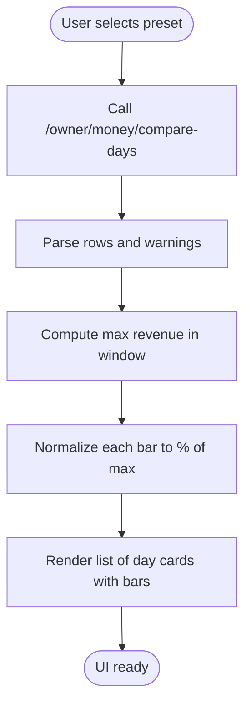

# Period Comparison View

<cite>
**Referenced Files in This Document**
- [OwnerView.jsx](file://src/views/OwnerView.jsx)
- [OwnerMoneyView.jsx](file://src/views/OwnerMoneyView.jsx)
- [OwnerLoadView.jsx](file://src/views/OwnerLoadView.jsx)
- [OwnerDataContext.jsx](file://src/contexts/OwnerDataContext.jsx)
- [apiClient.js](file://src/utils/apiClient.js)
- [owner.mjs](file://server/owner.mjs)
- [index.js](file://server/index.js)
</cite>

## Table of Contents
1. [Introduction](#introduction)
2. [Project Structure](#project-structure)
3. [Core Components](#core-components)
4. [Architecture Overview](#architecture-overview)
5. [Detailed Component Analysis](#detailed-component-analysis)
6. [Dependency Analysis](#dependency-analysis)
7. [Performance Considerations](#performance-considerations)
8. [Troubleshooting Guide](#troubleshooting-guide)
9. [Conclusion](#conclusion)

## Introduction
This document explains the period comparison functionality that enables boat tour business owners to analyze performance across different time windows. It covers:
- Preset selection system (7 days, 30 days, 90 days) and manual override capabilities
- Data visualization for revenue trends, payment breakdowns, and performance indicators
- Warning system for manual overrides and data anomalies
- Practical examples for seasonal comparisons and data-driven decision-making

## Project Structure
The period comparison feature spans UI views, data context, API client, and backend routes:
- UI: OwnerComparePeriodsView (standalone comparison screen) and OwnerMoneyView (dashboard with embedded weekly bars)
- Data context: OwnerDataContext manages pending data fetching and refresh orchestration
- API client: Centralized request handling with standardized response normalization
- Backend: Express router under /api/owner providing money summaries, compare-days, and pending-by-day endpoints

**Diagram sources**
- [OwnerView.jsx](file://src/views/OwnerView.jsx#L164-L194)
- [OwnerComparePeriodsView.jsx](file://src/views/OwnerView.jsx#L27-L132)
- [OwnerMoneyView.jsx](file://src/views/OwnerMoneyView.jsx#L54-L456)
- [OwnerDataContext.jsx](file://src/contexts/OwnerDataContext.jsx#L21-L128)
- [apiClient.js](file://src/utils/apiClient.js#L23-L88)
- [index.js](file://server/index.js#L40-L40)
- [owner.mjs](file://server/owner.mjs#L239-L272)

**Section sources**
- [OwnerView.jsx](file://src/views/OwnerView.jsx#L164-L194)
- [OwnerMoneyView.jsx](file://src/views/OwnerMoneyView.jsx#L54-L132)
- [OwnerDataContext.jsx](file://src/contexts/OwnerDataContext.jsx#L21-L128)
- [apiClient.js](file://src/utils/apiClient.js#L23-L88)
- [index.js](file://server/index.js#L40-L40)
- [owner.mjs](file://server/owner.mjs#L239-L272)

## Core Components
- Preset selection controls: 7 days, 30 days, 90 days (and additional presets in dashboard)
- Compare-days API: Returns daily revenue, cash, and card totals grouped by trip day
- Visualization: Bar charts normalized to the maximum revenue in the selected window
- Manual override detection: Warning flag surfaced when manual data supersedes online data
- Pending data integration: Optional real-time pending amounts by trip day for today/tomorrow/day2

Key behaviors:
- Preset mapping ensures consistent backend queries regardless of UI preset choice
- Daily rows are ordered chronologically and sliced to the last seven days for bar display
- Warnings are aggregated from all three data streams (money summary, boats, compare-days)

**Section sources**
- [OwnerView.jsx](file://src/views/OwnerView.jsx#L27-L132)
- [OwnerMoneyView.jsx](file://src/views/OwnerMoneyView.jsx#L83-L132)
- [owner.mjs](file://server/owner.mjs#L55-L77)
- [owner.mjs](file://server/owner.mjs#L239-L272)

## Architecture Overview
The period comparison feature follows a clean separation of concerns:
- UI views trigger data loading via apiClient
- Backend routes compute aggregates using trip-day expressions and return normalized JSON
- Context layer coordinates pending data refresh and cross-view synchronization
- Warnings propagate from backend to UI for transparency

**Diagram sources**
- [OwnerView.jsx](file://src/views/OwnerView.jsx#L35-L54)
- [apiClient.js](file://src/utils/apiClient.js#L23-L88)
- [owner.mjs](file://server/owner.mjs#L239-L272)
- [owner.mjs](file://server/owner.mjs#L55-L77)

## Detailed Component Analysis

### OwnerComparePeriodsView (Standalone Comparison)
Responsibilities:
- Present preset chips for 7 days, 30 days, 90 days
- Fetch compare-days data and render a vertical bar chart
- Display date range and warnings

Data flow:
- On preset change, loads compare-days rows
- Computes max revenue to normalize bar heights
- Renders each day with revenue and payment breakdown

**Diagram sources**
- [OwnerView.jsx](file://src/views/OwnerView.jsx#L35-L132)
- [owner.mjs](file://server/owner.mjs#L239-L272)

**Section sources**
- [OwnerView.jsx](file://src/views/OwnerView.jsx#L27-L132)
- [owner.mjs](file://server/owner.mjs#L239-L272)

### OwnerMoneyView (Dashboard with Weekly Bars)
Responsibilities:
- Provide a comprehensive dashboard with money summary, boats, and compare-days
- Display weekly bars for the last 7 days
- Integrate pending data by trip day
- Detect and surface manual override warnings

Key logic:
- compareDaysPreset maps current preset to appropriate compare-days window
- boatsPreset maps current preset to boats endpoint semantics
- Bars are computed from the last 7 days of compare-days rows
- Manual override detection checks combined warnings from all three streams

**Diagram sources**
- [OwnerMoneyView.jsx](file://src/views/OwnerMoneyView.jsx#L99-L132)
- [OwnerMoneyView.jsx](file://src/views/OwnerMoneyView.jsx#L218-L225)
- [OwnerDataContext.jsx](file://src/contexts/OwnerDataContext.jsx#L52-L90)
- [owner.mjs](file://server/owner.mjs#L99-L168)
- [owner.mjs](file://server/owner.mjs#L278-L399)
- [owner.mjs](file://server/owner.mjs#L239-L272)

**Section sources**
- [OwnerMoneyView.jsx](file://src/views/OwnerMoneyView.jsx#L83-L132)
- [OwnerMoneyView.jsx](file://src/views/OwnerMoneyView.jsx#L218-L225)
- [OwnerDataContext.jsx](file://src/contexts/OwnerDataContext.jsx#L52-L90)
- [owner.mjs](file://server/owner.mjs#L99-L168)
- [owner.mjs](file://server/owner.mjs#L278-L399)
- [owner.mjs](file://server/owner.mjs#L239-L272)

### Manual Override and Data Anomaly Detection
Mechanism:
- Manual override detection scans warnings returned by money summary, boats, and compare-days endpoints
- When detected, a prominent "manual" indicator appears in the UI
- The system surfaces a note indicating the data source is manual > online

Integration points:
- OwnerComparePeriodsView reads warnings from compare-days response
- OwnerMoneyView aggregates warnings from all three streams
- OwnerLoadView allows owners to enter manual revenue data per day and lock it

**Diagram sources**
- [OwnerView.jsx](file://src/views/OwnerView.jsx#L61-L61)
- [OwnerMoneyView.jsx](file://src/views/OwnerMoneyView.jsx#L218-L225)
- [OwnerLoadView.jsx](file://src/views/OwnerLoadView.jsx#L246-L247)

**Section sources**
- [OwnerView.jsx](file://src/views/OwnerView.jsx#L61-L61)
- [OwnerMoneyView.jsx](file://src/views/OwnerMoneyView.jsx#L218-L225)
- [OwnerLoadView.jsx](file://src/views/OwnerLoadView.jsx#L246-L247)

### Preset Selection System
Supported presets:
- 7 days, 30 days, 90 days
- Additional presets in dashboard: today, yesterday, last_nonzero_day

Backend mapping:
- presetRange translates UI presets to SQL date boundaries
- compare-days uses the mapped range to group by trip day
- boats endpoint uses a separate mapping tailored to boat-level aggregation

**Diagram sources**
- [OwnerView.jsx](file://src/views/OwnerView.jsx#L28-L84)
- [OwnerMoneyView.jsx](file://src/views/OwnerMoneyView.jsx#L83-L97)
- [owner.mjs](file://server/owner.mjs#L55-L77)
- [owner.mjs](file://server/owner.mjs#L239-L272)

**Section sources**
- [OwnerView.jsx](file://src/views/OwnerView.jsx#L28-L84)
- [OwnerMoneyView.jsx](file://src/views/OwnerMoneyView.jsx#L83-L97)
- [owner.mjs](file://server/owner.mjs#L55-L77)

### Data Visualization
Visualization components:
- Compare view: List of day cards with horizontal bars scaled to the maximum revenue in the window
- Dashboard view: Vertical bars for the last 7 days, color-coded by performance percentile
- Payment breakdown: Cash and card segments shown per day

Normalization:
- Bars are normalized to the maximum revenue in the selected window
- Percentile thresholds: low (<35%), medium (<60%), healthy (≥60%)

**Section sources**
- [OwnerView.jsx](file://src/views/OwnerView.jsx#L107-L125)
- [OwnerMoneyView.jsx](file://src/views/OwnerMoneyView.jsx#L246-L259)

### Pending Data Integration
Purpose:
- Show expected revenue by trip day for today/tomorrow/day2
- Supplement dashboard calculations with pending amounts

Implementation:
- OwnerMoneyView integrates pending data via OwnerDataContext
- Supports manual refresh and polling for today only
- Provides fallback listeners for external refresh events

**Section sources**
- [OwnerMoneyView.jsx](file://src/views/OwnerMoneyView.jsx#L196-L213)
- [OwnerDataContext.jsx](file://src/contexts/OwnerDataContext.jsx#L52-L90)

## Dependency Analysis
The period comparison feature depends on:
- API client for standardized request/response handling
- Backend routes for data computation and normalization
- Context for cross-component data coordination

**Diagram sources**
- [OwnerView.jsx](file://src/views/OwnerView.jsx#L35-L54)
- [OwnerMoneyView.jsx](file://src/views/OwnerMoneyView.jsx#L99-L132)
- [OwnerDataContext.jsx](file://src/contexts/OwnerDataContext.jsx#L52-L90)
- [apiClient.js](file://src/utils/apiClient.js#L23-L88)
- [index.js](file://server/index.js#L40-L40)
- [owner.mjs](file://server/owner.mjs#L239-L272)

**Section sources**
- [OwnerView.jsx](file://src/views/OwnerView.jsx#L35-L54)
- [OwnerMoneyView.jsx](file://src/views/OwnerMoneyView.jsx#L99-L132)
- [OwnerDataContext.jsx](file://src/contexts/OwnerDataContext.jsx#L52-L90)
- [apiClient.js](file://src/utils/apiClient.js#L23-L88)
- [index.js](file://server/index.js#L40-L40)
- [owner.mjs](file://server/owner.mjs#L239-L272)

## Performance Considerations
- Parallel loading: OwnerMoneyView fetches summary, boats, and compare-days concurrently
- Lightweight normalization: Bar normalization runs locally on small arrays
- Conditional polling: Dashboard polls only for today to reduce network load
- Request deduplication: OwnerDataContext tracks request IDs to prevent stale updates

Recommendations:
- Prefer 7-day windows for frequent comparisons to minimize payload size
- Use 30-day/90-day windows for strategic reviews to balance insight and performance
- Leverage manual override warnings to avoid acting on stale or inconsistent data

## Troubleshooting Guide
Common issues and resolutions:
- No data displayed:
  - Verify preset selection and date range
  - Check for warnings indicating missing revenue days or backend errors
- Manual override warning:
  - Review manual data entry for the affected day
  - Unlock and re-lock the day if necessary to reconcile with online data
- Stale pending amounts:
  - Trigger manual refresh in the dashboard
  - Ensure today/tomorrow/day2 selections are valid

Detection points:
- Compare view: Empty state when no rows are returned
- Dashboard: Warning banner and "manual" badge when warnings include "manual override"
- Pending integration: Error messages when pending data fails to load

**Section sources**
- [OwnerView.jsx](file://src/views/OwnerView.jsx#L126-L128)
- [OwnerMoneyView.jsx](file://src/views/OwnerMoneyView.jsx#L299-L303)
- [OwnerMoneyView.jsx](file://src/views/OwnerMoneyView.jsx#L446-L452)
- [OwnerLoadView.jsx](file://src/views/OwnerLoadView.jsx#L174-L181)

## Conclusion
The period comparison feature provides a robust foundation for business analysis:
- Preset-driven windows enable quick comparisons across short and long horizons
- Visualizations highlight trends and outliers through normalized bars
- Manual override warnings ensure transparency and trust in analytics
- Pending data integration supports forward-looking planning

By combining these elements, owners can confidently identify revenue patterns, compare peak versus off-peak performance, and make informed operational decisions grounded in accurate, timely data.