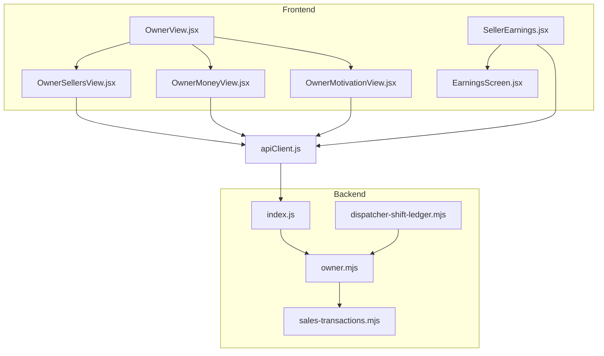
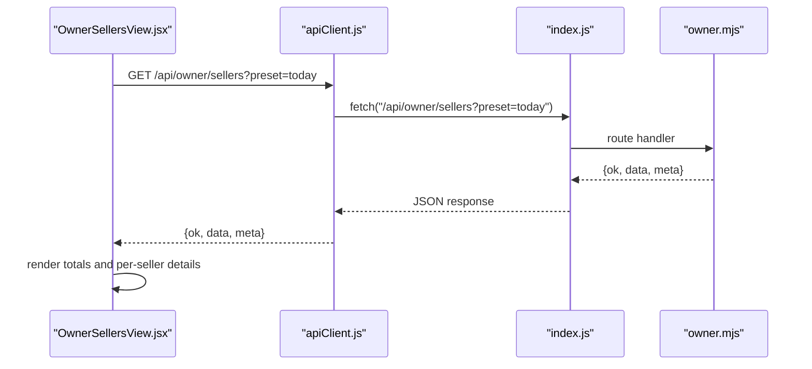
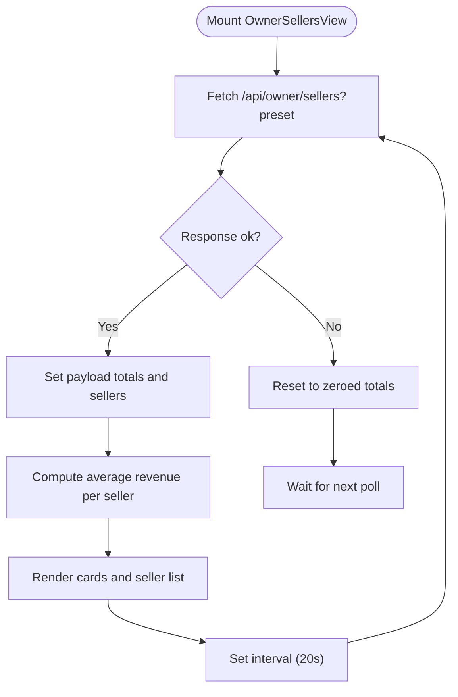
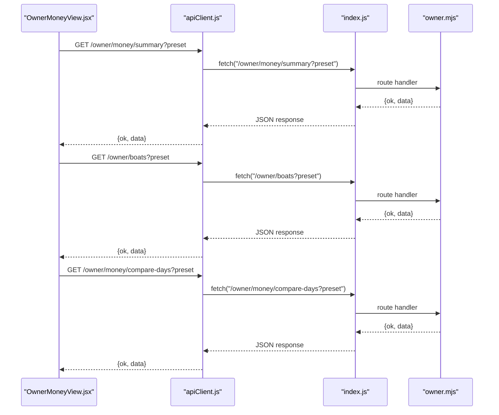
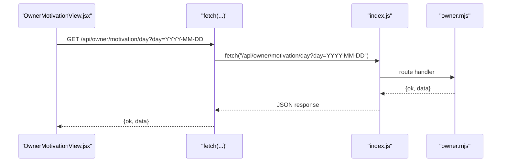
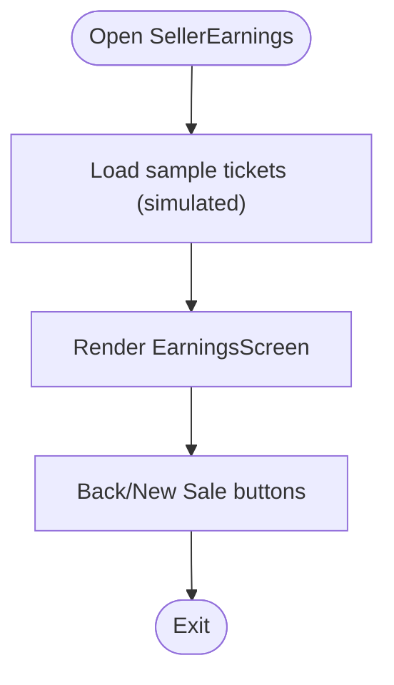
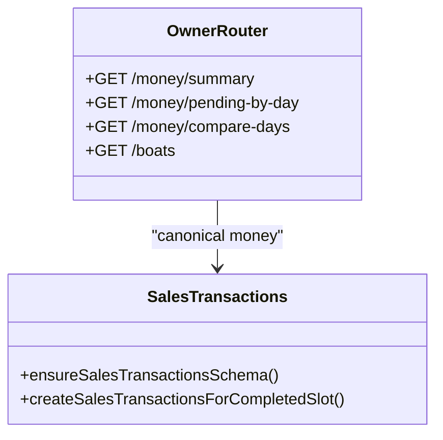
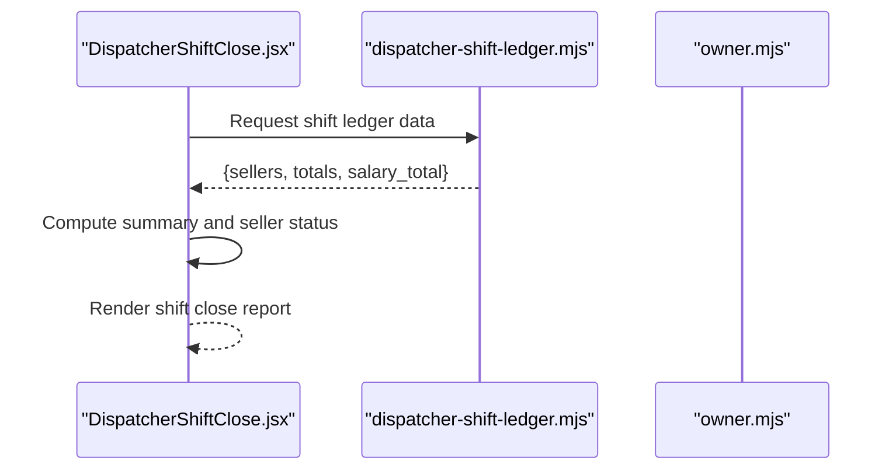
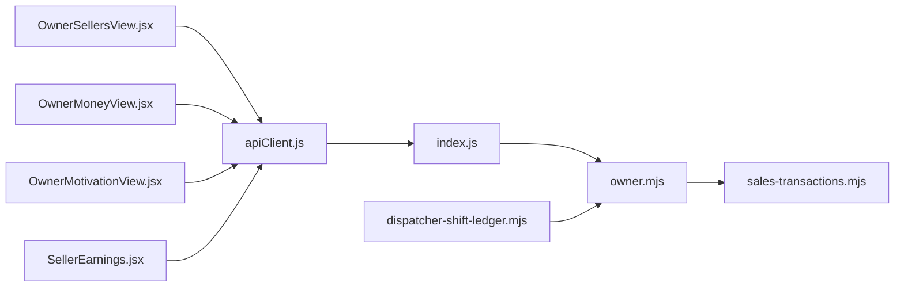

# Seller Performance Monitoring

<cite>
**Referenced Files in This Document**
- [OwnerSellersView.jsx](file://src/views/OwnerSellersView.jsx)
- [OwnerMoneyView.jsx](file://src/views/OwnerMoneyView.jsx)
- [OwnerMotivationView.jsx](file://src/views/OwnerMotivationView.jsx)
- [OwnerView.jsx](file://src/views/OwnerView.jsx)
- [SellerEarnings.jsx](file://src/views/SellerEarnings.jsx)
- [EarningsScreen.jsx](file://src/components/seller/EarningsScreen.jsx)
- [sales-transactions.mjs](file://server/sales-transactions.mjs)
- [owner.mjs](file://server/owner.mjs)
- [index.js](file://server/index.js)
- [apiClient.js](file://src/utils/apiClient.js)
- [DispatcherShiftClose.jsx](file://src/views/DispatcherShiftClose.jsx)
- [dispatcher-shift-ledger.mjs](file://server/dispatcher-shift-ledger.mjs)
</cite>

## Table of Contents
1. [Introduction](#introduction)
2. [Project Structure](#project-structure)
3. [Core Components](#core-components)
4. [Architecture Overview](#architecture-overview)
5. [Detailed Component Analysis](#detailed-component-analysis)
6. [Dependency Analysis](#dependency-analysis)
7. [Performance Considerations](#performance-considerations)
8. [Troubleshooting Guide](#troubleshooting-guide)
9. [Conclusion](#conclusion)

## Introduction
This document describes the seller performance monitoring system, focusing on how individual sellers are tracked and evaluated, how team performance is assessed, and how earnings and commission analysis integrate with the broader financial reporting. It covers:
- Individual seller tracking: sales volume, revenue generation, and performance metrics
- Team performance evaluation and comparison
- Commission analysis and sales target achievement tracking
- Productivity analytics and ranking systems
- Examples for identifying top performers, addressing underperformance, and implementing improvement strategies
- Integration with earnings tracking and commission calculation systems

## Project Structure
The system comprises:
- Frontend owner dashboard tabs for money, sellers, boats, motivation, and more
- Seller-side earnings screen for personal performance
- Backend APIs for owner analytics and sales transaction canonicalization
- Integration points for dispatcher shift close and commission computation

**Diagram sources**
- [OwnerView.jsx](file://src/views/OwnerView.jsx#L164-L194)
- [OwnerMoneyView.jsx](file://src/views/OwnerMoneyView.jsx#L54-L456)
- [OwnerSellersView.jsx](file://src/views/OwnerSellersView.jsx#L48-L177)
- [OwnerMotivationView.jsx](file://src/views/OwnerMotivationView.jsx#L47-L151)
- [SellerEarnings.jsx](file://src/views/SellerEarnings.jsx#L7-L91)
- [EarningsScreen.jsx](file://src/components/seller/EarningsScreen.jsx#L3-L68)
- [index.js](file://server/index.js#L20-L45)
- [owner.mjs](file://server/owner.mjs#L97-L456)
- [sales-transactions.mjs](file://server/sales-transactions.mjs#L1-L237)
- [dispatcher-shift-ledger.mjs](file://server/dispatcher-shift-ledger.mjs#L263-L303)
- [apiClient.js](file://src/utils/apiClient.js#L23-L88)

**Section sources**
- [OwnerView.jsx](file://src/views/OwnerView.jsx#L164-L194)
- [OwnerMoneyView.jsx](file://src/views/OwnerMoneyView.jsx#L54-L456)
- [OwnerSellersView.jsx](file://src/views/OwnerSellersView.jsx#L48-L177)
- [OwnerMotivationView.jsx](file://src/views/OwnerMotivationView.jsx#L47-L151)
- [SellerEarnings.jsx](file://src/views/SellerEarnings.jsx#L7-L91)
- [EarningsScreen.jsx](file://src/components/seller/EarningsScreen.jsx#L3-L68)
- [index.js](file://server/index.js#L20-L45)
- [owner.mjs](file://server/owner.mjs#L97-L456)
- [sales-transactions.mjs](file://server/sales-transactions.mjs#L1-L237)
- [dispatcher-shift-ledger.mjs](file://server/dispatcher-shift-ledger.mjs#L263-L303)
- [apiClient.js](file://src/utils/apiClient.js#L23-L88)

## Core Components
- OwnerSellersView: Loads seller performance via a dedicated owner API endpoint, displays totals and per-seller details, and polls periodically for live updates.
- OwnerMoneyView: Provides aggregated revenue, ticket counts, trips, and pending collections; includes day-over-day comparisons and auto-refresh logic.
- OwnerMotivationView: Exposes daily motivation parameters such as revenue, fund percentage, fund total, participants, and base per person.
- SellerEarnings and EarningsScreen: Allow sellers to review their personal sales history and earnings summary.
- Backend owner router: Implements owner analytics endpoints including money summaries, pending by day, compare-days, and boats aggregation.
- sales-transactions.mjs: Canonicalizes sales transactions for owner analytics, ensuring money appears only after trip completion and supporting safe schema evolution.
- dispatcher-shift-ledger.mjs: Supplies seller-level sales and balances used in shift close and commission calculations.

**Section sources**
- [OwnerSellersView.jsx](file://src/views/OwnerSellersView.jsx#L48-L177)
- [OwnerMoneyView.jsx](file://src/views/OwnerMoneyView.jsx#L54-L456)
- [OwnerMotivationView.jsx](file://src/views/OwnerMotivationView.jsx#L47-L151)
- [SellerEarnings.jsx](file://src/views/SellerEarnings.jsx#L7-L91)
- [EarningsScreen.jsx](file://src/components/seller/EarningsScreen.jsx#L3-L68)
- [owner.mjs](file://server/owner.mjs#L97-L456)
- [sales-transactions.mjs](file://server/sales-transactions.mjs#L1-L237)
- [dispatcher-shift-ledger.mjs](file://server/dispatcher-shift-ledger.mjs#L263-L303)

## Architecture Overview
The system integrates frontend dashboards with backend analytics and transaction canonicalization. OwnerSellersView and OwnerMoneyView rely on owner endpoints; sales data is normalized by sales-transactions.mjs; dispatcher shift ledger supplies seller-level sales and balances for commission computations.

**Diagram sources**
- [OwnerSellersView.jsx](file://src/views/OwnerSellersView.jsx#L57-L74)
- [apiClient.js](file://src/utils/apiClient.js#L23-L88)
- [index.js](file://server/index.js#L40-L45)
- [owner.mjs](file://server/owner.mjs#L97-L168)

## Detailed Component Analysis

### OwnerSellersView: Individual Seller Tracking
- Purpose: Display seller performance with revenue, ticket counts, and per-seller details.
- Data source: GET /api/owner/sellers?preset= with presets like today, yesterday, 7 days, month.
- Behavior: Polls every 20 seconds for today; computes average revenue per seller; shows warnings from backend metadata.
- Metrics shown:
  - Totals: total revenue, total tickets
  - Average revenue per seller
  - Active sellers count
  - Per-seller details: revenue, tickets, seller ID, and source

**Diagram sources**
- [OwnerSellersView.jsx](file://src/views/OwnerSellersView.jsx#L54-L83)

**Section sources**
- [OwnerSellersView.jsx](file://src/views/OwnerSellersView.jsx#L48-L177)

### OwnerMoneyView: Team Performance Evaluation and Productivity Analytics
- Purpose: Aggregate revenue, tickets, trips, and pending collections; compare periods; compute averages and day-of-week trends.
- Data sources:
  - GET /api/owner/money/summary?preset=
  - GET /api/owner/money/compare-days?preset=
  - GET /api/owner/boats?preset=
  - GET /api/owner/money/pending-by-day?day=
- Features:
  - Preset chips: today, yesterday, 7 days, 30 days, 90 days, last_nonzero_day
  - Auto-refresh for today (20s intervals) and visibility/focus triggers
  - Pending collections grouped by trip day
  - Day bars visualization for weekly revenue trend
  - Manual override detection and warnings propagation

**Diagram sources**
- [OwnerMoneyView.jsx](file://src/views/OwnerMoneyView.jsx#L99-L132)
- [owner.mjs](file://server/owner.mjs#L97-L168)
- [owner.mjs](file://server/owner.mjs#L239-L272)
- [owner.mjs](file://server/owner.mjs#L278-L399)

**Section sources**
- [OwnerMoneyView.jsx](file://src/views/OwnerMoneyView.jsx#L54-L456)
- [owner.mjs](file://server/owner.mjs#L97-L168)
- [owner.mjs](file://server/owner.mjs#L239-L272)
- [owner.mjs](file://server/owner.mjs#L278-L399)

### OwnerMotivationView: Daily Motivation Parameters
- Purpose: Provide daily motivation parameters such as revenue, fund percentage, fund total, participants, and base per person.
- Data source: GET /api/owner/motivation/day?day=YYYY-MM-DD
- Behavior: Auto-refreshes every 30 seconds for today; allows selecting a business day; shows warnings.

**Diagram sources**
- [OwnerMotivationView.jsx](file://src/views/OwnerMotivationView.jsx#L62-L95)
- [owner.mjs](file://server/owner.mjs#L97-L168)

**Section sources**
- [OwnerMotivationView.jsx](file://src/views/OwnerMotivationView.jsx#L47-L151)

### SellerEarnings and EarningsScreen: Personal Performance
- Purpose: Allow sellers to review their personal sales history and earnings summary.
- Data source: Simulated sample data in the current implementation; intended to connect to seller-specific sales endpoint.
- Features:
  - Total earnings calculation from prepayment or total price
  - Recent sales list display
  - Navigation to new sale and back

**Diagram sources**
- [SellerEarnings.jsx](file://src/views/SellerEarnings.jsx#L16-L53)
- [EarningsScreen.jsx](file://src/components/seller/EarningsScreen.jsx#L3-L68)

**Section sources**
- [SellerEarnings.jsx](file://src/views/SellerEarnings.jsx#L7-L91)
- [EarningsScreen.jsx](file://src/components/seller/EarningsScreen.jsx#L3-L68)

### Backend Integration: Owner Analytics Endpoints
- Owner router endpoints:
  - Money summary: revenue, cash, card totals
  - Pending by day: grouped by trip day
  - Compare days: day-over-day revenue breakdown
  - Boats: per-boat aggregation and fill percent estimation
- Business rules:
  - Revenue computed by trip day using presales business_day or created_at fallback
  - Cash/card derived from explicit payment columns
  - Pending computed as revenue minus posted payments

**Diagram sources**
- [owner.mjs](file://server/owner.mjs#L97-L456)
- [sales-transactions.mjs](file://server/sales-transactions.mjs#L34-L237)

**Section sources**
- [owner.mjs](file://server/owner.mjs#L97-L456)
- [sales-transactions.mjs](file://server/sales-transactions.mjs#L1-L237)

### Dispatcher Shift Close and Commission Calculation
- Purpose: Provide seller-level sales, deposits, and balances; compute salary placeholder (commission) and shift settlement.
- Data source: Dispatcher shift ledger supplies accepted, deposited, and balance per seller; UI may also compute salary as 13% of total revenue.
- Integration: Used in shift close flow and indirectly informs motivation/commission analysis.

**Diagram sources**
- [DispatcherShiftClose.jsx](file://src/views/DispatcherShiftClose.jsx#L117-L153)
- [dispatcher-shift-ledger.mjs](file://server/dispatcher-shift-ledger.mjs#L263-L303)

**Section sources**
- [DispatcherShiftClose.jsx](file://src/views/DispatcherShiftClose.jsx#L117-L153)
- [dispatcher-shift-ledger.mjs](file://server/dispatcher-shift-ledger.mjs#L263-L303)

## Dependency Analysis
- Frontend depends on apiClient for authenticated requests to backend owner endpoints.
- OwnerMoneyView and OwnerSellersView share the same owner API surface and use consistent preset handling.
- sales-transactions.mjs ensures canonical money records are created after trip completion, aligning owner analytics with accurate revenue and payment data.
- Dispatcher shift ledger complements owner analytics by providing seller-level sales and balances.

**Diagram sources**
- [apiClient.js](file://src/utils/apiClient.js#L23-L88)
- [index.js](file://server/index.js#L40-L45)
- [owner.mjs](file://server/owner.mjs#L97-L456)
- [sales-transactions.mjs](file://server/sales-transactions.mjs#L1-L237)
- [dispatcher-shift-ledger.mjs](file://server/dispatcher-shift-ledger.mjs#L263-L303)
- [OwnerSellersView.jsx](file://src/views/OwnerSellersView.jsx#L48-L177)
- [OwnerMoneyView.jsx](file://src/views/OwnerMoneyView.jsx#L54-L456)
- [OwnerMotivationView.jsx](file://src/views/OwnerMotivationView.jsx#L47-L151)
- [SellerEarnings.jsx](file://src/views/SellerEarnings.jsx#L7-L91)

**Section sources**
- [apiClient.js](file://src/utils/apiClient.js#L23-L88)
- [index.js](file://server/index.js#L40-L45)
- [owner.mjs](file://server/owner.mjs#L97-L456)
- [sales-transactions.mjs](file://server/sales-transactions.mjs#L1-L237)
- [dispatcher-shift-ledger.mjs](file://server/dispatcher-shift-ledger.mjs#L263-L303)
- [OwnerSellersView.jsx](file://src/views/OwnerSellersView.jsx#L48-L177)
- [OwnerMoneyView.jsx](file://src/views/OwnerMoneyView.jsx#L54-L456)
- [OwnerMotivationView.jsx](file://src/views/OwnerMotivationView.jsx#L47-L151)
- [SellerEarnings.jsx](file://src/views/SellerEarnings.jsx#L7-L91)

## Performance Considerations
- Polling strategy:
  - OwnerSellersView polls every 20 seconds for today; consider throttling or conditional polling for other presets.
  - OwnerMoneyView auto-refreshes for today and on focus/visibility; avoid redundant loads during manual refresh.
- Data volume:
  - OwnerMoneyView compares days; ensure backend queries are indexed by trip day and status.
  - sales-transactions.mjs uses safe schema checks and indices to prevent repeated work.
- Rendering:
  - OwnerSellersView memoizes average per seller to avoid unnecessary recalculations.
  - OwnerMoneyView computes bar heights and max revenue efficiently.

[No sources needed since this section provides general guidance]

## Troubleshooting Guide
- Invalid JSON or network errors:
  - OwnerSellersView and OwnerMotivationView capture and surface warnings from backend metadata.
  - apiClient logs network activity and errors for diagnostics.
- Manual overrides:
  - OwnerMoneyView detects manual overrides and displays a warning indicator.
- Pending data:
  - OwnerMoneyView shows pending by day only for today; for other presets, pending is zeroed.
- Dispatcher shift close:
  - If backend deposit endpoints are unavailable, UI falls back to local mode; verify backend deposit availability flag.

**Section sources**
- [OwnerSellersView.jsx](file://src/views/OwnerSellersView.jsx#L34-L46)
- [OwnerMotivationView.jsx](file://src/views/OwnerMotivationView.jsx#L25-L37)
- [OwnerMoneyView.jsx](file://src/views/OwnerMoneyView.jsx#L218-L225)
- [apiClient.js](file://src/utils/apiClient.js#L53-L87)

## Conclusion
The seller performance monitoring system combines owner dashboards, seller personal earnings, and backend canonical sales transactions to deliver actionable insights. OwnerSellersView provides granular seller tracking, OwnerMoneyView offers team-level analytics and comparisons, OwnerMotivationView sets daily targets, and dispatcher shift ledger supplies seller-level sales and balances for commission computations. Integrating these components enables identification of top performers, targeted underperformance remediation, and continuous productivity improvements.