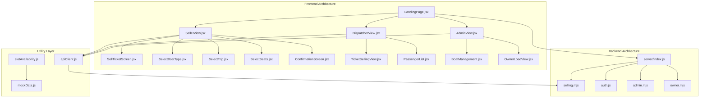
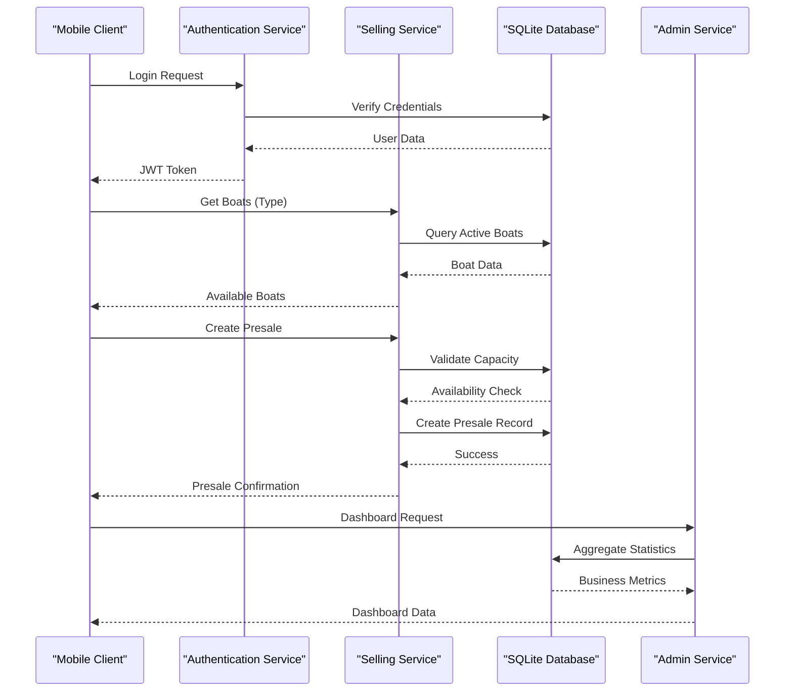
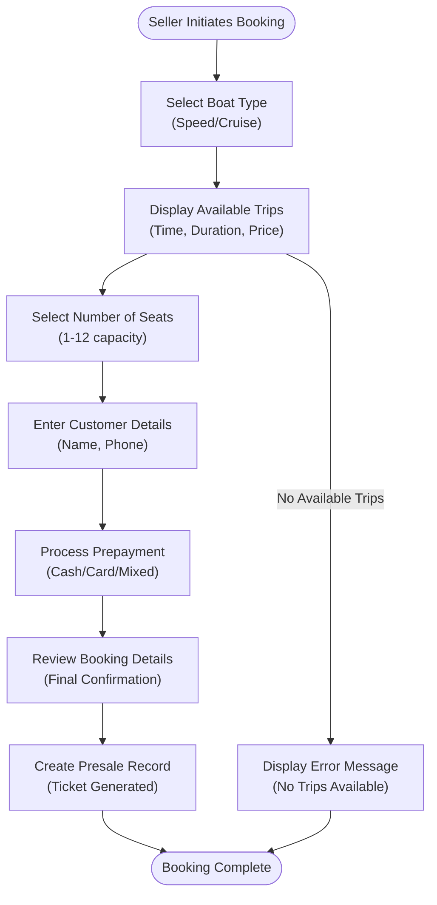
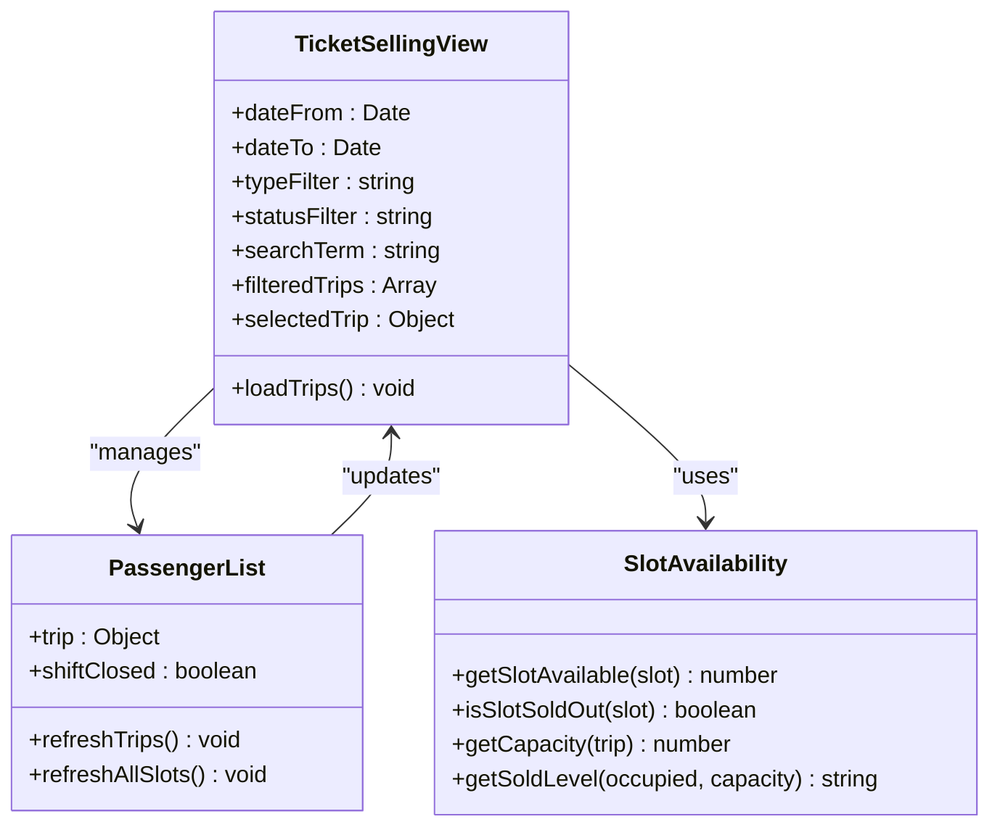
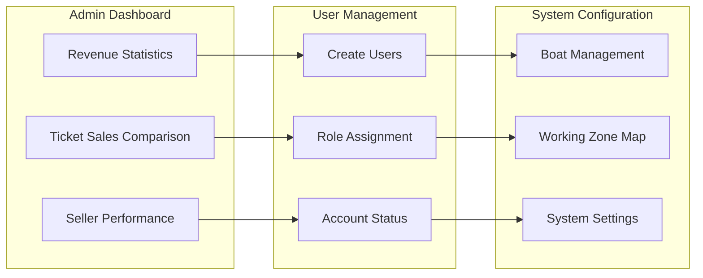
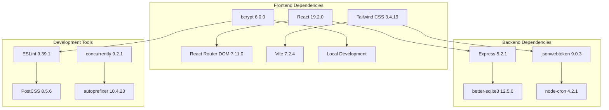

# Introduction and Purpose

<cite>
**Referenced Files in This Document**
- [README.md](file://README.md)
- [package.json](file://package.json)
- [docs/GLOSSARY.md](file://docs/GLOSSARY.md)
- [docs/BUSINESS_RULES.md](file://docs/BUSINESS_RULES.md)
- [docs/PROJECT_PRINCIPLES.md](file://docs/PROJECT_PRINCIPLES.md)
- [src/views/LandingPage.jsx](file://src/views/LandingPage.jsx)
- [src/views/SellerView.jsx](file://src/views/SellerView.jsx)
- [src/views/AdminView.jsx](file://src/views/AdminView.jsx)
- [src/components/dispatcher/TicketSellingView.jsx](file://src/components/dispatcher/TicketSellingView.jsx)
- [src/utils/slotAvailability.js](file://src/utils/slotAvailability.js)
- [src/data/mockData.js](file://src/data/mockData.js)
- [server/index.js](file://server/index.js)
- [server/selling.mjs](file://server/selling.mjs)
</cite>

## Table of Contents
1. [Introduction](#introduction)
2. [Project Structure](#project-structure)
3. [Core Components](#core-components)
4. [Architecture Overview](#architecture-overview)
5. [Detailed Component Analysis](#detailed-component-analysis)
6. [Dependency Analysis](#dependency-analysis)
7. [Performance Considerations](#performance-considerations)
8. [Troubleshooting Guide](#troubleshooting-guide)
9. [Conclusion](#conclusion)

## Introduction

The Beach Boat Ticket Sales System is a mobile-first Minimum Viable Product (MVP) web application designed to demonstrate comprehensive boat ticket sales functionality for beach boat tours and speed boat cruises. The project's mission is to modernize traditional paper-based ticketing processes by providing a streamlined digital presale booking system that enables tour operators, boat captains, and travel agencies to efficiently manage and sell tickets for water-based excursions.

### Business Value Proposition

The system addresses critical inefficiencies in traditional paper-based ticketing by introducing:

- **Digital Presale Booking**: Tour operators can create advance reservations with customer details, enabling better crowd management and revenue forecasting
- **Real-time Inventory Management**: Live seat availability tracking for both speed boat cruises and beach boat tours prevents overbooking and optimizes capacity utilization
- **Streamlined Operations**: Automated ticket generation eliminates manual record-keeping while maintaining compliance with operational requirements
- **Mobile-First Experience**: Touch-optimized interface designed for on-the-water environments where traditional desktop systems are impractical

### Target Audience

The platform serves three primary user groups within the maritime tourism ecosystem:

**Tour Operators**: Responsible for managing fleet capacity, pricing strategies, and operational schedules for beach boat tours and speed boat cruises

**Boat Captains/Dispatchers**: Handle daily operations including passenger boarding verification, real-time seat availability updates, and trip completion tracking

**Travel Agencies**: Facilitate group bookings and advance reservations for organized beach boat tour packages

### Problem Addressed

Traditional paper-based ticketing processes create significant operational challenges:

- **Manual Record Keeping**: Paper tickets require physical storage, manual tracking, and prone-to-error inventory management
- **Limited Real-time Visibility**: No immediate access to seat availability prevents informed booking decisions
- **Operational Inefficiency**: Time-consuming manual verification processes delay boarding and reduce throughput
- **Data Fragmentation**: Information silos between different booking channels make revenue tracking and reporting difficult

### Domain Selection Justification

The maritime tourism sector was chosen as the demonstration domain for several strategic reasons:

- **High Seasonality**: Beach boat tours and speed boat cruises operate seasonally, requiring robust booking systems during peak periods
- **Capacity Constraints**: Limited vessel capacity makes precise seat management critical for operational success
- **Mobile Environment**: On-water operations necessitate mobile-first solutions that work reliably in marine conditions
- **Regulatory Compliance**: Maritime operations require detailed passenger tracking and safety documentation
- **Revenue Sensitivity**: Tourism businesses depend heavily on efficient booking systems for revenue optimization

### Scope Limitations

As an MVP demonstration, the system intentionally focuses on core functionality while acknowledging production readiness gaps:

- **Development Focus**: Emphasizes business logic validation over enterprise-grade security and scalability
- **Simplified Infrastructure**: Uses local SQLite databases and in-memory data structures for demonstration purposes
- **Basic Authentication**: Implements fundamental JWT authentication without advanced security features
- **Mock Data Layer**: Utilizes mock data for business logic testing while maintaining realistic user workflows
- **Limited Integrations**: Designed as a standalone system without external payment processor or third-party integrations

**Section sources**
- [README.md](file://README.md#L1-L150)
- [docs/BUSINESS_RULES.md](file://docs/BUSINESS_RULES.md#L1-L49)
- [docs/PROJECT_PRINCIPLES.md](file://docs/PROJECT_PRINCIPLES.md#L1-L9)

## Project Structure

The application follows a clear separation of concerns with distinct frontend and backend components:

**Diagram sources**
- [src/views/LandingPage.jsx](file://src/views/LandingPage.jsx#L1-L35)
- [src/views/SellerView.jsx](file://src/views/SellerView.jsx#L1-L370)
- [src/views/AdminView.jsx](file://src/views/AdminView.jsx#L1-L382)
- [server/index.js](file://server/index.js#L1-L45)

The structure demonstrates a clear MVC-like pattern where views handle user interaction, components encapsulate reusable UI elements, and backend services manage business logic and data persistence.

**Section sources**
- [README.md](file://README.md#L78-L102)
- [package.json](file://package.json#L1-L41)

## Core Components

### Role-Based Access Control System

The application implements a comprehensive role-based access control system that governs user permissions across three primary roles:

**Seller Role**: Frontline ticket sales personnel with presale booking capabilities and basic operational functions

**Dispatcher Role**: Operations staff responsible for trip management, passenger verification, and real-time seat availability monitoring

**Admin/Owner Role**: Management oversight with comprehensive reporting, user administration, and system configuration capabilities

### Business Logic Foundation

The system establishes core business rules that govern ticket sales and operational workflows:

- **Presale Booking**: All ticket sales must originate from presale requests with customer details and payment information
- **Seat Availability Validation**: Real-time capacity checking prevents overbooking across both manual and generated slots
- **Cutoff Time Management**: Automated time-based restrictions ensure proper booking windows for different operational scenarios
- **Revenue Tracking**: Integrated commission calculations and payment processing support financial reporting

### Data Model Architecture

The system employs a normalized data model supporting both manual and generated slot types:

- **Boat Types**: Speed boat cruises and beach boat tours with distinct capacity and pricing structures
- **Slot Management**: Both manually created and template-generated slots with unified management interfaces
- **Customer Data**: Presale records with contact information and payment tracking
- **Transaction History**: Complete audit trail of all booking modifications and cancellations

**Section sources**
- [docs/BUSINESS_RULES.md](file://docs/BUSINESS_RULES.md#L3-L49)
- [docs/GLOSSARY.md](file://docs/GLOSSARY.md#L1-L11)
- [src/utils/slotAvailability.js](file://src/utils/slotAvailability.js#L1-L19)
- [src/data/mockData.js](file://src/data/mockData.js#L1-L40)

## Architecture Overview

The system implements a client-server architecture with clear separation between presentation, business logic, and data management layers:

**Diagram sources**
- [server/index.js](file://server/index.js#L20-L45)
- [server/selling.mjs](file://server/selling.mjs#L442-L638)
- [src/views/SellerView.jsx](file://src/views/SellerView.jsx#L150-L170)

The architecture emphasizes mobile-first design principles with responsive interfaces, offline-friendly caching mechanisms, and streamlined API interactions optimized for maritime environments.

**Section sources**
- [README.md](file://README.md#L66-L77)
- [package.json](file://package.json#L15-L39)

## Detailed Component Analysis

### Seller Workflow Process

The seller component orchestrates the complete ticket booking process through a guided workflow:

**Diagram sources**
- [src/views/SellerView.jsx](file://src/views/SellerView.jsx#L127-L170)
- [src/components/seller/SellTicketScreen.jsx](file://src/components/seller/SellTicketScreen.jsx#L1-L29)

The workflow ensures proper capacity validation, customer data collection, and payment processing while maintaining clear audit trails for all transactions.

### Dispatcher Operations Management

The dispatcher component provides comprehensive trip management capabilities:

**Diagram sources**
- [src/components/dispatcher/TicketSellingView.jsx](file://src/components/dispatcher/TicketSellingView.jsx#L58-L333)
- [src/utils/slotAvailability.js](file://src/utils/slotAvailability.js#L1-L19)

The dispatcher interface supports comprehensive trip filtering, real-time seat availability monitoring, and passenger management with visual indicators for trip status and occupancy levels.

### Administrative Oversight

The administrative component provides comprehensive system management and reporting capabilities:

**Diagram sources**
- [src/views/AdminView.jsx](file://src/views/AdminView.jsx#L215-L262)
- [src/views/AdminView.jsx](file://src/views/AdminView.jsx#L263-L376)

The admin interface consolidates business intelligence with operational controls, enabling comprehensive oversight of all system activities.

**Section sources**
- [src/views/SellerView.jsx](file://src/views/SellerView.jsx#L37-L370)
- [src/views/AdminView.jsx](file://src/views/AdminView.jsx#L1-L382)
- [src/components/dispatcher/TicketSellingView.jsx](file://src/components/dispatcher/TicketSellingView.jsx#L1-L333)

## Dependency Analysis

The system maintains clear dependency relationships that support modularity and maintainability:

**Diagram sources**
- [package.json](file://package.json#L15-L39)

The dependency structure supports rapid development cycles while maintaining production-ready standards for both frontend and backend components.

**Section sources**
- [package.json](file://package.json#L1-L41)

## Performance Considerations

The system incorporates several performance optimization strategies:

- **Mobile-First Design**: Optimized touch interactions and reduced data payloads for mobile environments
- **Caching Strategies**: Session-based caching for trip listings and real-time updates via event listeners
- **Database Optimization**: Efficient query patterns with proper indexing and connection pooling
- **Responsive Architecture**: Adaptive layouts that minimize computational overhead on mobile devices

## Troubleshooting Guide

Common operational issues and resolution strategies:

**Authentication Problems**: Verify JWT token validity and user role permissions through the authentication service

**Capacity Validation Errors**: Check seat availability calculations and ensure proper capacity limits for different boat types

**API Connectivity Issues**: Monitor backend service health and database connection status for proper operation

**Mobile Interface Problems**: Validate responsive design breakpoints and touch interaction handling for optimal mobile performance

## Conclusion

The Beach Boat Ticket Sales System represents a comprehensive demonstration of modern digital ticketing solutions tailored for maritime tourism operations. By focusing on mobile-first design, real-time capacity management, and streamlined booking workflows, the system effectively addresses the operational challenges inherent in traditional paper-based ticketing processes.

The project's MVP approach successfully validates core business functionality while establishing a foundation for future enhancements. The clear separation of concerns, comprehensive role-based access control, and robust business logic provide a solid architectural foundation for production deployment.

Through its focus on beach boat tours and speed boat cruises, the system demonstrates practical solutions for the maritime tourism sector's unique operational requirements, including capacity constraints, seasonal scheduling, and mobile environment considerations. This targeted approach ensures the demonstration remains focused, achievable, and directly applicable to real-world operational scenarios.