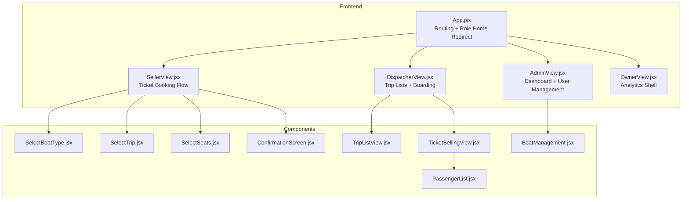
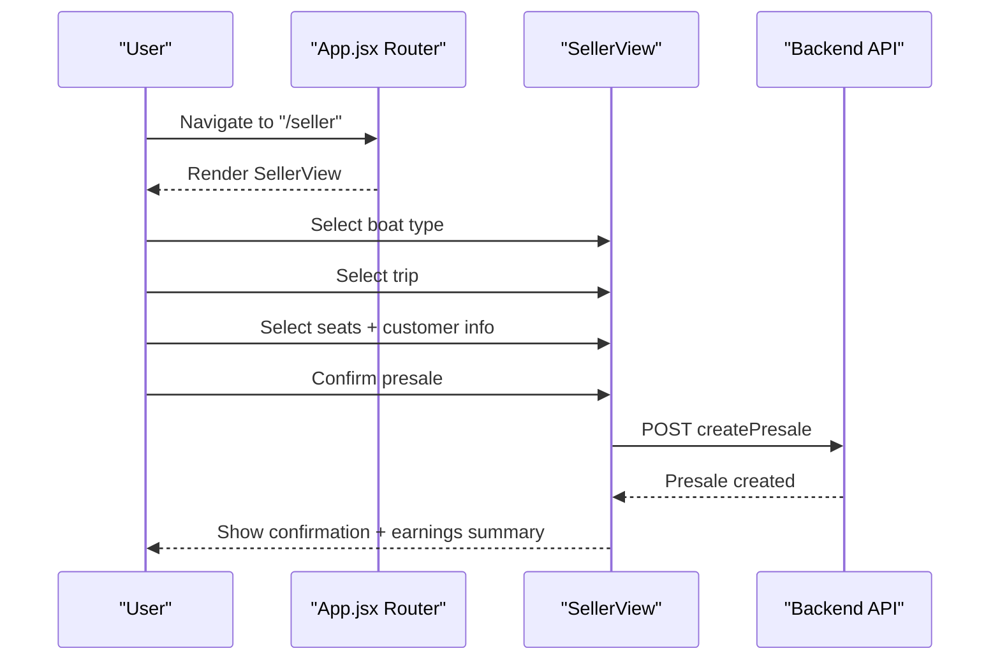
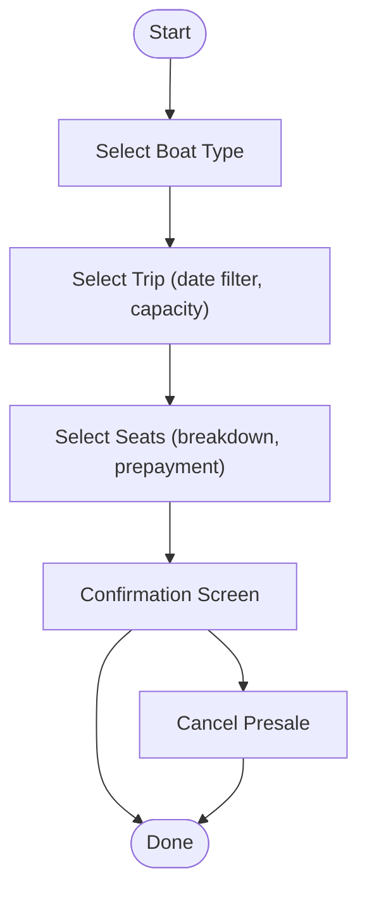
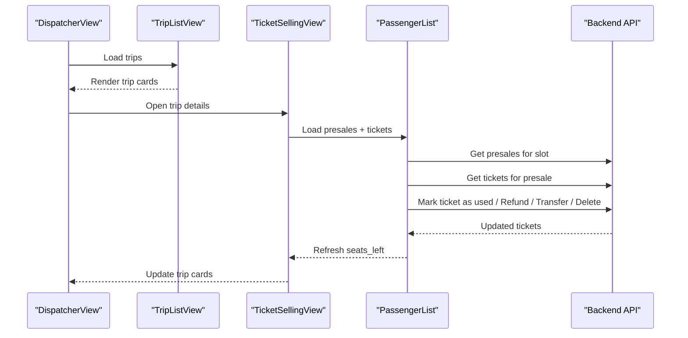
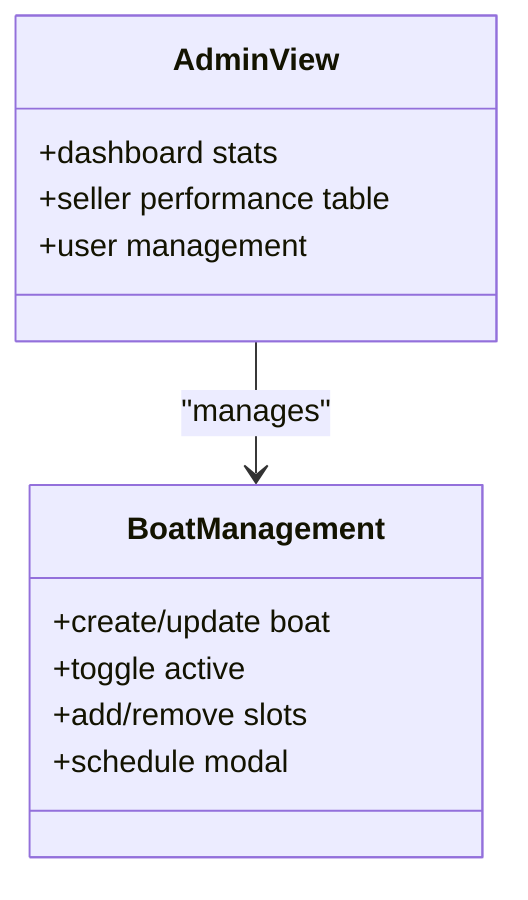
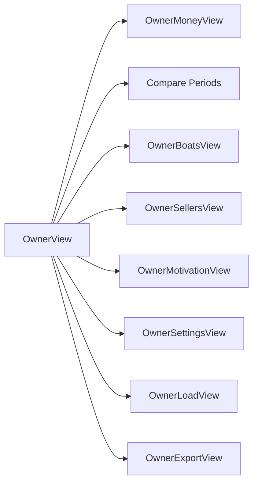
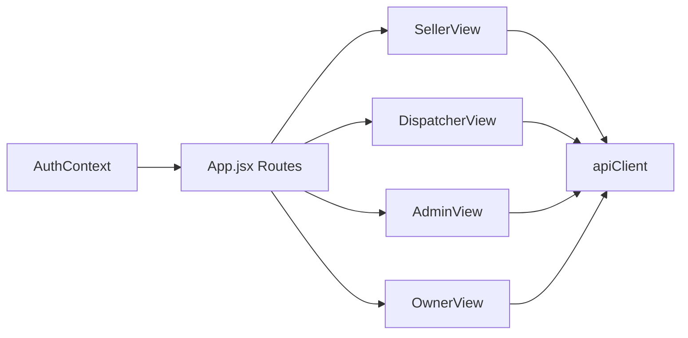

# Key Features and Workflows

<cite>
**Referenced Files in This Document**
- [README.md](file://README.md)
- [BUSINESS_RULES.md](file://docs/BUSINESS_RULES.md)
- [TIME_RULES.md](file://docs/TIME_RULES.md)
- [App.jsx](file://src/App.jsx)
- [SellerView.jsx](file://src/views/SellerView.jsx)
- [SelectBoatType.jsx](file://src/components/seller/SelectBoatType.jsx)
- [SelectTrip.jsx](file://src/components/seller/SelectTrip.jsx)
- [SelectSeats.jsx](file://src/components/seller/SelectSeats.jsx)
- [ConfirmationScreen.jsx](file://src/components/seller/ConfirmationScreen.jsx)
- [DispatcherView.jsx](file://src/views/DispatcherView.jsx)
- [TripListView.jsx](file://src/components/dispatcher/TripListView.jsx)
- [PassengerList.jsx](file://src/components/dispatcher/PassengerList.jsx)
- [TicketSellingView.jsx](file://src/components/dispatcher/TicketSellingView.jsx)
- [AdminView.jsx](file://src/views/AdminView.jsx)
- [BoatManagement.jsx](file://src/components/admin/BoatManagement.jsx)
- [OwnerView.jsx](file://src/views/OwnerView.jsx)
</cite>

## Table of Contents
1. [Introduction](#introduction)
2. [Project Structure](#project-structure)
3. [Core Components](#core-components)
4. [Architecture Overview](#architecture-overview)
5. [Detailed Component Analysis](#detailed-component-analysis)
6. [Dependency Analysis](#dependency-analysis)
7. [Performance Considerations](#performance-considerations)
8. [Troubleshooting Guide](#troubleshooting-guide)
9. [Conclusion](#conclusion)

## Introduction
This document explains the key features and workflows of the multi-role boat ticketing system. It covers four user roles (sellers, dispatchers, admins, and owners), the end-to-end ticketing workflow from presale booking through final boarding, seat selection and capacity management, real-time passenger management and boarding control, revenue tracking and earnings calculation, scheduling with manual and template-based trip generation, business rule enforcement (cutoff times and capacity limits), and the mobile-first, touch-friendly design approach.

## Project Structure
The application is a React + Vite frontend with a Node.js + Express backend. Roles are enforced via route protection and role checks. Business logic for trips, slots, and sales is implemented in the frontend components and backed by the backend APIs.

**Diagram sources**
- [App.jsx](file://src/App.jsx#L1-L139)
- [SellerView.jsx](file://src/views/SellerView.jsx#L1-L370)
- [DispatcherView.jsx](file://src/views/DispatcherView.jsx#L1-L291)
- [AdminView.jsx](file://src/views/AdminView.jsx#L1-L382)
- [OwnerView.jsx](file://src/views/OwnerView.jsx#L1-L384)
- [SelectBoatType.jsx](file://src/components/seller/SelectBoatType.jsx#L1-L48)
- [SelectTrip.jsx](file://src/components/seller/SelectTrip.jsx#L1-L193)
- [SelectSeats.jsx](file://src/components/seller/SelectSeats.jsx#L1-L549)
- [ConfirmationScreen.jsx](file://src/components/seller/ConfirmationScreen.jsx#L1-L221)
- [TripListView.jsx](file://src/components/dispatcher/TripListView.jsx#L1-L257)
- [PassengerList.jsx](file://src/components/dispatcher/PassengerList.jsx#L1-L800)
- [TicketSellingView.jsx](file://src/components/dispatcher/TicketSellingView.jsx#L1-L333)
- [BoatManagement.jsx](file://src/components/admin/BoatManagement.jsx#L1-L784)

**Section sources**
- [README.md](file://README.md#L1-L150)
- [App.jsx](file://src/App.jsx#L1-L139)

## Core Components
- Role-based routing and home redirection are centralized in the application shell.
- Seller workflow: boat type selection → trip selection → seat selection → confirmation → earnings summary.
- Dispatcher workflow: trip list → passenger list → boarding/refund/transfer actions.
- Admin workflow: dashboard stats, seller performance, user management, and boat/slot configuration.
- Owner workflow: analytics tabs (money, compare periods, boats, sellers, motivation, settings, load, export) with a mobile-first bottom navigation.

**Section sources**
- [App.jsx](file://src/App.jsx#L24-L38)
- [SellerView.jsx](file://src/views/SellerView.jsx#L37-L370)
- [DispatcherView.jsx](file://src/views/DispatcherView.jsx#L23-L291)
- [AdminView.jsx](file://src/views/AdminView.jsx#L10-L382)
- [OwnerView.jsx](file://src/views/OwnerView.jsx#L164-L384)

## Architecture Overview
The system enforces role-based access at the router level and delegates business logic to component-specific flows. Sellers create presales; dispatchers manage boarding and transfers; admins configure boats and users; owners view analytics.

**Diagram sources**
- [App.jsx](file://src/App.jsx#L52-L84)
- [SellerView.jsx](file://src/views/SellerView.jsx#L150-L170)
- [SelectBoatType.jsx](file://src/components/seller/SelectBoatType.jsx#L1-L48)
- [SelectTrip.jsx](file://src/components/seller/SelectTrip.jsx#L1-L193)
- [SelectSeats.jsx](file://src/components/seller/SelectSeats.jsx#L1-L549)
- [ConfirmationScreen.jsx](file://src/components/seller/ConfirmationScreen.jsx#L1-L221)

## Detailed Component Analysis

### Sellers: Ticket Booking Workflow
- Step progression: Sell → Type → Trip → Seats → Confirm.
- Boat type selection supports Speed, Cruise, and Banana.
- Trip selection filters by date and hides trips within cutoff windows.
- Seat selection supports adult/teen/child counts, prepayment, and validation.
- Confirmation displays presale details and allows cancellation.

**Diagram sources**
- [SellerView.jsx](file://src/views/SellerView.jsx#L37-L317)
- [SelectBoatType.jsx](file://src/components/seller/SelectBoatType.jsx#L1-L48)
- [SelectTrip.jsx](file://src/components/seller/SelectTrip.jsx#L34-L193)
- [SelectSeats.jsx](file://src/components/seller/SelectSeats.jsx#L1-L549)
- [ConfirmationScreen.jsx](file://src/components/seller/ConfirmationScreen.jsx#L1-L221)

**Section sources**
- [SellerView.jsx](file://src/views/SellerView.jsx#L37-L370)
- [SelectBoatType.jsx](file://src/components/seller/SelectBoatType.jsx#L1-L48)
- [SelectTrip.jsx](file://src/components/seller/SelectTrip.jsx#L1-L193)
- [SelectSeats.jsx](file://src/components/seller/SelectSeats.jsx#L1-L549)
- [ConfirmationScreen.jsx](file://src/components/seller/ConfirmationScreen.jsx#L1-L221)

### Dispatchers: Real-Time Passenger Management and Boarding Control
- Trip list view shows capacity, occupancy, and free seats; supports filtering and sorting.
- Passenger list view shows presales and individual tickets with statuses.
- Boarding actions: mark as used, refund, transfer, delete.
- Quick sale and payment acceptance modals support cash/card/mixed modes.
- Seat availability is refreshed after operations.

**Diagram sources**
- [DispatcherView.jsx](file://src/views/DispatcherView.jsx#L23-L291)
- [TripListView.jsx](file://src/components/dispatcher/TripListView.jsx#L71-L257)
- [TicketSellingView.jsx](file://src/components/dispatcher/TicketSellingView.jsx#L58-L333)
- [PassengerList.jsx](file://src/components/dispatcher/PassengerList.jsx#L167-L800)

**Section sources**
- [DispatcherView.jsx](file://src/views/DispatcherView.jsx#L23-L291)
- [TripListView.jsx](file://src/components/dispatcher/TripListView.jsx#L1-L257)
- [TicketSellingView.jsx](file://src/components/dispatcher/TicketSellingView.jsx#L1-L333)
- [PassengerList.jsx](file://src/components/dispatcher/PassengerList.jsx#L1-L800)

### Admins: System Configuration and Revenue Overview
- Dashboard shows total revenue, tickets sold, and speed/cruise comparisons.
- Seller performance table with sales, commission, and payouts.
- User management: create, enable/disable, reset password, delete.
- Boat management: create/update/archive boats, schedule slots, toggle activity.

**Diagram sources**
- [AdminView.jsx](file://src/views/AdminView.jsx#L10-L382)
- [BoatManagement.jsx](file://src/components/admin/BoatManagement.jsx#L1-L784)

**Section sources**
- [AdminView.jsx](file://src/views/AdminView.jsx#L1-L382)
- [BoatManagement.jsx](file://src/components/admin/BoatManagement.jsx#L1-L784)

### Owners: Business Analytics Shell
- Mobile-first bottom navigation with tabs for Money, Compare, Boats, Sellers, Motivation, Settings, Load, Export.
- UI-only shell; no actions affecting sales/trips/tickets.
- Fixed logout button and responsive layout.

**Diagram sources**
- [OwnerView.jsx](file://src/views/OwnerView.jsx#L164-L384)

**Section sources**
- [OwnerView.jsx](file://src/views/OwnerView.jsx#L1-L384)

### Seat Selection and Capacity Management
- Seat selection supports adult/teen/child breakdowns with validation against available capacity.
- Capacity is derived from slot or boat capacity; UI shows free/seats sold and percentage.
- Special handling for Banana trips disallows teen tickets.
- Prepayment validation prevents overpayments.

**Section sources**
- [SelectTrip.jsx](file://src/components/seller/SelectTrip.jsx#L95-L176)
- [SelectSeats.jsx](file://src/components/seller/SelectSeats.jsx#L1-L549)

### Real-Time Passenger Management and Boarding Control
- Presales and tickets are loaded per slot; UI reflects live seat counts.
- Operations include marking as used, refund, transfer to another slot, and delete.
- Transfer modal filters future trips with sufficient capacity and correct timing.
- Payment acceptance supports cash/card/mixed modes; prepay decisions handled for last active ticket scenarios.

**Section sources**
- [PassengerList.jsx](file://src/components/dispatcher/PassengerList.jsx#L167-L800)
- [TicketSellingView.jsx](file://src/components/dispatcher/TicketSellingView.jsx#L1-L333)

### Revenue Tracking and Earnings Calculation
- Sellers see earnings summary after ticket creation.
- Admin dashboard aggregates revenue and seller performance.
- Owner analytics provide comparative period views and revenue breakdowns.

**Section sources**
- [SellerView.jsx](file://src/views/SellerView.jsx#L304-L311)
- [AdminView.jsx](file://src/views/AdminView.jsx#L215-L262)
- [OwnerView.jsx](file://src/views/OwnerView.jsx#L27-L132)

### Scheduling System: Manual and Template-Based Trip Generation
- Manual trips: created directly via BoatManagement schedule modal with time, capacity, duration, and optional per-age pricing.
- Template-based trips: supported conceptually by templates and schedule templates modules; UI currently focuses on manual creation.
- Admins can archive boats with dependencies; clearing trips is supported via dedicated controls.

**Section sources**
- [BoatManagement.jsx](file://src/components/admin/BoatManagement.jsx#L213-L248)
- [BoatManagement.jsx](file://src/components/admin/BoatManagement.jsx#L539-L731)

### Business Rule Enforcement: Cutoff Times and Capacity Limits
- Cutoff logic uses server-side time exclusively; seller and dispatcher cutoffs are computed relative to trip start time.
- Sellers cannot sell after their cutoff; dispatchers can override seller cutoffs.
- Trips are considered closed when current server time reaches cutoff time; closing depends only on cutoff, not slot type.
- Capacity limits enforce seat availability during booking and boarding operations.

**Section sources**
- [BUSINESS_RULES.md](file://docs/BUSINESS_RULES.md#L1-L49)
- [TIME_RULES.md](file://docs/TIME_RULES.md#L1-L47)
- [SellerView.jsx](file://src/views/SellerView.jsx#L22-L35)
- [SelectTrip.jsx](file://src/components/seller/SelectTrip.jsx#L11-L23)
- [PassengerList.jsx](file://src/components/dispatcher/PassengerList.jsx#L321-L411)

### Mobile-First Design and Touch-Friendly Patterns
- Large buttons, big fonts, and high contrast for easy touch interaction.
- Bottom navigation for owners; segmented controls and large-selectable cards for dispatchers.
- Responsive grids for trip listings; collapsible modals for actions.

**Section sources**
- [README.md](file://README.md#L144-L150)
- [OwnerView.jsx](file://src/views/OwnerView.jsx#L196-L342)
- [DispatcherView.jsx](file://src/views/DispatcherView.jsx#L104-L229)

## Dependency Analysis
- Role-based routing depends on AuthContext and ProtectedRoute.
- Seller flow depends on apiClient for creating presales and retrieving boats/slots.
- Dispatcher flow depends on apiClient for trips, presales, tickets, and slot operations.
- Admin and Owner views depend on apiClient for stats, users, and boat/slot data.

**Diagram sources**
- [App.jsx](file://src/App.jsx#L1-L139)
- [SellerView.jsx](file://src/views/SellerView.jsx#L1-L370)
- [DispatcherView.jsx](file://src/views/DispatcherView.jsx#L1-L291)
- [AdminView.jsx](file://src/views/AdminView.jsx#L1-L382)
- [OwnerView.jsx](file://src/views/OwnerView.jsx#L1-L384)

**Section sources**
- [App.jsx](file://src/App.jsx#L1-L139)

## Performance Considerations
- Debouncing and anti-spam reloads in dispatcher flows prevent excessive network requests.
- Local caching of trips in sessionStorage reduces redundant loads.
- Optimistic UI updates for ticket operations with subsequent server reconciliation.

[No sources needed since this section provides general guidance]

## Troubleshooting Guide
- If trips do not appear, verify date filters and status filters; use the refresh button.
- If seat counts seem incorrect, ensure the latest dispatcher refresh event is fired.
- If presale creation fails, check customer inputs and prepayment constraints.
- If transfer fails, ensure destination trip has sufficient capacity and is in the future.

**Section sources**
- [DispatcherView.jsx](file://src/views/DispatcherView.jsx#L89-L93)
- [PassengerList.jsx](file://src/components/dispatcher/PassengerList.jsx#L413-L501)
- [SelectSeats.jsx](file://src/components/seller/SelectSeats.jsx#L248-L256)
- [ConfirmationScreen.jsx](file://src/components/seller/ConfirmationScreen.jsx#L68-L117)

## Conclusion
The system provides a cohesive, role-separated workflow for boat ticketing with strong business rule enforcement, real-time passenger management, and a mobile-first interface. Sellers focus on presales, dispatchers on boarding and transfers, admins on configuration and reporting, and owners on analytics.