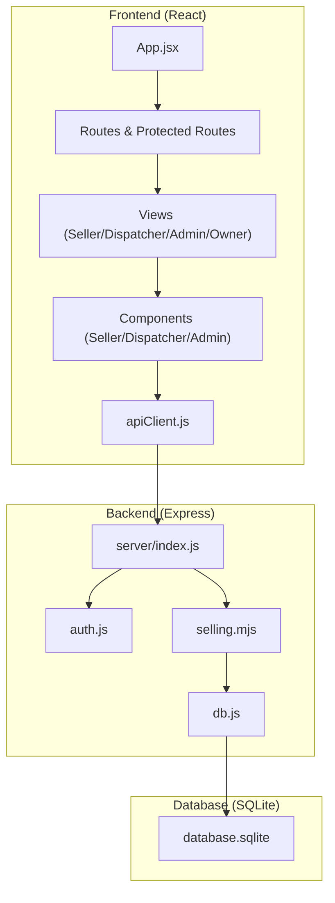
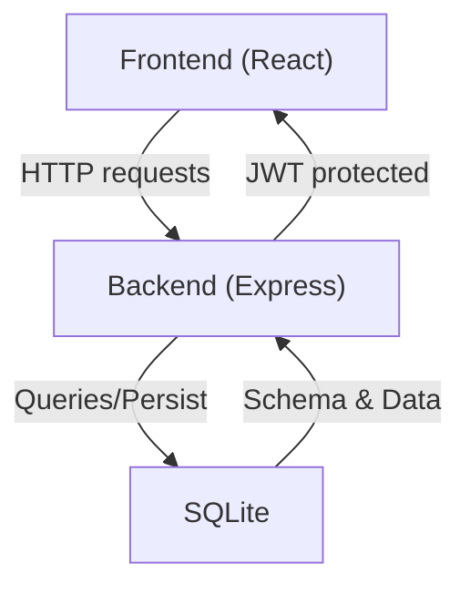
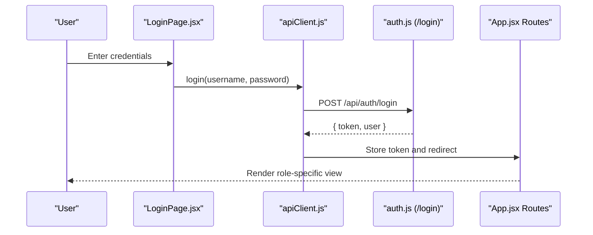
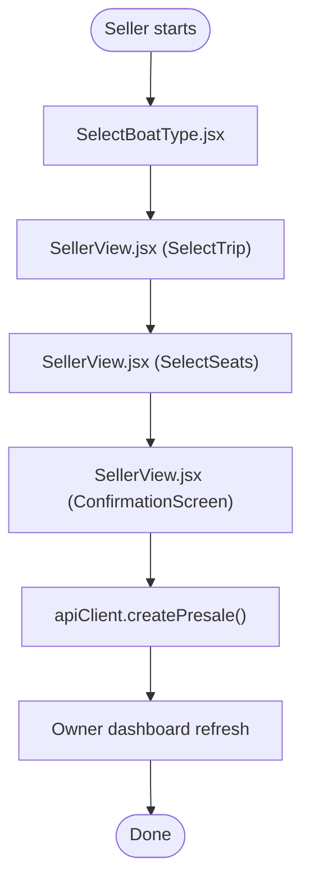
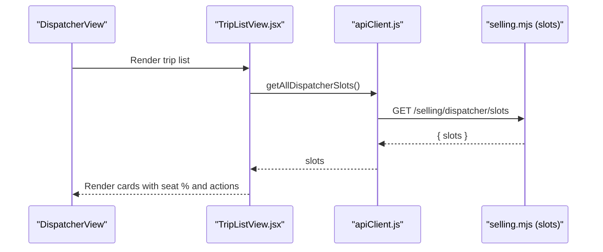
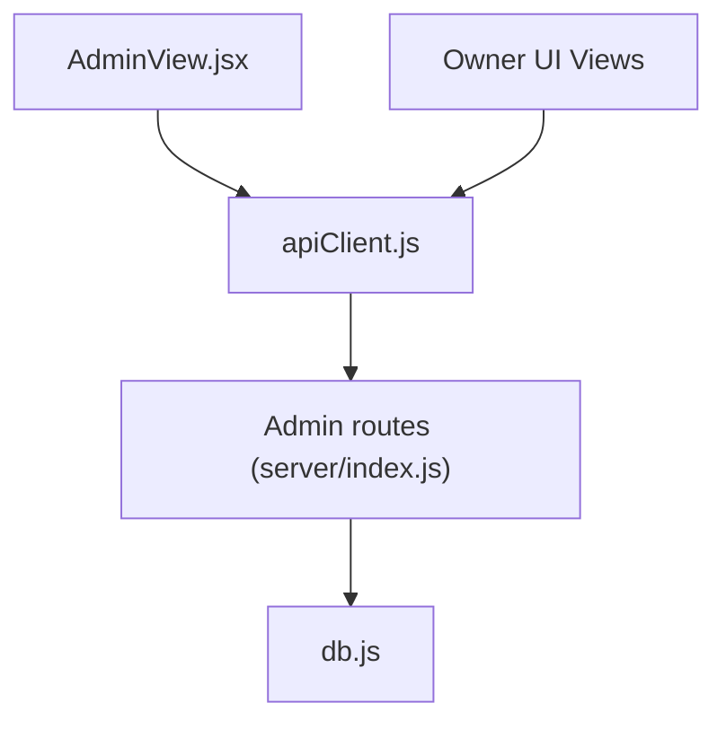
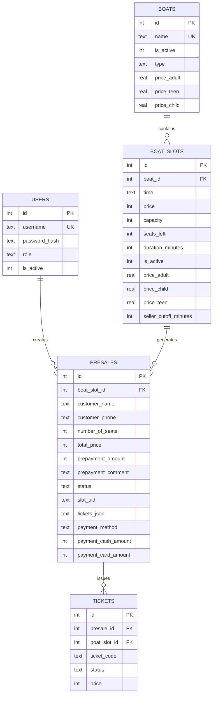
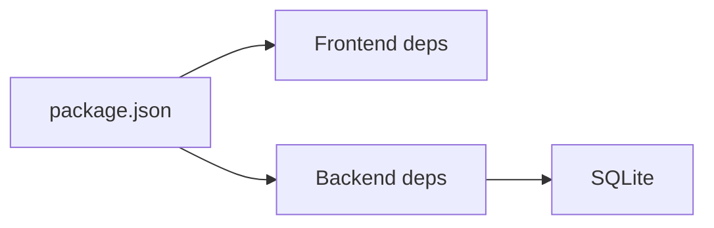

# Project Overview

<cite>
**Referenced Files in This Document**
- [README.md](file://README.md)
- [package.json](file://package.json)
- [server/index.js](file://server/index.js)
- [server/db.js](file://server/db.js)
- [server/auth.js](file://server/auth.js)
- [server/selling.mjs](file://server/selling.mjs)
- [src/App.jsx](file://src/App.jsx)
- [src/views/LandingPage.jsx](file://src/views/LandingPage.jsx)
- [src/views/LoginPage.jsx](file://src/views/LoginPage.jsx)
- [src/views/SellerView.jsx](file://src/views/SellerView.jsx)
- [src/components/seller/SelectBoatType.jsx](file://src/components/seller/SelectBoatType.jsx)
- [src/components/dispatcher/TripListView.jsx](file://src/components/dispatcher/TripListView.jsx)
- [src/views/AdminView.jsx](file://src/views/AdminView.jsx)
- [src/utils/apiClient.js](file://src/utils/apiClient.js)
- [src/data/mockData.js](file://src/data/mockData.js)
</cite>

## Table of Contents
1. [Introduction](#introduction)
2. [Project Structure](#project-structure)
3. [Core Components](#core-components)
4. [Architecture Overview](#architecture-overview)
5. [Detailed Component Analysis](#detailed-component-analysis)
6. [Dependency Analysis](#dependency-analysis)
7. [Performance Considerations](#performance-considerations)
8. [Troubleshooting Guide](#troubleshooting-guide)
9. [Conclusion](#conclusion)

## Introduction
Beach Boat Ticket Sales System is a mobile-first MVP web application designed to demonstrate a complete end-to-end boat ticket sales workflow. It focuses on real-time sales of speed boats and cruise boats trips, while also supporting presales and dispatcher shifts. The system provides role-based access control for sellers, dispatchers, admins, and owners, enabling streamlined operations from ticket purchase to revenue tracking.

Key business value:
- Real-time visibility into trip availability and seat occupancy for speed and cruise boats.
- Streamlined presale management with payment tracking and transfer/refund capabilities.
- Operational excellence for dispatchers with passenger lists and boarding controls.
- Executive oversight for admins and owners with revenue dashboards and user management.

Target audience:
- Sellers who sell tickets on-site.
- Dispatchers who manage trips and passenger flow.
- Admins and owners who oversee operations and financial reporting.

Key differentiators:
- Unified backend APIs serving both seller and dispatcher views.
- Robust seat capacity management with presales as the source of truth for generated slots.
- Dispatcher shift ledger and shift deposit routes for accurate shift accounting.
- SQLite-backed persistence with safe migrations and data normalization.

## Project Structure
The project follows a clear separation of concerns:
- Frontend (React + Vite): Views, components, routing, and API client.
- Backend (Node.js + Express): RESTful routes for authentication, selling, scheduling, and owner/admin features.
- Database (SQLite): File-based storage with migrations and schema normalization.

**Diagram sources**
- [server/index.js](file://server/index.js#L20-L45)
- [server/auth.js](file://server/auth.js#L10-L40)
- [server/db.js](file://server/db.js#L11-L26)
- [server/selling.mjs](file://server/selling.mjs#L1-L20)
- [src/App.jsx](file://src/App.jsx#L40-L136)
- [src/utils/apiClient.js](file://src/utils/apiClient.js#L23-L88)

**Section sources**
- [README.md](file://README.md#L1-L150)
- [package.json](file://package.json#L1-L41)

## Core Components
- Authentication and Authorization:
  - JWT-based login with role enforcement.
  - Protected routes ensuring only authorized roles access specific views.
- Seller Workflow:
  - Multi-step flow: select boat type (speed/cruise), choose trip, select seats, confirm and finalize presale.
  - Real-time seat availability and capacity checks.
- Dispatcher Operations:
  - Trip list view with filtering, sorting, and seat utilization metrics.
  - Passenger list per trip with boarding and refund controls.
- Admin/Owner Dashboard:
  - Revenue statistics, seller performance, and user management.
  - Owner UI for operational insights and financial summaries.

**Section sources**
- [server/auth.js](file://server/auth.js#L10-L75)
- [src/App.jsx](file://src/App.jsx#L24-L38)
- [src/views/SellerView.jsx](file://src/views/SellerView.jsx#L37-L370)
- [src/components/dispatcher/TripListView.jsx](file://src/components/dispatcher/TripListView.jsx#L71-L257)
- [src/views/AdminView.jsx](file://src/views/AdminView.jsx#L10-L382)

## Architecture Overview
The system architecture separates presentation, business logic, and persistence:
- Frontend renders role-specific views and interacts with backend via a typed API client.
- Backend exposes modular routes for auth, selling, scheduling, and owner/admin features.
- Database persists users, boats, slots, presales, tickets, and schedules with robust migrations.

**Diagram sources**
- [server/index.js](file://server/index.js#L20-L45)
- [server/db.js](file://server/db.js#L11-L26)
- [src/utils/apiClient.js](file://src/utils/apiClient.js#L23-L88)

## Detailed Component Analysis

### Authentication and Routing
- Login page captures credentials and stores remembered login info.
- Protected routes enforce role-based access and redirect unauthenticated users.
- JWT tokens are attached to API requests automatically.

**Diagram sources**
- [src/views/LoginPage.jsx](file://src/views/LoginPage.jsx#L56-L79)
- [src/utils/apiClient.js](file://src/utils/apiClient.js#L91-L98)
- [server/auth.js](file://server/auth.js#L120-L142)
- [src/App.jsx](file://src/App.jsx#L40-L136)

**Section sources**
- [src/views/LoginPage.jsx](file://src/views/LoginPage.jsx#L8-L159)
- [src/App.jsx](file://src/App.jsx#L24-L38)
- [server/auth.js](file://server/auth.js#L10-L75)
- [src/utils/apiClient.js](file://src/utils/apiClient.js#L15-L21)

### Seller Ticket Purchase Flow
- Stepwise UX: select boat type → select trip → select seats → confirm and finalize presale.
- Backend enforces capacity checks using presales as the source of truth for generated slots.
- Earnings summary and sales history are available to sellers.

**Diagram sources**
- [src/components/seller/SelectBoatType.jsx](file://src/components/seller/SelectBoatType.jsx#L3-L48)
- [src/views/SellerView.jsx](file://src/views/SellerView.jsx#L127-L170)
- [src/utils/apiClient.js](file://src/utils/apiClient.js#L166-L168)

**Section sources**
- [src/views/SellerView.jsx](file://src/views/SellerView.jsx#L37-L370)
- [src/components/seller/SelectBoatType.jsx](file://src/components/seller/SelectBoatType.jsx#L3-L48)
- [src/utils/apiClient.js](file://src/utils/apiClient.js#L108-L123)

### Dispatcher Trip and Passenger Management
- Dispatcher view lists trips with seat utilization and status filters.
- Drill-down to passenger list with boarding/refund actions.
- Shift ledger and shift deposit routes support accurate shift accounting.

**Diagram sources**
- [src/components/dispatcher/TripListView.jsx](file://src/components/dispatcher/TripListView.jsx#L85-L105)
- [src/utils/apiClient.js](file://src/utils/apiClient.js#L126-L128)
- [server/selling.mjs](file://server/selling.mjs#L1-L20)

**Section sources**
- [src/components/dispatcher/TripListView.jsx](file://src/components/dispatcher/TripListView.jsx#L71-L257)
- [src/utils/apiClient.js](file://src/utils/apiClient.js#L108-L128)
- [server/index.js](file://server/index.js#L25-L40)

### Admin and Owner Dashboard
- Admin view displays revenue, tickets sold, and seller performance.
- Owner UI provides operational insights and financial summaries.
- User management allows creation, activation/deactivation, and password resets.

**Diagram sources**
- [src/views/AdminView.jsx](file://src/views/AdminView.jsx#L50-L77)
- [server/index.js](file://server/index.js#L39-L40)
- [server/db.js](file://server/db.js#L11-L26)

**Section sources**
- [src/views/AdminView.jsx](file://src/views/AdminView.jsx#L10-L382)
- [server/index.js](file://server/index.js#L39-L40)

### Data Model Highlights
- Users, boats, slots, presales, tickets, and schedules are persisted in SQLite with migrations and normalization.
- Seat capacity and seats_left are enforced with presales as the authoritative source for generated slots.

**Diagram sources**
- [server/db.js](file://server/db.js#L40-L120)
- [server/db.js](file://server/db.js#L559-L647)
- [server/db.js](file://server/db.js#L688-L726)

**Section sources**
- [server/db.js](file://server/db.js#L40-L120)
- [server/db.js](file://server/db.js#L559-L647)
- [server/db.js](file://server/db.js#L688-L726)

## Dependency Analysis
- Frontend depends on React, React Router, Tailwind CSS, and a thin API client abstraction.
- Backend depends on Express, better-sqlite3, bcrypt, jsonwebtoken, and node-cron.
- Database is file-based SQLite with migrations and safety checks.

**Diagram sources**
- [package.json](file://package.json#L15-L38)

**Section sources**
- [package.json](file://package.json#L1-L41)

## Performance Considerations
- Seat capacity checks leverage presales as the source of truth for generated slots to avoid cache drift.
- Backend recalculates seats_left and caches computed values to reduce repeated queries.
- UI components debounce heavy operations and use memoization to minimize re-renders.

[No sources needed since this section provides general guidance]

## Troubleshooting Guide
- Authentication failures:
  - Verify JWT secret and token validity.
  - Ensure user account is active and credentials match stored hash.
- Capacity exceeded errors:
  - Confirm seat availability and that presales are counted correctly for generated slots.
- Database initialization issues:
  - Check database file path and permissions; review migrations and normalization logs.

**Section sources**
- [server/auth.js](file://server/auth.js#L10-L40)
- [server/selling.mjs](file://server/selling.mjs#L66-L94)
- [server/db.js](file://server/db.js#L11-L26)

## Conclusion
Beach Boat Ticket Sales System delivers a cohesive, role-aware solution for managing boat trips, presales, and dispatcher operations. Its mobile-first design, robust seat capacity management, and clear separation of frontend, backend, and database layers make it a practical MVP for demonstrating real-world ticketing workflows. The system’s architecture supports future enhancements such as advanced scheduling, analytics, and integrations while maintaining simplicity and reliability.