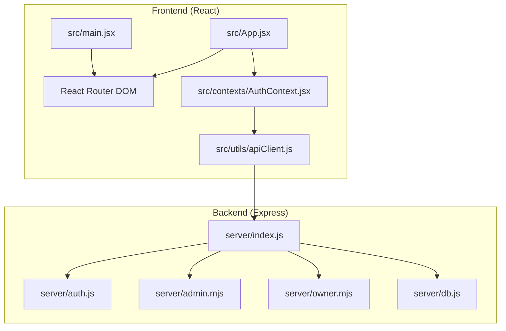
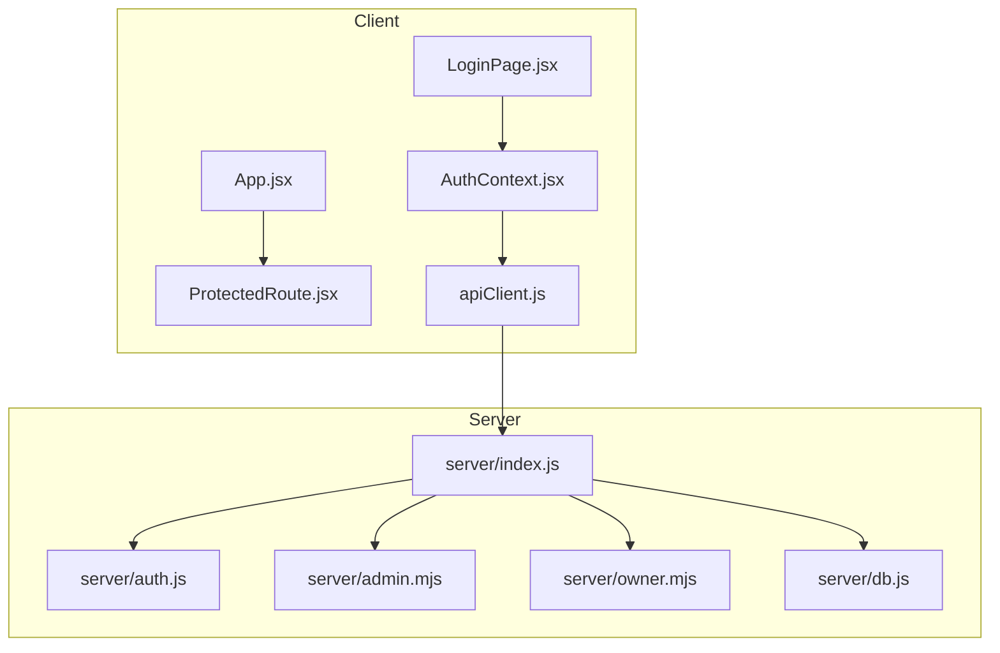
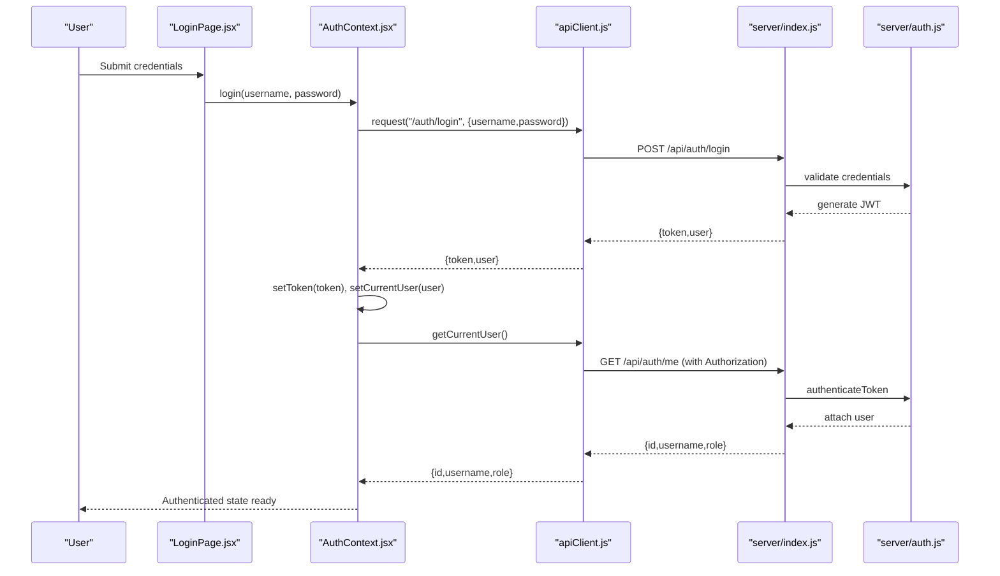
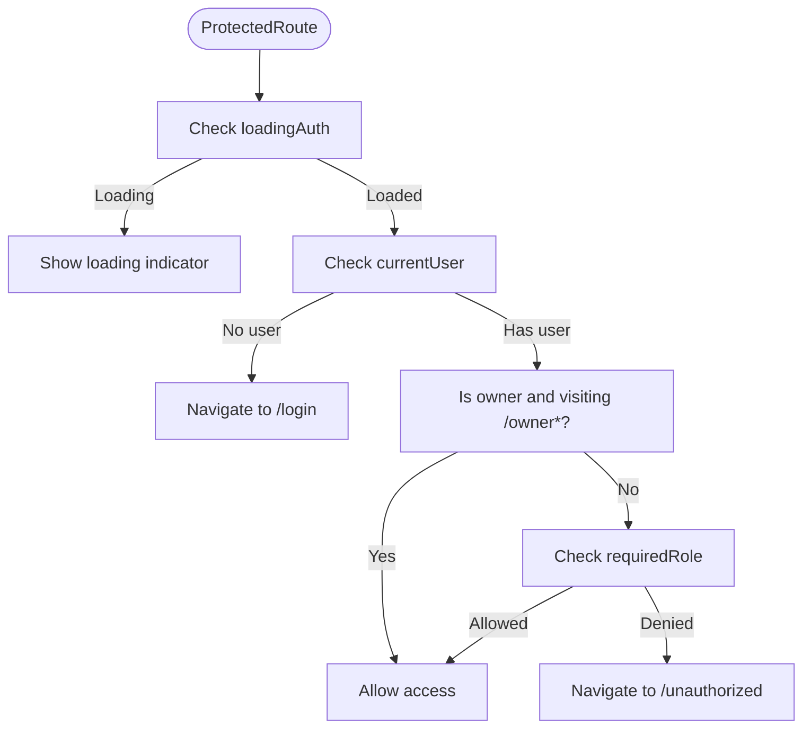
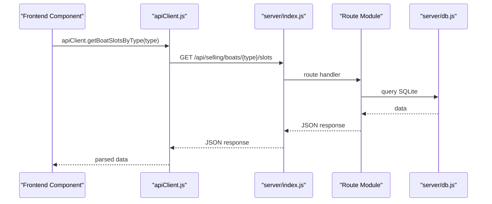
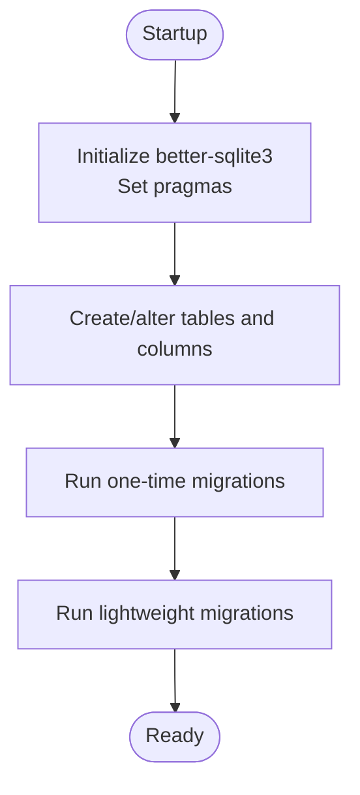
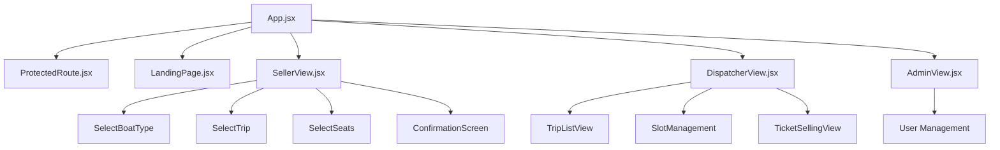
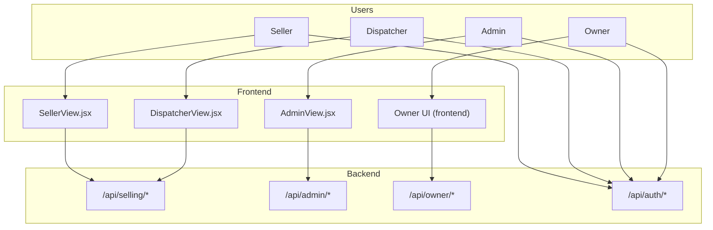
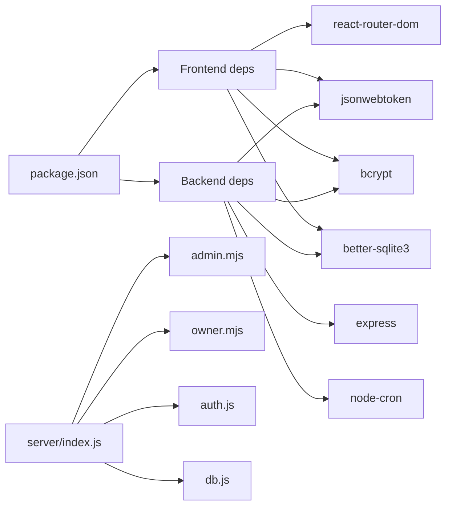

# System Architecture Overview

<cite>
**Referenced Files in This Document**
- [package.json](file://package.json)
- [README.md](file://README.md)
- [src/main.jsx](file://src/main.jsx)
- [src/App.jsx](file://src/App.jsx)
- [src/components/ProtectedRoute.jsx](file://src/components/ProtectedRoute.jsx)
- [src/views/LoginPage.jsx](file://src/views/LoginPage.jsx)
- [src/views/LandingPage.jsx](file://src/views/LandingPage.jsx)
- [src/views/AdminView.jsx](file://src/views/AdminView.jsx)
- [src/views/DispatcherView.jsx](file://src/views/DispatcherView.jsx)
- [src/views/SellerView.jsx](file://src/views/SellerView.jsx)
- [src/contexts/AuthContext.jsx](file://src/contexts/AuthContext.jsx)
- [src/utils/apiClient.js](file://src/utils/apiClient.js)
- [server/index.js](file://server/index.js)
- [server/auth.js](file://server/auth.js)
- [server/admin.mjs](file://server/admin.mjs)
- [server/owner.mjs](file://server/owner.mjs)
- [server/db.js](file://server/db.js)
- [init_db.js](file://init_db.js)
- [server/migrate-manual-offline.js](file://server/migrate-manual-offline.js)
- [server/migrate-owner-settings.js](file://server/migrate-owner-settings.js)
</cite>

## Table of Contents
1. [Introduction](#introduction)
2. [Project Structure](#project-structure)
3. [Core Components](#core-components)
4. [Architecture Overview](#architecture-overview)
5. [Detailed Component Analysis](#detailed-component-analysis)
6. [Dependency Analysis](#dependency-analysis)
7. [Performance Considerations](#performance-considerations)
8. [Troubleshooting Guide](#troubleshooting-guide)
9. [Conclusion](#conclusion)
10. [Appendices](#appendices)

## Introduction
This document describes the system architecture for a React-Express-Node.js application implementing a beach boat ticket sales platform. It focuses on the separation between the frontend React application and the backend Express server, client-server communication patterns, state management via context providers, routing architecture using React Router DOM, authentication flow with JWT tokens and protected routes, component hierarchy, database integration with better-sqlite3 and migration system, system context diagrams, and mobile-first responsive design considerations.

## Project Structure
The project follows a dual-process architecture:
- Frontend: React application bootstrapped with Vite, using React Router DOM for client-side routing and Context APIs for state management.
- Backend: Node.js/Express server exposing RESTful endpoints under /api, backed by a SQLite database via better-sqlite3.

Key runtime scripts and ports:
- Frontend runs on port 5173 (Vite dev server).
- Backend runs on port 3001 (Express server).
- Both can be launched concurrently via npm scripts.

**Diagram sources**
- [src/main.jsx](file://src/main.jsx#L15-L23)
- [src/App.jsx](file://src/App.jsx#L40-L136)
- [src/contexts/AuthContext.jsx](file://src/contexts/AuthContext.jsx#L19-L78)
- [src/utils/apiClient.js](file://src/utils/apiClient.js#L10-L88)
- [server/index.js](file://server/index.js#L20-L45)
- [server/auth.js](file://server/auth.js#L10-L40)
- [server/admin.mjs](file://server/admin.mjs#L1-L15)
- [server/owner.mjs](file://server/owner.mjs#L1-L10)
- [server/db.js](file://server/db.js#L1-L36)

**Section sources**
- [package.json](file://package.json#L6-L13)
- [README.md](file://README.md#L104-L136)

## Core Components
- Frontend bootstrap and routing:
  - Root mounting wraps the app with Router and AuthProvider.
  - App defines public and protected routes, role-based redirects, and nested views.
- Authentication and state:
  - AuthContext manages current user, login/logout, and token persistence in localStorage.
  - apiClient encapsulates HTTP requests, token injection, and response handling.
- Backend server:
  - Express server mounts route modules and middleware for authentication and role checks.
  - Admin and Owner endpoints provide role-scoped access to data and analytics.
- Database:
  - better-sqlite3 initializes the SQLite database and performs migrations on startup.
  - Dedicated migration scripts support offline analytics and settings versioning.

**Section sources**
- [src/main.jsx](file://src/main.jsx#L15-L23)
- [src/App.jsx](file://src/App.jsx#L40-L136)
- [src/contexts/AuthContext.jsx](file://src/contexts/AuthContext.jsx#L19-L78)
- [src/utils/apiClient.js](file://src/utils/apiClient.js#L10-L88)
- [server/index.js](file://server/index.js#L20-L45)
- [server/auth.js](file://server/auth.js#L10-L40)
- [server/admin.mjs](file://server/admin.mjs#L1-L15)
- [server/owner.mjs](file://server/owner.mjs#L1-L10)
- [server/db.js](file://server/db.js#L1-L36)

## Architecture Overview
High-level client-server architecture:
- Client (React):
  - Renders role-specific views and navigates using React Router DOM.
  - Uses AuthContext to enforce protected routes and manage session state.
  - Communicates with backend via apiClient, which attaches Authorization headers when available.
- Server (Express):
  - Exposes REST endpoints under /api.
  - Enforces authentication and role-based authorization using JWT middleware.
  - Provides admin and owner analytics endpoints backed by SQLite.

**Diagram sources**
- [src/views/LoginPage.jsx](file://src/views/LoginPage.jsx#L8-L81)
- [src/App.jsx](file://src/App.jsx#L40-L136)
- [src/components/ProtectedRoute.jsx](file://src/components/ProtectedRoute.jsx#L4-L35)
- [src/contexts/AuthContext.jsx](file://src/contexts/AuthContext.jsx#L19-L78)
- [src/utils/apiClient.js](file://src/utils/apiClient.js#L10-L88)
- [server/index.js](file://server/index.js#L20-L45)
- [server/auth.js](file://server/auth.js#L10-L40)
- [server/admin.mjs](file://server/admin.mjs#L1-L15)
- [server/owner.mjs](file://server/owner.mjs#L1-L10)
- [server/db.js](file://server/db.js#L1-L36)

## Detailed Component Analysis

### Authentication and JWT Flow
- Client:
  - LoginPage triggers AuthContext login, which calls apiClient.login and persists token.
  - On initial load, AuthContext attempts to fetch current user using apiClient.getCurrentUser.
  - ProtectedRoute enforces role-based access and redirects unauthorized users.
- Server:
  - /api/auth/login validates credentials and returns a signed JWT.
  - /api/auth/me requires a valid JWT and returns user info.
  - authenticateToken middleware verifies JWT and attaches user record to req.
  - Role guards (isAdmin, canSell, canDispatchManageSlots, canOwnerAccess, canOwnerOrAdmin) restrict endpoints.

**Diagram sources**
- [src/views/LoginPage.jsx](file://src/views/LoginPage.jsx#L56-L79)
- [src/contexts/AuthContext.jsx](file://src/contexts/AuthContext.jsx#L55-L63)
- [src/utils/apiClient.js](file://src/utils/apiClient.js#L91-L103)
- [server/index.js](file://server/index.js#L25-L26)
- [server/auth.js](file://server/auth.js#L120-L151)

**Section sources**
- [src/views/LoginPage.jsx](file://src/views/LoginPage.jsx#L56-L79)
- [src/contexts/AuthContext.jsx](file://src/contexts/AuthContext.jsx#L55-L63)
- [src/utils/apiClient.js](file://src/utils/apiClient.js#L91-L103)
- [server/auth.js](file://server/auth.js#L10-L40)
- [server/auth.js](file://server/auth.js#L120-L151)

### Protected Routes and Role-Based Access Control
- ProtectedRoute enforces:
  - Loading state while auth resolves.
  - Redirect to /login if not authenticated.
  - Role validation against requiredRole prop.
  - Special allowance for owner role accessing owner UI routes.
- App.jsx mounts ProtectedRoute wrappers around role-specific views.

**Diagram sources**
- [src/components/ProtectedRoute.jsx](file://src/components/ProtectedRoute.jsx#L4-L35)
- [src/App.jsx](file://src/App.jsx#L52-L130)

**Section sources**
- [src/components/ProtectedRoute.jsx](file://src/components/ProtectedRoute.jsx#L4-L35)
- [src/App.jsx](file://src/App.jsx#L52-L130)

### Client-Server Communication Patterns
- apiClient centralizes HTTP interactions:
  - Auto-injects Authorization header from localStorage.
  - Supports JSON serialization and network logging.
  - Provides convenience methods for auth, selling, presales, tickets, schedule templates, and owner analytics.
- Backend routes:
  - server/index.js mounts route modules and applies authenticateToken for protected endpoints.
  - Admin endpoints (/api/admin) and Owner endpoints (/api/owner) are guarded by role checks.

**Diagram sources**
- [src/utils/apiClient.js](file://src/utils/apiClient.js#L121-L123)
- [server/index.js](file://server/index.js#L25-L39)
- [server/db.js](file://server/db.js#L1-L36)

**Section sources**
- [src/utils/apiClient.js](file://src/utils/apiClient.js#L23-L88)
- [server/index.js](file://server/index.js#L25-L39)

### Database Layer Integration and Migration System
- Initialization and migrations:
  - server/db.js initializes better-sqlite3, sets pragmas, and creates/updates tables and columns on startup.
  - One-time and lightweight migrations normalize data, add columns, and create new tables.
  - init_db.js triggers database initialization on demand.
- Offline analytics and settings:
  - server/migrate-manual-offline.js creates tables for manual day and boat stats snapshots.
  - server/migrate-owner-settings.js creates tables for owner settings versions and day snapshots.

**Diagram sources**
- [server/db.js](file://server/db.js#L15-L26)
- [server/db.js](file://server/db.js#L38-L557)
- [init_db.js](file://init_db.js#L1-L8)
- [server/migrate-manual-offline.js](file://server/migrate-manual-offline.js#L26-L64)
- [server/migrate-owner-settings.js](file://server/migrate-owner-settings.js#L25-L49)

**Section sources**
- [server/db.js](file://server/db.js#L15-L26)
- [server/db.js](file://server/db.js#L38-L557)
- [init_db.js](file://init_db.js#L1-L8)
- [server/migrate-manual-offline.js](file://server/migrate-manual-offline.js#L26-L64)
- [server/migrate-owner-settings.js](file://server/migrate-owner-settings.js#L25-L49)

### Component Hierarchy and Views
- Entry and routing:
  - LandingPage redirects authenticated users to role-specific home pages.
  - App.jsx defines public routes (/login, /unauthorized) and protected routes for roles.
- Role-specific views:
  - AdminView: dashboard, user management, boat management, working zone.
  - DispatcherView: trip listings, selling controls, slot management, shift close.
  - SellerView: multi-step ticket sale flow (type → trip → seats → confirmation).
- Shared components:
  - ProtectedRoute, Toast, DebugButton.

**Diagram sources**
- [src/App.jsx](file://src/App.jsx#L40-L136)
- [src/views/LandingPage.jsx](file://src/views/LandingPage.jsx#L5-L32)
- [src/views/SellerView.jsx](file://src/views/SellerView.jsx#L234-L317)
- [src/views/DispatcherView.jsx](file://src/views/DispatcherView.jsx#L233-L284)
- [src/views/AdminView.jsx](file://src/views/AdminView.jsx#L161-L378)

**Section sources**
- [src/App.jsx](file://src/App.jsx#L40-L136)
- [src/views/LandingPage.jsx](file://src/views/LandingPage.jsx#L5-L32)
- [src/views/SellerView.jsx](file://src/views/SellerView.jsx#L234-L317)
- [src/views/DispatcherView.jsx](file://src/views/DispatcherView.jsx#L233-L284)
- [src/views/AdminView.jsx](file://src/views/AdminView.jsx#L161-L378)

### System Context Diagrams
- Users, Roles, and System Components:
  - Users have roles: seller, dispatcher, admin, owner.
  - Admin and Owner endpoints are protected by role checks.
  - Owner UI is separate from backend routes but shares the same JWT session.

**Diagram sources**
- [src/views/SellerView.jsx](file://src/views/SellerView.jsx#L37-L41)
- [src/views/DispatcherView.jsx](file://src/views/DispatcherView.jsx#L23-L31)
- [src/views/AdminView.jsx](file://src/views/AdminView.jsx#L10-L17)
- [server/admin.mjs](file://server/admin.mjs#L1-L15)
- [server/owner.mjs](file://server/owner.mjs#L1-L10)
- [server/auth.js](file://server/auth.js#L10-L40)

## Dependency Analysis
- Frontend dependencies:
  - React, React Router DOM, better-sqlite3 (runtime), jsonwebtoken (runtime), bcrypt (runtime).
- Backend dependencies:
  - Express, better-sqlite3, jsonwebtoken, bcrypt, node-cron.
- Internal dependencies:
  - server/index.js depends on route modules and db.js.
  - apiClient.js depends on environment and localStorage for tokens.

**Diagram sources**
- [package.json](file://package.json#L15-L39)
- [server/index.js](file://server/index.js#L6-L15)
- [server/admin.mjs](file://server/admin.mjs#L1-L5)
- [server/owner.mjs](file://server/owner.mjs#L1-L4)
- [server/auth.js](file://server/auth.js#L1-L5)
- [server/db.js](file://server/db.js#L1-L6)

**Section sources**
- [package.json](file://package.json#L15-L39)
- [server/index.js](file://server/index.js#L6-L15)

## Performance Considerations
- Database:
  - WAL mode and busy_timeout configured for concurrency and responsiveness.
  - Indexes created for presales slot_uid to optimize lookups.
- Network:
  - apiClient logs request durations and responses for diagnostics.
  - Token caching avoids redundant auth calls until expiration.
- UI:
  - Mobile-first design with big buttons and minimal text improves touch UX.
  - Conditional rendering and lazy loading of heavy components recommended.

## Troubleshooting Guide
- Authentication failures:
  - Verify JWT secret and token presence in localStorage.
  - Check /api/auth/login and /api/auth/me responses.
- Protected route issues:
  - Ensure ProtectedRoute receives requiredRole and that user role matches.
  - Confirm authenticateToken middleware is applied to protected routes.
- Database initialization:
  - On startup, server/db.js prints database file path and runs migrations.
  - Use init_db.js to force initialization if needed.
- Offline analytics:
  - Run migration scripts to create manual and owner settings tables.

**Section sources**
- [server/auth.js](file://server/auth.js#L10-L40)
- [server/auth.js](file://server/auth.js#L120-L151)
- [src/components/ProtectedRoute.jsx](file://src/components/ProtectedRoute.jsx#L4-L35)
- [server/db.js](file://server/db.js#L15-L26)
- [init_db.js](file://init_db.js#L1-L8)
- [server/migrate-manual-offline.js](file://server/migrate-manual-offline.js#L26-L64)
- [server/migrate-owner-settings.js](file://server/migrate-owner-settings.js#L25-L49)

## Conclusion
The system employs a clean separation between a React frontend and an Express backend, with JWT-based authentication and role-scoped access control. State management is centralized via React Context, and routing ensures protected access to role-specific views. The backend leverages better-sqlite3 for a file-based database with robust migration logic and dedicated analytics tables. The architecture supports mobile-first UX and provides a foundation for future enhancements.

## Appendices
- Cross-platform compatibility:
  - Node.js and better-sqlite3 are platform-agnostic; ensure consistent environment variables and file paths.
- Responsive design:
  - Tailwind CSS classes and mobile-first patterns are used across views.