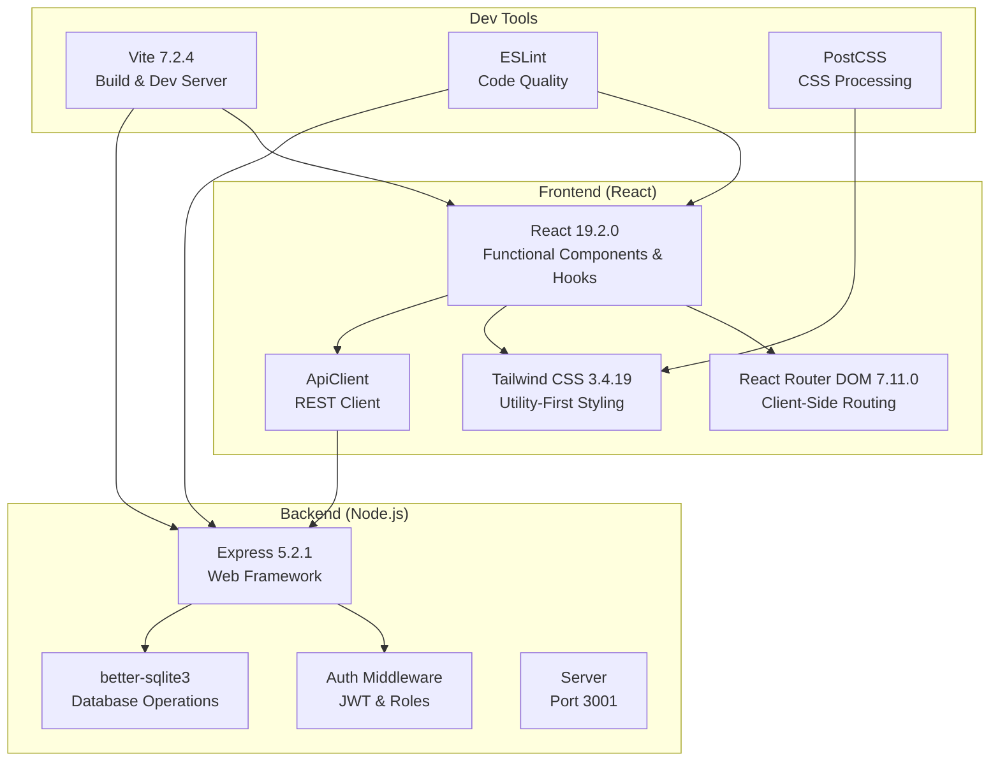

# Technology Stack Details

<cite>
**Referenced Files in This Document**
- [package.json](file://package.json)
- [vite.config.js](file://vite.config.js)
- [tailwind.config.js](file://tailwind.config.js)
- [postcss.config.js](file://postcss.config.js)
- [eslint.config.js](file://eslint.config.js)
- [server/index.js](file://server/index.js)
- [server/db.js](file://server/db.js)
- [server/auth.js](file://server/auth.js)
- [.env](file://.env)
- [src/main.jsx](file://src/main.jsx)
- [src/App.jsx](file://src/App.jsx)
- [src/utils/apiClient.js](file://src/utils/apiClient.js)
- [src/index.css](file://src/index.css)
- [start-dev.bat](file://start-dev.bat)
- [start-dev.ps1](file://start-dev.ps1)
</cite>

## Table of Contents
1. [Introduction](#introduction)
2. [Frontend Stack](#frontend-stack)
3. [Backend Stack](#backend-stack)
4. [Development Stack](#development-stack)
5. [Build Configuration](#build-configuration)
6. [Environment Setup](#environment-setup)
7. [Deployment Preparation](#deployment-preparation)
8. [Version Compatibility and Upgrade Considerations](#version-compatibility-and-upgrade-considerations)
9. [Database Choice Rationale](#database-choice-rationale)
10. [Mobile-First Design Selection](#mobile-first-design-selection)
11. [Architecture Overview](#architecture-overview)
12. [Troubleshooting Guide](#troubleshooting-guide)
13. [Conclusion](#conclusion)

## Introduction
This document details the modern web development technology stack used in the boat ticketing system. It covers the frontend (React 19.2.0, React Router DOM 7.11.0, Tailwind CSS 3.4.19), backend (Express 5.2.1, Node.js runtime, better-sqlite3), development tools (Vite 7.2.4, ESLint, PostCSS), build configuration, environment setup, and deployment preparation. It also explains version compatibility, upgrade considerations, and the rationale for choosing SQLite for this MVP demonstration.

## Frontend Stack
The frontend is built with React 19.2.0 using functional components and hooks. Routing is handled by React Router DOM 7.11.0, and styling leverages Tailwind CSS 3.4.19 for utility-first CSS. The application initializes with a strict mode and mounts the application inside a routing context with authentication provider.

Key frontend components and configurations:
- React 19.2.0 with functional components and hooks
- React Router DOM 7.11.0 for client-side routing
- Tailwind CSS 3.4.19 with PostCSS processing
- Strict mode mounting in main entry point
- Protected routes and role-based navigation

**Section sources**
- [src/main.jsx](file://src/main.jsx#L1-L26)
- [src/App.jsx](file://src/App.jsx#L1-L139)
- [package.json](file://package.json#L21-L23)
- [tailwind.config.js](file://tailwind.config.js#L1-L12)
- [postcss.config.js](file://postcss.config.js#L1-L7)
- [src/index.css](file://src/index.css#L1-L33)

## Backend Stack
The backend is powered by Express 5.2.1 running on Node.js. Authentication uses JSON Web Tokens (JWT) with bcrypt for password hashing. Data persistence is handled by better-sqlite3, which connects to a local SQLite database file located at the project root. The server exposes RESTful API endpoints under the /api prefix and includes middleware for authentication and role-based access control.

Core backend components:
- Express 5.2.1 web framework
- Node.js runtime environment
- better-sqlite3 for database operations
- JWT-based authentication and authorization
- Centralized database initialization and migrations

**Section sources**
- [server/index.js](file://server/index.js#L1-L45)
- [server/db.js](file://server/db.js#L1-L800)
- [server/auth.js](file://server/auth.js#L1-L154)
- [package.json](file://package.json#L15-L24)

## Development Stack
The development environment utilizes Vite 7.2.4 for fast builds and hot module replacement. Code quality is enforced via ESLint with React Hooks and React Refresh plugins. PostCSS is configured with Tailwind CSS and Autoprefixer for CSS processing. Development scripts orchestrate concurrent client and server startup.

Development tools:
- Vite 7.2.4 for rapid development builds
- ESLint with React Hooks and React Refresh configurations
- PostCSS with Tailwind CSS and Autoprefixer
- Concurrent development servers for frontend and backend

**Section sources**
- [package.json](file://package.json#L6-L14)
- [vite.config.js](file://vite.config.js#L1-L25)
- [eslint.config.js](file://eslint.config.js#L1-L30)
- [postcss.config.js](file://postcss.config.js#L1-L7)

## Build Configuration
The build system relies on Vite for bundling and optimizing the React application. The configuration enables the React plugin, sets up a development server with proxying to the backend API, and configures content paths for Tailwind CSS. Production builds are generated via the build script defined in package.json.

Build specifics:
- Vite configuration with React plugin
- Proxy configuration for /api requests to backend
- Tailwind CSS content scanning paths
- Production build generation

**Section sources**
- [vite.config.js](file://vite.config.js#L1-L25)
- [tailwind.config.js](file://tailwind.config.js#L1-L12)
- [package.json](file://package.json#L11-L11)

## Environment Setup
Environment variables are managed through a .env file for development mode flags. The application uses environment-specific configuration for development, with the backend listening on port 3001 and the frontend on port 5173. Development scripts are provided for Windows (.bat) and PowerShell (.ps1) environments.

Environment details:
- Development mode flag in .env
- Backend port 3001, frontend port 5173
- Cross-platform development launch scripts

**Section sources**
- [.env](file://.env#L1-L1)
- [server/index.js](file://server/index.js#L21-L21)
- [vite.config.js](file://vite.config.js#L6-L9)
- [start-dev.bat](file://start-dev.bat#L1-L11)
- [start-dev.ps1](file://start-dev.ps1#L1-L9)

## Deployment Preparation
The application is structured for straightforward deployment. The React frontend can be built using Vite and served statically, while the Node.js backend runs independently. Database files are stored locally, and environment variables can be configured for production deployment. The development scripts demonstrate the separation of concerns between frontend and backend services.

Deployment considerations:
- Static build generation for React frontend
- Independent Node.js backend service
- Local SQLite database file management
- Environment variable configuration for production

**Section sources**
- [package.json](file://package.json#L11-L11)
- [server/db.js](file://server/db.js#L11-L12)

## Version Compatibility and Upgrade Considerations
The project specifies precise versions for all major dependencies. Upgrades should be approached systematically, considering breaking changes in major versions and ensuring compatibility across the frontend, backend, and development toolchain.

Compatibility highlights:
- React 19.2.0 with hooks and functional components
- React Router DOM 7.11.0 for client-side routing
- Tailwind CSS 3.4.19 with PostCSS processing
- Express 5.2.1 for backend framework
- better-sqlite3 for database operations
- Vite 7.2.4 for build tooling
- ESLint for code quality

Upgrade considerations:
- Major version upgrades require thorough testing of React components and hooks
- Router updates should validate route definitions and protected routes
- Tailwind CSS updates may require reviewing utility class usage
- Express upgrades should verify middleware and route handler compatibility
- better-sqlite3 updates should validate database operations and migrations
- Vite upgrades should confirm plugin compatibility and build configuration
- ESLint updates should review rule configurations and plugin compatibility

**Section sources**
- [package.json](file://package.json#L15-L39)

## Database Choice Rationale
SQLite is selected for this MVP demonstration due to its simplicity, zero-configuration operation, and suitability for small-scale applications. better-sqlite3 provides a native, efficient interface for Node.js applications, enabling fast database operations without external dependencies. This choice reduces complexity for development and deployment while supporting the application's current requirements.

Database rationale:
- Zero-configuration operation simplifies setup
- Native performance with better-sqlite3
- Suitable for MVP scale and small teams
- Reduced operational overhead compared to external databases

**Section sources**
- [server/db.js](file://server/db.js#L1-L800)
- [package.json](file://package.json#L17-L17)

## Mobile-First Design Selection
The frontend employs Tailwind CSS for utility-first styling, enabling responsive design patterns that prioritize mobile experiences. The dark theme foundation and system font stack contribute to a modern, accessible interface suitable for various devices. Combined with React's component model and React Router for navigation, the stack supports a cohesive mobile-first web application.

Mobile-first advantages:
- Utility-first CSS with Tailwind for responsive design
- Dark theme optimized for low-light conditions
- System fonts for optimal performance and accessibility
- Component-based architecture for maintainable UI

**Section sources**
- [tailwind.config.js](file://tailwind.config.js#L1-L12)
- [src/index.css](file://src/index.css#L1-L33)
- [package.json](file://package.json#L37-L37)

## Architecture Overview
The application follows a classic client-server architecture with a React frontend and Express backend. The frontend communicates with the backend via RESTful API calls, while the backend manages authentication, authorization, and data persistence using better-sqlite3. Development is streamlined through Vite's fast rebuilds and hot module replacement.

**Diagram sources**
- [src/main.jsx](file://src/main.jsx#L1-L26)
- [src/App.jsx](file://src/App.jsx#L1-L139)
- [server/index.js](file://server/index.js#L1-L45)
- [server/auth.js](file://server/auth.js#L1-L154)
- [server/db.js](file://server/db.js#L1-L800)
- [vite.config.js](file://vite.config.js#L1-L25)
- [eslint.config.js](file://eslint.config.js#L1-L30)
- [postcss.config.js](file://postcss.config.js#L1-L7)

## Troubleshooting Guide
Common issues and resolutions:
- Database initialization failures: Verify database file path and permissions
- Authentication token errors: Check JWT secret and token expiration
- CORS/proxy issues: Validate Vite proxy configuration for /api routes
- Build errors: Ensure Node.js version compatibility and dependency installation
- Styling inconsistencies: Confirm Tailwind content paths and PostCSS configuration

Troubleshooting references:
- Database initialization and error handling
- Authentication middleware and token verification
- API client request/response handling and error logging
- Vite proxy configuration for development server

**Section sources**
- [server/db.js](file://server/db.js#L17-L26)
- [server/auth.js](file://server/auth.js#L10-L40)
- [src/utils/apiClient.js](file://src/utils/apiClient.js#L42-L88)
- [vite.config.js](file://vite.config.js#L10-L22)

## Conclusion
The boat ticketing system leverages a modern, efficient technology stack optimized for rapid development and maintainability. The combination of React, Express, and better-sqlite3 provides a solid foundation for an MVP, while Vite, ESLint, and Tailwind streamline the development experience. The chosen architecture supports mobile-first design principles and offers clear pathways for future scaling and enhancement.