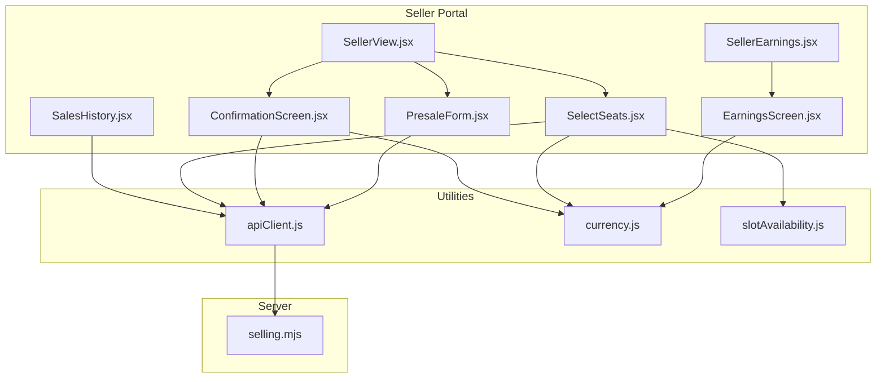
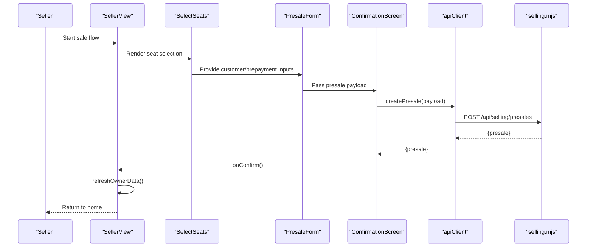
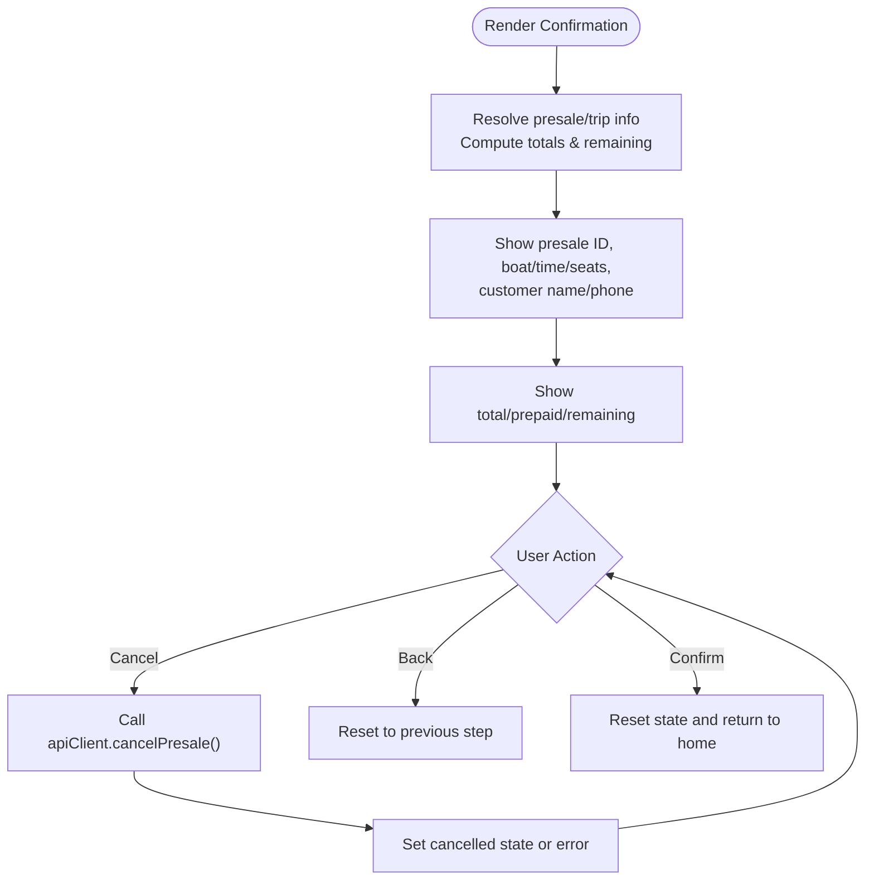
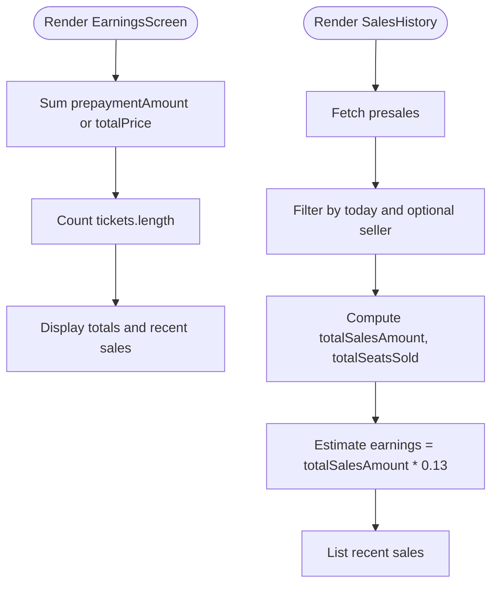
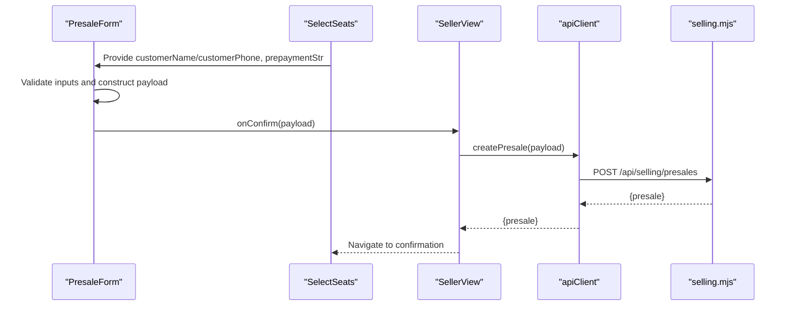
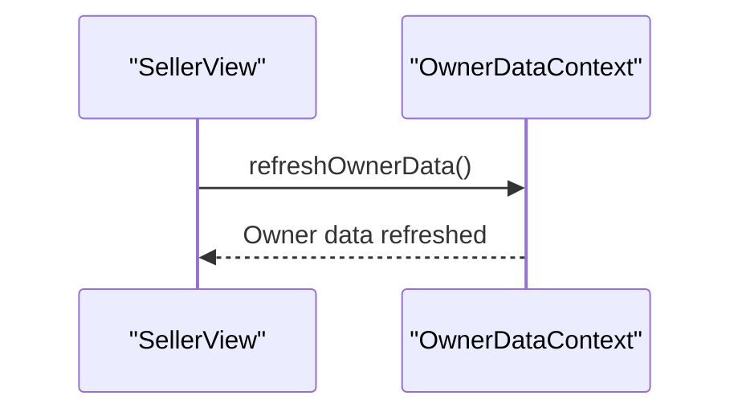
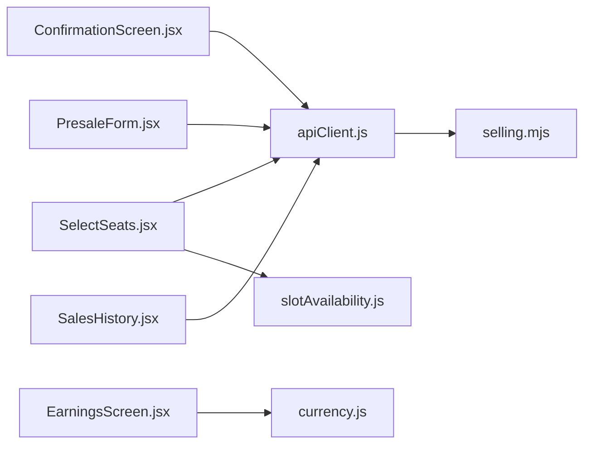

# Confirmation & Earnings

<cite>
**Referenced Files in This Document**
- [ConfirmationScreen.jsx](file://src/components/seller/ConfirmationScreen.jsx)
- [EarningsScreen.jsx](file://src/components/seller/EarningsScreen.jsx)
- [SellerEarnings.jsx](file://src/views/SellerEarnings.jsx)
- [PresaleForm.jsx](file://src/components/seller/PresaleForm.jsx)
- [SelectSeats.jsx](file://src/components/seller/SelectSeats.jsx)
- [SellerView.jsx](file://src/views/SellerView.jsx)
- [SalesHistory.jsx](file://src/components/seller/SalesHistory.jsx)
- [SellerHome.jsx](file://src/views/SellerHome.jsx)
- [apiClient.js](file://src/utils/apiClient.js)
- [currency.js](file://src/utils/currency.js)
- [slotAvailability.js](file://src/utils/slotAvailability.js)
- [selling.mjs](file://server/selling.mjs)
- [OwnerDataContext.jsx](file://src/contexts/OwnerDataContext.jsx)
</cite>

## Table of Contents
1. [Introduction](#introduction)
2. [Project Structure](#project-structure)
3. [Core Components](#core-components)
4. [Architecture Overview](#architecture-overview)
5. [Detailed Component Analysis](#detailed-component-analysis)
6. [Dependency Analysis](#dependency-analysis)
7. [Performance Considerations](#performance-considerations)
8. [Troubleshooting Guide](#troubleshooting-guide)
9. [Conclusion](#conclusion)

## Introduction
This document explains the confirmation and earnings tracking functionality in the seller portal. It covers:
- The confirmation screen that displays final ticket/presale details, customer information, trip details, seat numbers, and payment status.
- The earnings calculation system that aggregates tickets sold, estimates earnings, and presents daily summaries and recent sales.
- The presale creation workflow that collects customer data, handles prepayments, and generates presales.
- Integration with owner data refresh mechanisms and real-time updates.
- Examples of earnings calculations, commission structures, and bonus algorithms used in the system.

## Project Structure
The seller portal is a React application with a clear separation of concerns:
- Views orchestrate user flows and state transitions.
- Components encapsulate UI and business logic for selection, confirmation, and earnings.
- Utilities provide currency formatting, availability helpers, and API client abstractions.
- The server exposes selling endpoints for presales, transfers, and ticket operations.

**Diagram sources**
- [SellerView.jsx](file://src/views/SellerView.jsx#L1-L370)
- [SelectSeats.jsx](file://src/components/seller/SelectSeats.jsx#L1-L549)
- [ConfirmationScreen.jsx](file://src/components/seller/ConfirmationScreen.jsx#L1-L221)
- [EarningsScreen.jsx](file://src/components/seller/EarningsScreen.jsx#L1-L68)
- [SalesHistory.jsx](file://src/components/seller/SalesHistory.jsx#L1-L199)
- [SellerEarnings.jsx](file://src/views/SellerEarnings.jsx#L1-L91)
- [PresaleForm.jsx](file://src/components/seller/PresaleForm.jsx#L1-L219)
- [apiClient.js](file://src/utils/apiClient.js#L1-L360)
- [currency.js](file://src/utils/currency.js#L1-L15)
- [slotAvailability.js](file://src/utils/slotAvailability.js#L1-L19)
- [selling.mjs](file://server/selling.mjs#L1-L800)

**Section sources**
- [SellerView.jsx](file://src/views/SellerView.jsx#L1-L370)
- [apiClient.js](file://src/utils/apiClient.js#L1-L360)
- [selling.mjs](file://server/selling.mjs#L1-L800)

## Core Components
- ConfirmationScreen: Renders the final presale details, customer info, trip info, seat count, and payment status. Provides actions to cancel a presale (via API client) and confirm completion.
- EarningsScreen: Aggregates today’s sales, shows total tickets and earnings, and lists recent sales.
- SalesHistory: Loads presales, filters by today and optionally by seller, computes totals and estimated earnings.
- PresaleForm: Collects customer name/phone, seat count/breakdown, and prepayment; validates inputs and constructs payload.
- SelectSeats: Advanced seat selection with per-category breakdown, availability checks, and prepayment validation.
- SellerView: Orchestrates the end-to-end flow from selecting a boat type, trips, seats, to confirmation and presale creation.
- apiClient: Centralized HTTP client with token handling and convenience methods for selling endpoints.
- Currency utilities: Consistent RUB formatting across screens.
- Slot availability utilities: Normalizes available seat counts for UI.

**Section sources**
- [ConfirmationScreen.jsx](file://src/components/seller/ConfirmationScreen.jsx#L1-L221)
- [EarningsScreen.jsx](file://src/components/seller/EarningsScreen.jsx#L1-L68)
- [SalesHistory.jsx](file://src/components/seller/SalesHistory.jsx#L1-L199)
- [PresaleForm.jsx](file://src/components/seller/PresaleForm.jsx#L1-L219)
- [SelectSeats.jsx](file://src/components/seller/SelectSeats.jsx#L1-L549)
- [SellerView.jsx](file://src/views/SellerView.jsx#L1-L370)
- [apiClient.js](file://src/utils/apiClient.js#L1-L360)
- [currency.js](file://src/utils/currency.js#L1-L15)
- [slotAvailability.js](file://src/utils/slotAvailability.js#L1-L19)

## Architecture Overview
The seller portal integrates UI components with backend APIs to support presale creation and earnings tracking. The flow begins with the seller selecting a boat type and trip, choosing seats and collecting customer/prepayment data, then confirming and creating a presale. The UI updates earnings summaries and triggers owner data refreshes.

**Diagram sources**
- [SellerView.jsx](file://src/views/SellerView.jsx#L150-L170)
- [SelectSeats.jsx](file://src/components/seller/SelectSeats.jsx#L142-L216)
- [PresaleForm.jsx](file://src/components/seller/PresaleForm.jsx#L62-L82)
- [ConfirmationScreen.jsx](file://src/components/seller/ConfirmationScreen.jsx#L292-L312)
- [apiClient.js](file://src/utils/apiClient.js#L166-L168)
- [selling.mjs](file://server/selling.mjs#L642-L800)

## Detailed Component Analysis

### Confirmation Screen
The confirmation screen consolidates the final presale details and payment status:
- Displays presale ID, boat name, time, seats, customer name, and phone.
- Computes total price from either API-provided fields or seat count × unit price.
- Computes paid amount from API or local prepayment input and remaining balance.
- Provides actions to cancel a presale (via API client), go back, or confirm completion.
- Integrates with owner data refresh after successful presale creation.

**Diagram sources**
- [ConfirmationScreen.jsx](file://src/components/seller/ConfirmationScreen.jsx#L23-L117)

**Section sources**
- [ConfirmationScreen.jsx](file://src/components/seller/ConfirmationScreen.jsx#L1-L221)
- [SellerView.jsx](file://src/views/SellerView.jsx#L150-L170)

### Earnings Tracking
There are two complementary earnings views:
- EarningsScreen: Aggregates tickets passed from the view, sums prepayment amounts, and shows total tickets and earnings.
- SalesHistory: Loads presales, filters by today and optionally by seller, computes totals and estimated earnings using a fixed commission rate.

**Diagram sources**
- [EarningsScreen.jsx](file://src/components/seller/EarningsScreen.jsx#L3-L68)
- [SalesHistory.jsx](file://src/components/seller/SalesHistory.jsx#L64-L135)

**Section sources**
- [EarningsScreen.jsx](file://src/components/seller/EarningsScreen.jsx#L1-L68)
- [SalesHistory.jsx](file://src/components/seller/SalesHistory.jsx#L1-L199)
- [SellerEarnings.jsx](file://src/views/SellerEarnings.jsx#L1-L91)

### Presale Creation Workflow
The presale creation process collects customer data, validates inputs, and submits a payload:
- PresaleForm: Validates customer name/phone, prepayment bounds, and constructs payload with seat breakdown if provided.
- SelectSeats: Supports per-category seat breakdown, enforces availability, and validates prepayment ≤ total price.
- SellerView: Builds payload from parent-held state and delegates creation to apiClient.createPresale, then navigates to confirmation.

**Diagram sources**
- [PresaleForm.jsx](file://src/components/seller/PresaleForm.jsx#L39-L82)
- [SelectSeats.jsx](file://src/components/seller/SelectSeats.jsx#L142-L216)
- [SellerView.jsx](file://src/views/SellerView.jsx#L265-L279)
- [apiClient.js](file://src/utils/apiClient.js#L166-L168)
- [selling.mjs](file://server/selling.mjs#L642-L800)

**Section sources**
- [PresaleForm.jsx](file://src/components/seller/PresaleForm.jsx#L1-L219)
- [SelectSeats.jsx](file://src/components/seller/SelectSeats.jsx#L1-L549)
- [SellerView.jsx](file://src/views/SellerView.jsx#L150-L170)

### Owner Data Refresh Integration
After a successful presale creation, the seller view triggers owner data refresh to keep dashboards up to date:
- SellerView calls refreshOwnerData() after presale creation.
- OwnerDataContext provides refreshOwnerData() and refreshAllMoneyData() for owner-facing views.

**Diagram sources**
- [SellerView.jsx](file://src/views/SellerView.jsx#L158-L161)
- [OwnerDataContext.jsx](file://src/contexts/OwnerDataContext.jsx#L106-L112)

**Section sources**
- [SellerView.jsx](file://src/views/SellerView.jsx#L150-L170)
- [OwnerDataContext.jsx](file://src/contexts/OwnerDataContext.jsx#L1-L131)

## Dependency Analysis
Key dependencies and interactions:
- UI components depend on apiClient for backend operations.
- Currency formatting is centralized in currency.js.
- Seat availability normalization is handled by slotAvailability.js.
- Server endpoints in selling.mjs implement presale creation, cancellation, and transfer logic.

**Diagram sources**
- [ConfirmationScreen.jsx](file://src/components/seller/ConfirmationScreen.jsx#L1-L221)
- [SelectSeats.jsx](file://src/components/seller/SelectSeats.jsx#L1-L549)
- [PresaleForm.jsx](file://src/components/seller/PresaleForm.jsx#L1-L219)
- [EarningsScreen.jsx](file://src/components/seller/EarningsScreen.jsx#L1-L68)
- [SalesHistory.jsx](file://src/components/seller/SalesHistory.jsx#L1-L199)
- [apiClient.js](file://src/utils/apiClient.js#L1-L360)
- [currency.js](file://src/utils/currency.js#L1-L15)
- [slotAvailability.js](file://src/utils/slotAvailability.js#L1-L19)
- [selling.mjs](file://server/selling.mjs#L1-L800)

**Section sources**
- [apiClient.js](file://src/utils/apiClient.js#L1-L360)
- [currency.js](file://src/utils/currency.js#L1-L15)
- [slotAvailability.js](file://src/utils/slotAvailability.js#L1-L19)
- [selling.mjs](file://server/selling.mjs#L1-L800)

## Performance Considerations
- UI computations: Currency formatting and seat availability checks are lightweight and memoized where applicable.
- Network calls: apiClient batches requests and centralizes token handling; consider caching for repeated reads.
- Real-time updates: Owner data refresh is triggered on presale creation; avoid excessive refresh calls to prevent UI thrashing.

## Troubleshooting Guide
Common issues and resolutions:
- Presale creation fails due to invalid inputs:
  - Ensure customer name length ≥ 2, phone digits validated, prepayment within bounds, and seats ≥ 1.
- Capacity exceeded:
  - Verify available seats via slot availability helpers and UI constraints.
- Cancellation errors:
  - Check API responses and error messages surfaced by the confirmation screen.
- Earnings mismatch:
  - Confirm that EarningsScreen sums prepaymentAmount or totalPrice consistently and SalesHistory filters by today and optional seller.

**Section sources**
- [PresaleForm.jsx](file://src/components/seller/PresaleForm.jsx#L39-L60)
- [SelectSeats.jsx](file://src/components/seller/SelectSeats.jsx#L231-L245)
- [ConfirmationScreen.jsx](file://src/components/seller/ConfirmationScreen.jsx#L68-L117)
- [SalesHistory.jsx](file://src/components/seller/SalesHistory.jsx#L20-L62)

## Conclusion
The seller portal provides a robust confirmation and earnings tracking experience:
- ConfirmationScreen presents final presale details and payment status with reliable cancellation support.
- EarningsScreen and SalesHistory offer daily summaries and recent sales insights.
- PresaleForm and SelectSeats enforce validations and seat availability to prevent overbooking.
- Integration with owner data refresh keeps dashboards current after presale creation.
- The system demonstrates clear separation of concerns, centralized API access, and consistent currency formatting.