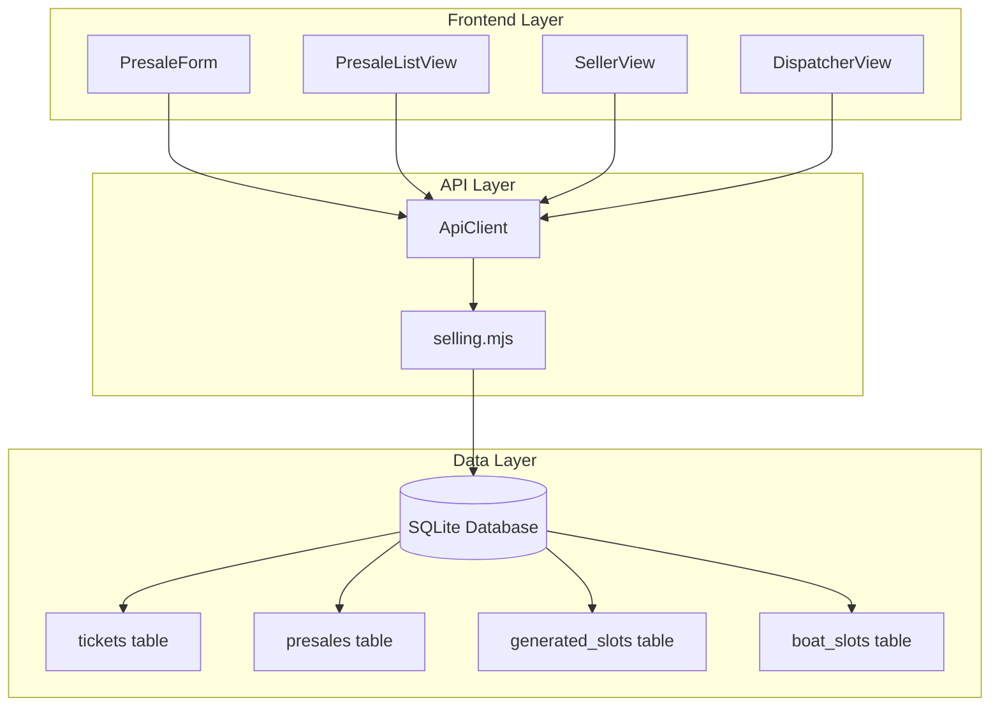
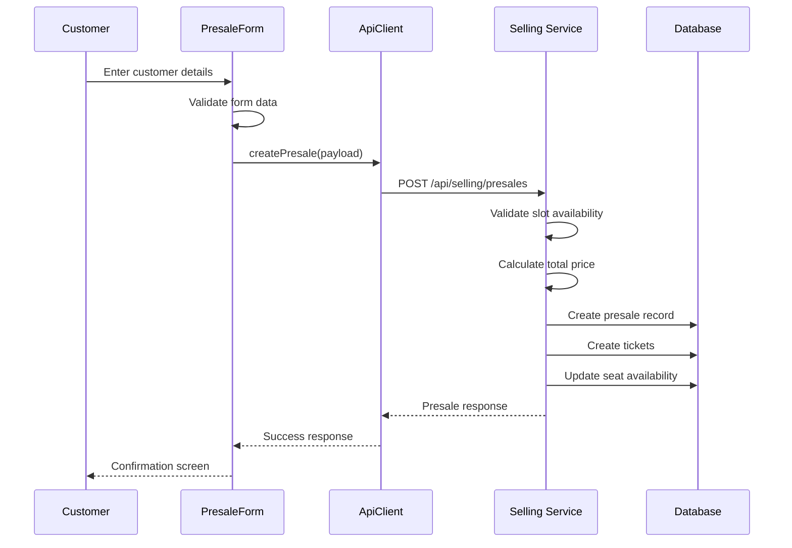
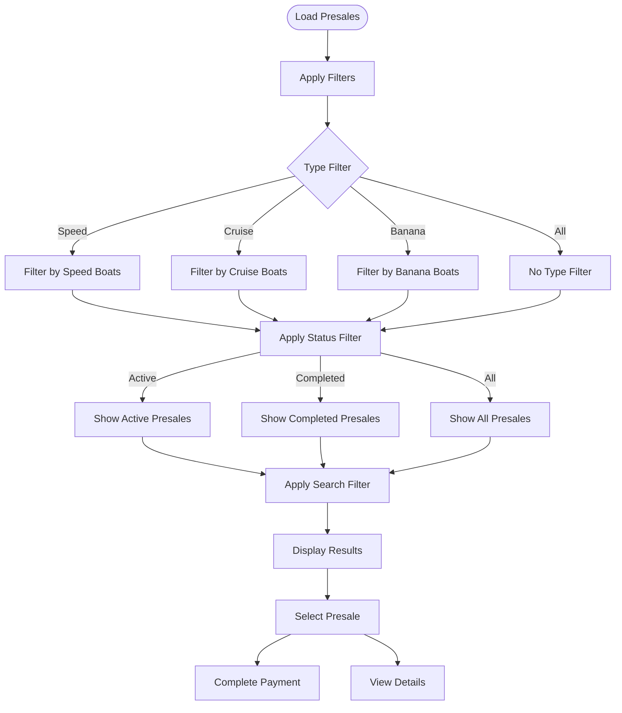
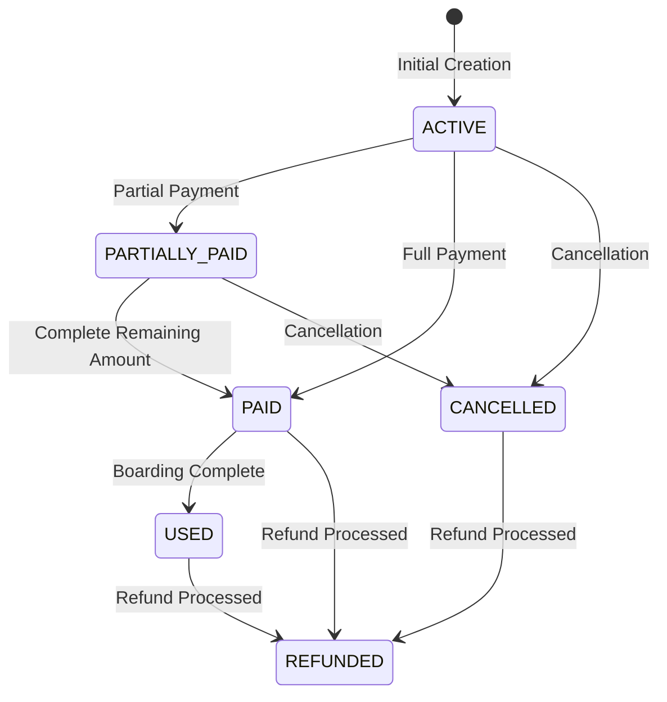
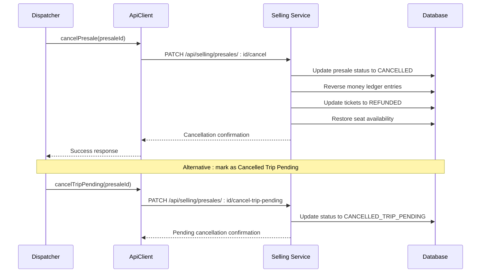
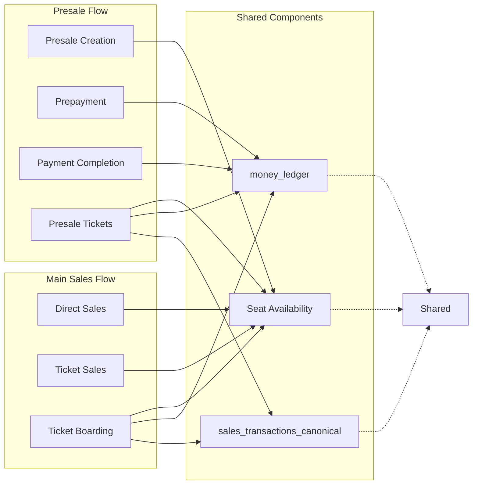

# Presale Management

<cite>
**Referenced Files in This Document**
- [PresaleForm.jsx](file://src/components/seller/PresaleForm.jsx)
- [PresaleListView.jsx](file://src/components/dispatcher/PresaleListView.jsx)
- [SellerView.jsx](file://src/views/SellerView.jsx)
- [DispatcherView.jsx](file://src/views/DispatcherView.jsx)
- [apiClient.js](file://src/utils/apiClient.js)
- [selling.mjs](file://server/selling.mjs)
- [db.js](file://server/db.js)
- [BUSINESS_RULES.md](file://docs/BUSINESS_RULES.md)
</cite>

## Table of Contents
1. [Introduction](#introduction)
2. [System Architecture](#system-architecture)
3. [Core Components](#core-components)
4. [Presale Creation Workflow](#presale-creation-workflow)
5. [Presale List Management](#presale-list-management)
6. [Payment Processing](#payment-processing)
7. [Cancellation and Refund Workflow](#cancellation-and-refund-workflow)
8. [Integration with Main Ticket Sales](#integration-with-main-ticket-sales)
9. [Business Rules and Validation](#business-rules-and-validation)
10. [Data Structures and API Reference](#data-structures-and-api-reference)
11. [Error Handling](#error-handling)
12. [Performance Considerations](#performance-considerations)
13. [Troubleshooting Guide](#troubleshooting-guide)
14. [Conclusion](#conclusion)

## Introduction

The presale management system is a critical component of the seller portal that enables customers to reserve boat trips in advance. This system handles the complete lifecycle of presales including customer information capture, seat selection, prepayment processing, status tracking, and eventual conversion to confirmed tickets.

The system integrates seamlessly with the main ticket sales workflow while maintaining separate business logic for advance bookings. It supports both manual and generated trip slots, provides real-time seat availability checking, and maintains comprehensive audit trails for financial transactions.

## System Architecture

The presale management system follows a client-server architecture with React-based frontend components and Express.js backend services.



**Diagram sources**
- [PresaleForm.jsx](file://src/components/seller/PresaleForm.jsx#L1-L219)
- [PresaleListView.jsx](file://src/components/dispatcher/PresaleListView.jsx#L1-L341)
- [apiClient.js](file://src/utils/apiClient.js#L1-L360)
- [selling.mjs](file://server/selling.mjs#L640-L1600)

**Section sources**
- [PresaleForm.jsx](file://src/components/seller/PresaleForm.jsx#L1-L219)
- [PresaleListView.jsx](file://src/components/dispatcher/PresaleListView.jsx#L1-L341)
- [apiClient.js](file://src/utils/apiClient.js#L1-L360)
- [selling.mjs](file://server/selling.mjs#L640-L1600)

## Core Components

### Frontend Components

The system consists of several key frontend components that work together to provide a seamless presale experience:

**PresaleForm Component**: Handles customer information capture, seat selection, and prepayment processing. Features real-time price calculation and validation.

**PresaleListView Component**: Provides dispatcher and owner visibility into all presales with filtering, sorting, and payment completion capabilities.

**SellerView Component**: Orchestrates the presale creation flow through multiple steps including boat type selection, trip selection, seat configuration, and confirmation.

**DispatcherView Component**: Manages the broader operational view for presale monitoring and management.

### Backend Services

The backend implements comprehensive presale management through the selling.mjs module, which handles:

- Presale creation with seat availability validation
- Payment processing and reconciliation
- Status tracking and transitions
- Cancellation and refund workflows
- Integration with the ticket sales system

**Section sources**
- [PresaleForm.jsx](file://src/components/seller/PresaleForm.jsx#L1-L219)
- [PresaleListView.jsx](file://src/components/dispatcher/PresaleListView.jsx#L1-L341)
- [SellerView.jsx](file://src/views/SellerView.jsx#L1-L370)
- [DispatcherView.jsx](file://src/views/DispatcherView.jsx#L1-L291)

## Presale Creation Workflow

The presale creation process follows a structured workflow that ensures data integrity and seat availability validation.



**Diagram sources**
- [PresaleForm.jsx](file://src/components/seller/PresaleForm.jsx#L62-L82)
- [apiClient.js](file://src/utils/apiClient.js#L166-L168)
- [selling.mjs](file://server/selling.mjs#L642-L1600)

### Step-by-Step Process

1. **Customer Information Capture**: The system validates customer name (minimum 2 characters) and phone number requirements.

2. **Seat Selection**: Real-time seat availability checking prevents overselling and provides immediate feedback on available seats.

3. **Pricing Calculation**: Dynamic price calculation based on seat categories (adult, teen, child) with support for both category-based and legacy pricing.

4. **Prepayment Processing**: Prepayment validation ensures amounts are within acceptable limits and properly recorded.

5. **Database Transaction**: Atomic transaction ensures data consistency across presale creation, ticket generation, and seat availability updates.

**Section sources**
- [PresaleForm.jsx](file://src/components/seller/PresaleForm.jsx#L39-L82)
- [selling.mjs](file://server/selling.mjs#L1082-L1244)

## Presale List Management

The presale list view provides comprehensive oversight of all presales with advanced filtering and management capabilities.



**Diagram sources**
- [PresaleListView.jsx](file://src/components/dispatcher/PresaleListView.jsx#L14-L70)

### Key Features

- **Real-time Filtering**: Dynamic filtering by boat type, status, and search terms
- **Visual Status Indicators**: Color-coded status display with clear visual cues
- **Payment Completion**: Direct payment processing for outstanding balances
- **Detailed Information**: Comprehensive customer and trip information display
- **Responsive Design**: Optimized for desktop and mobile viewing

**Section sources**
- [PresaleListView.jsx](file://src/components/dispatcher/PresaleListView.jsx#L1-L341)

## Payment Processing

The payment processing system handles both initial prepayments and subsequent payment completions with comprehensive financial tracking.



**Diagram sources**
- [selling.mjs](file://server/selling.mjs#L2370-L2569)

### Payment Methods and Tracking

The system supports multiple payment methods with detailed tracking:

- **Cash Payments**: Direct cash transactions with automatic cash ledger updates
- **Card Payments**: Credit/debit card transactions with card ledger tracking
- **Mixed Payments**: Combination of cash and card payments
- **Prepayment Tracking**: Separate tracking of initial deposits versus final payments

### Financial Reconciliation

The system maintains comprehensive financial records through:

- **Money Ledger**: Centralized transaction recording with audit trail
- **Canonical Records**: Consistent financial data for reporting and analytics
- **Real-time Updates**: Immediate financial impact of payment transactions

**Section sources**
- [selling.mjs](file://server/selling.mjs#L2370-L2569)
- [apiClient.js](file://src/utils/apiClient.js#L212-L229)

## Cancellation and Refund Workflow

The cancellation and refund system provides comprehensive management of presale modifications with proper financial reconciliation.



**Diagram sources**
- [selling.mjs](file://server/selling.mjs#L2700-L2812)
- [apiClient.js](file://src/utils/apiClient.js#L218-L233)

### Cancellation States

The system supports multiple cancellation states:

- **Immediate Cancellation**: Direct cancellation with seat restoration
- **Trip Pending Cancellation**: Cancellation pending trip changes
- **Refund Processing**: Formal refund with financial reconciliation

### Refund Process

Refund processing includes:

- **Financial Reversal**: Automatic reversal of posted ledger entries
- **Seat Restoration**: Proper restoration of seat availability
- **Ticket Status Update**: Update all related tickets to refunded status
- **Audit Trail**: Complete audit trail of all refund activities

**Section sources**
- [selling.mjs](file://server/selling.mjs#L2700-L3317)
- [apiClient.js](file://src/utils/apiClient.js#L218-L253)

## Integration with Main Ticket Sales

The presale system integrates seamlessly with the main ticket sales workflow while maintaining distinct business logic for advance bookings.



**Diagram sources**
- [selling.mjs](file://server/selling.mjs#L1292-L1499)
- [db.js](file://server/db.js#L95-L109)

### Shared Resources

Both presale and direct sales flows share:

- **Seat Availability Management**: Unified seat tracking across all booking types
- **Financial Ledger**: Consistent financial recording and reconciliation
- **Ticket Generation**: Standardized ticket creation and management
- **Reporting Systems**: Integrated analytics and reporting capabilities

### Distinct Business Logic

Presale-specific features include:

- **Advance Booking**: Separate from standard sales timing restrictions
- **Status Tracking**: Presale-specific status lifecycle management
- **Cancellation Flexibility**: Enhanced cancellation and modification options
- **Financial Isolation**: Separate financial tracking for advance bookings

**Section sources**
- [selling.mjs](file://server/selling.mjs#L1292-L1499)
- [db.js](file://server/db.js#L95-L109)

## Business Rules and Validation

The presale system enforces comprehensive business rules to ensure operational integrity and compliance with established policies.

### Role-Based Access Control

Different user roles have distinct permissions and limitations:

- **Seller**: Can create presales up to seller_cutoff_minutes before departure
- **Dispatcher**: Has extended permissions for managing presales after seller cutoff
- **Admin**: Full administrative privileges for system management

### Trip Cutoff Management

The system implements strict cutoff time enforcement:

- **Seller Cutoff**: Prevents sales within seller_cutoff_minutes of departure
- **Dispatcher Cutoff**: Allows sales up to dispatcher_cutoff_minutes after departure
- **Dynamic Cutoffs**: Different cutoff times for manual and generated slots

### Seat Availability Validation

Comprehensive seat availability checking prevents overselling:

- **Real-time Availability**: Live seat count verification
- **Category-Specific Limits**: Appropriate seat limits for different boat types
- **Capacity Management**: Automatic capacity adjustment for different boat configurations

**Section sources**
- [BUSINESS_RULES.md](file://docs/BUSINESS_RULES.md#L1-L49)
- [selling.mjs](file://server/selling.mjs#L891-L1005)

## Data Structures and API Reference

### Presale Data Model

The presale system uses a comprehensive data model to track all aspects of advance bookings:

| Field | Type | Description | Required |
|-------|------|-------------|----------|
| id | Integer | Unique identifier | Yes |
| boat_slot_id | Integer | Foreign key to boat_slots | Yes |
| customer_name | String | Customer full name | Yes |
| customer_phone | String | Customer contact phone | Yes |
| number_of_seats | Integer | Total seats reserved | Yes |
| total_price | Integer | Total booking cost in RUB | Yes |
| prepayment_amount | Integer | Initial payment amount | Yes |
| prepayment_comment | String | Payment description | No |
| status | String | Current presale status | Yes |
| tickets_json | String | Seat breakdown by category | No |
| payment_method | String | Primary payment method | No |
| payment_cash_amount | Integer | Cash portion of payment | No |
| payment_card_amount | Integer | Card portion of payment | No |
| slot_uid | String | Trip identifier | No |
| created_at | DateTime | Creation timestamp | Yes |
| updated_at | DateTime | Last update timestamp | Yes |

### API Endpoints

#### Presale Management Endpoints

| Endpoint | Method | Description | Authentication |
|----------|--------|-------------|----------------|
| `/api/selling/presales` | POST | Create new presale | Seller/Dispatcher |
| `/api/selling/presales` | GET | List all presales | Seller/Dispatcher |
| `/api/selling/presales/:id` | GET | Get specific presale | Seller/Dispatcher |
| `/api/selling/presales/:id/cancel` | PATCH | Cancel presale | Dispatcher/Admin |
| `/api/selling/presales/:id/refund` | PATCH | Process refund | Dispatcher/Admin |
| `/api/selling/presales/:id/paid` | PATCH | Mark as paid | Seller/Dispatcher |
| `/api/selling/presales/:id/accept-payment` | PATCH | Accept remaining payment | Seller/Dispatcher |
| `/api/selling/presales/:id/payment` | PATCH | Add additional payment | Dispatcher |
| `/api/selling/presales/:id/move` | PATCH | Move to different trip | Dispatcher/Admin |
| `/api/selling/presales/:id/seats` | PATCH | Modify seat count | Dispatcher/Admin |
| `/api/selling/presales/:id/used` | PATCH | Mark as boarded | Dispatcher/Admin |
| `/api/selling/presales/:id/delete` | PATCH | Delete presale | Dispatcher/Admin |

#### Ticket Management Endpoints

| Endpoint | Method | Description | Authentication |
|----------|--------|-------------|----------------|
| `/api/selling/presales/:id/tickets` | GET | Get presale tickets | Seller/Dispatcher |
| `/api/selling/tickets/:id/used` | PATCH | Mark ticket as used | Dispatcher/Admin |
| `/api/selling/tickets/:id/refund` | PATCH | Refund ticket | Dispatcher/Admin |
| `/api/selling/tickets/:id/delete` | PATCH | Delete ticket | Dispatcher/Admin |
| `/api/selling/tickets/:id/transfer` | PATCH | Transfer ticket | Dispatcher/Admin |

**Section sources**
- [apiClient.js](file://src/utils/apiClient.js#L165-L257)
- [selling.mjs](file://server/selling.mjs#L1602-L1748)

## Error Handling

The presale system implements comprehensive error handling to ensure robust operation and clear user feedback.

### Common Error Scenarios

| Error Code | Description | Resolution |
|------------|-------------|------------|
| `SLOT_UID_REQUIRED` | Missing trip identifier | Verify trip selection |
| `CUSTOMER_NAME_REQUIRED` | Invalid customer name | Enter valid name (≥2 chars) |
| `CUSTOMER_PHONE_REQUIRED` | Invalid phone number | Enter valid phone number |
| `INVALID_PREPAYMENT_AMOUNT` | Prepayment exceeds total | Adjust payment amount |
| `NO_SEATS` | Insufficient seat availability | Choose different trip or fewer seats |
| `CAPACITY_EXCEEDED` | Trip at full capacity | Select alternative trip |
| `TRIP_CLOSED_BY_TIME` | Trip outside sales window | Select different time slot |

### Error Response Format

All API errors follow a consistent format:

```json
{
  "ok": false,
  "code": "ERROR_CODE",
  "message": "Descriptive error message",
  "debug": {
    "route": "/api/selling/presales",
    "slotUid": "generated:123",
    "stack": "Error stack trace"
  }
}
```

### Frontend Error Handling

The frontend components implement comprehensive error handling:

- **Form Validation**: Real-time validation with user-friendly error messages
- **Network Error Recovery**: Automatic retry mechanisms for transient failures
- **State Management**: Proper error state management to prevent inconsistent UI states
- **User Feedback**: Clear error messaging and recovery guidance

**Section sources**
- [selling.mjs](file://server/selling.mjs#L648-L866)
- [PresaleForm.jsx](file://src/components/seller/PresaleForm.jsx#L39-L60)

## Performance Considerations

The presale system is designed with performance optimization in mind to handle concurrent operations efficiently.

### Database Optimization

- **Connection Pooling**: Efficient database connection management
- **Index Optimization**: Strategic indexing for frequently queried fields
- **Query Optimization**: Optimized queries for seat availability and presale listings
- **Transaction Management**: Atomic operations to prevent partial updates

### Frontend Performance

- **State Management**: Efficient React state management to minimize re-renders
- **Lazy Loading**: Component lazy loading for improved initial load times
- **Caching Strategies**: Strategic caching of frequently accessed data
- **Optimized Rendering**: Virtual scrolling for large presale lists

### Scalability Features

- **Horizontal Scaling**: Stateless components supporting horizontal scaling
- **Load Balancing**: Database connection pooling for load distribution
- **Monitoring**: Built-in performance monitoring and alerting
- **Resource Management**: Efficient memory and CPU usage patterns

## Troubleshooting Guide

### Common Issues and Solutions

**Issue**: Presale creation fails with "Not enough seats available"
- **Cause**: Selected trip has insufficient seat availability
- **Solution**: Choose a different trip or reduce seat count

**Issue**: Payment processing errors
- **Cause**: Invalid payment amount or method mismatch
- **Solution**: Verify payment amount does not exceed total price and use valid payment method

**Issue**: Presale not appearing in list
- **Cause**: Incorrect filtering or search criteria
- **Solution**: Reset filters and verify search terms

**Issue**: Seat availability shows incorrect values
- **Cause**: Cache synchronization issues
- **Solution**: Refresh page or wait for automatic cache update

### Debugging Tools

The system provides comprehensive debugging capabilities:

- **Network Logging**: Detailed API request/response logging
- **Database Queries**: SQL query logging for debugging
- **Performance Metrics**: Real-time performance monitoring
- **Error Tracking**: Centralized error reporting and analysis

### Support Procedures

For persistent issues:

1. **Clear Browser Cache**: Clear browser cache and cookies
2. **Check Network Connectivity**: Verify stable internet connection
3. **Review System Status**: Check system health and database connectivity
4. **Contact Support**: Open support ticket with error details and screenshots

**Section sources**
- [apiClient.js](file://src/utils/apiClient.js#L53-L87)
- [selling.mjs](file://server/selling.mjs#L1584-L1599)

## Conclusion

The presale management system provides a comprehensive solution for advance booking operations within the seller portal. Its robust architecture, comprehensive validation, and seamless integration with the main ticket sales workflow ensure reliable operation while maintaining flexibility for various business scenarios.

Key strengths of the system include:

- **Comprehensive Business Logic**: Complete coverage of presale lifecycle from creation to refund
- **Robust Error Handling**: Structured error handling with clear user feedback
- **Financial Integrity**: Complete financial tracking and reconciliation
- **Operational Flexibility**: Support for various cancellation and modification scenarios
- **Performance Optimization**: Efficient resource utilization and scalability

The system successfully bridges the gap between advance booking requirements and standard ticket sales operations, providing operators with the tools needed to manage complex booking scenarios while maintaining operational efficiency and financial accuracy.