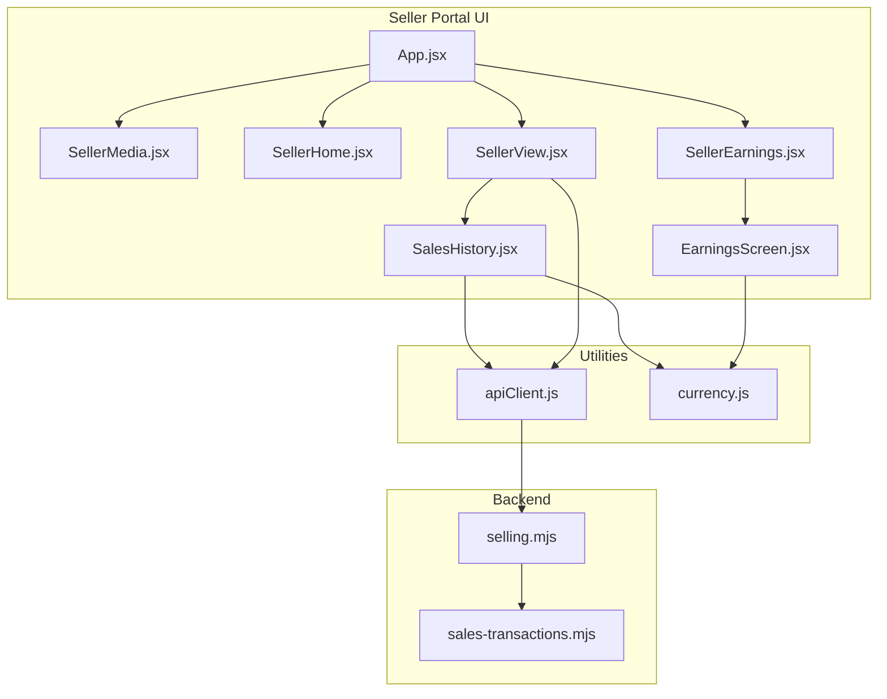
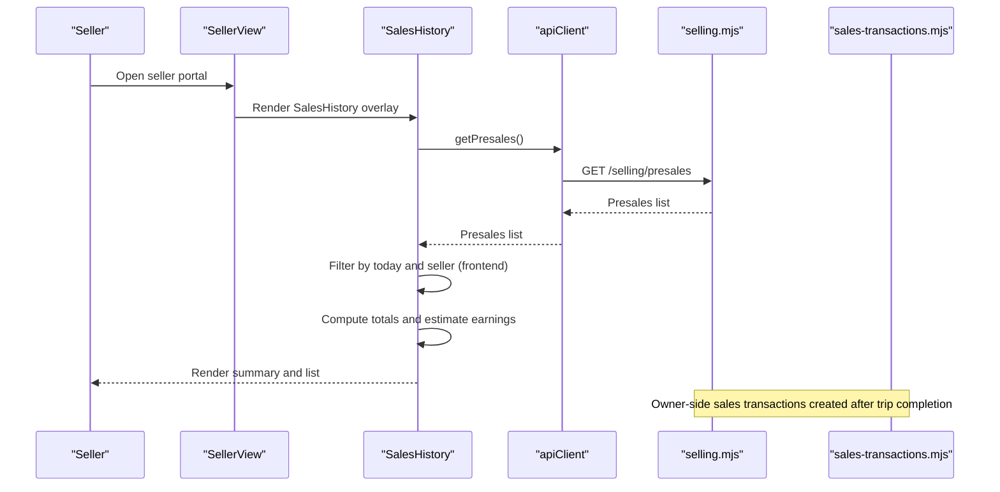
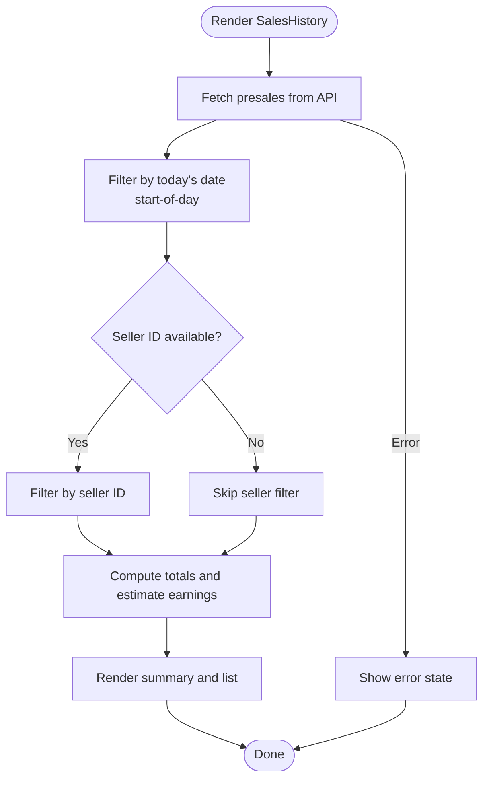
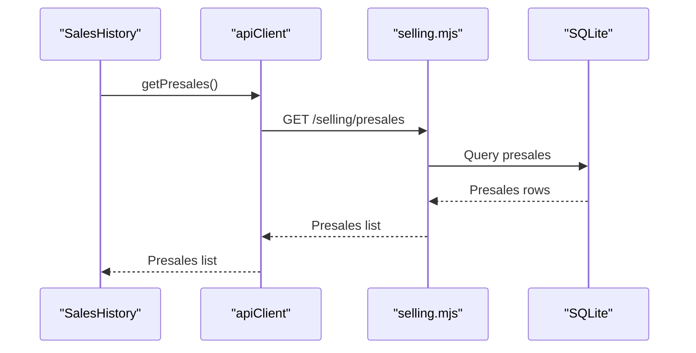
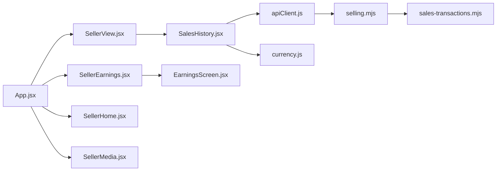

# Sales History & Media

<cite>
**Referenced Files in This Document**
- [SalesHistory.jsx](file://src/components/seller/SalesHistory.jsx)
- [SellerMedia.jsx](file://src/views/SellerMedia.jsx)
- [SellerHome.jsx](file://src/views/SellerHome.jsx)
- [apiClient.js](file://src/utils/apiClient.js)
- [currency.js](file://src/utils/currency.js)
- [SellerView.jsx](file://src/views/SellerView.jsx)
- [SellerEarnings.jsx](file://src/views/SellerEarnings.jsx)
- [EarningsScreen.jsx](file://src/components/seller/EarningsScreen.jsx)
- [App.jsx](file://src/App.jsx)
- [sales-transactions.mjs](file://server/sales-transactions.mjs)
- [selling.mjs](file://server/selling.mjs)
</cite>

## Table of Contents
1. [Introduction](#introduction)
2. [Project Structure](#project-structure)
3. [Core Components](#core-components)
4. [Architecture Overview](#architecture-overview)
5. [Detailed Component Analysis](#detailed-component-analysis)
6. [Dependency Analysis](#dependency-analysis)
7. [Performance Considerations](#performance-considerations)
8. [Troubleshooting Guide](#troubleshooting-guide)
9. [Conclusion](#conclusion)

## Introduction
This document explains the sales history and media management features in the seller portal. It covers:
- Sales history component for completed transactions, presales, cancellations, and transaction details
- Media screen functionality for seller dashboard access, promotional materials, and operational resources
- Home screen navigation and quick access features for sellers
- Data presentation patterns for transaction histories, filtering options, and search capabilities
- Backend API integration for retrieving sales data and UI patterns for displaying historical information
- Examples of data formatting, pagination handling, and user interaction patterns for accessing sales information

## Project Structure
The seller portal is organized around React views and components, with a shared API client and backend routes supporting presales and sales data.

**Diagram sources**
- [App.jsx](file://src/App.jsx#L52-L84)
- [SellerView.jsx](file://src/views/SellerView.jsx#L212-L232)
- [SalesHistory.jsx](file://src/components/seller/SalesHistory.jsx#L1-L199)
- [SellerEarnings.jsx](file://src/views/SellerEarnings.jsx#L1-L91)
- [EarningsScreen.jsx](file://src/components/seller/EarningsScreen.jsx#L1-L68)
- [apiClient.js](file://src/utils/apiClient.js#L105-L257)
- [selling.mjs](file://server/selling.mjs#L642-L681)
- [sales-transactions.mjs](file://server/sales-transactions.mjs#L167-L236)

**Section sources**
- [App.jsx](file://src/App.jsx#L52-L84)

## Core Components
- SalesHistory: Displays today’s sales summary and list of presales filtered by date and optionally seller identity. Uses a fixed commission percentage to estimate earnings.
- SellerMedia: Placeholder page for media resources under development.
- SellerHome: Provides quick-access buttons to sell tickets, view schedule, earnings, and media.
- SellerView: Orchestrates the sales flow and conditionally renders SalesHistory as an overlay.
- SellerEarnings: Shows earnings summary and recent sales (currently simulated).
- EarningsScreen: Reusable component to present earnings metrics and recent sales.
- apiClient: Centralized HTTP client with endpoints for presales and related operations.
- currency: Utility for formatting amounts as RUB.

**Section sources**
- [SalesHistory.jsx](file://src/components/seller/SalesHistory.jsx#L6-L199)
- [SellerMedia.jsx](file://src/views/SellerMedia.jsx#L1-L43)
- [SellerHome.jsx](file://src/views/SellerHome.jsx#L1-L67)
- [SellerView.jsx](file://src/views/SellerView.jsx#L212-L232)
- [SellerEarnings.jsx](file://src/views/SellerEarnings.jsx#L1-L91)
- [EarningsScreen.jsx](file://src/components/seller/EarningsScreen.jsx#L1-L68)
- [apiClient.js](file://src/utils/apiClient.js#L105-L257)
- [currency.js](file://src/utils/currency.js#L1-L15)

## Architecture Overview
The seller portal integrates UI components with a backend API to manage presales and display sales history. The SalesHistory component fetches presales and computes daily totals and estimates. The backend exposes presales endpoints and a dedicated sales transactions layer for canonical money records.

**Diagram sources**
- [SellerView.jsx](file://src/views/SellerView.jsx#L212-L232)
- [SalesHistory.jsx](file://src/components/seller/SalesHistory.jsx#L20-L62)
- [apiClient.js](file://src/utils/apiClient.js#L170-L172)
- [selling.mjs](file://server/selling.mjs#L642-L681)
- [sales-transactions.mjs](file://server/sales-transactions.mjs#L167-L236)

## Detailed Component Analysis

### SalesHistory Component
Purpose:
- Show today’s sales summary and a list of presales.
- Compute total sales amount, total seats sold, and estimated earnings using a fixed commission rate.
- Provide a back navigation action.

Key behaviors:
- Fetches presales via the API client.
- Filters presales by the start-of-day boundary of the current date.
- Attempts to filter by current seller identity if available.
- Formats currency using the shared formatter.
- Handles loading, empty, and error states.

UI pattern:
- Header with back button and title.
- Summary card with total sales, total seats, and estimated earnings.
- List of presales with trip name, time, seat count, customer name (if present), total price, and status.

Data formatting:
- Currency formatting via the shared utility.
- Time formatting from timestamps.

Pagination/search:
- No pagination or search in the current implementation; list is derived from a single API call and filtered client-side.

Integration with backend:
- Uses the presales endpoint to retrieve data.
- Seller filtering is best-effort and relies on available fields in returned records.

**Diagram sources**
- [SalesHistory.jsx](file://src/components/seller/SalesHistory.jsx#L20-L76)
- [apiClient.js](file://src/utils/apiClient.js#L170-L172)
- [currency.js](file://src/utils/currency.js#L6-L15)

**Section sources**
- [SalesHistory.jsx](file://src/components/seller/SalesHistory.jsx#L6-L199)
- [apiClient.js](file://src/utils/apiClient.js#L170-L172)
- [currency.js](file://src/utils/currency.js#L6-L15)

### Media Screen (SellerMedia)
Purpose:
- Provide a dedicated area for media resources (placeholder page currently).

UI pattern:
- Header with back and logout actions.
- Centered content indicating the page is under development.

Interaction:
- Back navigates to the previous screen.
- Logout triggers authentication logout and redirects to login.

**Section sources**
- [SellerMedia.jsx](file://src/views/SellerMedia.jsx#L1-L43)

### Home Screen Navigation (SellerHome)
Purpose:
- Offer quick-access buttons for common seller tasks.

Buttons:
- Sell ticket: navigates to the seller flow starter.
- Schedule: opens the dispatcher view.
- My sales: opens the earnings view.
- Media: opens the media view.

Logout:
- Global logout button in the header.

**Section sources**
- [SellerHome.jsx](file://src/views/SellerHome.jsx#L1-L67)

### SellerView Integration and Overlay
Purpose:
- Manage the end-to-end selling flow and optionally display SalesHistory as an overlay.

Overlay behavior:
- When enabled, renders a header with logout and displays SalesHistory inside a container.

Navigation:
- Buttons on the home screen trigger navigation to the seller flow, earnings, and media.

**Section sources**
- [SellerView.jsx](file://src/views/SellerView.jsx#L212-L232)
- [SellerHome.jsx](file://src/views/SellerHome.jsx#L30-L56)

### Earnings Presentation (SellerEarnings + EarningsScreen)
Purpose:
- Present earnings summary and recent sales for the current seller.

Current state:
- Earnings view simulates data; in a real app, it would call a backend endpoint to retrieve seller-specific sales.
- EarningsScreen displays total tickets sold, total earnings, and a recent sales list.

UI pattern:
- Summary card with metrics.
- Recent sales list with truncation to last N entries.
- Action buttons to go back or initiate a new sale.

**Section sources**
- [SellerEarnings.jsx](file://src/views/SellerEarnings.jsx#L1-L91)
- [EarningsScreen.jsx](file://src/components/seller/EarningsScreen.jsx#L1-L68)

### Backend API Integration
Presales endpoints:
- Create presale: POST /selling/presales
- List presales: GET /selling/presales
- Accept payment: PATCH /selling/presales/{id}/accept-payment
- Cancel presale: PATCH /selling/presales/{id}/cancel
- Transfer presale: PATCH /selling/presales/{id}/transfer
- Get presale tickets: GET /selling/presales/{id}/tickets

Sales transactions (owner-side):
- Canonical money records are created for generated slots after trip completion.
- Records include business day, slot UID, amounts, status, and method.

**Diagram sources**
- [SalesHistory.jsx](file://src/components/seller/SalesHistory.jsx#L20-L62)
- [apiClient.js](file://src/utils/apiClient.js#L170-L172)
- [selling.mjs](file://server/selling.mjs#L642-L681)

**Section sources**
- [apiClient.js](file://src/utils/apiClient.js#L165-L257)
- [selling.mjs](file://server/selling.mjs#L642-L681)
- [sales-transactions.mjs](file://server/sales-transactions.mjs#L167-L236)

## Dependency Analysis
- SalesHistory depends on:
  - apiClient for presales retrieval
  - currency for formatting
  - AuthContext for current user identity (best-effort seller filtering)
- SellerView conditionally renders SalesHistory as an overlay and manages routing.
- SellerEarnings uses EarningsScreen to present data; currently simulated.
- App configures routes for seller, home, earnings, and media.

**Diagram sources**
- [SalesHistory.jsx](file://src/components/seller/SalesHistory.jsx#L1-L6)
- [SellerView.jsx](file://src/views/SellerView.jsx#L212-L232)
- [SellerEarnings.jsx](file://src/views/SellerEarnings.jsx#L1-L91)
- [EarningsScreen.jsx](file://src/components/seller/EarningsScreen.jsx#L1-L68)
- [App.jsx](file://src/App.jsx#L52-L84)
- [apiClient.js](file://src/utils/apiClient.js#L105-L257)
- [selling.mjs](file://server/selling.mjs#L642-L681)
- [sales-transactions.mjs](file://server/sales-transactions.mjs#L167-L236)

**Section sources**
- [App.jsx](file://src/App.jsx#L52-L84)

## Performance Considerations
- Client-side filtering: Filtering presales by date and optional seller occurs in memory. For large datasets, consider server-side filtering or pagination.
- Currency formatting: Using locale-aware formatting is efficient; avoid reformatting excessively in loops.
- Overlays: Rendering SalesHistory as an overlay avoids full-page reloads and improves responsiveness.
- Token handling: apiClient automatically attaches Authorization headers when available, reducing redundant code.

## Troubleshooting Guide
Common issues and resolutions:
- SalesHistory shows no data:
  - Verify backend presales endpoint availability and response format.
  - Confirm current user identity is available for best-effort seller filtering.
- Error messages in SalesHistory:
  - The component sets an error state and displays a red banner; check network logs and backend responses.
- Earnings view shows simulated data:
  - Replace simulated data with a real API call to retrieve seller-specific sales.
- Media screen placeholder:
  - The media view indicates “page under development”; implement content as needed.

**Section sources**
- [SalesHistory.jsx](file://src/components/seller/SalesHistory.jsx#L51-L58)
- [SellerEarnings.jsx](file://src/views/SellerEarnings.jsx#L14-L53)
- [SellerMedia.jsx](file://src/views/SellerMedia.jsx#L33-L38)

## Conclusion
The seller portal provides a focused set of features for managing sales and accessing media resources. SalesHistory offers a practical way to review today’s presales and compute earnings estimates, while SellerHome and SellerView streamline navigation and quick actions. The backend supports presales operations and a canonical sales transactions layer for owner analytics. Future enhancements could include server-side filtering, pagination, and expanded media content.