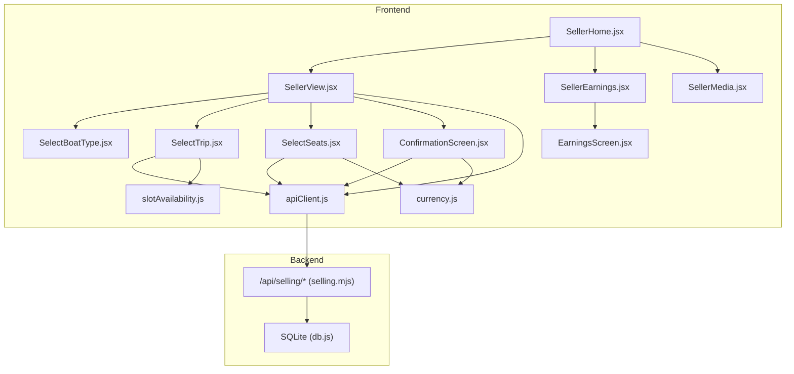
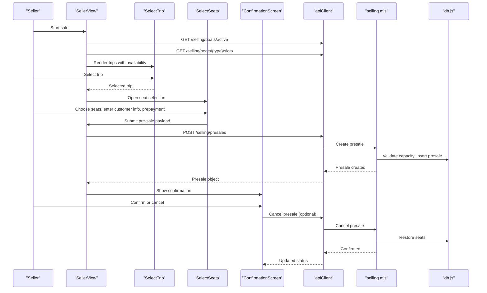
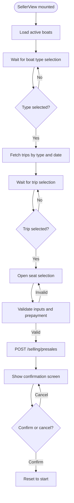
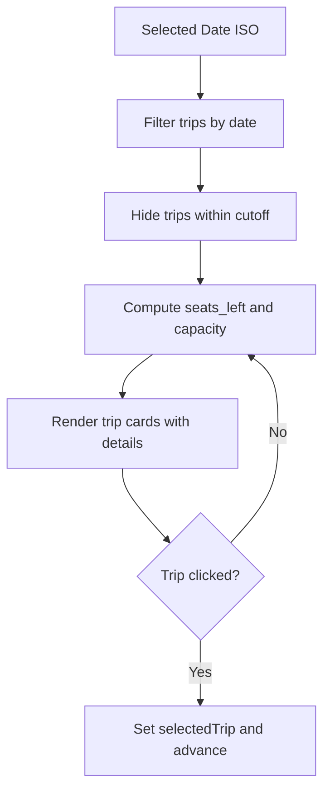
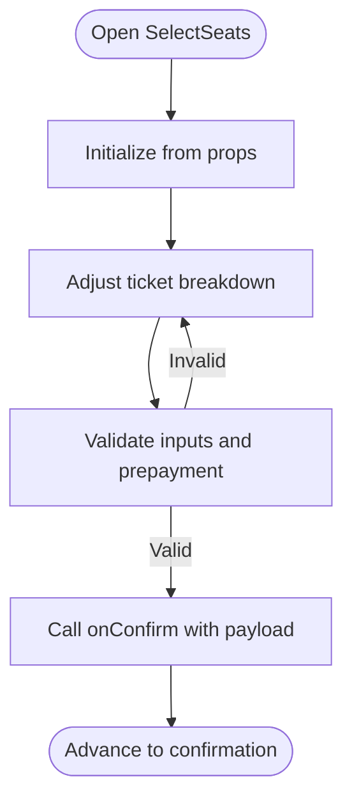
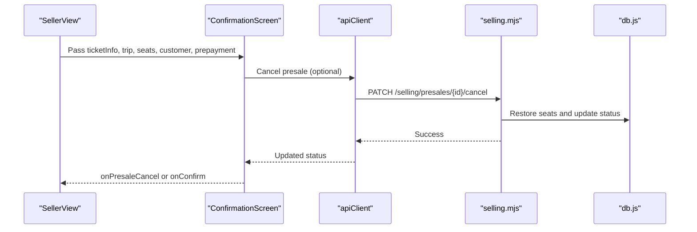
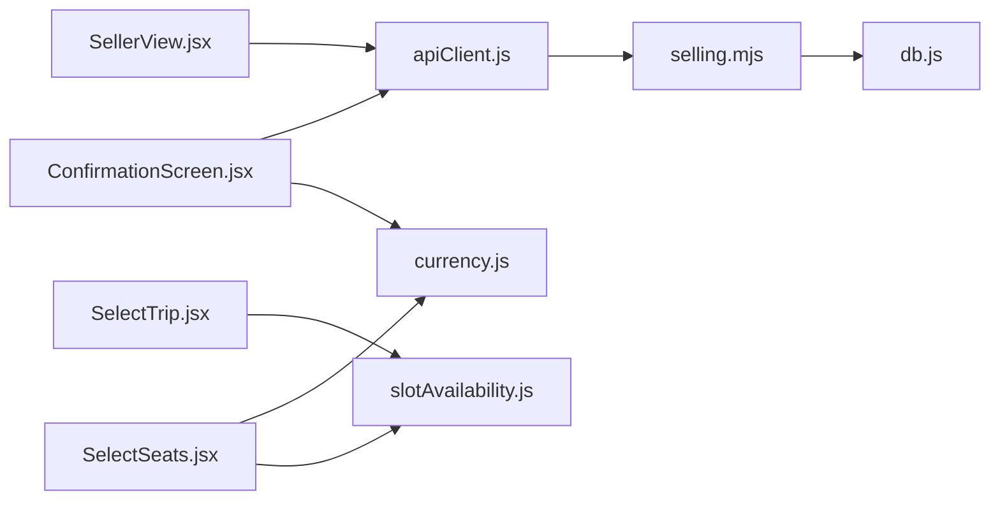

# Seller Portal

<cite>
**Referenced Files in This Document**
- [SellerView.jsx](file://src/views/SellerView.jsx)
- [SellerHome.jsx](file://src/views/SellerHome.jsx)
- [SellerMedia.jsx](file://src/views/SellerMedia.jsx)
- [SellerEarnings.jsx](file://src/views/SellerEarnings.jsx)
- [SelectBoatType.jsx](file://src/components/seller/SelectBoatType.jsx)
- [SelectTrip.jsx](file://src/components/seller/SelectTrip.jsx)
- [SelectSeats.jsx](file://src/components/seller/SelectSeats.jsx)
- [ConfirmationScreen.jsx](file://src/components/seller/ConfirmationScreen.jsx)
- [EarningsScreen.jsx](file://src/components/seller/EarningsScreen.jsx)
- [apiClient.js](file://src/utils/apiClient.js)
- [slotAvailability.js](file://src/utils/slotAvailability.js)
- [currency.js](file://src/utils/currency.js)
- [selling.mjs](file://server/selling.mjs)
- [db.js](file://server/db.js)
</cite>

## Table of Contents
1. [Introduction](#introduction)
2. [Project Structure](#project-structure)
3. [Core Components](#core-components)
4. [Architecture Overview](#architecture-overview)
5. [Detailed Component Analysis](#detailed-component-analysis)
6. [Dependency Analysis](#dependency-analysis)
7. [Performance Considerations](#performance-considerations)
8. [Troubleshooting Guide](#troubleshooting-guide)
9. [Conclusion](#conclusion)
10. [Appendices](#appendices)

## Introduction
This document describes the complete seller portal functionality for the boat ticketing application. It covers the end-to-end ticket sales workflow: selecting a boat type (Speed, Cruise, Banana), choosing a trip with real-time seat availability, selecting seats and customer details, creating a pre-sale, and confirming the order. It also documents the earnings summary screen, media and home dashboards, and the integration with backend APIs and real-time data synchronization.

## Project Structure
The seller portal is implemented as a React single-page application with a dedicated seller view orchestrating multiple step components. Backend APIs are exposed under /api/selling and backed by a SQLite database with migrations ensuring schema stability.

**Diagram sources**
- [SellerView.jsx](file://src/views/SellerView.jsx#L37-L368)
- [SelectBoatType.jsx](file://src/components/seller/SelectBoatType.jsx#L1-L48)
- [SelectTrip.jsx](file://src/components/seller/SelectTrip.jsx#L34-L193)
- [SelectSeats.jsx](file://src/components/seller/SelectSeats.jsx#L5-L549)
- [ConfirmationScreen.jsx](file://src/components/seller/ConfirmationScreen.jsx#L23-L221)
- [EarningsScreen.jsx](file://src/components/seller/EarningsScreen.jsx#L3-L68)
- [SellerMedia.jsx](file://src/views/SellerMedia.jsx#L4-L43)
- [SellerHome.jsx](file://src/views/SellerHome.jsx#L4-L67)
- [SellerEarnings.jsx](file://src/views/SellerEarnings.jsx#L7-L91)
- [apiClient.js](file://src/utils/apiClient.js#L10-L360)
- [slotAvailability.js](file://src/utils/slotAvailability.js#L7-L19)
- [currency.js](file://src/utils/currency.js#L6-L15)
- [selling.mjs](file://server/selling.mjs#L442-L638)
- [db.js](file://server/db.js#L11-L800)

**Section sources**
- [SellerView.jsx](file://src/views/SellerView.jsx#L37-L368)
- [apiClient.js](file://src/utils/apiClient.js#L10-L360)
- [selling.mjs](file://server/selling.mjs#L442-L638)
- [db.js](file://server/db.js#L11-L800)

## Core Components
- SellerView: Orchestrates the multi-step ticket sale flow, manages navigation, state, and API interactions.
- SelectBoatType: Allows sellers to choose Speed, Cruise, or Banana boat types.
- SelectTrip: Displays available trips filtered by date and type, shows real-time seat availability and duration.
- SelectSeats: Handles seat selection, customer info, prepayment, and validation; computes totals.
- ConfirmationScreen: Shows pre-sale details, allows cancellation, and completion.
- EarningsScreen: Summarizes tickets sold and earnings.
- SellerHome: Entry dashboard with quick actions to start a sale, open dispatcher view, earnings, and media.
- SellerEarnings: View for seller earnings summary.
- SellerMedia: Placeholder page for media gallery.
- apiClient: Centralized HTTP client with typed endpoints for selling, presales, and transfers.
- slotAvailability: Utility to compute available seats from slot data.
- currency: Formatting utility for RUB amounts.

**Section sources**
- [SellerView.jsx](file://src/views/SellerView.jsx#L37-L368)
- [SelectBoatType.jsx](file://src/components/seller/SelectBoatType.jsx#L3-L48)
- [SelectTrip.jsx](file://src/components/seller/SelectTrip.jsx#L34-L193)
- [SelectSeats.jsx](file://src/components/seller/SelectSeats.jsx#L5-L549)
- [ConfirmationScreen.jsx](file://src/components/seller/ConfirmationScreen.jsx#L23-L221)
- [EarningsScreen.jsx](file://src/components/seller/EarningsScreen.jsx#L3-L68)
- [SellerHome.jsx](file://src/views/SellerHome.jsx#L4-L67)
- [SellerEarnings.jsx](file://src/views/SellerEarnings.jsx#L7-L91)
- [SellerMedia.jsx](file://src/views/SellerMedia.jsx#L4-L43)
- [apiClient.js](file://src/utils/apiClient.js#L10-L360)
- [slotAvailability.js](file://src/utils/slotAvailability.js#L7-L19)
- [currency.js](file://src/utils/currency.js#L6-L15)

## Architecture Overview
The seller portal follows a layered architecture:
- Presentation Layer: React components for each step of the workflow.
- Orchestration Layer: SellerView coordinates state transitions and API calls.
- Data Access Layer: apiClient encapsulates HTTP requests to /api/selling endpoints.
- Business Logic: Backend routes in selling.mjs enforce capacity, pricing, and slot resolution.
- Persistence: SQLite database managed by db.js with migrations and constraints.

**Diagram sources**
- [SellerView.jsx](file://src/views/SellerView.jsx#L172-L210)
- [SelectTrip.jsx](file://src/components/seller/SelectTrip.jsx#L34-L193)
- [SelectSeats.jsx](file://src/components/seller/SelectSeats.jsx#L142-L216)
- [ConfirmationScreen.jsx](file://src/components/seller/ConfirmationScreen.jsx#L68-L117)
- [apiClient.js](file://src/utils/apiClient.js#L166-L253)
- [selling.mjs](file://server/selling.mjs#L642-L800)
- [db.js](file://server/db.js#L11-L800)

## Detailed Component Analysis

### SellerView: Multi-step Workflow Orchestration
SellerView manages the entire ticket sale lifecycle:
- Step progression: Sell → Type → Trip → Seats → Confirm.
- State management: selectedType, selectedTrip, numberOfSeats, customer details, prepayment, selectedDate, and loading flags.
- API interactions: loads active boats, fetches trips by type and date, creates presales, and refreshes owner data.
- Navigation: handles back/next transitions and resets state appropriately.

Key behaviors:
- Boat loading on mount.
- Trip loading when type and date change and step requires it.
- Pre-sale creation and toast notifications.
- Back navigation resets state to maintain consistency.

**Diagram sources**
- [SellerView.jsx](file://src/views/SellerView.jsx#L172-L210)
- [SellerView.jsx](file://src/views/SellerView.jsx#L150-L170)
- [SellerView.jsx](file://src/views/SellerView.jsx#L234-L317)

**Section sources**
- [SellerView.jsx](file://src/views/SellerView.jsx#L37-L368)

### SelectBoatType: Boat Type Selection
Allows sellers to choose among Speed, Cruise, and Banana boats. Provides a back button to exit to the home screen.

- Buttons for each type trigger onSelect with the type string.
- Disabled “Fishing” option indicates future feature.

**Section sources**
- [SelectBoatType.jsx](file://src/components/seller/SelectBoatType.jsx#L3-L48)

### SelectTrip: Trip Selection with Real-time Availability
Displays trips filtered by selected date and type, with:
- Date selector: Today, Tomorrow, Day After Tomorrow, and a calendar input.
- Visibility filter: Trips eligible for sale (hide those within a cutoff window).
- Availability: Computes sold/seats_left/capacity and percentage bar.
- Duration: Formats minutes into readable duration.
- Clicking a trip selects it and advances to seat selection.

**Diagram sources**
- [SelectTrip.jsx](file://src/components/seller/SelectTrip.jsx#L34-L193)
- [slotAvailability.js](file://src/utils/slotAvailability.js#L7-L19)

**Section sources**
- [SelectTrip.jsx](file://src/components/seller/SelectTrip.jsx#L34-L193)
- [slotAvailability.js](file://src/utils/slotAvailability.js#L7-L19)

### SelectSeats: Seat Selection, Customer Info, and Prepayment
Core UX for seat selection and order preparation:
- Ticket breakdown: Adult, Teen, Child counters with increment/decrement logic respecting available seats.
- Banana-specific rules: Disables Teen tickets and enforces capacity limit.
- Customer info: Name and phone inputs with validation; presets for quick selection.
- Prepayment: Numeric input with presets; validates against total price.
- Validation: Ensures name length, phone digits, seat count, prepayment bounds, and boat-type constraints.
- Confirmation: Builds payload and invokes onConfirm with seats and breakdown.

**Diagram sources**
- [SelectSeats.jsx](file://src/components/seller/SelectSeats.jsx#L5-L549)

**Section sources**
- [SelectSeats.jsx](file://src/components/seller/SelectSeats.jsx#L5-L549)

### ConfirmationScreen: Order Confirmation and Cancellation
Shows the created pre-sale details:
- Displays presale ID, boat, time, seats, customer, and phone.
- Calculates total price, prepayment, and remaining balance.
- Supports cancellation via apiClient with fallback fetch.
- Provides back/confirm actions.

**Diagram sources**
- [ConfirmationScreen.jsx](file://src/components/seller/ConfirmationScreen.jsx#L68-L117)
- [apiClient.js](file://src/utils/apiClient.js#L231-L233)
- [selling.mjs](file://server/selling.mjs#L642-L800)

**Section sources**
- [ConfirmationScreen.jsx](file://src/components/seller/ConfirmationScreen.jsx#L23-L221)
- [apiClient.js](file://src/utils/apiClient.js#L231-L233)
- [selling.mjs](file://server/selling.mjs#L642-L800)

### Earnings Summary: Tickets Sold and Earnings
SellerEarnings loads sample data and renders EarningsScreen:
- Totals computed from ticket list: total tickets and total earnings.
- Last five sales preview with timestamps.
- Navigation to back/home/new sale.

Note: In a production app, this would call an earnings endpoint instead of using sample data.

**Section sources**
- [SellerEarnings.jsx](file://src/views/SellerEarnings.jsx#L7-L91)
- [EarningsScreen.jsx](file://src/components/seller/EarningsScreen.jsx#L3-L68)

### Media and Home Screens
- SellerHome: Dashboard with buttons to start a sale, open dispatcher view, earnings, and media; includes logout.
- SellerMedia: Placeholder page with header and back/logout controls.

**Section sources**
- [SellerHome.jsx](file://src/views/SellerHome.jsx#L4-L67)
- [SellerMedia.jsx](file://src/views/SellerMedia.jsx#L4-L43)

## Dependency Analysis
Frontend dependencies:
- SellerView depends on apiClient for all backend calls and uses slotAvailability and currency utilities.
- SelectTrip and SelectSeats depend on slotAvailability for seat computations.
- ConfirmationScreen depends on currency formatting and apiClient for cancellation.

Backend dependencies:
- selling.mjs routes depend on db.js for schema and data operations.
- Routes enforce capacity checks, pricing, and slot resolution.

**Diagram sources**
- [SellerView.jsx](file://src/views/SellerView.jsx#L37-L368)
- [SelectTrip.jsx](file://src/components/seller/SelectTrip.jsx#L34-L193)
- [SelectSeats.jsx](file://src/components/seller/SelectSeats.jsx#L5-L549)
- [ConfirmationScreen.jsx](file://src/components/seller/ConfirmationScreen.jsx#L23-L221)
- [apiClient.js](file://src/utils/apiClient.js#L10-L360)
- [slotAvailability.js](file://src/utils/slotAvailability.js#L7-L19)
- [currency.js](file://src/utils/currency.js#L6-L15)
- [selling.mjs](file://server/selling.mjs#L442-L638)
- [db.js](file://server/db.js#L11-L800)

**Section sources**
- [SellerView.jsx](file://src/views/SellerView.jsx#L37-L368)
- [apiClient.js](file://src/utils/apiClient.js#L10-L360)
- [selling.mjs](file://server/selling.mjs#L442-L638)
- [db.js](file://server/db.js#L11-L800)

## Performance Considerations
- Debounce or throttle trip loading when changing dates to avoid excessive network calls.
- Memoize derived values (e.g., formatted durations, availability percentages) to reduce re-renders.
- Lazy-load heavy components only when needed.
- Cache recent trips per type and date to minimize repeated fetches.
- Batch UI updates during seat adjustments to keep the interface responsive.

## Troubleshooting Guide
Common issues and resolutions:
- No trips shown:
  - Verify active boats of the chosen type exist.
  - Ensure selected date is valid and within the cutoff window.
  - Check backend route for the type and date filtering.
- Seat selection disabled:
  - Confirm available seats are greater than current selection.
  - For Banana trips, ensure Teen tickets are not selected.
- Prepayment validation errors:
  - Ensure prepayment is non-negative and not greater than total price.
  - Validate phone digits and name length.
- Cancellation failures:
  - Confirm presale ID exists and backend route is reachable.
  - Inspect network logs and error messages from the API.

Operational tips:
- Use the built-in toast notifications for immediate feedback.
- Leverage the owner data refresh after creating a pre-sale to synchronize dashboards.
- Validate backend connectivity and token presence in apiClient.

**Section sources**
- [SelectTrip.jsx](file://src/components/seller/SelectTrip.jsx#L11-L23)
- [SelectSeats.jsx](file://src/components/seller/SelectSeats.jsx#L224-L256)
- [ConfirmationScreen.jsx](file://src/components/seller/ConfirmationScreen.jsx#L68-L117)
- [SellerView.jsx](file://src/views/SellerView.jsx#L150-L170)

## Conclusion
The seller portal provides a streamlined, real-time ticket sales experience with robust validation, clear availability indicators, and seamless backend integration. The modular component design and centralized API client facilitate maintainability and extensibility. Future enhancements could include seat maps, advanced seat selection visuals, and deeper integration with analytics and reporting.

## Appendices

### API Contract Summary
- Boat listing: GET /api/selling/boats
- Slots by type: GET /api/selling/boats/{type}/slots
- Create pre-sale: POST /api/selling/presales
- Cancel pre-sale: PATCH /api/selling/presales/{id}/cancel
- Accept payment: PATCH /api/selling/presales/{id}/accept-payment
- Transfer pre-sale: PATCH /api/selling/presales/{id}/transfer
- Get transfer options: GET /api/selling/transfer-options

**Section sources**
- [apiClient.js](file://src/utils/apiClient.js#L117-L297)
- [selling.mjs](file://server/selling.mjs#L642-L800)