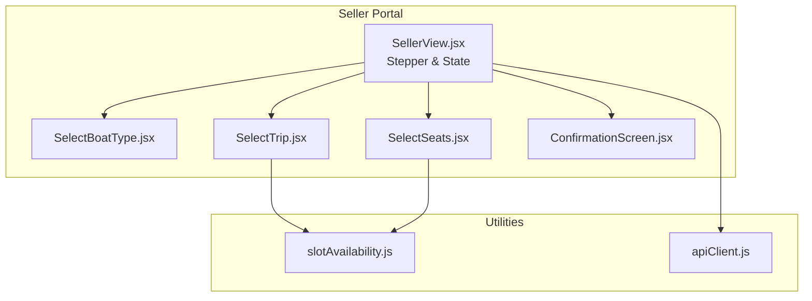
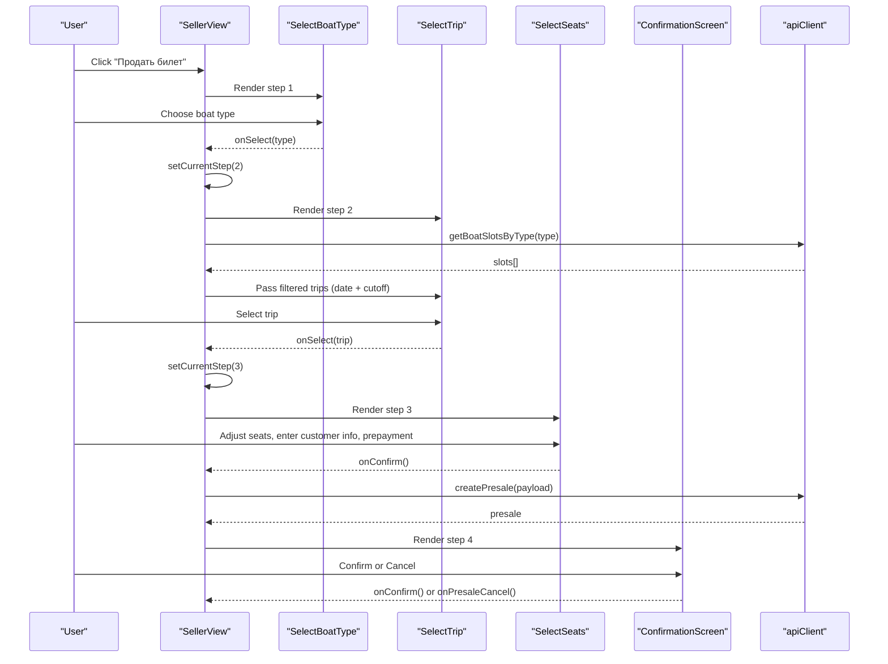
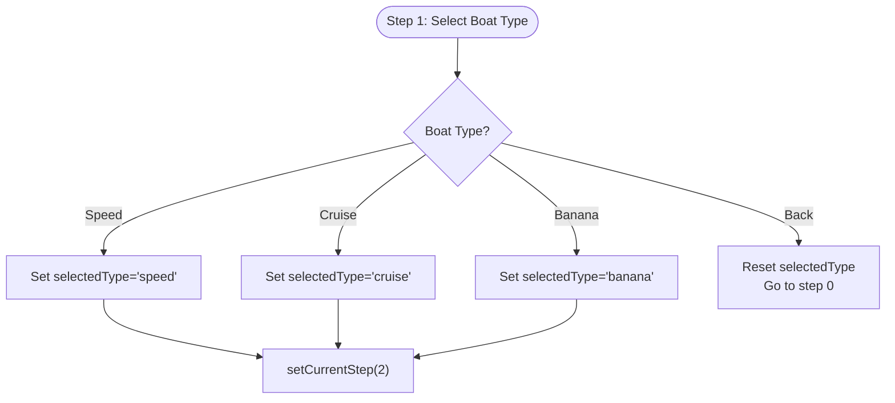
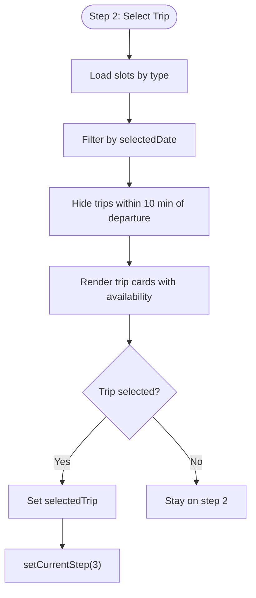
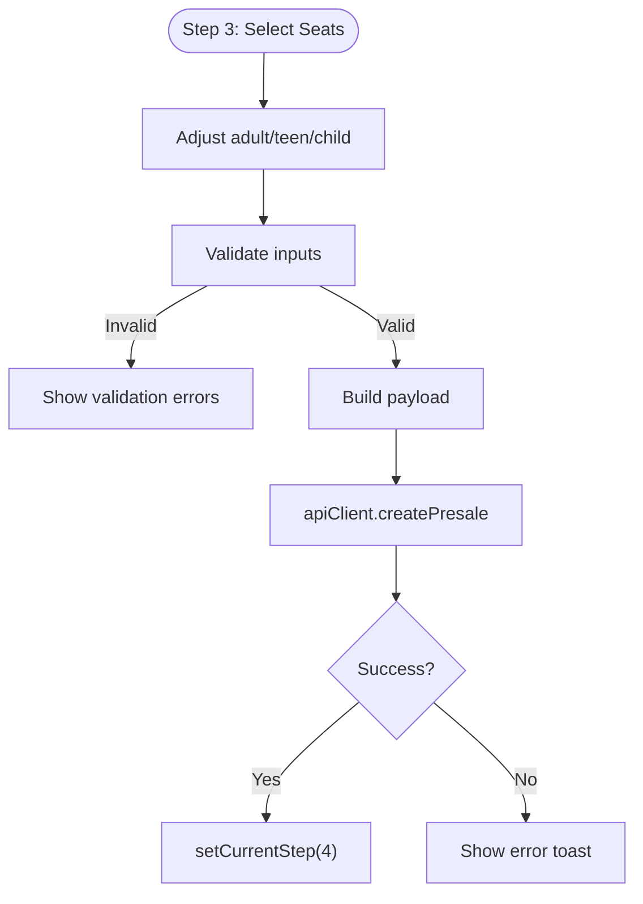
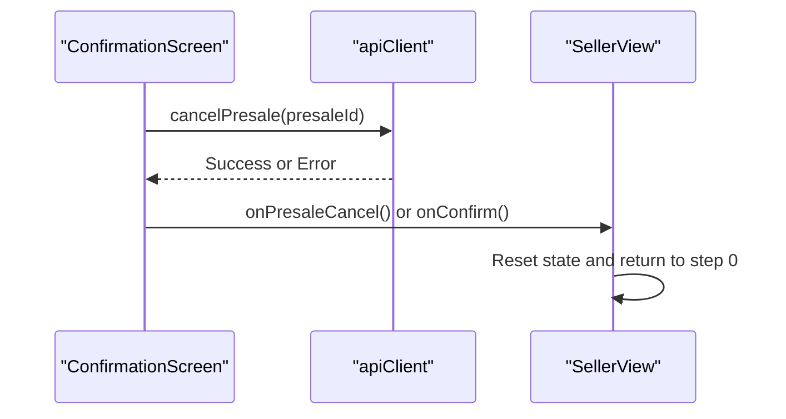
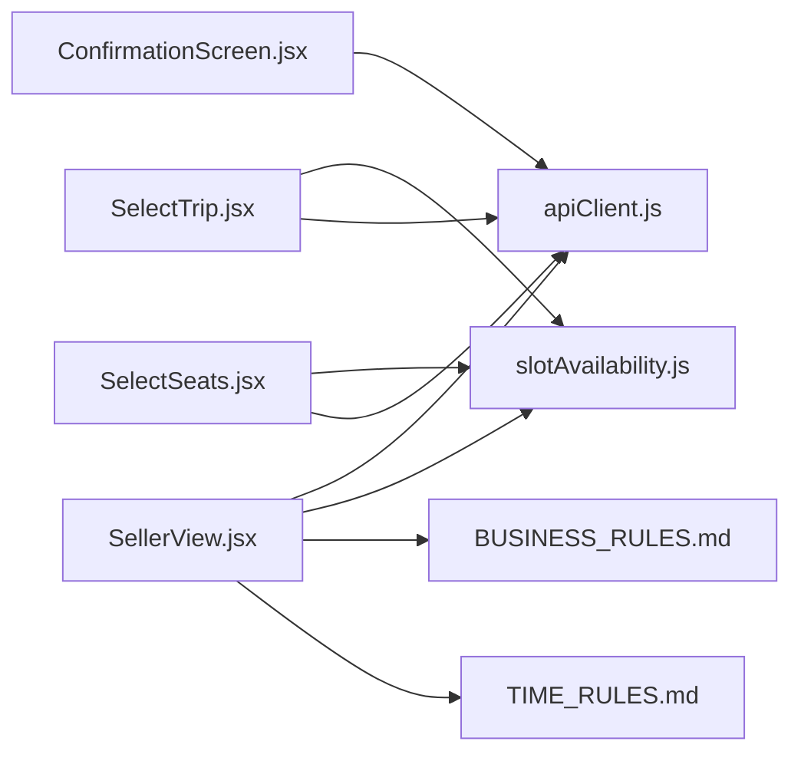

# Ticket Sales Workflow

<cite>
**Referenced Files in This Document**
- [SellerView.jsx](file://src/views/SellerView.jsx)
- [SelectBoatType.jsx](file://src/components/seller/SelectBoatType.jsx)
- [SelectTrip.jsx](file://src/components/seller/SelectTrip.jsx)
- [SelectSeats.jsx](file://src/components/seller/SelectSeats.jsx)
- [ConfirmationScreen.jsx](file://src/components/seller/ConfirmationScreen.jsx)
- [slotAvailability.js](file://src/utils/slotAvailability.js)
- [apiClient.js](file://src/utils/apiClient.js)
- [BUSINESS_RULES.md](file://docs/BUSINESS_RULES.md)
- [TIME_RULES.md](file://docs/TIME_RULES.md)
- [API_CONTRACT.md](file://docs/API_CONTRACT.md)
</cite>

## Table of Contents
1. [Introduction](#introduction)
2. [Project Structure](#project-structure)
3. [Core Components](#core-components)
4. [Architecture Overview](#architecture-overview)
5. [Detailed Component Analysis](#detailed-component-analysis)
6. [Dependency Analysis](#dependency-analysis)
7. [Performance Considerations](#performance-considerations)
8. [Troubleshooting Guide](#troubleshooting-guide)
9. [Conclusion](#conclusion)

## Introduction
This document describes the complete ticket sales workflow in the seller portal, covering the four-step stepper interface: Продать (Sell) → Тип (Type) → Рейс (Trip) → Места (Seats) → Подтвердить (Confirm). It explains boat type selection, trip filtering and availability, seat selection mechanics, and the business logic enforcing cutoff times before departure. Practical examples demonstrate component state management, API integration patterns, and error handling throughout the workflow.

## Project Structure
The seller portal is organized around a view component that orchestrates four primary UI screens:
- SellerView: manages the stepper state and routes to the appropriate step
- SelectBoatType: allows choosing boat type (Speed, Cruise, Banana)
- SelectTrip: displays available trips filtered by date and cutoff rules
- SelectSeats: handles seat selection, customer info, and prepayment
- ConfirmationScreen: presents the created presale and provides cancellation

**Diagram sources**
- [SellerView.jsx](file://src/views/SellerView.jsx#L37-L370)
- [SelectBoatType.jsx](file://src/components/seller/SelectBoatType.jsx#L1-L48)
- [SelectTrip.jsx](file://src/components/seller/SelectTrip.jsx#L1-L193)
- [SelectSeats.jsx](file://src/components/seller/SelectSeats.jsx#L1-L549)
- [ConfirmationScreen.jsx](file://src/components/seller/ConfirmationScreen.jsx#L1-L221)
- [slotAvailability.js](file://src/utils/slotAvailability.js#L1-L19)
- [apiClient.js](file://src/utils/apiClient.js#L1-L360)

**Section sources**
- [SellerView.jsx](file://src/views/SellerView.jsx#L37-L370)

## Core Components
- SellerView: Central orchestrator managing the four-step stepper, navigation, state transitions, and API calls.
- SelectBoatType: Presents boat type choices and navigates to the trip selection step.
- SelectTrip: Filters trips by date and cutoff time, displays availability, and selects a trip.
- SelectSeats: Manages seat breakdown, customer info, prepayment, and validation.
- ConfirmationScreen: Shows presale details, handles cancellation, and finalizes the sale.

**Section sources**
- [SellerView.jsx](file://src/views/SellerView.jsx#L67-L125)
- [SelectBoatType.jsx](file://src/components/seller/SelectBoatType.jsx#L3-L44)
- [SelectTrip.jsx](file://src/components/seller/SelectTrip.jsx#L34-L192)
- [SelectSeats.jsx](file://src/components/seller/SelectSeats.jsx#L5-L548)
- [ConfirmationScreen.jsx](file://src/components/seller/ConfirmationScreen.jsx#L23-L220)

## Architecture Overview
The workflow follows a unidirectional data flow:
- SellerView holds global state and coordinates step transitions.
- SelectTrip loads trips via apiClient and applies date and cutoff filters.
- SelectSeats validates inputs, computes totals, and triggers presale creation.
- ConfirmationScreen displays presale details and supports cancellation.

**Diagram sources**
- [SellerView.jsx](file://src/views/SellerView.jsx#L113-L170)
- [SelectTrip.jsx](file://src/components/seller/SelectTrip.jsx#L194-L210)
- [SelectSeats.jsx](file://src/components/seller/SelectSeats.jsx#L265-L279)
- [ConfirmationScreen.jsx](file://src/components/seller/ConfirmationScreen.jsx#L290-L312)
- [apiClient.js](file://src/utils/apiClient.js#L166-L168)

## Detailed Component Analysis

### Step 1: Boat Type Selection
- Purpose: Allow the seller to choose a boat type (Speed, Cruise, Banana) and proceed to trip selection.
- Behavior:
  - Buttons trigger onSelect with the chosen type.
  - Back button resets type and returns to initial step.
- State management:
  - selectedType stored in SellerView.
  - On selection, clears trips and moves to step 2.

**Diagram sources**
- [SelectBoatType.jsx](file://src/components/seller/SelectBoatType.jsx#L8-L27)
- [SellerView.jsx](file://src/views/SellerView.jsx#L127-L138)

**Section sources**
- [SelectBoatType.jsx](file://src/components/seller/SelectBoatType.jsx#L3-L44)
- [SellerView.jsx](file://src/views/SellerView.jsx#L127-L138)

### Step 2: Trip Selection
- Purpose: Display available trips filtered by selected date and cutoff time.
- Filtering logic:
  - Date filter: Today, Tomorrow, Day After Tomorrow, plus a date picker.
  - Cutoff enforcement: Trips within 10 minutes of departure are hidden.
- Availability indicators:
  - Seats left, sold count, percentage filled, and progress bar.
- Navigation:
  - Clicking a trip sets selectedTrip and advances to step 3.

**Diagram sources**
- [SellerView.jsx](file://src/views/SellerView.jsx#L186-L210)
- [SelectTrip.jsx](file://src/components/seller/SelectTrip.jsx#L34-L40)
- [slotAvailability.js](file://src/utils/slotAvailability.js#L7-L10)

**Section sources**
- [SelectTrip.jsx](file://src/components/seller/SelectTrip.jsx#L34-L192)
- [SellerView.jsx](file://src/views/SellerView.jsx#L186-L210)
- [slotAvailability.js](file://src/utils/slotAvailability.js#L7-L10)
- [BUSINESS_RULES.md](file://docs/BUSINESS_RULES.md#L6-L8)
- [TIME_RULES.md](file://docs/TIME_RULES.md#L16-L36)

### Step 3: Seat Selection and Customer Info
- Purpose: Configure number of seats, ticket breakdown (adult/teen/child), customer details, and prepayment.
- Seat selection:
  - Increment/decrement buttons constrained by available seats.
  - For Banana trips, teen tickets are disallowed.
  - Total seats computed from breakdown and synced to parent.
- Validation:
  - Customer name length ≥ 2.
  - Phone digits exactly 11.
  - Prepayment ≤ total price and ≥ 0.
- API integration:
  - Builds payload with slotUid, numberOfSeats, tickets breakdown, customerName, customerPhone, prepaymentAmount.
  - Calls apiClient.createPresale and proceeds to confirmation step.

**Diagram sources**
- [SelectSeats.jsx](file://src/components/seller/SelectSeats.jsx#L71-L216)
- [SellerView.jsx](file://src/views/SellerView.jsx#L265-L279)
- [apiClient.js](file://src/utils/apiClient.js#L166-L168)

**Section sources**
- [SelectSeats.jsx](file://src/components/seller/SelectSeats.jsx#L5-L548)
- [SellerView.jsx](file://src/views/SellerView.jsx#L265-L279)
- [apiClient.js](file://src/utils/apiClient.js#L166-L168)

### Step 4: Confirmation and Cancellation
- Purpose: Display presale details and provide actions to confirm or cancel.
- Features:
  - Shows presale ID, boat/time/seats, customer info, total/prepayment/remaining.
  - Supports cancellation via apiClient with fallback fetch.
  - After confirmation, returns to initial step.

**Diagram sources**
- [ConfirmationScreen.jsx](file://src/components/seller/ConfirmationScreen.jsx#L68-L117)
- [SellerView.jsx](file://src/views/SellerView.jsx#L299-L311)

**Section sources**
- [ConfirmationScreen.jsx](file://src/components/seller/ConfirmationScreen.jsx#L23-L220)
- [SellerView.jsx](file://src/views/SellerView.jsx#L290-L312)

## Dependency Analysis
- SellerView depends on:
  - apiClient for fetching slots and creating presales.
  - slotAvailability for computing available seats.
  - Business rules and time rules documents for cutoff enforcement.
- SelectTrip depends on:
  - slotAvailability for seat counts.
  - Date utilities for date normalization.
- SelectSeats depends on:
  - slotAvailability for seat limits.
  - Currency formatting utilities.
  - Validation helpers passed from parent.
- ConfirmationScreen depends on:
  - apiClient for cancellation.
  - Date/time formatting utilities.

**Diagram sources**
- [SellerView.jsx](file://src/views/SellerView.jsx#L1-L370)
- [SelectTrip.jsx](file://src/components/seller/SelectTrip.jsx#L1-L193)
- [SelectSeats.jsx](file://src/components/seller/SelectSeats.jsx#L1-L549)
- [ConfirmationScreen.jsx](file://src/components/seller/ConfirmationScreen.jsx#L1-L221)
- [slotAvailability.js](file://src/utils/slotAvailability.js#L1-L19)
- [apiClient.js](file://src/utils/apiClient.js#L1-L360)
- [BUSINESS_RULES.md](file://docs/BUSINESS_RULES.md#L1-L49)
- [TIME_RULES.md](file://docs/TIME_RULES.md#L1-L47)

**Section sources**
- [SellerView.jsx](file://src/views/SellerView.jsx#L1-L370)
- [SelectTrip.jsx](file://src/components/seller/SelectTrip.jsx#L1-L193)
- [SelectSeats.jsx](file://src/components/seller/SelectSeats.jsx#L1-L549)
- [ConfirmationScreen.jsx](file://src/components/seller/ConfirmationScreen.jsx#L1-L221)
- [slotAvailability.js](file://src/utils/slotAvailability.js#L1-L19)
- [apiClient.js](file://src/utils/apiClient.js#L1-L360)
- [BUSINESS_RULES.md](file://docs/BUSINESS_RULES.md#L1-L49)
- [TIME_RULES.md](file://docs/TIME_RULES.md#L1-L47)

## Performance Considerations
- Debounce or throttle date changes to avoid excessive API calls.
- Cache trips by type and date to minimize network requests.
- Use memoization for derived values (e.g., formatted durations, availability percentages).
- Batch UI updates to reduce re-renders during seat adjustments.

## Troubleshooting Guide
Common issues and resolutions:
- No trips displayed:
  - Verify selected date and type filters.
  - Check cutoff enforcement logic; trips within 10 minutes are intentionally hidden.
- Seat selection disabled:
  - Ensure available seats are greater than current selection.
  - For Banana trips, teen tickets are not allowed.
- Validation errors:
  - Customer name must be at least 2 characters.
  - Phone must be exactly 11 digits.
  - Prepayment must be non-negative and not exceed total price.
- API errors:
  - Inspect network logs and error messages from apiClient.
  - Ensure authentication token is present.

**Section sources**
- [SelectTrip.jsx](file://src/components/seller/SelectTrip.jsx#L11-L23)
- [SelectSeats.jsx](file://src/components/seller/SelectSeats.jsx#L231-L256)
- [apiClient.js](file://src/utils/apiClient.js#L63-L87)

## Conclusion
The seller portal implements a robust, step-by-step ticket sales workflow with clear state management, strict cutoff enforcement, and comprehensive validation. The modular component design enables maintainability and extensibility while providing a smooth user experience from boat type selection through seat confirmation.