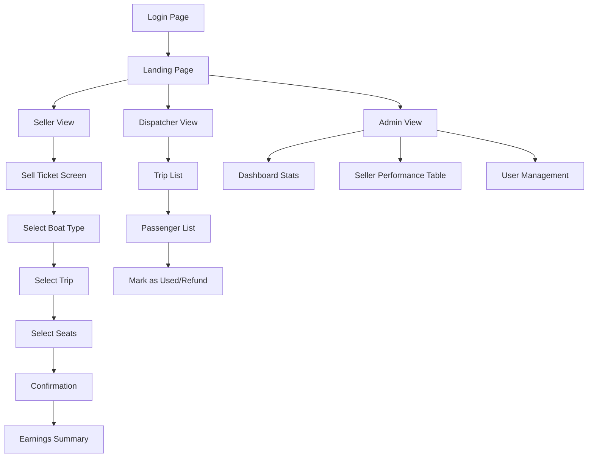

# Beach Boat Ticket Sales System

A mobile-first MVP web application for demonstrating a beach boat ticket sales system with authentication.

## Application Structure



## Features

### Authentication
- Login with username and password
- Role-based access control (Seller, Dispatcher, Admin)
- JWT token authentication

### Landing Page
- Role-based navigation based on user role
- Logout functionality

### Seller View
1. Sell Ticket button
2. Boat type selection (Speed or Cruise)
3. Trip selection with time, duration, price, and seats left
4. Seat selection with payment method
5. Confirmation screen with ticket details
6. Earnings summary showing tickets sold, commission, and bonuses
7. Logout functionality

### Dispatcher View
- List of all trips
- Passenger list for each trip
- Mark passengers as used or process refunds
- Logout functionality

### Admin View
- Dashboard with total revenue, tickets sold, and speed/cruise sales comparison
- Seller performance table showing sales amounts, commissions, and payments
- User management system:
  - Create users with roles
  - List all users
  - Enable/disable users
  - Reset user passwords
- Logout functionality

## Technical Implementation

- **Frontend**: React + Vite
- **Styling**: Tailwind CSS
- **State Management**: Local state + Context API for authentication
- **Routing**: React Router
- **Authentication**: JWT tokens stored in localStorage
- **Backend**: Node.js + Express
- **Database**: SQLite (file-based) using better-sqlite3
- **Password Security**: bcrypt hashing
- **Data**: Mocked in-memory data for business logic, SQLite for user management

## Components Structure

```
src/
├── components/
│   ├── dispatcher/
│   │   └── PassengerList.jsx
│   └── seller/
│       ├── ConfirmationScreen.jsx
│       ├── EarningsScreen.jsx
│       ├── SelectBoatType.jsx
│       ├── SelectSeats.jsx
│       ├── SelectTrip.jsx
│       └── SellTicketScreen.jsx
├── data/
│   └── mockData.js
├── views/
│   ├── AdminView.jsx
│   ├── DispatcherView.jsx
│   ├── LandingPage.jsx
│   └── SellerView.jsx
├── App.jsx
├── main.jsx
└── index.css
```

## How to Run

1. Install dependencies:
   ```
   npm install
   ```

2. Start the development server:
   ```
   npm run dev
   ```

3. Open your browser to http://localhost:5173

## How to start the app

### Windows PowerShell Commands:

1. Navigate to the project directory:
   ```powershell
   cd d:\Проэкты\МОре\boat-ticket-app
   ```

2. Start both frontend and backend servers with one command:
   ```powershell
   npm run dev
   ```

This command will:
- Start the backend server on http://localhost:3001
- Start the frontend Vite server on http://localhost:5173 (or 5174 if 5173 is busy)
- Display clear URLs for both services in the console output

## Default Admin Credentials

- **Username**: admin
- **Password**: admin123

⚠️ **Important**: Change this password immediately after first login!

## Design Principles

- Mobile-first responsive design
- Big buttons for easy touch interaction
- Minimal text with clear visual hierarchy
- Clean and readable UI
- No authentication or complex validation// trigger  
